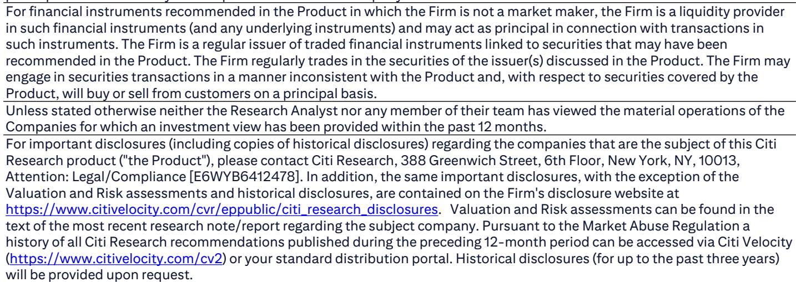

# 机构观点：微创医疗机器人业务与近期数据观察

微创医疗机器人（2252.HK）发布2026年上半年业绩预告，利润区间为2800万至4000万元人民币，而2025年同期为净损失1.15亿元。这是该公司首次实现半年度正向利润。营收同比增长200%至230%，超出市场普遍预期（+173%）和机构自身预期（+190%），主要驱动力来自图迈手术机器人在海外和国内市场的持续商业化推进。海外营收同比增长超过450%。毛利率同比提升超过15个百分点，机构认为这得益于规模效应、流程优化以及向高毛利耗材的产品组合迁移。

这份机构报告的核心判断是：营收超预期和首次半年度正向利润是当前最值得关注的信号，但利润质量仍受制于研究驱动型增长阶段。利润中值3400万元低于机构预期的4400万元，差距被归因于当前增长阶段的研究属性。完整半年报将于8月底公布，管理层可能上调全年装机目标，这被机构视为下一个关键观察点。

## 1. 海外营收增速超过450%成为增长主引擎

海外市场是这份业绩预告中最突出的结构性变化。海外营收同比增长超过450%，远超国内增速。机构认为，这反映了图迈手术机器人在全球市场的商业化势头正在加速。此前公司设定的2026年全球装机目标为200台，机构预期管理层可能在半年报业绩会上将这一目标上调。装机目标的上调将被视为全球商业化进程加速的确认信号，可能成为市场定价重新评估的事件，并带动市场对利润预期的调整。

> **KC评论：** 海外营收增速是这份报告中最值得追踪的指标。450%的同比增速基数较低，但方向性意义明确——如果公司能在8月业绩会上确认海外装机目标上调，市场对这家公司的认知框架可能从“国内市场渗透率提升”切换为“全球平台化发展”。

## 2. 毛利率提升超过15个百分点反映运营效率改善

毛利率同比改善超过15个百分点，机构将其归因于三个因素：规模效应带来的单位成本下降、生产流程优化、以及产品组合向高毛利耗材迁移。这是运营层面的重要进展。手术机器人公司的利润增长路径通常依赖装机量爬坡后的耗材营收增长，毛利率改善意味着耗材营收占比正在提升，商业模式正在从设备销售驱动转向耗材复购驱动。机构认为这是“显著的运营成就”。

## 3. 首次半年度正向利润但仍低于预期

利润中值3400万元，高于市场普遍预期的2400万元，但低于机构预期的4400万元。机构将差距解释为当前增长阶段的研究属性——公司在海外市场扩张、研发投入和商业化团队建设上仍在持续投入。首次半年度正向利润的意义在于验证了商业模式的可行性，但利润质量仍需观察：利润相对规模较小，且是否可持续取决于下半年营收能否维持增速、以及费用控制是否有效。完整半年报将提供更详细的利润结构拆解。

## 4. 90天观察期聚焦管理层指引

机构在业绩预告发布后启动了为期90天的上行趋势观察。核心逻辑是：近期报价回调被视为短期资金调整，但真正的观察点是8月底半年报业绩会上的管理层指引。如果管理层确认海外订单势头强劲并上调全年装机目标，机构认为这可能成为重要的市场定价重新评估事件。隐含假设包括加权平均资本成本9.4%、贝塔系数0.8、长期增长率3.0%。机构选择现金流折现模型而非同行对比估值法，理由是公司从2026年起将产生正向现金流。

不确定性方面，机构认为该公司存在较高不确定性，主要节奏变化不确定性包括：行业政策影响超预期导致销售中断、持续未盈利、研发失败、竞争加剧、监管不确定性、严重不良事件引发的声誉不确定性、以及价格下降不确定性。

For informational purposes only. Portions may be generated,translated,summarized,or edited with AI assistance based on source materials and may contain omissions or errors. Please verify independently. This is not investment,legal,tax,accounting,or other professional advice.

For informational purposes only. Portions may be generated,translated,summarized,or edited with AI assistance based on source materials and may contain omissions or errors. Please verify independently. This is not investment,legal,tax,accounting,or other professional advice.

