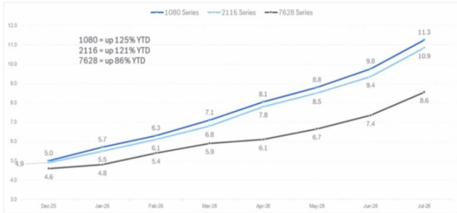

# Kingboard Laminates Holdings (1888.HK)

# 通过南亚新材电话会议获得的相关行业观察

## Citi要点

在南亚新材（688519）发布2026年上半年业绩预告后，我们与该公司董事会秘书进行了一场电话会议。关键要点包括：1）预期2026年下半年覆铜板（CCL）及电子玻璃布的平均售价将持续上升；2）电子玻璃布的供应紧张局面最早可能持续到2027年底；3）南亚新材2026年下半年毛利率环比上半年将继续显著扩张。我们认为该电话会议对CCL行业（包括Kingboard Laminates和生益科技）具有正向参考意义。Kingboard Laminates股价从历史高位有所调整，当前估值处于历史均值偏低区间，市场可能在重新评估其基本面前景。

在CCL/PCB公司的2026年上半年业绩预告中，净利润运行速率较强——南亚新材预计2026年上半年净利润同比增长超过3.5倍，达人民币4.2亿至5亿元，中值指引意味着同比增长约369%、环比增长约106%。图1展示了中国A股CCL/PCB产业链公司2026年上半年业绩预告情况。总体来看，各环节季度利润增速从上游玻璃布企业（最高）到CCL企业，再到下游PCB企业（相对较低）依次递减。

2026年下半年CCL平均售价上涨的行业影响——南亚新材指出，由于同期上游材料电子玻璃布成本大幅上升，其无铅无卤FR4等级CCL平均售价已从2025年底的每张160-170元人民币弹性较高至当前每张300元人民币（见图2）。管理层预计，2026年下半年CCL平均售价将继续上涨（根据管理层估计，年底可能达到每张360-400元人民币），主要受以下因素支撑：1）非AI应用（如汽车、智能手机等）需求持续增长，尽管增长幅度温和；2）非AI领域CCL供应明显减少，因为EMC、生益科技等主要CCL厂商正将产能从非AI转向AI应用。

南亚新材预计电子玻璃布供应紧张局面最早持续到2027年底——我们此前曾认为，随着织机（将纱线织成布的设备）数量增加，电子玻璃布供应紧张局面将从2027年年中开始缓解。但南亚新材管理层给出了更为积极的看法，认为由于AI-CCL应用需求前景强劲，供应紧张至少持续到2027年底。南亚新材目前AI-CCL销售中70%为M6-M8等级，M9-M10等级销量较少，其余为M5及以下等级。管理层估计，当前AI布约占总产能360-370万张的20%。南亚新材将在2027年新增200万张产能，并在2028年提升至600万张，其中大部分用于AI-CCL。

## 研究观点

**催化剂观察：** 上行方向，有效期至2026年8月2日

| 项目 | 数据 |
|------|------|
| 报价（2026年7月22日16:10） | 40.26港元 |
| 参考目标 | 130.00港元 |
| 预期报价回报 | 222.9% |
| 预期股息率 | 3.8% |
| 预期总回报 | 226.8% |
| 总市值 | 1,268.77亿港元（161.80亿美元） |

Eric Lau，电话：+852-2501-2726，邮箱：eric.h.lau@citi.com  
Alice Cai，电话：+852-2501-2704，邮箱：alice.cai@citi.com  
Andy Li，电话：+852-2501-2597，邮箱：andy.li@citi.com  

**南亚新材今年毛利率季度环比扩张的行业启示**——南亚新材预计2026年一季度至四季度毛利率将实现可持续的环比扩张。我们认为这一趋势也适用于生益科技和Kingboard Laminates等其他CCL厂商。这些公司设定了内部指引：若三季度毛利率低于25%、二季度低于20%、一季度低于10%，则不接单。

**Kingboard Laminates 2026年净利润运行速率展望**——我们预计2026年上半年净利润同比增长超过3倍，达到40亿港元。部分国内读者预期Kingboard Laminates业绩约为30亿港元，这可能会低于我们的预测。我们认为即使如此，关键点在于季度利润速率将从2026年一季度的10亿港元，按国内读者预期跃升至20-25亿港元，或按我们的模型升至30亿港元。Kingboard Laminates的利润增速高于生益科技、南亚新材等纯CCL厂商是合理的，因为其上游电子玻璃布利润增长更为强劲。这体现了Kingboard Laminates今年垂直一体化（自产上游材料）的优势，在玻璃布平均售价大幅上涨背景下，其表现优于其他纯CCL厂商。

**图1：CCL/PCB产业链2026年上半年业绩预告概览**

| 公司 | 代码 | 1Q25 | 2Q25 | 1Q26 | 2Q26E | 1Q26同比 | 2Q26E同比 | 2Q26E环比 | 1H26预告 |
|------|------|------|------|------|-------|---------|----------|---------|---------|
| **玻璃纤维/电子布** | | | | | | | | |
| 中国巨石 | 600176.SS | 730.4 | 956.6 | 1,267.2 | 1,685.1 | +73% | +76% | +33% | 2,783.6 – 3,121.0 |
| 宏和科技 | 603256.SS | 30.9 | 56.5 | 140.2 | 228.3 | +354% | +304% | +63% | 331.7 – 405.4 |
| 山东玻纤 | 605006.SS | 8.7 | ~0 | 10.1 | 19.1 | +15% | n.m. | +89% | 23.4 – 35.1 |
| **CCL及上游材料** | | | | | | | | |
| 生益科技 | 600183.SS | 563.6 | 862.8 | 1,158.1 | 2,040.4 | +105% | +136% | +76% | 3,099.0 – 3,298.0 |
| 南亚新材 | 688519.SS | 21.1 | 66.1 | 150.1 | 309.9 | +611% | +369% | +106% | 420.0 – 500.0 |
| 金安国纪 | 002636.SZ | 23.4 | 47.1 | 201.8 | 573.2 | +764% | +1,117% | +184% | 730.0 – 820.0 |
| 东材科技 | 601208.SS | 91.9 | 98.4 | 186.8 | 125.2 | +103% | +27% | -33% | ~312.0 |
| 华正新材 | 603186.SS | 18.4 | 24.3 | 30.9 | 149.1 | +68% | +514% | +383% | 155.0 – 205.0 |
| 宏昌电子 | 603002.SS | 6.5 | 9.9 | 0.5 | 38.9 | -93% | +294% | n.m. | 38.6 – 40.2 |
| **PCB** | | | | | | | | |
| 东山精密 | 002384.SZ | 455.9 | 302.1 | 1,109.9 | 1,840.1 | +143% | +509% | +66% | 2,900.0 – 3,000.0 |
| 沪电股份 | 002463.SZ | 762.5 | 920.3 | 1,242.1 | 1,672.9 | +63% | +82% | +35% | 2,830.0 – 3,000.0 |
| 深南电路 | 002916.SZ | 491.4 | 868.6 | 850.2 | 1,349.8 | +73% | +55% | +59% | 2,100.0 – 2,300.0 |
| 生益电子 | 688183.SS | 200.2 | 330.3 | 444.7 | 664.6 | +122% | +101% | +49% | 1,081.8 – 1,136.8 |
| 广合科技 | 001389.SZ | 240.4 | 251.2 | 392.6 | 542.4 | +63% | +116% | +38% | 910.0 – 960.0 |
| 兴森科技 | 002436.SZ | 9.4 | 19.5 | 18.7 | 91.3 | +100% | +368% | +388% | 100.0 – 120.0 |
| 世运电路 | 603920.SS | 179.8 | 204.3 | 36.6 | 46.9 | -80% | -77% | +28% | 67.0 – 100.0 |
| 奥士康 | 002913.SZ | 112.3 | 83.6 | 17.5 | 71.5 | -84% | -14% | +309% | 78.0 – 100.0 |
| 博敏电子 | 603936.SS | 27.3 | 10.6 | -10.9 | -38.1 | 转亏 | 转亏 | 亏损扩大 | -56.0 – -42.0 |
| 依顿电子 | 603328.SS | 116.3 | 144.4 | 37.7 | 67.8 | -68% | -53% | +80% | 92.5 – 118.5 |
| 中京电子 | 002579.SZ | 6.8 | 11.5 | 5.6 | -90.6 | -17% | 转亏 | 转亏 | -90.0 – -80.0 |
| 广东骏亚 | 603386.SS | 15.1 | 23.0 | -20.5 | 11.5 | 转亏 | -50% | 转盈 | -12.0 – -6.0 |
| **铜箔** | | | | | | | | |
| 嘉元科技 | 688388.SS | 24.5 | 12.3 | 120.5 | 254.5 | +393% | n.m. | +111% | 360.0 – 390.0 |
| 诺德股份 | 600110.SS | -37.7 | -34.8 | 40.1 | 62.9 | 扭亏 | 扭亏 | +57% | ~103.0 |
| **PCB化学品** | | | | | | | | |
| 天承科技 | 688603.SS | 19.0 | 17.8 | 29.9 | 32.6 | +58% | +83% | +9% | 60.0 – 65.0 |
| 光华科技 | 002741.SZ | 25.2 | 31.1 | 41.1 | 50.4 | +63% | +62% | +23% | 85.0 – 98.0 |

**图2：2026年初至今电子玻璃布平均售价弹性较高以上**  
  
© 2026 Citi Inc. 未经Citi书面许可不得转载。  
来源：Citi、F139（SCI99子公司）、公司公告

## Kingboard Laminates Holdings

## 估值参考

我们对Kingboard Laminates的参考目标为130港元，基于约28-29倍2027年预期市盈率（高于历史均值3个标准差）。这一倍数高于其历史周期峰值区间（介于+1至+2个标准差），以反映2026年下半年AI布新业务占比提升可能带来的市场重新定价，以及电子玻璃布价格在6月同比涨幅较高背景下进一步上修盈利的可能性。采用+3个标准差也考虑到2026年二季度以来三座AI布窑炉的陆续投产。我们认为这一溢价是合理的，预计2026-2028年将进入持续的毛利率扩张周期，同时Kingboard Laminates今年将在英伟达和ASIC生态系统下扩大AI布客户基础，有望带动盈利上调。我们认为市盈率方法能够恰当反映公司中期运营表现。参考目标对应的市盈率与增长率之比（PEG）约为0.3倍（区域同业约0.6倍），基于2026-2028年三年每股收益复合年增长率99%（此前为92%）。与区域CCL同业相比，这一估值似乎并不苛刻。

## 风险因素

可能导致公司表现超出或低于参考目标的风险包括：1）AI相关产品对上游材料（如玻璃布、铜箔）的需求增速快于或慢于预期；2）中国宏观环境增速快于或慢于预期；3）中国刺激性政策力度强于或弱于预期；4）电子产品终端需求恢复或走弱。

若您有视觉障碍并希望就本文件中图表的详细信息与Citi代表沟通，请致电美国1-888-500-5008（TTY：711），或从美国境外拨打+1-210-677-3788。

## 附录A-1

## 分析师认证

主要负责本研究报告准备和内容的研究分析师已在作者栏中标有“AC”，或在其负责的内容旁边以粗体列出。若作者栏中有多位AC分析师，每位分析师仅对其负责的部分进行认证，不包括其他AC分析师以粗体列出的内容以及对特定发行人的观点。每位分析师认证，就其负责的报告部分而言：（1）所表达的观点准确反映了他们对各发行人和证券的个人看法，并且是独立准备的；（2）分析师的薪酬中没有任何部分直接或间接地与本研究报告中该分析师提出的具体建议或观点相关。

## 重要披露

（以下为历史评级和目标价格变动图表，因篇幅原因省略详细数据，可参考原文链接）

（此处省略大量法律披露文本，因改写版本为笔记摘要，不包含完整法律声明）
