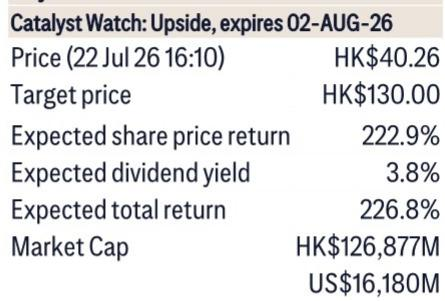
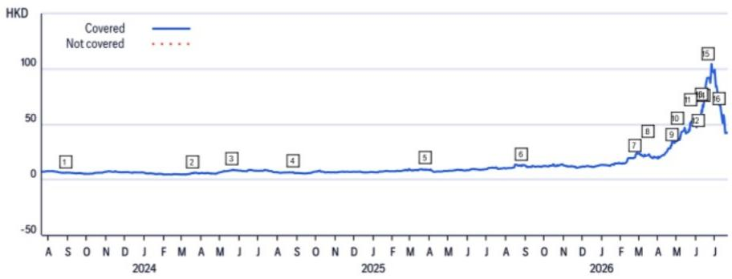
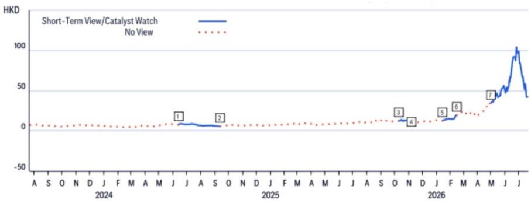

# Citi：电子布与CCL及近期数据观察

Citi在与南亚新材管理层交流后发布报告，认为覆铜板（CCL）及上游电子布行业正经历一轮供应偏紧周期。南亚新材在1H26业绩预告中披露利润同比增长超过3.5倍，达到4.2亿至5亿元，其中2Q26单季环比增长106%。该信号对CCL产业链具有一定参考意义，尤其是对拥有垂直一体化能力的建滔积层板。

电子布价格在2026年内已呈现较高弹性。南亚新材管理层预计，电子布供应偏紧态势至少持续到2027年底，这一判断比Citi此前预期的2027年中更为积极。主要原因是AI-CCL需求保持增长，而新增产能投放节奏较缓。南亚新材目前AI级电子布约占其总产能的20%，公司计划2027年新增200万张产能，2028年达到600万张，大部分将用于AI-CCL。

CCL价格同步上行。南亚新材的无铅无卤FR4级CCL价格已从2025年底的每张160-170元升至目前的300元，管理层预计年底或达到360-400元。支撑因素包括：非AI应用（汽车、智能手机）需求温和增长，以及主要CCL厂商将产能从非AI转向AI应用导致的供应调整。

> **观察思考：** Citi报告中最值得关注的不是南亚新材的利润数字本身，而是管理层对电子布供应偏紧持续至2027年底的判断。这意味着CCL厂商的定价能力和利润扩张周期可能比市场预期的更长，尤其是那些拥有上游电子布自产能力的公司。

## 1. 产业链利润呈现从上游到下游递减的特征

Citi梳理了1H26中国CCL/PCB产业链公司的业绩预告，发现利润增速呈现明显分层。电子布/玻璃纤维厂商的季度利润增速最高，其次是CCL厂商，PCB厂商增速相对最低。以2Q26单季同比增速为例，电子布厂商宏和科技达到304%，CCL厂商南亚新材为369%，而PCB厂商沪电股份为82%。

这种利润分布结构反映了当前产业链的供需结构集中在上游。电子布产能扩张周期长、资本开支大，短期内新增供应有限，而AI服务器对高频高速CCL的需求正在稳步释放。Citi认为，这一利润分配格局在2026年下半年仍将持续。

## 2. 建滔积层板的垂直一体化优势在电子布涨价周期中放大

Citi预计建滔积层板1H26利润同比增长超过3倍，达到40亿港元。部分国内读者预期为30亿港元，但Citi认为即使低于其预测，关键观察点在于季度利润率的提升——从1Q26的10亿港元增至2Q26的20-25亿港元（国内读者预期）或30亿港元（Citi模型）。

建滔积层板拥有上游电子布自产能力，在电子布价格大幅上涨的背景下，其利润弹性高于纯CCL厂商如生益科技和南亚新材。Citi指出，这体现了垂直一体化在当前周期中的价值。建滔积层板报价已从历史高点有所回落，当前市盈率约8-9倍。

## 3. 南亚新材毛利率逐季提升，行业定价纪律正在形成

南亚新材管理层预计2026年毛利率将从1Q到4Q逐季扩大。Citi认为这一趋势同样适用于生益科技和建滔积层板。值得注意的是，这些CCL厂商已设定内部指引：若毛利率低于25%则不接3Q订单，低于20%不接2Q订单，低于10%不接1Q订单。

这种定价纪律在历史上较为罕见。Citi认为，这反映出CCL厂商在当前供需格局下拥有一定的议价能力，不再像以往周期中那样被动接受价格节奏变化。如果电子布供应偏紧持续，CCL厂商的定价权可能得以延续。

## 4. 观察框架：关注电子布价格走势和AI-CCL需求结构

对于跟踪这一产业链的读者，Citi报告提供了两个可复用的观察维度。一是电子布价格走势，这是判断CCL利润周期的先行指标。二是AI-CCL的需求结构，尤其是M6-M8级别产品的占比变化。南亚新材目前AI-CCL销售中70%为M6-M8级别，M9-M10量很少。如果AI服务器对更高等级CCL的需求增加，可能进一步影响产品均价和毛利率。

建滔积层板正在为英伟达和ASIC生态系统下的AI电子布扩大客户基础，或将成为利润增长的驱动因素之一。Citi认为，随着AI电子布业务从2H26开始贡献收入，公司可能迎来新的关注。

For informational purposes only. Portions may be generated,translated,summarized,or edited with AI assistance based on source materials and may contain omissions or errors. Please verify independently. This is not investment,legal,tax,accounting,or other professional advice.

For informational purposes only. Portions may be generated,translated,summarized,or edited with AI assistance based on source materials and may contain omissions or errors. Please verify independently. This is not investment,legal,tax,accounting,or other professional advice.

