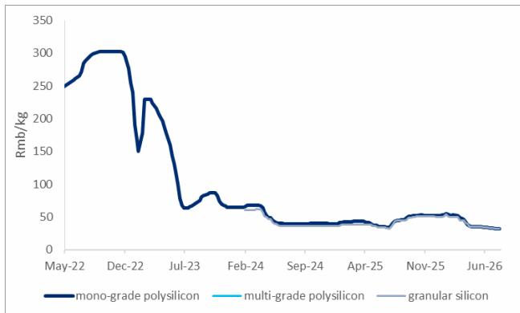
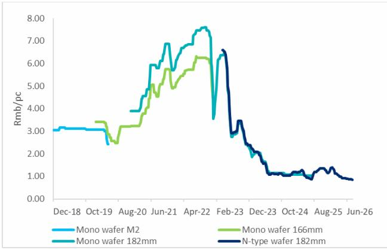
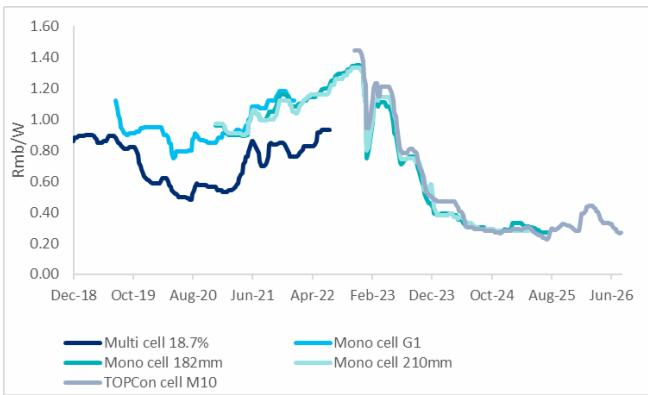
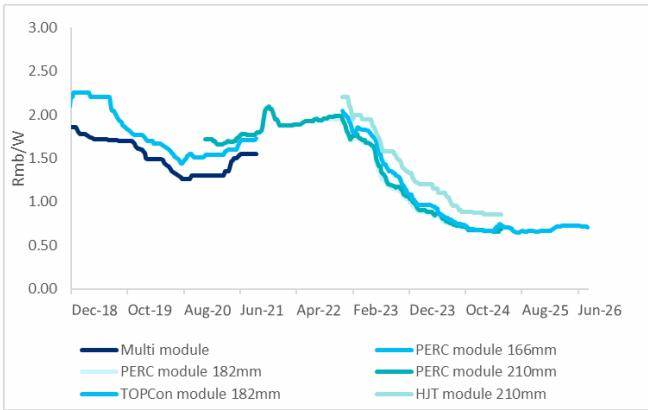
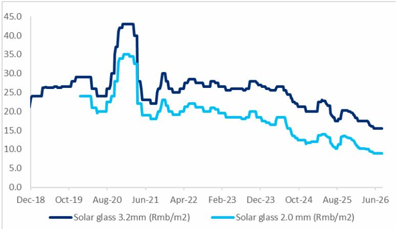

# 中国可再生能源行业观察

## 太阳能产品价格动态：硅片组件价格调整，多晶硅与电池片略有回升

2026年上半年国内太阳能装机量同比变化

本周国内太阳能产品价格呈现分化趋势：硅片和组件价格环比下降0.4%-2.3%，多晶硅和电池片价格环比上升0.1%-0.9%。光伏玻璃价格保持稳定，行业运营产能本月至今减少6250吨/日（约7.7%），主要受盈利水平影响。2026年上半年国内太阳能装机量约72.1GW，同比有所下降；其中6月装机量约12.5GW。近期发布的《多晶硅能耗限额标准》和《太阳能组件与逆变器能效标准》（2027年1月1日起实施）有望推动低效产能出清，但对当前有效供给的影响可能有限。在太阳能与储能领域，出货量增长较快的储能制造商如阳光电源、德业等受到关注。

多晶硅价格小幅回升——截至2026年7月22日当周，棒状多晶硅均价环比上涨0.1%至31.6元/公斤，颗粒多晶硅均价持平于31.5元/公斤。据SMM数据，截至7月16日，多晶硅厂家库存总量较高（约318千吨）。部分厂家在汛期小幅提产。中国硅业协会预计7月多晶硅月度产量约10万吨，略高于月度需求的9.1万吨。

硅片价格下降，电池片价格上升——n型硅片市场报价环比下降2.3%（182mm产品）和0.9%（210mm产品），主要因需求端表现平淡且产能利用率较高。SMM预计7月国内硅片产量环比下降3.7%至52.3GW，截至7月16日库存水平环比减少3.1%至27.1GW。据SMM，硅片环节产能整合已开始，部分二三线企业正寻求产能租赁。TOPCon电池片均价环比上涨0.9%至0.27元/瓦。SCI99预计短期电池片价格维持平稳。

组件价格小幅下降——本周182mm组件均价环比下降0.4%至0.71元/瓦。SMM预计7月国内月度组件产量环比增长11.0%至42.0GW。

光伏玻璃产能继续停运——2.0mm和3.2mm光伏玻璃均价分别维持在9.0元/平方米和15.5元/平方米。截至7月16日，行业平均库存周期为47.3天，环比减少1.2%。

---

**国内光伏玻璃在产熔量变化**：截至7月16日，国内光伏玻璃在产日熔量环比下降2.2%至77,750吨（同比下降15.6%）。受盈利水平影响，本月至今国内在产光伏玻璃产能已减少6,250吨/日（约7.7%）。

---

**图1：截至7月22日当周国内多晶硅价格**

| | 本周 | 环比 | 月环比 | 同比 |
|---|---|---|---|---|
| 多晶硅（元/公斤） | 31.6 | +0.1% | -3.2% | -29.3% |
| 硅片（元/片） | 0.84 | -2.3% | -3.4% | -30.0% |
| 电池片（元/瓦） | 0.27 | +0.9% | -7.8% | -7.8% |
| 组件（元/瓦） | 0.71 | -0.4% | -1.5% | +7.1% |
| 玻璃-2.0mm（元/平方米） | 9.0 | 0.0% | 0.0% | -12.2% |

**图2：国内多晶硅周度价格走势**

**图3：国内硅片周度价格走势**

**图4：国内电池片周度价格走势**

**图5：国内组件周度价格走势**

**图6：国内光伏玻璃周度价格走势**

---

## 宁波德业科技

（605117.SS）

公司主要从事储能及逆变器相关业务，产品销往多个市场。其在细分领域积累了一定技术优势，出货规模持续增长。

## 阳光电源

（300274.SZ）

公司聚焦光伏逆变器、储能系统及电站开发等业务，在国内外市场均占有重要份额。随着全球清洁能源转型推进，公司产品需求保持增长态势。
