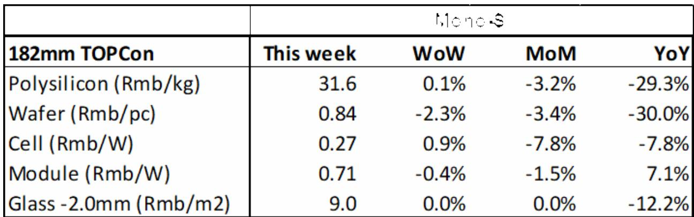
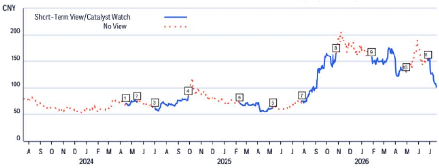

# Citi：价格数据与市场变化观察

中国光伏市场在2026年上半年经历了显著调整。Citi相关研究数据显示，1H26中国光伏新增装机量同比下降65.9%至72.1GW，其中6月单月装机12.5GW，同比下降9.3%。这一降幅主要源于去年同期的高基数效应，而非需求端的根本性调整。与此同时，产业链各环节价格走势出现分化：多晶硅和电池片价格周环比小幅上涨0.1%和0.9%，而硅片和组件价格则分别下跌2.3%和0.4%。这种价格分化反映出不同环节供需格局的差异。

报告同时关注到，中国光伏玻璃行业正经历产能主动调整。截至7月16日，国内运营中的光伏玻璃日熔量已降至77,750吨，较月初减少6,250吨，降幅达7.7%。产能调整的直接原因是行业盈利能力偏低，企业选择暂停部分产线以缓解库存不确定性。行业平均库存周期为47.3天，较前一周微降1.2%。

## 1. 多晶硅库存高企但价格小幅回升，供需仍存缺口

多晶硅环节呈现“高库存与价格微涨并存”的格局。截至7月22日当周，棒状多晶硅均价为31.6元/公斤，周环比上涨0.1%；颗粒硅价格持平于31.5元/公斤。然而，据SMM数据，截至7月16日，多晶硅生产商库存高达31.8万吨。中国硅业协会预计7月多晶硅产量约为10万吨，而月度需求约为9.1万吨，供给仍略高于需求。

> **KC观察：** 多晶硅价格微涨与高库存并存，说明当前价格已接近部分企业的成本线，继续调整的空间有限。但月度产量仍超出需求约10%，库存消化仍需时间。后续减产执行情况值得关注。

## 2. 硅片环节产能整合启动，二三线企业寻求产能共享

硅片价格跌幅在产业链中最为显著。182mm n型硅片价格周环比下跌2.3%至0.84元/瓦，210mm产品下跌0.9%至1.15元/瓦。SMM数据显示，7月中国硅片产量预计环比下降3.7%至52.3GW，库存水平则环比下降3.1%至27.1GW。值得关注的是，SMM指出硅片环节已开始出现产能整合，部分二三线企业正在寻求产能共享。这一信号表明，行业出清正在从价格竞争向产能结构优化演进。

## 3. 组件价格持续调整，7月产量预期环比增长

组件价格延续调整态势。182mm组件均价周环比下跌0.4%至0.71元/瓦。尽管价格仍在调整，但SMM预计7月中国组件产量将环比增长11.0%至42.0GW。产量增长与价格下跌并存，反映出企业仍在通过提升开工率摊薄固定成本，而非主动减产保价。这一策略能否持续，取决于下游需求能否消化新增产量。

## 4. 光伏玻璃产能主动调整，行业盈利不确定性传导至供给端

光伏玻璃是当前产业链中供给调整最为明显的环节。截至7月16日，国内运营中的光伏玻璃日熔量同比下降15.6%。行业平均库存周期为47.3天，较前一周微降1.2%。产能调整的直接原因是低盈利水平导致企业主动暂停产线。这一调整有助于缓解供给过剩，但效果仍需观察下游装机需求能否同步回暖。

## 5. 储能需求成为产业链结构性亮点

在光伏产业链整体调整的背景下，Citi研报将关注重点转向储能领域。报告明确表示，在中国光伏和储能板块中，更偏好储能制造商，尤其是出货量增长较高的企业。这一判断基于两个逻辑：一是光伏装机增速节奏变化后，储能作为配套环节的需求刚性更强；二是储能渗透率仍处于较低水平，增长空间大于光伏主材环节。

---

For informational purposes only. Portions may be generated,translated,summarized,or edited with AI assistance based on source materials and may contain omissions or errors. Please verify independently. This is not investment,legal,tax,accounting,or other professional advice.

For informational purposes only. Portions may be generated,translated,summarized,or edited with AI assistance based on source materials and may contain omissions or errors. Please verify independently. This is not investment,legal,tax,accounting,or other professional advice.

