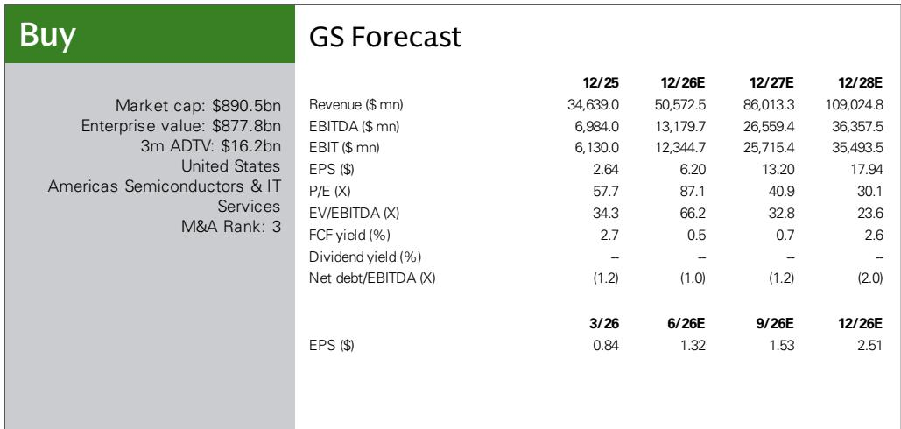
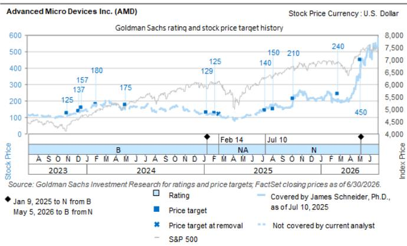

# The AI Infrastructure TAM Is Doubling, But Only One Company Has the CPU-to-Accelerator Strategy to Capture It

AMD’s Advancing AI event in San Francisco last week was not a product launch. It was a market redefinition. The company raised its total compute addressable market estimate from $365 billion to $2 trillion by 2030, with the datacenter AI accelerator segment alone projected to grow from $200 billion to $1.4 trillion at a 40% compound annual rate. These numbers are not aspirational forecasts. They reflect a structural shift in how computing demand is being reshaped by agentic AI—workloads that require not just more accelerators, but fundamentally different orchestration between CPUs and GPUs.

The event’s most consequential announcement was the strategic partnership with Anthropic, under which the AI lab will deploy 2 gigawatts of AMD’s Instinct MI450 GPUs in Helios rack-scale systems starting in the first half of 2027. AMD also plans a $5 billion equity investment in Anthropic. This is not merely a customer win. It is a signal that AMD is moving beyond the hyperscaler GPU procurement cycle and into long-term, co-optimized infrastructure relationships with frontier AI developers. The partnership with Microsoft, which will deploy Helios racks for inference workloads on Azure beginning in the second half of 2026, reinforces the same thesis: AMD is building an ecosystem, not just selling chips.

Participants entered the event with elevated expectations, and based on conversations with attendees, the announcements met them. The position in the overall compute market is driven by an already strong CPU franchise and a broadening aperture of key customers in AI accelerators. But the real story is not about any single partnership or product. It is about how AMD is constructing a strategy that no other semiconductor company can replicate—one that leverages CPU dominance to win accelerator share, and vice versa.

## Agentic AI Is Forcing a Re-Architecture of Compute, and AMD's CPU-Accelerator Symbiosis Is the Only Answer That Works at Scale

The single most important insight from the event is not a number—it is a mechanism. Agentic AI workloads do not simply require more floating-point operations. They require complex orchestration: planning, tool use, memory retrieval, multi-step reasoning, and real-time adaptation. These tasks place intense demands on CPUs, which must coordinate increasingly elaborate workflows while accelerators handle the heavy inference lifting. AMD's updated TAM estimates reflect this reality: the datacenter CPU market is projected to grow from $26 billion to $220 billion by 2030, a 50% compound annual growth rate that far exceeds historical CPU market expansion.

This is where AMD's structural advantage becomes clear. The company already commands a strong position in the server CPU market, and it expects to capture 50% of that segment by 2030. No other major semiconductor firm can offer a comparable combination of high-performance CPU and AI accelerator under one roof. Nvidia does not provide server CPUs at scale. Intel's AI accelerator efforts remain nascent. AMD's EPYC CPU lineage, combined with its Instinct GPU roadmap, creates a platform lock-in that pure-play accelerator vendors cannot match.

The practical implication for enterprise buyers is straightforward: if you are building an agentic AI infrastructure stack, you will likely end up with AMD CPUs regardless of which accelerator you choose. And once those CPUs are installed, the incremental cost and integration risk of deploying AMD accelerators shrinks dramatically. This is not a theoretical advantage. It is the same dynamic that drove Intel's dominance in the previous computing era, when owning the CPU effectively dictated the rest of the platform. AMD is now replaying that playbook, but with a twist: this time, the CPU and the accelerator are equally strategic.

## Helios Is Not a Product; It Is a Rack-Scale Architecture That Forces Ecosystem Dependency

AMD's unveiling of the Helios rack-scale platform represents a deliberate shift from component selling to system-level value capture. Helios is built on the CDNA 5 architecture, with GPUs delivering up to 40 petaflops at FP4 precision, 432 gigabytes of HBM4 memory, and 23.3 terabytes per second of memory bandwidth. Each system combines 75 GPUs connected via UALink over Ethernet, a 96-core EPYC CPU, Salina DPU, Volcano 800G AI NIC, and six networking trays. AMD stated that Helios is already in full production, with shipments beginning at the end of the third quarter and volume ramp in the fourth quarter.

The strategic significance of Helios goes beyond raw specifications. By delivering a fully integrated rack-scale system, AMD is forcing customers to commit to an entire ecosystem of hardware and software dependencies. The UALink interconnect, the Pensando DPU, the networking stack—these are not optional components. They are the moat. Once a customer commits to Helios, the switching costs become substantial. The partnership with Cerebras, which combines Helios with Cerebras' Wafer-Scale Engine for an inference solution that delivers up to 5x better tokens-per-watt, further extends this ecosystem play. AMD is not just selling chips to Cerebras; it is embedding its architecture into Cerebras' cloud offering, expected to launch in the second half of 2026.

For enterprise decision-makers, the question is no longer whether to adopt AMD GPUs. It is whether to adopt AMD infrastructure. The answer will increasingly depend on how much of your AI stack you are willing to standardize around a single vendor's ecosystem. AMD is betting that the integration benefits—reduced latency, simplified deployment, unified software tooling—will outweigh the lock-in concerns. Given the complexity of agentic AI workloads, that bet is rational.

## ROCm.ai and Hyperloom Convert Software Fragmentation into a Competitive Moat

Hardware alone does not win AI infrastructure markets. Software does. AMD has historically lagged Nvidia in developer tooling and ecosystem maturity, but the launch of ROCm.ai signals a deliberate effort to close that gap. ROCm.ai integrates with tools such as Cursor, Claude, Codex, and Gemini to provide an AI-driven software development experience. More importantly, AMD introduced Hyperloom, an optimization layer that automatically tunes system configurations and optimizes end-to-end AI workloads. AMD stated that over 14,000 models have been optimized through Hyperloom, delivering an average 3.3x performance improvement compared with ROCm 7.

The numbers matter, but the strategic logic matters more. Hyperloom is not just a performance booster. It is a lock-in mechanism. Once developers optimize their models for Hyperloom, the cost of migrating to competing hardware increases. The 3.3x performance improvement is not a static benchmark; it is a moving target that AMD can widen as it adds more optimizations. For enterprise AI teams, the decision to adopt ROCm.ai is not just about today's performance. It is about committing to a software stack that will improve over time, while competing stacks may not receive equivalent optimization attention.

This is the same playbook that Nvidia used to build its CUDA moat, but with a critical difference. AMD's software strategy is explicitly designed to leverage its CPU strength. ROCm.ai works across AMD's entire compute portfolio, meaning that enterprises already running EPYC CPUs can integrate ROCm.ai without additional hardware changes. The software moat reinforces the hardware moat, and vice versa. For any company building an AI infrastructure roadmap, this integration should be a central consideration in vendor selection.

## A Decision Framework for Enterprise AI Infrastructure Buyers: Three Questions to Determine Whether AMD's Strategy Aligns with Your Roadmap

The following framework translates AMD's announcements into actionable questions for technology leaders evaluating their AI infrastructure strategy.

First, what is the CPU-to-accelerator ratio in your projected agentic AI workloads? If your workloads are heavily inference-oriented with complex orchestration requirements, the CPU share of total compute cost will be higher than in training-dominated environments. AMD's EPYC advantage becomes more valuable as the CPU burden increases. Companies building multi-step reasoning agents, retrieval-augmented generation pipelines, or autonomous workflow systems should model their CPU requirements explicitly, not assume that accelerator spending dominates total cost of ownership.

Second, how much ecosystem standardization are you willing to accept in exchange for integration benefits? Helios represents a bet on vertical integration. The trade-off is clear: lower deployment friction and optimized performance versus reduced flexibility to mix and match components from different vendors. Enterprises with heterogeneous infrastructure strategies may find Helios less attractive. Those building greenfield AI data centers, or those willing to standardize around a single platform for a multi-year cycle, should evaluate Helios as a potential foundation.

Third, what is your software stack migration cost? ROCm.ai and Hyperloom are not optional add-ons. They are central to AMD's value proposition. If your team has already invested heavily in CUDA-optimized workflows, the migration cost may outweigh the hardware benefits. But if you are early in your AI infrastructure journey, or if you are willing to invest in software portability, AMD's software ecosystem offers a path to performance gains that are likely to compound over time.

The answers to these questions will determine whether AMD's strategy is a fit for your organization. For companies that answer yes to all three—high CPU workload share, willingness to standardize, and low software migration cost—AMD's positioning is uniquely compelling. For others, the calculus is more nuanced, but the direction of travel is clear: the market is moving toward integrated CPU-accelerator architectures, and AMD is the only company that offers both at scale.

## The $5 Billion Anthropic Bet Signals That AMD Is Playing a Different Game Than Its Peers

The $5 billion equity investment in Anthropic is the most underappreciated detail from the event. It is not a standard customer relationship. It is a strategic alignment that aligns AMD's hardware roadmap with Anthropic's model development cycle. The 2-gigawatt Helios deployment beginning in early 2027 represents a multi-year commitment that gives AMD visibility into the most demanding AI workloads on the planet. That visibility will inform future architecture decisions, software optimizations, and capacity planning.

For market observers, the implication is that AMD is no longer competing solely on price-performance ratios against Nvidia. It is competing on roadmap alignment with the most important AI labs. The Anthropic deal, combined with the Microsoft partnership, gives AMD two of the most demanding inference customers in the world. That demand signal is worth more than any benchmark. It tells the market that AMD's hardware is not just viable for inference—it is becoming a preferred platform for frontier AI deployment.

The risks are real. Slower-than-expected adoption of agentic AI would compress the TAM that justifies AMD's current valuation. The Meta GPU deployment could face delays. x86 architecture could lose share in enterprise AI environments. And AMD has not yet demonstrated the operating leverage that would convert revenue growth into proportional earnings growth. But these risks are considered in the valuation multiple. The upside scenario—where agentic AI demand accelerates, AMD captures 50% of the CPU market, and its accelerator share expands—is not yet fully reflected in market pricing.

The conclusion from the Advancing AI event is not that AMD has won. It is that AMD has positioned itself to win in a way that no other semiconductor company can replicate. The CPU-accelerator symbiosis, the rack-scale platform strategy, the software ecosystem investment, and the frontier AI lab partnerships form a coherent whole. For enterprise buyers and market participants alike, the question is not whether AMD is a credible alternative to the incumbent. It is whether the market is large enough for two winners, and whether AMD's strategy gives it the structural advantages needed to be one of them. The evidence presented last week suggests the answer is yes.

*For informational purposes only. Portions may be generated, translated, summarized, or edited with AI assistance based on source materials and may contain omissions or errors. Please verify independently. This is not professional advice.*

For informational purposes only. Portions may be generated, translated, summarized, or edited with AI assistance based on source materials and may contain omissions or errors. Please verify independently. This is not professional advice.

