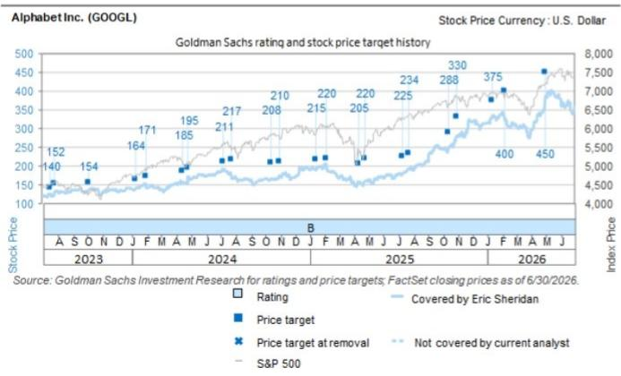

# Alphabet Inc. (GOOGL) 近期观察

Q2'26 回顾：人工智能相关投入持续增长（谷歌云营收预期上调）

GOOGL

12个月参考价：$435.00

当前报价：$342.09

参考波动空间：27.2%

Alphabet 第二季度财报围绕几个关键主题：1）搜索及其他业务同比增长约17%（各区域及广告主行业均表现稳健），公司提示未来同比基数较高及汇率影响，这使我们预计未来几个季度增速将趋于常态化；2）YouTube广告收入重现增长，用户参与度、广告转化效果及直接响应组合获正面评价，订阅业务（音乐及高级会员）亦贡献收入增量；3）谷歌云营收同比增长82%，收入积压约5140亿美元，直接TPU硬件销售/承诺的比例上升（尽管仍为少数），企业对合作伙伴算力需求保持积极；4）2026年资本支出展望上调（从1800-1900亿美元调整为1950-2050亿美元），管理层重申2027年资本支出将“显著增加”，以加快算力建设满足客户需求——我们目前预测2026/27年资本支出分别约为2050亿和3500亿美元；5）持续强调提升整体运营效率，在内部与外部资本支持人工智能投入之间维持稳健信用状况。总体来看，这一系列结果构成了积极的运营叙事，与我们（已上调）的预测及市场预期相符。在通过多种路径更广泛推广和商业化人工智能（消费者与企业）方面，Alphabet管理层对竞争定位、运营表现及长期资本回报前景持续表达信心。

我们认为，市场后续关注点可能集中在：a）人工智能主题下资本支出峰值的可见度（规模与时间节点）；b）Gemini相对其他基础模型（包括开源替代方案）的竞争定位；c）公司如何在内部产品开发、外部客户需求及追求前沿模型性能之间分配算力。此外，关于广告业务收入基数上升及谷歌云分部运营利润率压缩（折旧增加及第三方算力交易）的定性评论，可能引发市场对市场预估是否充分反映公司前景的讨论。

长期来看，我们继续认为Alphabet在当前（桌面与移动计算在全球范围的混合效用）及未来（人工智能/机器学习、个性化、降低应用门槛）的计算环境中均具备良好定位。我们持续主张：大规模人工智能分发（拥有10亿以上用户的应用集群）与算力规模（既用于投入也推动效率）这两大叙事在长期人工智能领域可能仍被低估，特别是当我们从人工智能变现的“基础设施”层迈向“平台”与“应用”层时。此外，我们日益认为Alphabet（产品与市场策略，加上扩展算力能力）在消费者与企业计算领域对人工智能产品服务需求增长中具备主动地位。

我们维持积极看法，并将12个月参考价从$440调整为$435，以反映本次财报及管理层评论后对前瞻运营预测的更新。根据更新后的预测，GOOGL当前交易于约20倍我们2027年GAAP每股收益预估（不含净现金）。

Exhibit 1: GOOGL - 营收、资本支出、折旧摊销及GAAP费用增长预测（百万美元，2024-2031E）

<table><tr><td></td><td>2024</td><td>2025</td><td>2026E</td><td>2027E</td><td>2028E</td><td>2029E</td><td>2030E</td><td>2031E</td></tr><tr><td>总营收（净额）</td><td>$ 295,118</td><td>$ 342,910</td><td>$ 432,987</td><td>$ 548,830</td><td>$ 673,449</td><td>$ 797,144</td><td>$ 911,550</td><td>$ 1,027,002</td></tr><tr><td>同比增速</td><td>15.1%</td><td>16.2%</td><td>26.3%</td><td>26.8%</td><td>22.7%</td><td>18.4%</td><td>14.4%</td><td>12.7%</td></tr><tr><td>资本支出总额</td><td>$ 52,535</td><td>$ 91,447</td><td>$ 203,145</td><td>$ 349,896</td><td>$ 414,627</td><td>$ 466,455</td><td>$ 489,778</td><td>$ 514,267</td></tr><tr><td>同比增速</td><td>62.9%</td><td>74.1%</td><td>122.1%</td><td>72.2%</td><td>18.5%</td><td>12.5%</td><td>5.0%</td><td>5.0%</td></tr><tr><td>资本强度占比</td><td>17.8%</td><td>26.7%</td><td>46.9%</td><td>63.8%</td><td>61.6%</td><td>58.5%</td><td>53.7%</td><td>50.1%</td></tr><tr><td>GAAP费用总额</td><td>$ 182,728</td><td>$ 213,871</td><td>$ 259,217</td><td>$ 317,567</td><td>$ 383,511</td><td>$ 453,398</td><td>$ 523,792</td><td>$ 592,654</td></tr><tr><td>同比增速</td><td>6.1%</td><td>17.0%</td><td>21.2%</td><td>22.5%</td><td>20.8%</td><td>18.2%</td><td>15.5%</td><td>13.1%</td></tr><tr><td>折旧摊销总额</td><td>$ 15,311</td><td>$ 21,136</td><td>$ 45,928</td><td>$ 84,756</td><td>$ 129,806</td><td>$ 178,974</td><td>$ 227,936</td><td>$ 274,309</td></tr><tr><td>同比增速</td><td>14.9%</td><td>38.0%</td><td>117.3%</td><td>84.5%</td><td>53.2%</td><td>37.9%</td><td>27.4%</td><td>20.3%</td></tr><tr><td>GAAP费用（不含折旧摊销及一次性项目）*</td><td>$ 166,110</td><td>$ 187,586</td><td>$ 208,589</td><td>$ 232,811</td><td>$ 253,705</td><td>$ 274,424</td><td>$ 295,856</td><td>$ 318,345</td></tr><tr><td>同比增速</td><td>7.2%</td><td>12.9%</td><td>11.2%</td><td>11.6%</td><td>9.0%</td><td>8.2%</td><td>7.8%</td><td>7.6%</td></tr></table>

\*一次性项目包括报告的重组费用及法律计提：2023年约39亿美元，2024年约13亿美元，2025年约52亿美元，2026E约47亿美元
来源：公司数据，GS全球研究

## Q2'26 积极因素与关注点

积极因素：a）云业务持续增长，Q2'26营收同比增长82%，积压订单环比增加约500亿美元至约5140亿美元，运营利润率同比扩张约1500个基点，来自企业的AI需求强劲（近90%的财富100强企业使用Gemini Enterprise，新客户获取量同比弹性较高）；b）YouTube广告收入高于市场预估（FactSet），直接响应及品牌广告增长，平台借助赛事（全球超17亿世界杯观众）、新Creator Shows系列及客厅场景（"Buy with Google Pay"推出）实现增长；c）Q2搜索及其他业务营收同比增长16.8%，超预期，零售与金融行业表现突出，AI Overviews与AI模式整合为统一搜索体验带动使用量增长（AI模式月活跃用户超10亿）。

关注点：a）管理层将2026年资本支出指引上调至1950-2050亿美元（此前为1800-1900亿美元），因加速交付产能以满足增长需求，2027年资本支出预计较2026年显著增加；b）Q3展望包含汇率相关逆风影响营收增长（主要影响搜索及YouTube广告），同时自Q3'25起搜索收入基数效应加剧；c）订阅、平台与设备业务Q2营收略低于市场预估。

## Q3'26及2026年预测调整

Q3'26：合并总营收1254.9亿美元（此前1235.7亿美元）；GAAP EBITDA 591.5亿美元（此前539.1亿美元）；GAAP每股收益2.95美元（此前2.80美元）。
2026年：合并总营收4989.6亿美元（此前4889.7亿美元）；GAAP EBITDA 2197.0亿美元（此前2112.6亿美元）；GAAP每股收益20.51美元（此前13.69美元）。

## 维持积极看法；调整参考价至$435（此前$440）

我们的$435、12个月参考价基于以下两者等权重混合：（1）EV/GAAP EBIT应用于我们NTM+1年预测；（2）采用EV/FCF-SBC倍数的修正DCF应用于我们NTM+4年预测，并以12%折现3年。

Exhibit 2: Q2'26实际值 vs. 预估（百万美元，除每股数据外）

<table><tr><td></td><td>实际值</td><td>GS预估</td><td>市场共识</td><td>实际值 vs. GS</td><td>实际值 vs. 共识</td><td>环比变化</td><td>同比变化</td></tr><tr><td>谷歌分部营收（毛额）</td><td>$ 119,308</td><td>$ 116,644</td><td>$ 116,774</td><td>2.3%</td><td>2.2%</td><td>8.8%</td><td>24.1%</td></tr><tr><td>谷歌服务</td><td>$ 94,540</td><td>$ 93,484</td><td>$ 94,278</td><td>1.1%</td><td>0.3%</td><td>5.5%</td><td>14.5%</td></tr><tr><td>谷歌搜索及其他</td><td>$ 63,271</td><td>$ 62,589</td><td>$ 63,296</td><td>1.1%</td><td>0.0%</td><td>4.8%</td><td>16.8%</td></tr><tr><td>YouTube广告</td><td>$ 11,055</td><td>$ 10,580</td><td>$ 10,791</td><td>4.5%</td><td>2.4%</td><td>11.9%</td><td>12.9%</td></tr><tr><td>谷歌网络</td><td>$ 7,303</td><td>$ 7,207</td><td>$ 7,142</td><td>1.3%</td><td>2.3%</td><td>4.8%</td><td>-0.7%</td></tr><tr><td>谷歌订阅、平台及设备</td><td>$ 12,911</td><td>$ 13,108</td><td>$ 13,049</td><td>-1.5%</td><td>-1.1%</td><td>4.3%</td><td>15.2%</td></tr><tr><td>谷歌云</td><td>$ 24,768</td><td>$ 23,161</td><td>$ 22,496</td><td>6.9%</td><td>10.1%</td><td>23.7%</td><td>81.8%</td></tr><tr><td>其他赌注</td><td>$ 382</td><td>$ 392</td><td>$ 398</td><td>-2.5%</td><td>-4.0%</td><td>-7.1%</td><td>2.4%</td></tr><tr><td>合并毛营收</td><td>$ 119,796</td><td>$ 117,036</td><td>$ 117,173</td><td>2.4%</td><td>2.2%</td><td>9.0%</td><td>24.2%</td></tr><tr><td>TAC（总额）</td><td>$ (16,179)</td><td>$ (15,970)</td><td>$ (16,254)</td><td>-1.3%</td><td>0.5%</td><td>6.2%</td><td>10.0%</td></tr><tr><td>合并净营收</td><td>$ 103,617</td><td>$ 101,066</td><td>$ 100,919</td><td>2.5%</td><td>2.7%</td><td>9.5%</td><td>26.8%</td></tr><tr><td>GAAP营业利润</td><td>$ 40,770</td><td>$ 38,781</td><td>$ 40,801</td><td>5.1%</td><td>-0.1%</td><td></td><td></td></tr><tr><td>营业利润率（净营收占比）</td><td>39.3%</td><td>38.4%</td><td>40.4%</td><td>97 bps</td><td>-108 bps</td><td></td><td></td></tr><tr><td>谷歌服务营业利润</td><td>$ 39,544</td><td>$ 39,263</td><td>$ 40,532</td><td>0.7%</td><td>-2.4%</td><td></td><td></td></tr><tr><td>营业利润率</td><td>41.8%</td><td>42.0%</td><td>43.0%</td><td>-17 bps</td><td>-116 bps</td><td></td><td></td></tr><tr><td>谷歌云营业利润</td><td>$ 8,814</td><td>$ 7,411</td><td>$ 7,040</td><td>18.9%</td><td>25.2%</td><td></td><td></td></tr><tr><td>营业利润率</td><td>35.6%</td><td>32.0%</td><td>31.3%</td><td>359 bps</td><td>429 bps</td><td></td><td></td></tr><tr><td>GAAP EBITDA</td><td>$ 47,874</td><td>$ 50,595</td><td>$ 48,523</td><td>-5.4%</td><td>-1.3%</td><td></td><td></td></tr><tr><td>GAAP每股收益</td><td>$ 9.11</td><td>$ 2.59</td><td>$ 2.90</td><td>251.1%</td><td>213.9%</td><td></td><td></td></tr></table>

Q2 GAAP每股收益受益于其他收入约980亿美元（与未实现投资利得相关）
来源：公司数据，GS全球研究，Visible Alpha共识数据

## Exhibit 3: Q3'26、2026、2027及2028年预测调整（百万美元，除每股数据外）

<table><tr><td rowspan="2"></td><td colspan="3">Q3 2026</td><td colspan="3">2026</td><td colspan="3">2027</td><td colspan="3">2028</td></tr><tr><td>此前</td><td>更新</td><td>变动%</td><td>此前</td><td>更新</td><td>变动%</td><td>此前</td><td>更新</td><td>变动%</td><td>此前</td><td>更新</td><td>变动%</td></tr><tr><td>谷歌分部营收（毛额）</td><td>$ 123,206</td><td>$ 127,131</td><td>3.2%</td><td>$ 487,601</td><td>$ 497,490</td><td>2.0%</td><td>$ 598,253</td><td>$ 618,859</td><td>3.4%</td><td>$ 735,882</td><td>$ 749,588</td><td>1.9%</td></tr><tr><td>谷歌服务</td><td>$ 96,984</td><td>$ 97,575</td><td>0.6%</td><td>$ 387,278</td><td>$ 388,693</td><td>0.4%</td><td>$ 432,390</td><td>$ 431,387</td><td>-0.2%</td><td>$ 478,793</td><td>$ 478,486</td><td>-0.1%</td></tr><tr><td>谷歌搜索及其他</td><td>$ 63,921</td><td>$ 64,204</td><td>0.4%</td><td>$ 258,182</td><td>$ 258,515</td><td>0.1%</td><td>$ 290,748</td><td>$ 289,277</td><td>-0.5%</td><td>$ 323,799</td><td>$ 322,866</td><td>-0.3%</td></tr><tr><td>YouTube广告</td><td>$ 11,184</td><td>$ 11,492</td><td>2.8%</td><td>$ 43,998</td><td>$ 45,179</td><td>2.7%</td><td>$ 49,277</td><td>$ 49,877</td><td>1.2%</td><td>$ 54,575</td><td>$ 55,363</td><td>1.4%</td></tr><tr><td>谷歌网络</td><td>$ 7,207</td><td>$ 7,207</td><td>0.0%</td><td>$ 29,056</td><td>$ 29,152</td><td>0.3%</td><td>$ 28,475</td><td>$ 28,569</td><td>0.3%</td><td>$ 27,906</td><td>$ 27,998</td><td>0.3%</td></tr><tr><td>谷歌订阅、平台及设备</td><td>$ 14,672</td><td>$ 14,672</td><td>0.0%</td><td>$ 56,043</td><td>$ 55,846</td><td>-0.4%</td><td>$ 63,889</td><td>$ 63,665</td><td>-0.4%</td><td>$ 72,514</td><td>$ 72,259</td><td>-0.4%</td></tr><tr><td>谷歌云</td><td>$ 26,222</td><td>$ 29,556</td><td>12.7%</td><td>$ 100,322</td><td>$ 108,797</td><td>8.4%</td><td>$ 165,864</td><td>$ 187,471</td><td>13.0%</td><td>$ 257,089</td><td>$ 271,101</td><td>5.5%</td></tr><tr><td>其他赌注</td><td>$ 361</td><td>$ 361</td><td>0.0%</td><td>$ 1,552</td><td>$ 1,543</td><td>-0.6%</td><td>$ 1,630</td><td>$ 1,620</td><td>-0.6%</td><td>$ 1,711</td><td>$ 1,701</td><td>-0.6%</td></tr><tr><td>合并毛营收</td><td>$ 123,567</td><td>$ 127,492</td><td>3.2%</td><td>$ 488,973</td><td>$ 498,959</td><td>2.0%</td><td>$ 599,883</td><td>$ 620,479</td><td>3.4%</td><td>$ 737,594</td><td>$ 751,289</td><td>1.9%</td></tr><tr><td>TAC（总额）</td><td>$ (16,354)</td><td>$ (16,472)</td><td>0.7%</td><td>$ (65,691)</td><td>$ (65,972)</td><td>0.4%</td><td>$ (71,800)</td><td>$ (71,648)</td><td>-0.2%</td><td>$ (77,849)</td><td>$ (77,839)</td><td>0.0%</td></tr><tr><td>合并净营收</td><td>$ 107,212</td><td>$ 111,020</td><td>3.6%</td><td>$ 423,282</td><td>$ 432,987</td><td>2.3%</td><td>$ 528,084</td><td>$ 548,830</td><td>3.9%</td><td>$ 659,744</td><td>$ 673,449</td><td>2.1%</td></tr><tr><td>GAAP营业利润</td><td>$ 41,475</td><td>$ 43,348</td><td>4.5%</td><td>$ 167,866</td><td>$ 173,770</td><td>3.5%</td><td>$ 216,380</td><td>$ 231,263</td><td>6.9%</td><td>$ 281,160</td><td>$ 289,938</td><td>3.1%</td></tr><tr><td>营业利润率（净营收占比）</td><td>38.7%</td><td>39.0%</td><td>36 bps</td><td>39.7%</td><td>40.1%</td><td>47 bps</td><td>41.0%</td><td>42.1%</td><td>116 bps</td><td>42.6%</td><td>43.1%</td><td>44 bps</td></tr><tr><td>谷歌服务营业利润</td><td>$ 41,672</td><td>$ 42,050</td><td>0.9%</td><td>$ 169,503</td><td>$ 169,035</td><td>-0.3%</td><td>$ 200,961</td><td>$ 203,524</td><td>1.3%</td><td>$ 237,978</td><td>$ 237,534</td><td>-0.2%</td></tr><tr><td>营业利润率</td><td>43.0%</td><td>43.1%</td><td>13 bps</td><td>43.8%</td><td>43.5%</td><td>-28 bps</td><td>46.5%</td><td>47.2%</td><td>70 bps</td><td>49.7%</td><td>49.6%</td><td>-6 bps</td></tr><tr><td>谷歌云营业利润</td><td>$ 8,915</td><td>$ 9,754</td><td>9.4%</td><td>$ 32,817</td><td>$ 35,499</td><td>8.2%</td><td>$ 60,912</td><td>$ 56,141</td><td>-7.8%</td><td>$ 99,556</td><td>$ 78,619</td><td>-21.0%</td></tr><tr><td>营业利润率</td><td>34.0%</td><td>33.0%</td><td>-100 bps</td><td>32.7%</td><td>32.6%</td><td>-8 bps</td><td>36.7%</td><td>29.9%</td><td>-678 bps</td><td>38.7%</td><td>29.0%</td><td>-972 bps</td></tr><tr><td>GAAP EBITDA</td><td>$ 53,909</td><td>$ 59,152</td><td>9.7%</td><td>$ 211,255</td><td>$ 219,698</td><td>4.0%</td><td>$ 288,213</td><td>$ 316,019</td><td>9.6%</td><td>$ 385,984</td><td>$ 419,745</td><td>8.7%</td></tr><tr><td>GAAP每股收益</td><td>$ 2.80</td><td>$ 2.95</td><td>5.3%</td><td>$ 13.69</td><td>$ 20.51</td><td>49.7%</td><td>$ 14.47</td><td>$ 15.44</td><td>6.7%</td><td>$ 18.66</td><td>$ 19.08</td><td>2.2%</td></tr></table>

2026年GAAP每股收益受益于其他收入约980亿美元（与Q2报告的投资未实现利得相关）
来源：GS全球研究

## 估值：维持积极看法；调整参考价至$435（此前$440）

我们$435的12个月参考价（此前$440）基于以下两者等权重混合：（1）EV/GAAP EBIT应用于NTM+1年预测；（2）采用EV/FCF-SBC倍数的修正DCF应用于NTM+4年预测，并以12%折现3年。具体而言：

26.0x EV/GAAP EBIT（不变）或0.79x EV/GAAP EBIT-to-growth（此前0.89x）应用于NTM+1年预测。

50.0x EV/FCF-SBC（不变）应用于NTM+4年预测，以12%折现3年（不变）。折现率代表CAPM，采用覆盖公司集合的加权平均：（1）3%无风险利率（基于标准化10年期利率）；（2）平均贝塔约1.3；（3）股权风险溢价7%。

Exhibit 4: GOOGL估值分析（百万美元，除每股数据外）

<table><tr><td colspan="4">情景分析</td></tr><tr><td></td><td>下行</td><td>基准</td><td>上行</td></tr><tr><td>估值</td><td>$ 235</td><td>$ 435</td><td>$ 540</td></tr><tr><td>上行/下行空间</td><td>-29%</td><td>32%</td><td>63%</td></tr><tr><td>GAAP EBIT（NTM）</td><td>$ 157,338</td><td>$ 203,567</td><td>$ 221,642</td></tr><tr><td>EBIT利润率</td><td>35.0%</td><td>41.7%</td><td>42.0%</td></tr><tr><td>GAAP EBIT（NTM+1年）</td><td>$ 213,788</td><td>$ 261,146</td><td>$ 288,096</td></tr><tr><td>EBIT利润率</td><td>39.0%</td><td>42.9%</td><td>43.0%</td></tr><tr><td>EV / GAAP EBIT</td><td>16.0x</td><td>26.0x</td><td>28.0x</td></tr><tr><td>EBIT复合年增长率</td><td>20.3%</td><td>33.0%</td><td>39.7%</td></tr><tr><td>EV / GAAP EBIT-to-Growth</td><td>0.79x</td><td>0.79x</td><td>0.71x</td></tr><tr><td>企业价值</td><td>$ 3,420,609</td><td>$ 6,789,789</td><td>$ 8,066,693</td></tr><tr><td>FCF-SBC（NTM+4年）</td><td>$ 86,874</td><td>$ 107,156</td><td>$ 125,485</td></tr><tr><td>FCF占营收比例</td><td>9.0%</td><td>11.1%</td><td>13.0%</td></tr><tr><td>EV / FCF-SBC</td><td>40.0x</td><td>50.0x</td><td>55.0x</td></tr><tr><td>FCF-SBC复合年增长率</td><td>-219.5%</td><td>-228.2%</td><td>-235.1%</td></tr><tr><td>EV / FCF-SBC-to-Growth</td><td>n/a</td><td>n/a</td><td>n/a</td></tr><tr><td>折现率</td><td>15.0%</td><td>12.0%</td><td>10.0%</td></tr><tr><td>折现期（年）</td><td>3</td><td>3</td><td>3</td></tr><tr><td>企业价值（NTM+3年）</td><td>$ 3,474,971</td><td>$ 5,357,812</td><td>$ 6,901,678</td></tr><tr><td>折现后企业价值</td><td>$ 2,284,850</td><td>$ 3,813,585</td><td>$ 5,185,333</td></tr><tr><td colspan="4">权重</td></tr><tr><td>源自GAAP EBITDA的企业价值</td><td>50%</td><td>50%</td><td>50%</td></tr><tr><td>源自（FCF-SBC）的企业价值</td><td>50%</td><td>50%</td><td>50%</td></tr><tr><td>企业价值</td><td>$ 2,852,730</td><td>$ 5,301,687</td><td>$ 6,626,013</td></tr><tr><td colspan="4">资本结构调整</td></tr><tr><td>调整后净债务 - NTM期末</td><td>$ (101,971)</td><td>$ (101,971)</td><td>$ (101,971)</td></tr><tr><td>分红</td><td>$ 10,841</td><td>$ 10,841</td><td>$ 10,841</td></tr><tr><td>调整后流通股数 - NTM期末</td><td>12,509</td><td>12,509</td><td>12,509</td></tr></table>

来源：公司数据，GS全球研究

风险因素包括：a）产品实用性与广告支出面临竞争；b）行业变革对可变现（产品）搜索造成挑战；c）媒体消费习惯变迁；d）大额投入使运营利润率在较长时期内低于预期；e）未来无/低水平股东回报；f）监管及行业实践变化影响业务模式前景。此外，Alphabet面临全球宏观环境波动及市场对成长风格偏好变化的风险。

## 附录

## Reg AC

我们，Eric Sheridan、Alex Vegliante, CFA、Aarshiya Sachdeva与Emma Huang，特此证明本报告中表达的所有观点准确反映我们对标的公司及其证券的个人看法。我们还证明，我们的报酬中没有任何部分直接或间接与本报告中的具体建议或观点相关。

除非另有说明，本报告封面所列人员为GS全球投资研究部分析师。

贡献作者：Eric Sheridan（GS & Co. LLC）、Alex Vegliante, CFA（GS & Co. LLC）、Aarshiya Sachdeva（GS & Co. LLC）、Emma Huang（GS & Co. LLC）。

除非另有说明，本报告"贡献作者"部分所列人员为GS全球投资研究部分析师。

## GS因子概况

GS因子概况通过将关键属性与市场（即我们的评级股票池）及其行业同行进行比较，提供股票的投资环境背景。四个关键属性为：增长、财务回报、倍数（如估值）和综合（增长、财务回报和倍数的复合）。增长、财务回报和倍数通过计算每只股票特定指标的标准化排名得出。标准化排名平均后转换为相关属性的百分位。每个指标的具体计算可能因会计年度、行业和地区而异，但标准方法如下：

增长基于股票的前瞻销售增长、EBITDA增长和每股收益增长（对于金融股，仅每股收益和销售增长），较高百分位表示增长较高的公司。财务回报基于股票的前瞻ROE、ROCE和CROCI（对于金融股，仅ROE），较高百分位表示财务回报较高的公司。倍数基于股票的前瞻市盈率、市净率、股息率（P/D）、EV/EBITDA、EV/FCF和EV/债务调整现金流（DACF）（对于金融股，仅市盈率、市净率和股息率），较高百分位表示交易于较高倍数的股票。综合百分位计算为增长百分位、财务回报百分位和（100% - 倍数百分位）的平均值。

财务回报和倍数使用GS分析师对未来至少三个季度末的预测。增长使用对未来至少七个季度末相对于未来至少三个季度末的输入（所有指标均按每股计算）。

如需更详细说明GS因子概况的计算方式，请联系您的GS代表。

## M&A排名

在我们的全球覆盖范围内，我们使用并购框架审视股票，考虑定性因素和定量因素（可能因行业和地区而异），以纳入某些公司可能被收购的潜在可能性。然后我们将覆盖范围内的股票从1到3分配M&A排名，1表示公司成为收购目标的可能性较高（30%-50%），2表示中等（15%-30%），3表示较低（0%-15%）。对于排名为1或2的公司，按照我们标准部门指引，我们将M&A部分纳入目标价。M&A排名3被视为不重要，因此不计入我们的目标价，可能在研究中讨论也可能不讨论。

## Quantum

Quantum是GS专有数据库，提供详细的财务报表历史、预测和比率。可用于对单个公司进行深入分析，或比较不同行业和市场的公司。

## 披露

Alphabet Inc.的评级相对于其覆盖范围内的其他公司：ACV Auctions Inc., Airbnb Inc., Alphabet Inc., Amazon.com Inc., Angi Inc., AppLovin Corp., Booking Holdings Inc., Bumble Inc., Chewy Inc., Clear Secure Inc., Corsair Gaming Inc., Coursera Inc., Cricut Inc., DoorDash Inc., DoubleVerify Inc., DraftKings Inc., Duolingo Inc., Ethos Technologies Inc., Expedia Group, Fiverr International Ltd., Frontdoor Inc., GoodRx Holdings Inc., Grindr Inc., Groupon Inc., Ibotta Inc., Instacart, Liftoff Mobile Inc., Lyft Inc., Match Group, MediaAlpha Inc., Meta Platforms Inc., Netflix Inc., Nextdoor Holdings, Opera Ltd., Pattern Group Inc., Peloton Interactive Inc., People Inc., Pinterest Inc., Playtika, Reddit Inc., Roblox, Snap Inc., Space Exploration Technologies Corp., Sportradar Group, Spotify Technology S.A., StubHub Holdings, Take-Two Interactive Software Inc., Tripadvisor Inc., Uber Technologies Inc., Unity Software Inc., Upwork Inc., Wayfair Inc., Webtoon Entertainment Inc., Xometry Inc., Yelp Inc., ZipRecruiter Inc.

## 公司特定监管披露

以下披露涉及GS集团（及其附属机构，“GS”）与GS全球投资研究所覆盖公司之间的关系。

GS担任一项待定承销的经理或联合经理：Alphabet Inc. ($342.09)

GS在截至本报告前一个月的月末，持有1%或以上的普通股权（不包括附属机构及根据美国证券法无需汇总的业务部门持有的头寸）：Alphabet Inc. ($342.09)

GS在过去12个月内因投资银行服务获得报酬：Alphabet Inc. ($342.09)

GS预计在未来3个月内将或寻求因投资银行服务获得报酬：Alphabet Inc. ($342.09)

GS在过去12个月内因非投资银行服务获得报酬：Alphabet Inc. ($342.09)

GS在过去12个月内与Alphabet Inc.存在投资银行服务客户关系：Alphabet Inc. ($342.09)

GS在过去12个月内与Alphabet Inc.存在非投资银行证券相关服务客户关系：Alphabet Inc. ($342.09)

GS在过去12个月内与Alphabet Inc.存在非证券服务客户关系：Alphabet Inc. ($342.09)

GS在过去12个月内管理或联合管理了公开或Rule 144A发行：Alphabet Inc. ($342.09)

GS对该证券或其衍生品做市：Alphabet Inc. ($342.09)

## 评级/投资银行关系分布 GS投资研究全球股票覆盖范围

<table><tr><td rowspan="2"></td><td colspan="3">评级分布</td><td colspan="3">投资银行关系</td></tr><tr><td>积极</td><td>中性</td><td>保守</td><td>积极</td><td>中性</td><td>保守</td></tr><tr><td>全球</td><td>50%</td><td>34%</td><td>16%</td><td>65%</td><td>59%</td><td>43%</td></tr></table>

截至2026年7月1日，GS全球投资研究对3,104支股票有评级。GS将股票分配为"积极"和"保守"于各区域投资清单；未分配股票被视为"中性"。此类分配等同于FINRA规则要求的上述披露中的"买入"、"持有"和"卖出"。见下文"评级、覆盖范围和相关定义"。投资银行关系图表反映了GS在过去十二个月内为每个评级类别中的标的公司提供投资银行服务的百分比。

## 目标价和评级历史图表

  
所示目标价应考虑GS先前所有可能包含或可能不包含目标价的出版物，以及公司、其行业和金融市场的发展情况。

## 目标价历史表 Alphabet Inc. (GOOGL)

<table><tr><td>报告日期</td><td>目标价 ($)</td><td>收盘价 ($)</td></tr><tr><td>08-Jul-26</td><td>440.00</td><td>361.92</td></tr><tr><td>30-Apr-26</td><td>450.00</td><td>384.80</td></tr><tr><td>05-Feb-26</td><td>400.00</td><td>331.25</td></tr><tr><td>12-Jan-26</td><td>375.00</td><td>331.86</td></tr><tr><td>30-Oct-25</td><td>330.00</td><td>281.48</td></tr><tr><td>14-Oct-25</td><td>288.00</td><td>245.45</td></tr><tr><td>24-Jul-25</td><td>234.00</td><td>192.17</td></tr><tr><td>10-Jul-25</td><td>225.00</td><td>177.62</td></tr><tr><td>25-Apr-25</td><td>220.00</td><td>161.96</td></tr><tr><td>11-Apr-25</td><td>205.00</td><td>157.14</td></tr><tr><td>05-Feb-25</td><td>220.00</td><td>191.33</td></tr><tr><td>13-Jan-25</td><td>215.00</td><td>191.01</td></tr><tr><td>30-Oct-24</td><td>210.00</td><td>174.46</td></tr><tr><td>14-Oct-24</td><td>208.00</td><td>164.96</td></tr><tr><td>24-Jul-24</td><td>217.00</td><td>172.63</td></tr><tr><td>08-Jul-24</td><td>211.00</td><td>189.03</td></tr><tr><td>26-Apr-24</td><td>195.00</td><td>171.95</td></tr><tr><td>15-Apr-24</td><td>185.00</td><td>154.86</td></tr><tr><td>31-Jan-24</td><td>171.00</td><td>140.10</td></tr><tr><td>10-Jan-24</td><td>164.00</td><td>142.28</td></tr><tr><td>04-Oct-23</td><td>154.00</td><td>135.24</td></tr><tr><td>26-Jul-23</td><td>152.00</td><td>129.27</td></tr></table>

表中所示目标价未针对公司行为进行调整。

## 监管披露

## 美国法律法规要求的披露

见上文公司特定监管披露，了解以下对报告所提及公司的任何适用披露：待定交易中的经理或联合经理；1%或以上所有权；某些服务的报酬；客户关系类型；先前期间的公开/144A发行；董事职位；对于股权证券，做市和/或专家角色。GS可能作为本金交易本报告讨论的发行人的债务证券（或相关衍生品）。

以下为额外要求的披露：所有权和重大利益冲突：GS政策禁止其分析师、向分析师汇报的专业人员及其家庭成员持有分析师覆盖范围内任何公司的证券。分析师报酬：分析师的报酬部分基于GS的盈利能力，包括投资银行收入。分析师作为董事或高管：GS政策通常禁止分析师、向分析师汇报的人员或其家庭成员在分析师覆盖范围内的任何公司担任董事、高管或顾问。非美国分析师：非美国分析师可能不是GS & Co. LLC的关联人员，因此可能不受FINRA规则2241或FINRA规则2242关于与标的公司沟通、公开露面以及交易分析师所覆盖证券的限制。

## 美国以外法律法规要求的额外披露

以下披露为特定司法管辖区所要求，除非已根据美国法律作出上述披露。澳大利亚：GS Australia Pty Ltd及其附属公司不是澳大利亚《1959年银行法》定义的授权存款机构，不提供银行服务，也不在澳大利亚开展银行业务。本研究报告及其访问权限仅面向"批发客户"（定义见澳大利亚《公司法》），除非GS另有约定。在撰写研究报告时，GS Australia全球投资研究成员可能参加由其研究标的公司或其他实体举办的现场访问及其他会议。在某些情况下，如果GS Australia认为在特定情况下适当且合理，此类访问或会议的部分或全部费用可能由相关发行人承担。若本文件内容包含任何金融产品建议，则仅为一般性建议，由GS在未考虑客户目标、财务状况或需求的情况下编制。客户在采纳任何此类建议前，应考虑与其自身目标、财务状况和需求相关的适当性。某些GS Australia和New Zealand的利益披露副本及GS澳大利亚卖方研究独立性政策声明副本可在以下网址获取：https://www.goldmansachs.com/disclosures/australia-new-zealand/index.html。巴西：与CVM第20号决议相关的披露信息可在https://www.gs.com/worldwide/brazil/area/gir/index.html获取。适用情况下，根据CVM第20号决议第20条定义，本研究报告内容的主要巴西注册分析师为本报告第一作者，除非文本末尾另有说明。加拿大：此信息仅供信息参考，绝不构成GS & Co. LLC为在加拿大购买任何加拿大证券而进行的宣传、要约或招揽。GS & Co. LLC未在任何加拿大司法管辖区注册为交易商，通常不被允许交易加拿大证券，并可能被禁止在加拿大的某些司法管辖区销售某些证券和产品。如您希望对加拿大证券或其他产品进行交易，请联系GS加拿大公司（GS集团附属公司）或其他注册加拿大交易商。香港：可通过联系GS (Asia) L.L.C.索取所覆盖公司证券的进一步信息。印度：可通过联系GS (India) Securities Private Limited获取本报告提及的标的公司进一步信息。研究分析师 – SEBI注册号INH000001493，办公室地址：10th Floor, Ascent-Worli, Sudam Kalu Ahire Marg, Worli, Mumbai-400 025, India。公司身份号U74140MH2006FTC160634，电话+91 22 6616 9000，传真+91 22 6616 9001。GS可能持有本研究报告提及的标的公司1%或以上的证券（定义见印度《证券合约（监管）法》1956年第2(h)条）。SEBI注册及NISM认证绝不保证中介机构的业绩，也不提供对读者回报的任何保证。GS (India) Securities Private Limited合规官及读者投诉联系方式、年度合规审计报告副本及其他相关信息和披露可在此链接查看：https://www.goldmansachs.com/worldwide/india/research-analyst。日本：见下文。韩国：本研究报告及其访问权限仅面向"专业读者"（定义见《金融服务与资本市场法》），除非GS另有约定。可通过联系GS (Asia) L.L.C.首尔分行获取本报告提及的标的公司进一步信息。新西兰：GS New Zealand Limited及其附属公司在新西兰既不是"注册银行"，也不是"存款接受机构"（定义见《新西兰储备银行法》1989）。本研究报告及其访问权限面向"批发客户"（定义见《金融顾问法》2008），除非GS另有约定。某些GS Australia和New Zealand利益披露副本可在以下网址获取：https://www.goldmansachs.com/disclosures/australia-new-zealand/index.html。俄罗斯：在俄罗斯联邦分发的研究报告不作为俄罗斯法律定义下的广告，而是具有信息和分析性质，不以产品推广为主要目的，不提供俄罗斯法律关于评估活动定义下的评估。研究报告不构成俄罗斯法律法规定义下的个性化研究交流，不针对特定客户，且未分析客户的财务状况、投资特征或风险状况。GS不对客户或任何其他人基于本研究报告做出的任何投资决策承担责任。新加坡：GS (Singapore) Pte.（公司编号：198602165W）受新加坡金融管理局监管，接受本研究报告的法律责任。有关本研究报告的任何问题，应联系该公司。台湾：此材料仅供参考，未经许可不得转载。读者应仔细考虑自身投资风险。投资结果由个人读者负责。英国：在英国被归类为零售客户（定义见金融行为监管局规则）的人士，应结合GS先前对所涉公司的研究报告阅读本研究报告，并应参考GS International已发送给其的风险警告。有关这些风险警告的副本以及本报告中使用的某些金融术语词汇表，可向GS International索取。

欧盟与英国：与欧盟委员会授权条例(EU) 2016/958第6(2)条（包括该授权条例在英国脱欧后转换为英国国内法律和法规）相关的披露信息，涉及投资推荐或其他推荐或暗示投资策略的信息的客观呈现技术安排，以及特定利益或利益冲突的披露，可在https://www.gs.com/disclosures/europeanpolicy.html获取，该页面说明了与投资研究相关的利益冲突管理欧洲政策。

日本：GS Japan Co., Ltd. 是在关东财务局注册的金融工具交易商，注册号Kinsho 69，是日本证券业协会、日本金融期货协会、第二类金融工具交易商协会及日本投资管理协会会员。股票买卖需与客户预先确定佣金并加收消费税。见公司特定披露中的任何适用披露，这些披露是日本交易所、日本证券业协会或日本证券金融公司所要求的。

## 评级、覆盖范围和相关定义

积极 (B)、中性 (N)、保守 (S)。分析师推荐股票为"积极"或"保守"，以将其纳入各区域投资清单。被分配为"积极"或"保守"的依据是该股票相对其覆盖范围内的总回报潜力。任何未被分配为"积极"或"保守"且具有有效评级的股票（即非评级暂停、未评级、早期生物科技、覆盖暂停或未覆盖）被视为"中性"。每个区域管理区域认定清单，该清单从各自区域投资清单中的积极评级股票中选出，代表基于总回报潜力大小和/或回报实现可能性的投资推荐。此类认定清单的增减由各区域投资审查委员会或其他指定委员会管理，不表示分析师对这些股票的投资评级发生变化。

总回报潜力代表当前股价与目标价之间的上行或下行差异，包括所有已支付或预期股息，在目标价对应的预期时间范围内实现。所有被覆盖股票均需设定目标价。总回报潜力、目标价及相关时间范围在每份添加或重申投资清单成员资格的报告中有说明。

覆盖范围：每份覆盖范围中的股票列表可通过主要分析师、股票和覆盖范围在https://www.gs.com/research/hedge.html获取。

未评级 (NR)。根据GS政策，当GS在此公司的并购或战略交易中担任顾问角色，或由于GS参与某项交易而存在法律、法规或政策限制，或存在其他特定情况时，投资评级、目标价及盈利预测（如相关）将被移除。早期生物科技 (ES)。根据GS政策，当此公司尚无通过II期临床试验的药物、治疗或医疗设备，也无许可分销后II期药物、治疗或医疗设备的权利时，不分配投资评级和目标价。评级暂停 (RS)。GS已暂停对此股票的投资评级和目标价，因为缺乏足够的基本面依据来确定投资评级或目标价。此股票之前的投资评级和目标价（如有）不再有效，不应依赖。覆盖暂停 (CS)。GS已暂停对此公司的覆盖。未覆盖 (NC)。GS未覆盖此公司。

## 全球产品；分发实体

GS全球投资研究为GS客户制作和分发研究产品。GS全球各办公室的分析师对行业和公司进行研究，并对宏观经济、货币、大宗商品和投资组合策略进行研究。本研究在澳大利亚由GS Australia Pty Ltd (ABN 21 006 797 897) 分发；在巴西由GS do Brasil Corretora de Títulos e Valores Mobiliários S.A. 分发；公共沟通渠道GS Brazil：0800 727 5764 和/或 contatogoldmanbrasil@gs.com。工作日（节假日除外）上午9点至下午6点提供服务。GS巴西公众沟通渠道：0800 727 5764 和/或 contatogoldmanbrasil@gs.com。营业时间：周一至周五（节假日除外），上午9点至下午6点；在加拿大由GS & Co. LLC分发；在香港由GS (Asia) L.L.C.分发；在印度由GS (India) Securities Private Ltd.分发；在日本由GS Japan Co., Ltd.分发；在韩国由GS (Asia) L.L.C.首尔分行分发；在新西兰由GS New Zealand Limited分发；在俄罗斯由OOO GS分发；在新加坡由GS (Singapore) Pte. (公司编号：198602165W) 分发；在美国由GS & Co. LLC分发。GS International已批准本研究在英国境内分发。

GS International（"GSI"）由审慎监管局（PRA）授权，受金融行为监管局（FCA）和PRA监管，已批准本研究在英国境内分发。

欧洲经济区：GS Bank Europe SE（"GSBE"）是一家在德国注册的信贷机构，在单一监管机制内受欧洲央行直接审慎监管，在其他方面受德国联邦金融监管局（BaFin）和德国央行监管，并在欧洲经济区内分发研究。

## 一般性披露

本研究仅供我们的客户使用。除与GS相关的披露外，本研究基于我们认为可靠的当前公开信息，但我们不声明其准确或完整，且不应将其视为可依赖的信息。本文所含信息、意见、估计和预测均为截至当前日期，如有更改恕不另行通知。我们寻求适当更新我们的研究，但各种法规可能阻止我们这样做。除某些定期发布的行业报告外，大多数报告由分析师酌情以不规则的间隔发布。

GS开展全球全面服务、一体化的投资银行、投资管理和经纪业务。我们与全球投资研究所覆盖的大量公司存在投资银行和其他业务关系。GS & Co. LLC是美国证券交易商，是SIPC成员（https://www.sipc.org）。

我们的销售人员、交易员和其他专业人士可能向客户和主要交易部门提供口头或书面的市场评论或交易策略，这些评论或策略可能反映与本研究中表达的意见相反的观点。我们的资产管理、主要交易部门和投资业务可能做出与本研究中的建议或观点不一致的投资决策。

本报告中命名的分析师可能有时与我们的客户（包括GS销售人员和交易员）讨论或在本研究中讨论交易策略，这些策略引用可能对本研究讨论的股权证券市场价格产生近期影响的催化剂或事件，该影响可能在方向上与分析师的已发布目标价预期相反。任何此类交易策略均不同于分析师对这些股票的基本股权评级，该评级反映股票相对于其覆盖范围的回报潜力，如本文所述。

我们和我们的关联公司、高管、董事和员工可能不时持有本研究提及的证券或衍生品的多头或空头头寸，作为本金进行交易，并买入或卖出，除非法规或GS政策另有禁止。

GS组织会议上第三方演讲者所持的观点，包括来自GS其他部门的个人，不一定反映全球投资研究的观点，也不是GS的官方观点。

本文提及的任何第三方，包括任何销售人员、交易员和其他专业人士或其家庭成员，可能持有与本文署名分析师所表达的观点不一致的产品头寸。

本研究不是任何司法管辖区内的出售要约或购买要约招揽，在此类要约或招揽为非法的司法管辖区亦不构成。它不构成个人推荐，也未考虑特定客户的投资目标、财务状况或需求。客户应考虑本研究中的任何建议或推荐是否适合其特定情况，并酌情寻求专业建议，包括税务建议。本研究提及的证券价格和价值以及从中获得的收入可能波动。过往业绩并非未来业绩的指引，未来回报不保证，原始资本可能亏损。汇率波动可能对某些投资的货币价值、价格或收入产生不利影响。

某些交易，包括涉及期货、期权和其他衍生品的交易，具有重大风险，不适合所有读者。读者应查看期权和期货披露文件，可向GS销售代表索取或在以下网址获取：https://www.theocc.com/about/publications/character-risks.jsp 和 https://www.goldmansachs.com/disclosures/cftc_fcm_disclosures。期权策略中涉及多次买入和卖出期权（如价差）的策略，交易成本可能显著。支持文件将应要求提供。

全球投资研究提供的不同服务级别：GS全球投资研究向您提供的服务级别和类型可能与向GS内部和其他外部客户提供的服务有所差异，取决于多种因素，包括您对接收沟通频率和方式的个人偏好、风险特征和投资关注点与视角（例如，市场整体、行业特定、长期、短期），您与GS整体客户关系的规模和范围，以及法律和监管限制。例如，某些客户可能要求在特定证券研究报告发布时收到通知，某些客户可能要求通过数据接口或其他方式将分析师基本面分析的基础数据以电子方式传送。对于分析师对股权证券的基本研究观点（如评级、目标价或盈利预测的重大变化）的任何变更，将在通过内部客户网站电子公布或通过其他方式向所有有权接收报告的客户广泛传播之前，不向任何客户传达。

所有研究报告同时通过内部客户网站电子公布向所有客户分发。并非所有研究内容都重新分发给我们的客户或提供给第三方聚合商，GS也不对第三方聚合商重新分发我们的研究负责。对于与一种或多种证券、市场或资产类别相关的研究、模型或其他数据（包括相关服务），请联系您的GS代表或访问https://research.gs.com。

披露信息也可在https://www.gs.com/research/hedge.html或联系研究合规部门获取：200 West Street, New York, NY 10282。

## © 2026 GS

您被允许通过本服务存储、显示、分析、修改、重新格式化及打印向您提供的信息，但仅供您个人使用。未经GS明确书面同意，您不得转售或逆向工程此信息以计算或开发任何指数用于披露和/或营销，或创建任何其他衍生作品、商业产品、数据或报价。未经GS明确书面同意，您不得以任何格式向任何第三方发布、传播或以其他方式复制此信息（整体或部分）。前述限制包括但不限于使用、提取、下载或检索此信息（整体或部分）来训练或微调机器学习或人工智能系统，或作为提示或输入向任何此类系统提供或复制此信息（整体或部分）。
