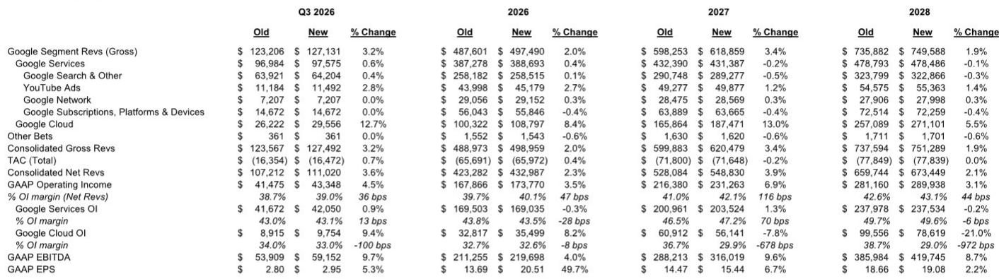
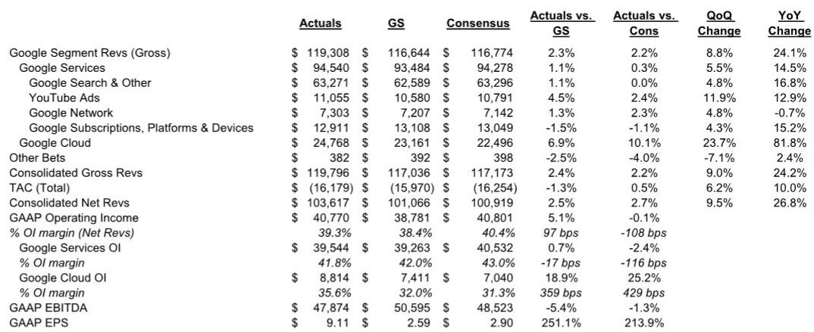
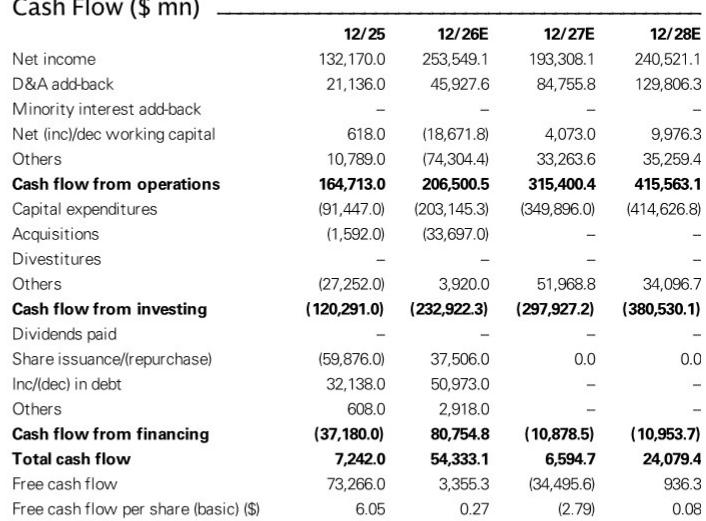

# GS：Alphabet与AI及近期数据观察

Alphabet 在 2026 年第二季度的财报中呈现出一个清晰的信号：AI 研究周期仍在加速，且已经开始在收入端产生可量化的成果。这份来自GS的观察核心判断是，市场可能低估了 Alphabet 在 AI 领域“分发规模”与“算力规模”双重优势的长期价值，尤其是在 AI 商业化从基础设施层向平台和应用层迁移的进程中。

报告中最具冲击力的数字来自 Google Cloud：该业务在第二季度实现了 82% 的同比增长，收入积压订单环比增加约 500 亿美元，达到约 5140 亿美元。这个数字背后，是近 90% 的财富 100 强企业正在使用 Gemini Enterprise 产品，以及新客户获取量同比弹性较高。GS据此大幅上调了云计算收入预测——2026 年全年收入预期从 4233 亿美元上调至 4330 亿美元，2027 年从 5281 亿美元上调至 5488 亿美元。

与此同时，资本支出指引也在上调。管理层将 2026 年资本支出预期从 1800-1900 亿美元提高至 1950-2050 亿美元，并重申 2027 年资本支出将“显著增长”。GS据此预测 2026/2027 年资本支出分别约为 2050 亿美元和 3500 亿美元。这意味着资本密集度将从 2025 年的 26.7% 攀升至 2027 年的 63.8%。

> **KC观察：** 资本支出的大幅扩张与云计算收入加速之间存在直接关联。报告显示，Google Cloud 收入中直接 TPU 硬件销售/承诺的占比正在上升，这意味着 Alphabet 正在将算力研究转变为可计量的客户合同。读者可以留意的不是资本支出相对值，而是这笔研究能否持续转变为积压订单的增长。

## 1. 搜索业务面临基数效应，但 AI 集成正在改变用户行为

搜索及其他收入在第二季度实现了约 17% 的同比增长，超出预期，零售和资金垂直领域表现尤其强劲。但管理层明确提示，从第三季度开始将面临更严峻的同比基数以及外汇逆风。GS据此判断，未来几个季度搜索增速将逐步回归正常化水平。

一个值得关注的细节是，AI Overviews 与 AI Mode 已被整合为统一的搜索体验，AI Mode 月活跃用户已超过 10 亿。这组数据表明，AI 对搜索的改造并非停留在功能叠加，而是正在重塑用户与搜索引擎的交互方式。对于广告主而言，这意味着广告转化路径和归因模型可能需要重新校准。

## 2. YouTube 广告收入重新加速，订阅业务成为第二增长曲线

YouTube 广告收入在第二季度超出GS和市场的预期，直接响应广告和品牌广告均呈现增长。世界杯等大型活动带来了超过 17 亿的全球观众，新的整理版创作者节目和“报告观点with Google Pay”功能也在推动客厅场景的变现。

更值得关注的是订阅业务。YouTube Music 与 Premium 订阅收入被纳入公司的“订阅”收入线，并成为重要的增长驱动力。这意味着 Alphabet 正在从单一的广告收入模式转向“广告+订阅”的双引擎结构。对于内容平台而言，这种收入结构的多元化有助于平滑广告周期的波动。

## 3. 资本支出与运营效率的平衡是未来两年的核心观察点

报告中最具张力的部分，是 Alphabet 如何在“加速算力建设”与“维持运营效率”之间取得平衡。一方面，2027 年资本支出预计将达到 3500 亿美元，折旧与摊销将从 2025 年的 211 亿美元飙升至 2028 年的 1298 亿美元；另一方面，管理层仍在强调提升整体运营效率，并维持强劲的信用状况。

GS预测，2026 年自由现金流将从 2025 年的 733 亿美元骤降至 34 亿美元，2027 年甚至可能出现负值。这意味着 Alphabet 正在用当前的现金流换取未来的算力基础设施。对于长期观察者而言，关键指标不是短期自由现金流，而是资本支出能否持续转变为云计算积压订单的增长。

## 4. 一个可复用的观察框架：从基础设施到平台再到应用

报告提供了一个清晰的 AI 商业化阶段框架：当前市场主要关注基础设施层的研究规模，但 Alphabet 的优势在于同时覆盖“平台层”（Gemini 模型、Google Cloud）和“应用层”（搜索、YouTube、Workspace）。GS认为，随着 AI 商业化从基础设施向平台和应用迁移，Alphabet 的“分发规模”（超过 10 亿用户的应用程序组合）与“算力规模”的双重优势将逐渐被市场重新定价。

这个框架可以帮助读者理解一个看似矛盾的现象：为什么 Alphabet 在资本支出大幅扩张的同时，EBIT 利润率仍在提升（从 2025 年的 37.6% 预计升至 2028 年的 43.1%）。答案在于，算力研究不仅服务于外部客户，也同时驱动内部产品的效率提升和成本优化。

For informational purposes only. Portions may be generated,translated,summarized,or edited with AI assistance based on source materials and may contain omissions or errors. Please verify independently. This is not investment,legal,tax,accounting,or other professional advice.

For informational purposes only. Portions may be generated,translated,summarized,or edited with AI assistance based on source materials and may contain omissions or errors. Please verify independently. This is not investment,legal,tax,accounting,or other professional advice.

