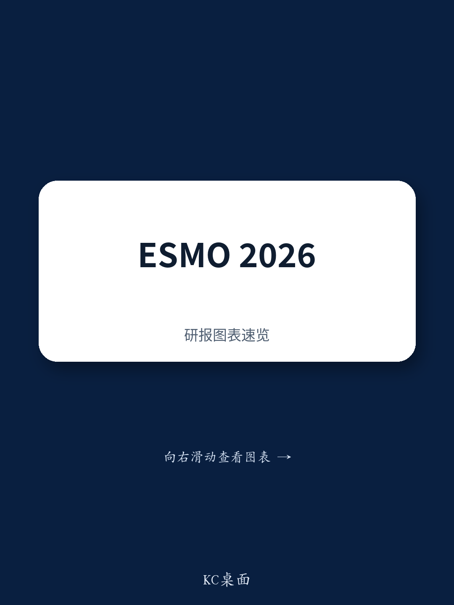

# 中国医疗-ESMO2026中国数据聚焦

2026年欧洲肿瘤内科学会（ESMO）年会将于10月23日至27日在马德里举行。某机构在近期发布的报告中，梳理了中国生物医药企业将在本次会议上披露的关键临床数据，并指出几个值得观察的方向：科伦博泰sac-TMT在非小细胞肺癌一线治疗中的III期数据、再鼎医药ZL-1310在小细胞肺癌一线治疗中的早期数据，以及多个针对RAS突变的靶向疗法首次人体数据。

报告认为，这些数据将为中国创新药在多个治疗领域的竞争格局提供新的验证节点，尤其是ADC联合治疗的安全性与疗效平衡、DLL3靶向疗法在一线SCLC中的定位，以及KRAS G12D抑制剂在胰腺癌中的横向对比。

## 1. sac-TMT的Lung06数据成为ESMO焦点

科伦博泰此前宣布，其sac-TMT（SKB264/MK-2870）在中国开展的III期OptiTROP-Lung06试验，在PD-L1 TPS<1%的一线非鳞非小细胞肺癌患者中已达到无进展生存期的主要终点。该机构指出，该数据若被选为ESMO的Late-Breaking Abstract，将是本次会议最受关注的中国产品之一。

这一数据的关键意义在于：sac-TMT此前已在多个癌种中显示出疗效信号，但在PD-L1低表达这一免疫治疗相对薄弱的亚群中，能否通过TROP2 ADC联合免疫治疗实现突破，将直接影响该药物在肺癌领域的发展空间。报告同时提醒，LBA摘要标题将于9月25日公布，最终数据需待10月19日全文披露。

> **观察：** PD-L1 TPS<1%的NSCLC患者对现有免疫疗法应答率较低，这一人群的疗效数据往往比整体人群更能体现ADC联合方案的差异化价值。如果sac-TMT在此亚群中显示出有临床意义的PFS改善，将为其在更广泛一线NSCLC适应症中的注册路径提供有力支撑。

## 2. DLL3靶向疗法竞争：一线SCLC数据将决定差异化空间

小细胞肺癌领域，DLL3靶向疗法是本次ESMO中国药企的另一个密集披露方向。该机构重点提及再鼎医药的ZL-1310（DLL3 ADC）在一线SCLC中联合阿替利珠单抗及卡铂的Ib/Ic期数据，认为这是再鼎医药2026年下半年的关键关注点。

报告指出，在二线治疗中，各DLL3靶向疗法的疗效已趋于接近，因此ZL-1310能否凭借其安全性优势，在一线联合治疗中显示出更优的临床获益与风险的平衡，将决定其在SCLC治疗格局中的独特定位。此外，泽璟制药的alveltamig（DLL3/DLL3/CD3三特异性抗体）将更新二线以上SCLC的长期OS数据——此前ASCO披露的18个月OS率为58.6%，本次会议可能确认其中位OS是否达到20-25个月区间，并与安进tarlatamab的III期DeLLphi-304最新OS数据形成直接对比。

恒瑞医药的DLL3 ADC（SHR-4849）和DLL3 TCE（SHR-7787）也将分别披露长期生存数据和首次I/II期结果，进一步丰富这一靶点的治疗选择。

## 3. ADC联合治疗与新型ADC的临床数据初现

ADC领域的进展不仅限于单药。该机构指出，本次ESMO将有多项ADC联合免疫治疗的数据披露，其中值得关注的是恒瑞医药cMET ADC（SHR-1826）联合PD-L1及CTLA-4抑制剂在二线以上非鳞NSCLC中的II期数据，以及CLDN18.2 ADC（SHR-A1904）联合阿得贝利单抗在一线胃癌中的Ib期数据。

报告特别强调，这些联合方案的核心观察点在于“兼容性”——即联合用药对治疗特征的影响，特别是重叠毒性与增量获益之间的平衡。这一判断框架同样适用于豪森药业EGFR/c-MET双抗ADC（HS-20122）和科济药业CDH17 ADC（CM518D1）的首次人体数据，它们将展示新型ADC在实体瘤中的初步安全性和疗效信号。

## 4. RAS靶向疗法：KRAS G12D抑制剂进入横向对比阶段

在RAS突变靶向治疗领域，本次ESMO将迎来多个中国药企的KRAS G12D抑制剂数据。恒瑞医药的HRS-4642将在胰腺癌中披露联合尼妥珠单抗的Ib/II期结果，同时还有联合免疫治疗在胰腺癌和NSCLC中的多个队列数据。劲方医药的GFH375则被列为LBA，将展示其在KRAS G12D突变胰腺癌中的I/II期数据。

该机构认为，这些数据可以与RevMed的zoldonrasib在ESMO GI上公布的结果进行横向比较，为KRAS G12D抑制剂的竞争格局提供初步的疗效与安全性参照。此外，劲方医药的panRAS分子胶GFH276也将作为LBA首次披露实体瘤中的I期数据，这是继RevMed的daraxonrasib在胰腺癌III期取得突破后，该领域最受关注的早期临床进展之一。

---

本次ESMO中国药企的数据披露密度较高，涉及ADC、双抗/三抗、RAS抑制剂等多个技术路线。该机构的分析框架提示，读者应关注的不只是单药疗效数据，更包括联合方案的毒性管理、同类药物间的横向对比，以及早期数据对后续注册路径的支撑力度。随着9月25日LBA标题公布和10月19日全文披露，这些判断将迎来第一轮验证。

For reference only. Portions may be generated, translated, summarized, or edited with AI assistance based on source materials and may contain omissions or errors. Please verify independently. This does not constitute professional advice.

For reference only. Portions may be generated, translated, summarized, or edited with AI assistance based on source materials and may contain omissions or errors. Please verify independently. This does not constitute professional advice.

