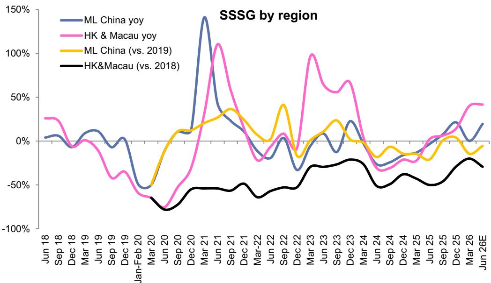
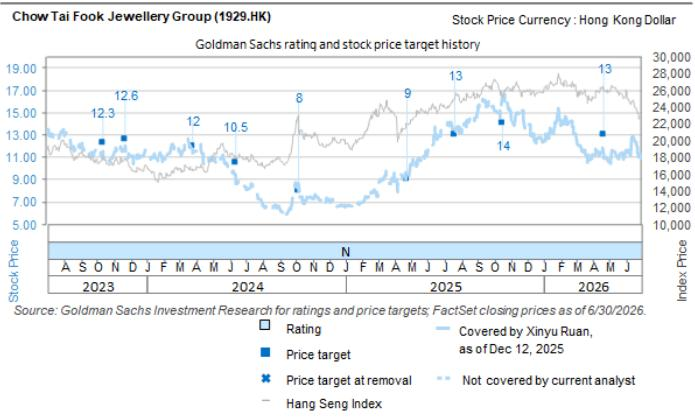

# 公司研究概览

## 周大福珠宝集团 (1929.HK)

# 第一财季同店销售增长符合预期，七月因天气因素增速有所调整；管理层对全年指引持积极态度；评级中性

周大福（CTF）公布了第一财季（截至2026年6月季度）的经营数据，并于7月23日收盘后召开电话会议。参考此前六福的业绩，中国大陆自营店同店销售增长录得19.6%（4-5月为19.7%，与预期20%一致），加盟店增长15.7%；香港及澳门表现稳健，增长41.7%（4-5月为40.6%，略高于预期40%）。在中国大陆，与六福（自营店/加盟店分别增长16%/25%）相比，CTF自营店渠道表现较好，加盟店则稍逊；港澳同店销售增长与六福的41%相近。按品类看，在金价调整背景下，按重计价产品表现较好，中国大陆/港澳分别增长38%/63.7%；定价类产品则分别变化-1%/+13.1%。中国大陆在6月季度净关店258家，管理层预计全年中国大陆净关店600-700家。

展望未来，管理层对实现全年指引表示有信心，并指出第一财季表现好于其预期。进入7月，7月1-19日中国大陆同店销售增速较6月季度有所调整，自营店实现单位数正增长，管理层将其归因于天气因素影响以及世界杯赛事前两周带来的客流量分流。不过第三周表现出现环比改善。积极方面，在金价趋稳及黎明系列等成功产品带动下，定价类产品在7月表现较好（自营渠道双位数增长），管理层将全年销售指引从20亿港元上调至30亿港元。

我们认为该结果基本符合市场预期，4-5月的高同店销售增长此前已有体现。黎明系列是积极惊喜，也为7月定价类产品的较好表现提供了支撑，但第一财季中国大陆定价类产品结构受金价波动影响同比下降约5个百分点。我们认为同店销售增长的可持续性以及新产品能否推动定价类产品结构改善（vs.公司全年指引同比小幅扩张）将是关注重点。维持中性评级。

我们感谢何女士对本报告的贡献。

## 第一财季经营更新

## 中国大陆：

第一财季自营店同店销售同比增长19.6%，主要受平均售价上升驱动，销量同比下降5.2%。这意味着6月季度销售额水平约为2019年同期的95%（即疫情前水平），相较3月季度（约为85%）有所提升。加盟店同店销售增长15.7%。

分产品看，定价类珠宝同店销售同比下降1%，定价类黄金/宝石镶嵌平均售价同比分别增长40%/4%至9,100/8,700港元。按重计价珠宝同店销售同比增长38%，平均售价同比上升26%至10,600港元。公司仍在进行零售网络优化，6月季度中国大陆净关店258家。电商零售额保持强劲，同比增长28.9%，占零售额8.9%。

## 香港及澳门：

第一财季同店销售同比增长41.7%，其中香港增长35%，澳门增长64.6%，主要受平均售价上升驱动，销量也同比增长9.4%。这意味着6月季度销售额水平约为2018年（即正常水平，疫情前及香港宏观事件前）的71%，而上一财年第四季度为80%。

分产品看，定价类珠宝同店销售同比增长13.1%，定价类黄金/宝石镶嵌平均售价同比分别变化+71%/+2%至8,700/16,600港元。按重计价珠宝同店销售同比增长63.7%，平均售价同比上升10%至17,100港元。

## 电话会议要点

全年指引重申：管理层重申大陆收入中至高个位数增长、同店销售中高个位数增长，港澳同店销售低双位数增长。在金价每盎司4,300美元的假设下，毛利率/经营利润率指引仍分别为26.5%-27.5%/约14%；对冲收益5-8亿港元。在当前金价约4,100美元/盎司水平下，管理层认为对收入影响有限，按重计价黄金需求仍受支撑。按重计价黄金占比提升可能影响毛利率，但可以通过较高的按重计价产品销售/对冲收益带来的经营杠杆来抵消，全年净利润基本稳定。

近期趋势：7月1-19日中国大陆同店销售增速调整至个位数增长，港澳则录得双位数增长。管理层指出7月前两周同店销售受天气因素及世界杯赛事分流影响，但第三周表现有所改善。在产品结构方面，尽管定价类产品在6月季度受金价波动影响表现较弱，管理层指出截至7月至今，中国大陆自营店定价类产品同店销售实现双位数增长，受益于新产品驱动，表现优于整体。

黎明系列带来积极惊喜：黎明系列第一财季零售额超过8.7亿港元，超出管理层预期，新会员占客户比例超过20%。管理层将全年销售指引上调至超过30亿港元（原为20亿港元）。管理层还指出整体宝石镶嵌产品销售额同比增长超过80%，主要由黎明系列驱动。中国高级定制珠宝系列在6月发布活动中售出超过250件。

渠道策略：在中国大陆，第一财季新开14家店，净关店258家（上财年同期净关311家）。管理层预计全年净关店600-700家，主要集中在上半年。不过新店的单店销售额约为关店的三倍，因此网络优化对收入影响有限。海外方面，公司近期在曼谷和加拿大开设了旗舰店，并升级了马来西亚柏威年广场店。计划年底在新加坡开设新店。未来扩张将聚焦东南亚和北美核心地段。

区域市场评论：1）中国大陆：一线和二线城市表现优于低线城市，自营店表现优于加盟店，购物中心店表现优于低客流位置。2）港澳：游客贡献了香港约60%的销售和澳门超过80%的销售，与去年同期及疫情前水平大致持平。

图1：周大福6月季度中国大陆同店销售增速提升，港澳维持强劲  
周大福按区域同店销售增长  
  
注：港澳正常期指疫情前及香港宏观事件前  
来源：公司数据

## 目标价风险及方法论 - 周大福珠宝集团

我们对CTF给予中性评级，12个月目标价13港元。目标价基于FY27E平均市盈率13倍。主要风险：同店销售复苏慢于或快于预期，门店扩张慢于或快于预期，租金成本削减低于或高于预期，中国大陆游客旅游目的地偏好的变化，中国旅游政策变化，金价/汇率波动，以及新品牌的表现。

## 附录

## Reg AC

我们，Xinyu Ruan和Michelle Cheng，特此证明本报告中表达的所有观点准确反映了我们对所涉公司及其证券的个人观点。我们也证明，我们的报酬中没有任何部分直接或间接地与报告中表达的具体建议或观点相关。

除非另有说明，本报告封面所列个人为GS全球投资研究部门的分析师。

贡献作者：Xinyu Ruan GS (Asia) L.L.C., Michelle Cheng GS (Asia) L.L.C., Molly Dai GS (Asia) L.L.C., Keira Liu GS (Asia) L.L.C.。

除非另有说明，本报告“贡献作者”中列出的个人为GS全球投资研究部门的分析师。

## GS因子概况

GS因子概况通过将关键属性与市场（即我们评级股票的覆盖范围）及其行业同行进行比较，为股票提供投资背景。所描绘的四个关键属性是：增长、财务回报、倍数（例如估值）和综合（增长、财务回报和倍数的组合）。增长、财务回报和倍数的计算方法是使用每只股票特定指标的标准化排名，然后将指标的标准化排名平均值转换为相关属性的百分位数。每个指标的具体计算可能因财年、行业和地区而异，但标准方法如下：

增长基于股票的未来销售增长、EBITDA增长和EPS增长（对于金融股，仅计算EPS和销售增长），较高百分位数表示增长率较高的公司。财务回报基于股票的未来ROE、ROCE和CROCI（对于金融股，仅计算ROE），较高百分位数表示财务回报较高的公司。倍数基于股票的未来P/E、P/B、价格/股息（P/D）、EV/EBITDA、EV/FCF和EV/债务调整后现金流（DACF）（对于金融股，仅计算P/E、P/B和P/D），较高百分位数表示以较高倍数交易的股票。综合百分位数计算为增长百分位数、财务回报百分位数和（100% - 倍数百分位数）的平均值。

财务回报和倍数使用GS分析师至少在未来三个季度之后的财年预测。增长使用未来至少七个季度之后财年的输入数据（所有指标均为每股基准），与至少未来三个季度之后的财年进行比较。

有关我们如何计算GS因子概况的更详细说明，请联系您的GS代表。

## 并购排名

在我们的全球覆盖范围内，我们使用并购框架审视股票，考虑定性因素和定量因素（可能因行业和地区而异），以纳入某些公司可能被收购的可能性。然后我们分配并购排名，从1到3对覆盖范围内的公司进行评分，其中1表示公司成为收购目标的可能性较高（30%-50%），2表示中等可能性（15%-30%），3表示低可能性（0%-15%）。对于排名为1或2的公司，按照我们的部门指导方针，我们将并购组成部分纳入目标价。并购排名3被视为不重要，因此不计入目标价，并且可能会或可能不会在研究中讨论。

## Quantum

Quantum是GS的专有数据库，可提供详细的财务报表历史、预测和比率。可用于对单一公司进行深入分析，或比较不同行业和市场的公司。

## 披露

周大福珠宝集团的评级相对于其覆盖范围中的其他公司：安踏体育、布鲁可集团、波司登国际控股、茶姬控股、周大福珠宝集团、周大生珠宝、儒鸿企业、丰泰企业、美食达客、古茗控股、海底捞国际控股、华利集团、九毛九、绝味食品、老铺黄金、李宁、瑞幸咖啡、六福集团、宏远纺织、名创优品（ADR）、名创优品（H）、蜜雪集团、泡泡玛特、宝胜国际控股、統一超商、晨光文具、申洲国际集团、九兴控股、滔搏国际控股、統一企業、特步国际控股、裕元工业、百胜中国控股（ADR）、百胜中国控股（H）

## 公司特定监管披露

以下披露涉及GS集团（及其关联公司，“GS”）与GS全球投资研究所涉公司之间的关系。

GS在过去12个月内已因投资银行服务获得报酬：周大福珠宝集团（12.51港元）

GS预计在未来3个月内将因投资银行服务获得或寻求获得报酬：周大福珠宝集团（12.51港元）

GS在过去12个月内与以下公司存在投资银行服务客户关系：周大福珠宝集团（12.51港元）

GS在做市该证券或其衍生品：周大福珠宝集团（12.51港元）

## 评级/投资银行关系分布
GS投资研究全球股票覆盖范围

|  | 评级分布 |  |  | 投资银行关系 |  |  |
|---|---|---|---|---|---|---|
|  | 买入 | 持有 | 卖出 | 买入 | 持有 | 卖出 |
| 全球 | 50% | 34% | 16% | 65% | 59% | 43% |

截至2026年7月1日，GS全球投资研究对3,104只股票有投资评级。GS将股票分配为Buy和Sell分别位于不同区域的Investment Lists；未分配此类评级的股票被视为Neutral。此类分配相当于FINRA规则要求的买入、持有和卖出目的。请参见下方的"评级、覆盖范围及相关定义"。

## 目标价及评级历史图

  
所示目标价应在所有先前发布的GS报告的背景下考虑，该报告可能或可能未包括目标价，以及公司、其行业和金融市场的发展。

## 目标价历史表 - 周大福珠宝集团 (1929.HK)

报告日期 目标价（港元） 收盘价（港元）

| 2026年4月22日 | 13.00 | 11.31 |
|---|---|---|
| 2025年10月17日 | 14.00 | 16.52 |
| 2025年7月22日 | 13.00 | 14.00 |
| 2025年4月24日 | 9.00 | 9.63 |
| 2024年10月7日 | 8.00 | 8.59 |
| 2024年6月13日 | 10.50 | 9.46 |
| 2024年3月26日 | 12.00 | 11.44 |
| 2023年11月23日 | 12.60 | 12.04 |
| 2023年10月12日 | 12.30 | 11.56 |

## 监管披露

## 美国法律法规要求的披露

见上述公司特定监管披露中关于本报告所涉公司的任何披露：待定交易中的经理或联合经理；1%或其他所有权；特定服务的报酬；客户关系类型；先前期间的公开募股管理/联合管理；董事职位；针对股票证券，做市和/或专家角色。GS以自营身份交易或可能交易本报告中讨论的发行人的债务证券（或相关衍生品）。

其他要求披露：所有权和重大利益冲突：GS政策禁止其分析师、向分析师报告的专业人士及其家庭成员持有分析师覆盖范围内任何公司的证券。分析师报酬：分析师的报酬部分基于GS的盈利能力，包括投资银行收入。分析师担任高级职员或董事：GS政策通常禁止其分析师、向分析师报告的人员或其家庭成员在分析师覆盖范围内的任何公司担任高级职员、董事或顾问。非美国分析师：非美国分析师可能不是GS & Co. LLC的关联人，因此可能不受FINRA规则2241或2242对与所涉公司沟通、公开露面以及交易分析师所覆盖证券的约束。

## 美国以外法律法规要求的其他披露

以下披露为特定司法管辖区所要求，但已根据美国法律法规在上述范围内做出的除外。澳大利亚：GS Australia Pty Ltd及其关联公司不是澳大利亚的授权存款机构（定义见1959年银行业法（联邦）），不提供银行服务，也不在澳大利亚开展银行业务。本研究报告及其访问权限仅供澳大利亚公司法含义内的“批发客户”使用，除非GS另有约定。在编制研究报告时，GS Australia全球投资研究部门的人员可能会参加由研究报告所涉公司及其他实体的现场会议或其他会议。在某些情况下，此类现场会议或会议的费用可能部分或全部由相关发行人承担，前提是GS Australia认为在特定情况下适当且合理。若本文档内容包含任何金融产品建议，则仅为一般性建议，由GS在未考虑客户目标、财务状况或需求的情况下编制。客户在依据此类建议行事前应考虑其自身情况。GS Australia和New Zealand的某些利益披露及GS澳大利亚卖方研究独立性政策声明副本可在以下网址获取：https://www.goldmansachs.com/disclosures/australia-new-zealand/index.html。巴西：根据CVM决议20号的披露信息见https://www.gs.com/worldwide/brazil/area/gir/index.html。在适用情况下，主要负责本研究报告内容的巴西注册分析师（定义见CVM决议20号第20条）为本报告第一作者，除非文中另有说明。加拿大：此信息仅供您参考，并非GS & Co. LLC为购买加拿大证券而进行的广告、发行或招揽。GS & Co. LLC未在任何加拿大司法管辖区注册为交易商，通常不允许交易加拿大证券，并可能被禁止在加拿大某些司法管辖区出售某些证券和产品。如果您希望交易任何加拿大证券或其他产品，请联系GS加拿大公司（GS集团附属公司）或其他注册加拿大交易商。香港：有关本研究所涉公司证券的更多信息，可向GS (Asia) L.L.C.索取。印度：有关本研究所涉公司或公司的更多信息，可从GS (India) Securities Private Limited获取，研究分析师注册号INH000001493，地址：10th Floor, Ascent-Worli, Sudam Kalu Ahire Marg, Worli, Mumbai-400 025, India，企业身份号U74140MH2006FTC160634，电话+91 22 6616 9000，传真+91 22 6616 9001。GS可能实益拥有本研究报告所涉公司1%或以上的证券（定义见1956年印度证券合同（监管）法第2(h)条）。SEBI注册及NISM认证不以任何方式保证中介机构的业绩或向读者提供回报保证。GS (India) Securities Private Limited合规官及读者投诉联系方式、年度合规审计报告副本及其他相关信息和披露见链接：https://www.goldmansachs.com/worldwide/india/research-analyst。日本：见下文。韩国：本研究及其访问权限仅供金融投资服务和资本市场法含义内的“专业读者”使用，除非GS另有约定。有关本研究所涉公司或公司的更多信息，可从GS (Asia) L.L.C.首尔分行获取。新西兰：GS New Zealand Limited及其关联公司不是新西兰的“注册银行”或“存款接受者”（定义见1989年新西兰储备银行法）。本研究及其访问权限仅供Financial Advisers Act 2008的含义内的“批发客户”使用，除非GS另有约定。GS Australia和New Zealand的某些利益披露副本见：https://www.goldmansachs.com/disclosures/australia-new-zealand/index.html。俄罗斯：在俄罗斯联邦分发的研究报告不是俄罗斯立法定义中的广告，而是信息和分析，其主要目的不是推广产品，也不提供俄罗斯评估活动立法含义内的评估。研究报告不构成俄罗斯法律法规定义的个人化研究交流，不针对特定客户，且未分析客户的财务状况、投资概况或风险概况。GS不对客户或任何其他人基于本研究报告做出的任何投资决策承担责任。新加坡：GS (Singapore) Pte.（公司编号：198602165W）受新加坡金融管理局监管，对本研究报告承担法律责任，有关本研究报告的任何事宜请联系该公司。台湾：此材料仅供参考，未经许可不得转载。读者应仔细考虑自身的投资风险。投资结果由读者个人负责。英国：在英国被归类为零售客户的人士（定义见金融行为监管局规则）应结合先前GS对相关报告所涉公司的研究报告阅读本报告，并应参阅GS International已发送给他们的风险警告。这些风险警告的副本及本报告中使用的某些金融术语词汇表可向GS International索取。

欧盟和英国：关于欧盟委员会授权条例(EU) (2016/958)第6(2)条（该条例补充欧洲议会和理事会条例(EU) No 596/2014，包括英国退出欧盟和欧洲经济区后该授权条例在英国国内法律和法规中的实施情况）中关于研究交流或推荐或暗示投资策略的客观呈现技术安排以及特定利益或利益冲突披露的技术监管标准的信息，可在以下网址获取：https://www.gs.com/disclosures/europeanpolicy.html，其中说明了欧洲利益冲突管理与投资研究相关的政策。

日本：GS Japan Co., Ltd.是关东财务局注册的金融工具交易商，注册号Kinsho 69，是日本证券业协会、日本金融期货协会、第二类金融工具业协会和日本投资顾问协会的会员。股票买卖需按预先与客户确定的佣金加上消费税收取。请参见公司特定披露中适用的日本交易所、日本证券业协会或日本证券金融公司要求披露的内容。

## 评级、覆盖范围及相关定义

买入(B)、中性(N)、卖出(S) 分析师建议将股票作为买入或卖出纳入各个区域的Investment Lists。股票被分配买入或报告评级取决于其相对于覆盖范围的总回报潜力。未被分配买入或报告评级且具有活跃评级的股票（即非评级暂停、未评级、早期生物科技、覆盖暂停或未覆盖的股票）被视为中性。每个区域管理区域信念清单，从该区域Investment Lists中选出的报告评级股票组成，代表基于总回报潜力大小和/或回报实现可能性在其各自覆盖范围内的研究交流。此类信念清单中股票的添加或移除由各区域的投资审查委员会或其他指定委员会管理，不代表分析师对这些股票投资评级的变化。

总回报潜力代表当前股价与目标价之间的上行或下行差异，包括所有已付或预期的股息，在目标价相关时间范围内实现。目标价对所有覆盖股票均为必需。总回报潜力、目标价和相关时间范围在每份增加或重申Investment List成员资格的报告中有说明。

覆盖范围：每只股票的所有覆盖范围列表可通过主要分析师、股票和覆盖范围在https://www.gs.com/research/hedge.html获取。

未评级(NR)。当GS在此公司的并购或战略交易中担任顾问时，或由于GS涉及交易的法律、监管或政策约束，以及在某些其他情况下，投资评级、目标价和盈利预测（如适用）将根据GS政策移除。早期生物科技(ES)。当该公司尚未有通过二期临床试验的药物、治疗或医疗设备，也未获得分发后二期药物、治疗或医疗设备的许可时，根据GS政策不分配投资评级和目标价。评级暂停(RS)。GS已暂停对该股票的投资评级和目标价，因为没有足够的基本面基础来确定投资评级或目标价。先前的投资评级和目标价（如有）不再有效，不应再依赖。覆盖暂停(CS)。GS已暂停对该公司的覆盖。未覆盖(NC)。GS未覆盖该公司。

## 全球产品；分销实体

GS全球投资研究为GS客户在全球范围内制作和分发研究产品。基于GS全球各办事处的分析师对行业和公司进行研究，并对宏观经济、货币、大宗商品和投资组合策略进行研究。本研究在澳大利亚由GS Australia Pty Ltd (ABN 21 006 797 897)分发；在巴西由GS do Brasil Corretora de Títulos e Valores Mobiliários S.A.分发；公共沟通渠道GS Brasil: 0800 727 5764 和/或 contatogoldmanbrasil@gs.com。工作日（节假日除外）9:00-18:00。在加拿大由GS & Co. LLC分发；在香港由GS (Asia) L.L.C.分发；在印度由GS (India) Securities Private Ltd.分发；在日本由GS Japan Co., Ltd.分发；在韩国由GS (Asia) L.L.C.首尔分行分发；在新西兰由GS New Zealand Limited分发；在俄罗斯由OOO GS分发；在新加坡由GS (Singapore) Pte.（公司编号：198602165W）分发；在美国由GS & Co. LLC分发。GS International已批准本研究在英国的分发。

GS International（“GSI”），由审慎监管局（“PRA”）授权，受金融行为监管局（“FCA”）和PRA监管，已批准本研究在英国的分发。

欧洲经济区：GS Bank Europe SE（“GSBE”）是一家在德国注册的信贷机构，在单一监管机制下接受欧洲央行的直接审慎监管，并在其他方面受德国联邦金融监管局（Bundesanstalt für Finanzdienstleistungsaufsicht, BaFin）和德意志联邦银行监管，并在欧洲经济区内分发研究。

## 一般披露

本研究仅供我们的客户使用。除与GS相关的披露外，本研究基于我们认为是可靠的当前公开信息，但我们不表示其准确或完整，不应作为依据。本文中的信息、观点、估计和预测均为截至本文日期，如有变更恕不另行通知。我们寻求适当更新我们的研究，但各种法规可能阻止我们这样做。除某些定期发布的行业报告外，大多数报告根据分析师的判断不定期发布。

GS从事全球全方位、综合性投资银行、投资管理和经纪业务。我们与全球投资研究所涵盖的很大一部分公司有投资银行和其他业务关系。GS & Co. LLC，美国经纪交易商，是SIPC成员（https://www.sipc.org）。

我们的销售人员、交易员和其他专业人员可能向我们的客户和主交易柜台提供口头或书面市场评论或交易策略，这些评论或策略可能反映与本研究中的意见相反的意见。我们的资产管理业务、主交易柜台和投资业务可能做出与本研究的建议或观点不一致的投资决策。

本报告中指定的分析师可能不时与我们的客户（包括GS销售人员和交易员）讨论，或在本报告中讨论，提及可能对本报告讨论的股票市场价格产生近期影响的催化剂或事件的交易策略，这种影响可能方向性地与分析师对这些股票的已发布目标价预期相反。任何此类交易策略都不同于且不影响分析师对这些股票的基本股权评级，该评级反映股票相对于其覆盖范围的回报潜力，如本文所述。

我们及我们的关联公司、高级职员、董事和员工将不时持有本研究所涉证券或衍生品的多头或空头头寸，作为自营交易主体并买卖这些证券或衍生品，除非法规或GS政策禁止。

GS安排会议上第三方发言者（包括来自GS其他部门的个人）的观点不一定反映全球投资研究的观点，也不是GS的官方观点。

本文中引用的任何第三方，包括任何销售人员、交易员和其他专业人员或其家庭成员，可能持有与这些产品相关的头寸，这些头寸与本报告中分析师表达的观点不一致。

本研究不构成出售要约或购买任何证券的要约邀请，在任何此类要约或邀请非法的司法管辖区无效。它不构成个人建议，也未考虑个别客户的投资目标、财务状况或需求。客户应考虑本研究中的任何建议或推荐是否适合其自身情况，并在适当时寻求专业建议，包括税务建议。本研究所涉投资的价值和价格及其产生的收入可能波动。过去的表现不是未来表现的指引，未来回报不保证，可能发生原始资本损失。汇率波动可能对某些投资的价值或价格或由此产生的收入产生不利影响。

某些交易，包括涉及期货、期权和其他衍生品的交易，存在重大风险，不适合所有读者。读者应查阅当前的期权和期货披露文件，可从GS销售代表或https://www.theocc.com/about/publications/character-risks.jsp和https://www.goldmansachs.com/disclosures/cftc\_fcm\_disclosures获取。期权策略中若涉及多次买卖期权（如价差），交易成本可能显著。将根据要求提供支持文件。

全球投资研究提供的服务级别差异：您从GS全球投资研究所获得的服务级别和类型可能与GS内部及其他外部客户相比有所不同，具体取决于各种因素，包括您对沟通频率和方式的偏好、您的风险偏好和投资视角（例如，全市场、行业特定、长期、短期）、您与GS的整体客户关系的规模和范围，以及法律和监管限制。例如，某些客户可能希望在特定证券研究报告发布时收到通知，某些客户可能希望将从我们内部客户网站上获得的分析师基础研究数据通过数据馈送或其他方式以电子方式传递给他们。分析师的任何基础研究观点变化（例如，对股票证券的评级、目标价或盈利预测的重大变化）都不会在通过电子方式向我们的内部客户网站广泛发布研究报告或其他必要方式之前告知任何客户，以使所有有权收到此类报告的客户都获得信息。

所有研究报告通过电子方式同时发布到我们的内部客户网站，并同时分发给所有客户。并非所有研究内容都会分发给我们的客户或提供给第三方聚合商，GS也不对第三方聚合商重新分发我们的研究负责。有关一种或多种证券、市场或资产类别的研究、模型或其他数据（包括相关服务），请联系您的GS代表或访问https://research.gs.com。

披露信息也可在https://www.gs.com/research/hedge.html或向Research Compliance, 200 West Street, New York, NY 10282获取。

## © 2026 GS.

您可以将通过本服务获得的信息存储、显示、分析、修改、重新格式化并打印，仅供您个人使用。未经GS明确书面同意，您不得转售或逆向工程此信息以计算或开发任何指数用于披露和/或营销，或创建任何其他衍生作品、商业产品、数据或产品。未经GS明确书面同意，您不得以任何格式向任何第三方发布、传输或以其他方式复制此信息的全部或部分内容。前述限制包括但不限于使用、提取、下载或检索此信息的全部或部分，用于训练或微调机器学习或人工智能系统，或作为任何此类系统的提示或输入。
