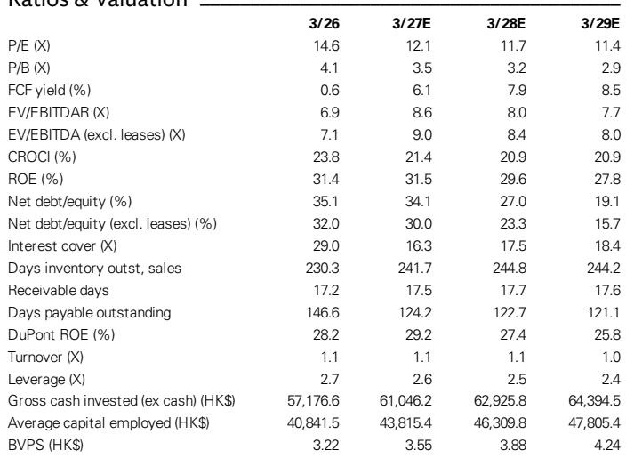
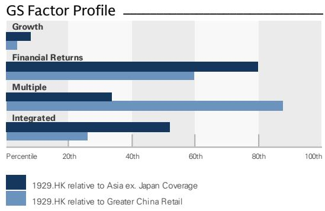

# GS：周大福1QFY27同店业务与近期数据观察

周大福珠宝集团于7月23日收市后公布1QFY27（2026年4月至6月季度）营运数据，并召开会议。GS在随后发布的报告中指出，该季度中国内地自营店同店销售增长19.6%，与GS预期的20%基本一致；港澳市场同店销售增长41.7%，略高于40%的预期。整体表现符合市场预期，但进入7月后增速出现节奏变化。

报告的核心判断是：周大福1QFY27的强劲同店增长主要由金价回调驱动的重量计价产品带动，固定价格产品在中国内地仍录得同比下滑。管理层重申全年指引，并对达成目标有信心，但7月前两周的天气和世界杯赛事分流对客流造成影响，第三周已出现环比改善。GS更新公司观点，认为同店增长的可持续性以及新产品能否推动固定价格产品占比提升，是后续观察的关键。

## 1. 中国内地同店增长由重量计价产品驱动，固定价格产品仍承压

1QFY27中国内地自营店同店销售增长19.6%，主要由平均售价提升驱动，销量同比下降5.2%。分产品看，重量计价珠宝同店销售增长38%，平均售价同比上升26%至10,600港元；固定价格珠宝同店销售同比下降1%，其中固定价格黄金和宝石镶嵌产品的平均售价分别同比上升40%和4%至9,100港元和8,700港元。

GS认为，固定价格产品在中国内地的占比同比下降约5个百分点，主要受金价波动影响。这一趋势与周大福全年指引中固定价格产品占比小幅同比扩张的目标存在差距，新产品能否扭转这一局面是后续关注重点。

> **KC评论：** 金价回调虽然支撑了重量计价产品的需求，但固定价格产品的毛利率通常更高。如果固定价格产品占比持续下降，即使收入增长，整体毛利率也可能承压。管理层在会议中表示，金价稳定和Dawn系列等新产品的成功，已在7月带动固定价格产品在中国内地自营店渠道实现双位数增长，这是一个需要验证的积极信号。

## 2. 港澳市场同店增长强劲，游客贡献比例稳定

港澳市场1QFY27同店销售增长41.7%，其中香港增长35%，澳门增长64.6%。与2018年正常水平相比，6月季度同店销售恢复至71%，低于上一季度的80%。分产品看，重量计价珠宝同店销售增长63.7%，固定价格珠宝增长13.1%。

报告显示，游客贡献了香港约60%的销售额和澳门超过80%的销售额，这一比例与一年前和疫情前基本持平。GS认为，港澳市场的恢复节奏与中国内地游客的出行偏好和消费能力高度相关，后续增速能否维持仍需观察。

## 3. 渠道优化持续推进，新店效率显著高于关店

周大福在1QFY27净关闭中国内地门店258家，管理层预计全年净关闭600至700家，主要集中在上半年。但报告同时指出，新店的销售额约为关闭门店的3倍，因此渠道优化对收入的净影响有限。

海外方面，公司近期在曼谷和加拿大开设了奢侈品门店，并升级了马来西亚柏威年门店，计划年底前在新加坡开设新店。GS认为，海外扩张聚焦东南亚和北美核心地段，与公司品牌升级战略一致，但短期内对整体收入的贡献仍较小。

## 4. Dawn系列超预期，管理层上调全年销售指引

Dawn系列在1QFY27的零售销售额超过8.7亿港元，超出管理层预期，其中新客户占比超过20%。管理层因此将FY27全年销售指引从20亿港元上调至30亿港元。报告还提到，整体宝石镶嵌产品销售额同比增长超过80%，主要由Dawn系列驱动；中国高级珠宝系列在6月发布活动中售出超过250件。

GS认为，Dawn系列是本次报告中的积极惊喜，为固定价格产品的表现提供了支撑。但该系列能否持续拉动固定价格产品占比提升，以及金价走势对消费者偏好的影响，仍是需要跟踪的关键变量。

---

For informational purposes only. Portions may be generated,translated,summarized,or edited with AI assistance based on source materials and may contain omissions or errors. Please verify independently. This is not investment,legal,tax,accounting,or other professional advice.

For informational purposes only. Portions may be generated,translated,summarized,or edited with AI assistance based on source materials and may contain omissions or errors. Please verify independently. This is not investment,legal,tax,accounting,or other professional advice.

