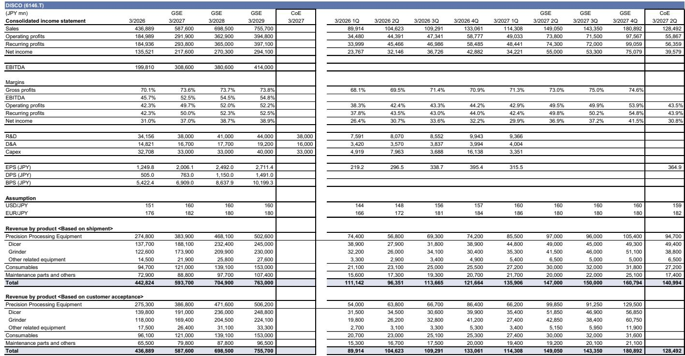
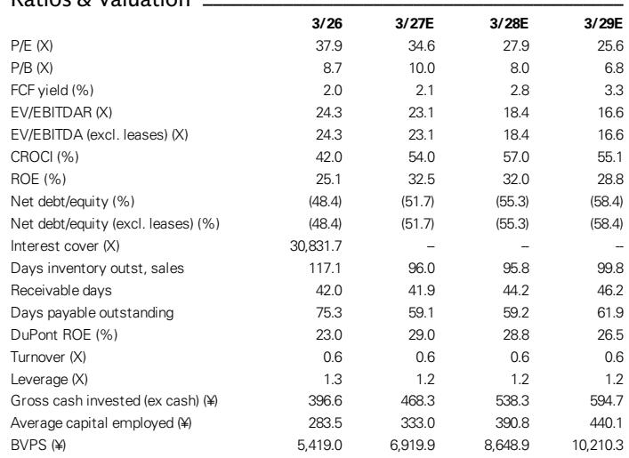
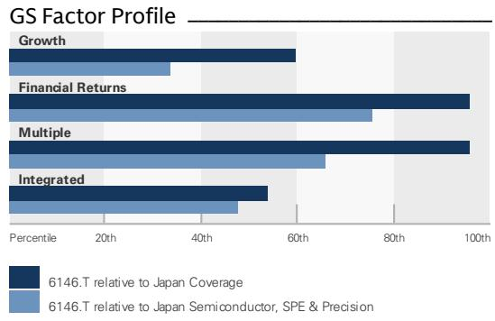

# GS：Disco相关业务与AI、CPO及季度数据观察

Disco 在 7 月 23 日收盘后公布了 2026 财年第一季度业绩。营业利润 490 亿日元，与GS预估的 509 亿日元和彭博一致预期的 486 亿日元基本吻合。真正让许多参与者感到意外的是第二季度出货预测——公司预计出货额为 1410 亿日元（按 159 日元兑 1 美元计算），显著高于彭博一致预期的 1300 亿日元出头。GS分析师指出，此前不少参与者原本预期，由于 HBM 出货集中在第一季度，且总部派驻制造现场的技术支持人员维持在约 100 人不变，第二季度出货量可能环比持平甚至下降。公司给出的预测表明出货动能仍在向上，这是一个值得观察的变化。

## 1. 第一季度出货超预期，第二季度预测环比继续增长

第一季度实际出货额为 1359 亿日元，比公司自身预测高出 39 亿日元。细分来看，设备出货低于目标 30 亿日元，原因是先进封装研发应用的演示设备销售收入确认时点出现错位；耗材出货超出目标 20 亿日元，其他杂项项目超出 50 亿日元。第二季度出货预测 1410 亿日元意味着环比增长。公司明确表示，第一季度延迟确认的演示设备销售收入预计不会在第二季度入账。

## 2. 生成式AI与硅光子（CPO）成为第二季度出货两大推动因素

Disco 在业绩说明会上指出，生成式AI应用将继续推动设备出货，HBM 相关出货预计在第一季度之后延续至多个客户。公司还特别提到，用于硅光子（CPO）的设备出货预计在第二季度扩大，但未披露具体数字。与此同时，面向 OSAT（外包半导体封测）的出货预计在第二季度有所下降，部分原因是第一季度出货集中在中国市场。

> **KC评论：** CPO 被单独提及作为出货推动因素，这是本次业绩说明会的一个增量信息。此前市场更多关注 HBM 和 CoWoS，硅光子作为下一代互连技术，其设备需求开始进入可追踪阶段。Disco 没有给出量化预测，但方向性确认本身值得关注。

## 3. 定价策略未变，生成式AI设备利润率高于量产应用

公司表示近期未调整定价策略，但已能够吸收原材料价格上涨等成本影响。设备利润率与加工难度相关，而非客户属性——生成式AI设备的利润率通常高于量产应用。第二季度盈利预测假设毛利率环比下降约 1 个百分点（第一季度为 71.3%），销售管理费用略高于 340 亿日元，与出货规模同步。公司还提到，耗材利润率正因出货量提升而上升。

## 4. 出货水平有望持续走高，市场共识仍有上调空间

GS小幅调整了盈利预测以反映第一季度实际数据，未做重大修改。分析师认为，出货水平将持续受益于先进封装技术路线的迁移，包括 HBM、CoWoS、EMIB-T、混合键合以及本次被管理层列为出货推动因素的硅光子（CPO）。基于这些技术变化，市场共识仍有相当的上行空间。

一个可复用的观察框架是：Disco 的出货预测是比季度利润更领先的指标，因为它直接反映客户对先进封装设备的实际提货意愿。当出货预测连续超预期时，后续几个季度的收入能见度往往随之提高。本次预测的另一个隐含信息是，演示设备延迟确认并未影响整体出货节奏，说明核心需求足够强劲。

For informational purposes only. Portions may be generated,translated,summarized,or edited with AI assistance based on source materials and may contain omissions or errors. Please verify independently. This is not investment,legal,tax,accounting,or other professional advice.

For informational purposes only. Portions may be generated,translated,summarized,or edited with AI assistance based on source materials and may contain omissions or errors. Please verify independently. This is not investment,legal,tax,accounting,or other professional advice.

