EUROPE AUTOMOBILES

# 中国市场零售数据观察（2026年6月）：销量整体调整，价格表现相对稳定；宝马M系列表现突出

本系列追踪德国豪华品牌——梅赛德斯-奔驰、宝马和保时捷——在中国市场国产及进口车型的零售销量和平均交易价格（ATP），是对我们中国市场零售量仪表板（2026年6月）的补充，该仪表板仅覆盖国产车型。自2019年以来，外国品牌持续推进本地化，同时国内高端挑战者崛起，中国汽车进口市场规模年复合增长率约为-11%。但进口车型仍维持远超合资产品的平均交易价格和利润率。

梅赛德斯-奔驰2026年6月合资渠道交付24,800辆（近1/3/6/12月同比-41.8%/-32.8%/-31.2%/-28.3%），进口车型6,869辆（近1/3/6/12月同比-17.9%/-22.3%/-24.1%/-25.0%），其中高端车型（TEV）2,779辆，同比-27.6%。进口车型平均交易价格降至90.8万元，同比-11.6%（其中高端车型140万元，同比-12.6%），合资车型平均交易价格29.8万元，同比-7.8%。

☐ S级2026年6月销售1,059辆，同比-38.8%，其中超过一半为迈巴赫版本，但该版本当月交易价格降幅显著。其本土竞品尊界S800当月录得593辆，较此前超过4,000辆的峰值明显回落。GLE表现较好（同比+11.5%），其本地化生产即将到来。

□ 梅赛德斯-奔驰进口车型隐含零售收入2026年6月达62亿元（同比-27.4%），2026年第二季度187亿元（同比-24.9%）。合资车型隐含零售收入2026年6月104亿元（同比-25.0%），2026年第二季度279亿元（同比-28.8%）。

宝马2026年6月合资渠道交付33,073辆（近1/3/6/12月同比-32.7%/-28.9%/-18.1%/-13.5%），进口车型3,725辆（近1/3/6/12月同比-45.6%/-43.6%/-34.4%/-20.4%）。相比之下，进口车型平均交易价格升至49.9万元，同比+6.5%。合资车型平均交易价格处于调整区间，31.0万元，同比-7.0%。合并计算，宝马中国市场全系车型隐含零售收入2026年6月达132亿元（同比-34.9%），2026年第二季度363亿元（同比-34.6%）。

☐ 我们关注M系列的表现韧性，2026年6月销量423辆，同比+9.9%，平均交易价格82.9万元，同比+5.4%。这一持续增长凸显了M系列作为高性能标杆品牌的长期吸引力，即使在整体进口市场环境变化的背景下，依然为注重驾驶体验的内燃机车型开辟了稳固的细分市场。

保时捷2026年6月在中国交付2,188辆（近1/3/6/12月同比-46.2%/-41.2%/-36.0%/-27.5%）。平均交易价格98.0万元，同比-6.2%。车型中，911保持相对稳定，168万元，同比-5.6%；而Taycan是拖累综合平均交易价格的主要因素，同比-24.8%。隐含零售收入2026年6月21亿元（同比-49.5%），2026年第二季度65亿元（同比-47.1%）。

<table><tr><td colspan="3">历史数据与近12个月对比</td></tr><tr><td>FY25</td><td>104,002</td><td>14.7%</td></tr><tr><td>最高值（FY21）</td><td>175,699</td><td>93.7%</td></tr><tr><td>5年中间值</td><td>156,168</td><td>72.2%</td></tr></table>

<table><tr><td colspan="3">历史数据与近12个月对比</td></tr><tr><td>最低值</td><td>237,896</td><td>-36.8%</td></tr><tr><td>最高值</td><td>693,720</td><td>84.2%</td></tr><tr><td>5年中间值</td><td>564,339</td><td>49.8%</td></tr></table>

## 梅赛德斯-奔驰

图表1：梅赛德斯-奔驰合资渠道销量：2026年6月交付24,800辆，近1/3/6/12月同比分别为-41.8%/-32.8%/-31.2%/-28.3%。

<table><tr><td colspan="3">注册量（辆）及同比变化（%）</td></tr><tr><td>近1月</td><td>24,800</td><td>-41.8%</td></tr><tr><td>近3月</td><td>77,598</td><td>-32.8%</td></tr><tr><td>近6月</td><td>165,727</td><td>-31.2%</td></tr><tr><td>近12月</td><td>376,668</td><td>-28.3%</td></tr></table>

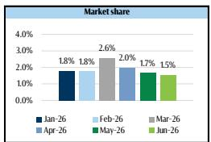  
数据来源：CPCA，GS全球研究

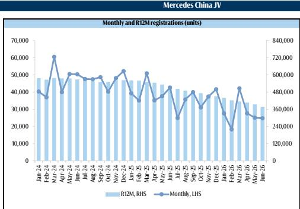

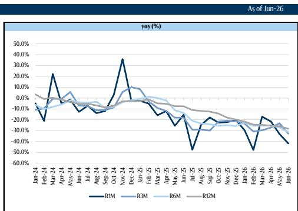

图表2：梅赛德斯-奔驰进口车型销量：2026年6月交付6,869辆（近1/3/6/12月同比-17.9%/-22.3%/-24.1%/-25.0%），其中高端车型2,779辆，同比-27.6%。

<table><tr><td colspan="3">进口零售量（辆）及同比变化（%）</td></tr><tr><td>近1月</td><td>6,869</td><td>-17.9%</td></tr><tr><td>近3月</td><td>19,194</td><td>-22.3%</td></tr><tr><td>近6月</td><td>41,018</td><td>-24.1%</td></tr><tr><td>近12月</td><td>90,703</td><td>-25.0%</td></tr></table>

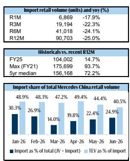

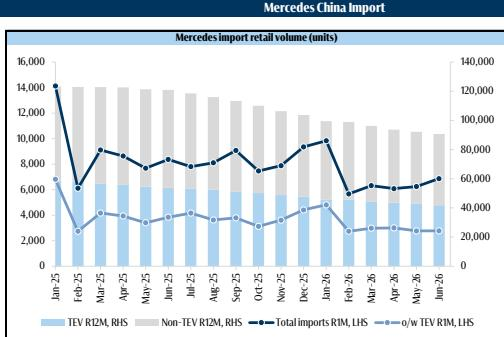  
数据来源：新浪汽车，CPCA，GS全球研究

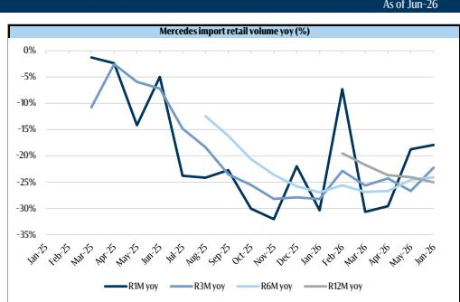

图表3：梅赛德斯-奔驰进口车型平均交易价格降至90.8万元，同比-11.6%，主要受GLE和E级影响。高端车型平均交易价格140万元，同比-12.6%，受S级迈巴赫影响。合资车型平均交易价格降至29.8万元，同比-7.8%，受核心内燃机车型（如E级和GLC）价格调整影响。

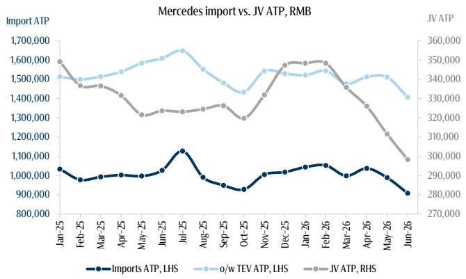  
数据来源：新浪汽车，GS全球研究  
图表4：梅赛德斯-奔驰进口车型隐含零售收入2026年6月达62亿元（同比-27.4%），2026年第二季度187亿元（同比-24.9%）。合资车型隐含零售收入2026年6月104亿元（同比-25.0%），2026年第二季度279亿元（同比-28.8%）。

梅赛德斯-奔驰隐含零售收入——进口 vs 合资，人民币百万元  
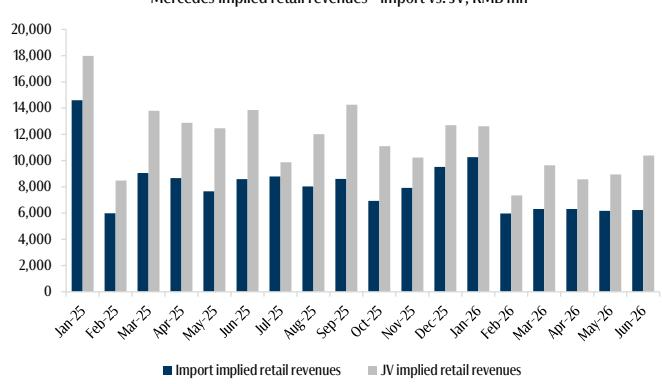  
数据来源：新浪汽车，GS全球研究

## 宝马

图表5：宝马合资渠道销量：2026年6月交付33,073辆，近1/3/6/12月同比分别为-32.7%/-28.9%/-18.1%/-13.5%。

<table><tr><td colspan="3">注册量（辆）及同比变化（%）</td></tr><tr><td>近1月</td><td>33,073</td><td>-32.7%</td></tr><tr><td>近3月</td><td>98,059</td><td>-28.9%</td></tr><tr><td>近6月</td><td>220,972</td><td>-18.1%</td></tr><tr><td>近12月</td><td>484,682</td><td>-13.5%</td></tr></table>

<table><tr><td colspan="3">历史数据与近12个月对比</td></tr><tr><td>最低值</td><td>282,000</td><td>-41.8%</td></tr><tr><td>最高值</td><td>717,269</td><td>48.0%</td></tr><tr><td>5年中间值</td><td>640,345</td><td>32.1%</td></tr></table>

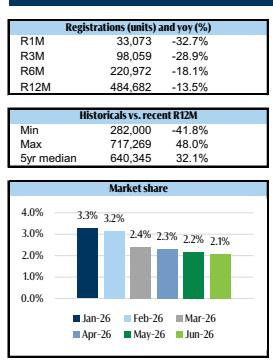  
数据来源：CPCA，GS全球研究

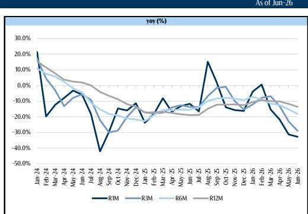

图表6：宝马进口车型销量：2026年6月交付3,725辆（近1/3/6/12月同比-45.6%/-43.6%/-34.4%/-20.4%）。我们关注M系列的表现韧性，销量423辆，同比+9.9%。

<table><tr><td colspan="3">进口零售量（辆）及同比变化（%）</td></tr><tr><td>近1月</td><td>3,725</td><td>-45.6%</td></tr><tr><td>近3月</td><td>11,046</td><td>-43.6%</td></tr><tr><td>近6月</td><td>24,740</td><td>-34.4%</td></tr><tr><td>近12月</td><td>59,770</td><td>-20.4%</td></tr></table>

<table><tr><td colspan="3">历史数据与近12个月对比</td></tr><tr><td>FY25</td><td>65,181</td><td>9.1%</td></tr><tr><td>最高值（FY19）</td><td>172,840</td><td>189.2%</td></tr><tr><td>5年中间值</td><td>102,910</td><td>72.2%</td></tr></table>

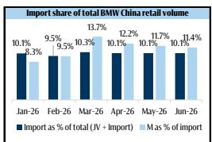

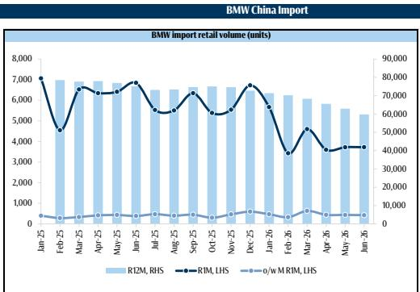  
数据来源：新浪汽车，GS全球研究

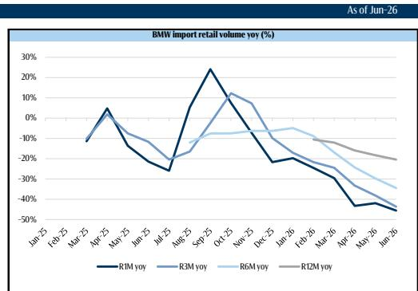

图表7：宝马进口车型平均交易价格2026年6月升至49.9万元，同比+6.5%，其中M系列平均交易价格82.9万元，同比+5.4%。合资车型平均交易价格处于调整区间，31.0万元，同比-7.0%。  
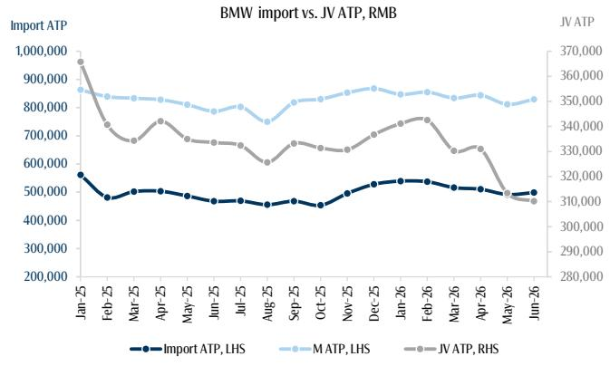  
数据来源：新浪汽车，GS全球研究

图表8：合并计算，宝马中国市场全系车型隐含零售收入2026年6月达132亿元（同比-34.9%），2026年第二季度363亿元（同比-34.6%）。  
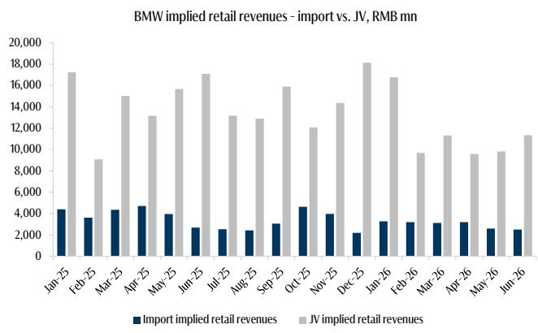  
数据来源：新浪汽车，GS全球研究

图表10：保时捷2026年6月在中国市场平均交易价格98.0万元，同比-6.2%。911平均交易价格168万元，同比-5.6%，而Taycan是综合平均交易价格下降的主要驱动因素（同比-24.8%）。

<table><tr><td colspan="3">进口零售量（辆）及同比变化（%）</td></tr><tr><td>近1月</td><td>2,188</td><td>-46.2%</td></tr><tr><td>近3月</td><td>6,796</td><td>-41.2%</td></tr><tr><td>近6月</td><td>12,808</td><td>-36.0%</td></tr><tr><td>近12月</td><td>34,734</td><td>-27.5%</td></tr></table>

## 保时捷

图表9：保时捷2026年6月在中国交付2,188辆（同比-46.2%）。零售降幅有所扩大，近1/3/6/12月同比分别为-46.2%/-41.2%/-36.0%/-27.5%。

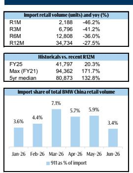

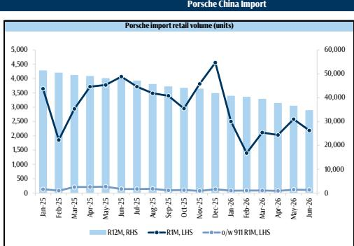  
数据来源：新浪汽车，GS全球研究

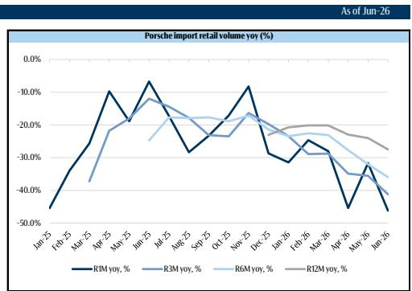

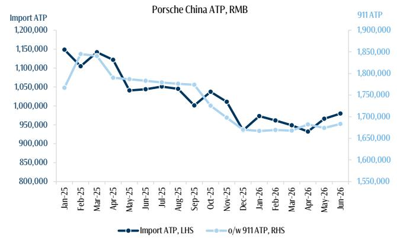  
数据来源：新浪汽车，GS全球研究  
图表11：保时捷在中国市场的隐含零售收入2026年6月达21亿元（同比-49.5%），2026年第二季度65亿元（同比-47.1%）。

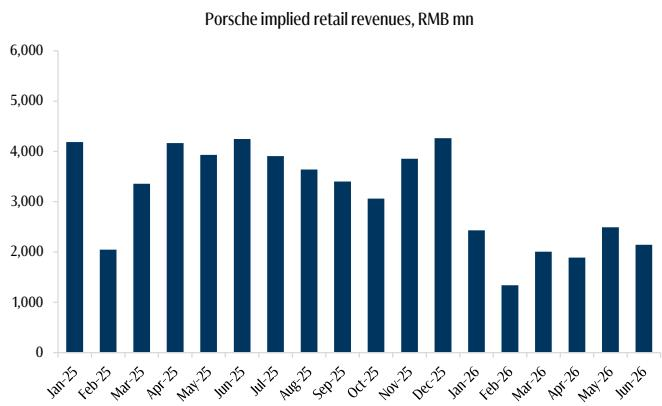  
数据来源：新浪汽车，GS全球研究

## 附录

图表12：梅赛德斯-奔驰S级2026年6月销售1,059辆，同比-38.8%，其中超过一半为迈巴赫版本（574辆）。

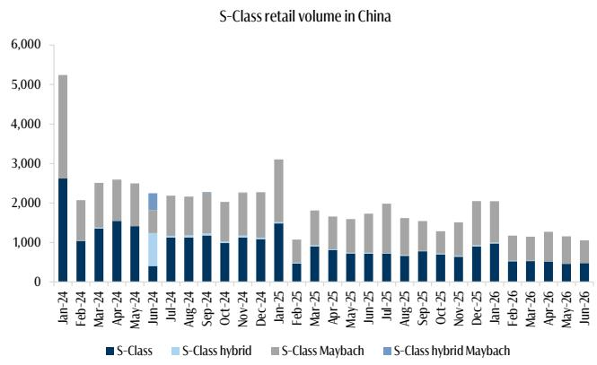  
数据来源：新浪汽车，GS全球研究

图表13：S级的本土竞品尊界S800当月录得593辆，较此前超过4,000辆的峰值明显回落。  
  
数据来源：新浪汽车，CPCA，GS全球研究

图表14：自2019年以来，随着外国品牌持续推进本地化以及国内高端挑战者崛起，中国汽车进口市场规模年复合增长率约为-11%。  
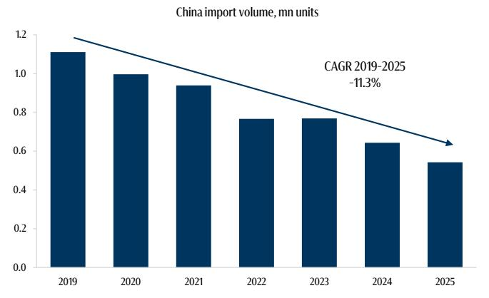  
数据来源：CADA，GS全球研究

图表15：在进口细分市场中，德国品牌整体保持稳定，合计份额接近50%。  
中国进口细分市场品牌份额，%  
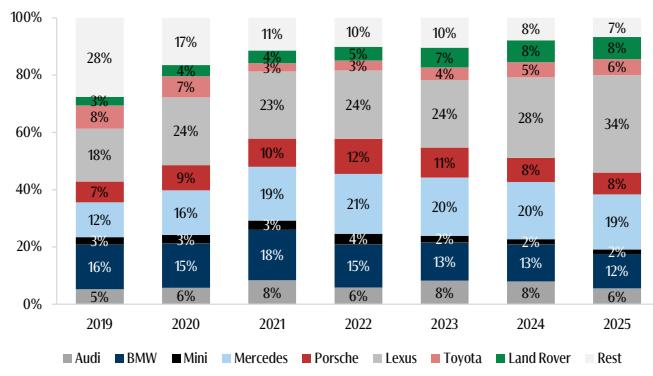  
数据来源：CADA，GS全球研究

## 披露附录

## Reg AC

我们，Christian Frenes、Monika Mengting Liu（特许金融分析师）、Shivam Kotecha和Robert Triulzi，特此证明本报告中表达的所有观点均准确反映了我们个人对标的公司或公司及其证券的看法。我们还证明，我们的薪酬中没有任何部分直接或间接与本报告中的具体建议或观点相关。

除非另有说明，本报告封面所列人员为GS全球研究部门的分析师。

供稿作者：Christian Frenes（GS International）、Monika Mengting Liu，CFA（GS International）、Shivam Kotecha（GS India SPL）、Robert Triulzi（GS International）。

除非另有说明，本报告“供稿作者”披露中列出的个人为GS全球研究部门的分析师。

## GS因子画像

GS因子画像通过将股票的关键属性与市场（即我们所覆盖的评级股票池）及其行业同行进行比较，提供投资背景。四个关键属性为：增长、财务回报、倍数（如估值）和综合（增长、财务回报和倍数的综合）。增长、财务回报和倍数通过每只股票特定指标的标准化排名计算得出。各指标的标准化排名求平均后转换为相应属性的百分位值。每个指标的具体计算可能因财政年度、行业和地区而异，但标准方法如下：

增长基于股票预期的销售增长、EBITDA增长和每股收益增长（对于金融股，仅基于每股收益和销售增长），百分位越高表示增长公司越强。财务回报基于股票预期的ROE、ROCE和CROCI（对于金融股，仅基于ROE），百分位越高表示财务回报越高。倍数基于股票预期市盈率、市净率、股息率（P/D）、EV/EBITDA、EV/FCF和EV/债务调整后现金流（DACF）（对于金融股，仅基于市盈率、市净率和股息率），百分位越高表示股票交易倍数越高。综合百分位计算为增长百分位、财务回报百分位和（100% - 倍数百分位）的平均值。

财务回报和倍数使用GS分析师至少未来三个季度末的预测。增长使用至少未来七个季度的投入与至少未来三个季度的投入相比（所有指标均为每股基础）。

有关GS因子画像计算方式的更详细说明，请联络您的GS代表。

## M&A排名

在我们的全球覆盖范围内，我们采用M&A框架审视股票，考虑定性和定量因素（可能因行业和地区而异），以纳入某些公司被收购的潜在可能性。然后我们分配M&A排名，用于对我们评级覆盖的公司进行1到3分的评分，其中1表示公司成为收购目标的高概率（30%-50%），2表示中等概率（15%-30%），3表示低概率（0%-15%）。对于排名为1或2的公司，按照我们部门的标准指引，我们会将M&A组成部分纳入目标价格。M&A排名为3视为不重大，因此不纳入目标价格计算，且可能在研究中讨论或不讨论。

## Quantum

Quantum是GS的专有数据库，提供详细的财务历史、预测和比率。可用于深度分析单个公司，或比较不同行业和市场公司。

## 披露信息

评级/投资银行关系分布
GS全球研究股票覆盖范围

<table><tr><td rowspan="2"></td><td colspan="3">评级分布</td><td colspan="3">投资银行关系</td></tr><tr><td>买入</td><td>持有</td><td>卖出</td><td>买入</td><td>持有</td><td>卖出</td></tr><tr><td>全球</td><td>50%</td><td>34%</td><td>16%</td><td>65%</td><td>59%</td><td>43%</td></tr></table>

截至2026年7月1日，GS全球研究对3,104只股票进行了投资评级。GS将股票分配为不同地区投资清单上的买入和卖出；未如此分配的股票被视为中性。这些分配对应于FINRA规则要求披露的买入、持有和卖出。参见下方“评级、覆盖范围及相关定义”。投资银行关系图表反映了GS在过去十二个月内为每个评级类别中标的公司提供投资银行服务的百分比。

## 监管披露

## 美国法律法规要求的披露

请参见上方公司特定监管披露，以了解本报告中提及的公司可能需要披露的以下任何内容：待定交易中的经理或联席经理；1%或以上所有权；特定服务的报酬；客户关系类型；之前期间管理/联席管理的公开发行；董事席位；对股票而言，做市和/或专家角色。GS以自营方式交易或可能交易本报告中讨论的发行人债务证券（或相关衍生品）。

以下是额外要求的披露：所有权和重大利益冲突：GS政策禁止其分析师、向分析师汇报的专业人员及其家庭成员持有分析师覆盖范围内任何公司的证券。分析师薪酬：分析师的薪酬部分取决于GS的盈利能力，其中包括投资银行收入。分析师作为官员或董事：GS政策通常禁止其分析师、向分析师汇报的人员或其家庭成员在分析师覆盖范围内的任何公司担任官员、董事或顾问。非美国分析师：非美国分析师可能不是GS & Co. LLC的关联人员，因此可能不受FINRA Rule 2241或FINRA Rule 2242关于与被覆盖公司沟通、公开露面以及交易分析师覆盖证券的限制。

美国以外法律和法规要求的其他披露

以下披露是所指示司法管辖区要求的，除非已根据美国法律法规在上文作出。澳大利亚：GS Australia Pty Ltd及其附属机构不是澳大利亚《银行业法》（1959年联邦）定义的授权存款吸收机构，在澳大利亚不提供银行业务，也不从事银行业务。本研究及其访问权限仅适用于澳大利亚《公司法》含义内的“批发客户”，除非GS另有约定。在编写研究报告时，GS Australia全球研究成员可能出席由研究报告涵盖的公司及其他实体主办或组织的实地访问及其他会议。在某些情况下，此类实地访问或会议的部分或全部费用可能由相关发行人承担，如果GS Australia认为在实地访问或会议的具体情况下适当且合理。如果本文档内容包含任何金融产品建议，则仅为一般性建议，由GS在未考虑客户目标、财务状况或需求的情况下编制。客户在根据任何此类建议采取行动前，应考虑该建议是否适合其自身目标、财务状况和需求。GS Australia和新西兰的某些利益披露副本以及GS的澳大利亚卖方研究独立性政策声明可在以下网址获取：https://www.goldmansachs.com/disclosures/australia-new-zealand/index.html。巴西：与CVM Resolution n. 20相关的披露信息可在以下网址获取：https://www.gs.com/worldwide/brazil/area/gir/index.html。如适用，本研究报告内容的主要负责巴西注册分析师（如CVM Resolution n. 20第20条所定义）为本报告开头指定的第一作者，除非正文末尾另有说明。加拿大：此信息仅供您参考，绝不构成GS & Co. LLC为购买加拿大证券而在加拿大进行的广告、要约或招揽。GS & Co. LLC未根据适用加拿大证券法在任何加拿大司法管辖区注册为交易商，通常不被允许交易加拿大证券，并且在加拿大某些司法管辖区可能被禁止出售某些证券和产品。如果您希望在加拿大交易任何加拿大证券或其他产品，请联络GS Canada Inc.（GS Group Inc.的附属机构）或其他注册的加拿大交易商。香港：可根据要求从GS (Asia) L.L.C.获取本研究中提及的被覆盖公司证券的进一步信息。印度：可从GS (India) Securities Private Limited获取本研究中提及的标的公司或公司的进一步信息，SEBI注册号INH000001493，地址：10th Floor, Ascent-Worli, Sudam Kalu Ahire Marg, Worli, Mumbai-400 025, India，公司识别号U74140MH2006FTC160634，电话+91 22 6616 9000，传真+91 22 6616 9001。GS可能受益拥有本研究报告提及的标的公司或公司1%或以上的证券（如1956年《印度证券合约（监管）法》第2(h)条所定义）。SEBI的注册和NISM的认证绝不保证中间商的业绩或向读者提供任何回报保证。GS (India) Securities Private Limited合规官和读者投诉联系方式、年度合规审计报告副本以及其他相关信息及披露可在以下链接获取：https://www.goldmansachs.com/worldwide/india/research-analyst。日本：见下方。韩国：本研究及其访问权限仅适用于《金融服务和资本市场法》含义内的“专业读者”，除非GS另有约定。可从GS (Asia) L.L.C.首尔分行获取本研究中提及的标的公司或公司的进一步信息。新西兰：GS New Zealand Limited及其附属机构不是新西兰《1989年新西兰储备银行法》定义的“注册银行”或“存款吸收机构”。本研究及其访问权限适用于《2008年金融顾问法》定义的“批发客户”，除非GS另有约定。GS Australia和新西兰的某些利益披露副本可在以下网址获取：https://www.goldmansachs.com/disclosures/australia-new-zealand/index.html。俄罗斯：在俄罗斯联邦分发的研究报告不属于俄罗斯立法定义的广告，而是不具有主要促销产品目的的信息和分析，并且不提供俄罗斯评估活动立法含义内的评估。研究报告不构成俄罗斯法律法规定义的个性化研究交流，不针对特定客户，且未分析客户的财务状况、投资概况或风险状况。GS对客户或任何其他人可能基于本研究报告做出的任何投资决策不承担任何责任。新加坡：GS (Singapore) Pte.（公司编号：198602165W），受新加坡金融管理局监管，接受对本研究的法律责任，如有任何由本研究引起或与之相关的事项，应联系本研究。台湾：此材料仅供参考，未经许可不得转载。读者应仔细考虑自身投资风险。投资结果由个人读者自行负责。英国：在英国会被归类为零售客户（如金融市场行为监管局规则所定义）的人士，应结合已收到的GS International关于被覆盖公司的先前研究阅读本研究，并应参考已发送给他们的风险警告。这些风险警告的副本以及本报告中使用的某些财务术语的词汇表可从GS International索取。

欧盟和英国：与欧盟委员会授权条例(EU)(2016/958)第6(2)条相关的披露信息（该条例补充欧洲议会和理事会条例(EU) No 596/2014，包括该授权条例在英国脱离欧盟和欧洲经济区后在英国国内法律和法规中的实施）涉及研究交流或建议投资策略的客观呈现的技术安排，以及特定利益或利益冲突的披露，可在以下网址获取：https://www.gs.com/disclosures/europeanpolicy.html，其中阐述了与投资研究相关的利益冲突管理的欧洲政策。

日本：GS Japan Co., Ltd.是在关东财务局注册的金融工具交易商，注册号金商第69号，是日本证券业协会、日本金融期货协会、第二类金融工具业协会和日本投资管理协会的会员。股票买卖需支付预先确定的佣金加消费税。请参阅公司特定披露，了解日本证券交易所、日本证券业协会或日本证券金融公司要求的任何适用披露。

## 评级、覆盖范围及相关定义

买入（B）、中性（N）、卖出（S）分析师推荐将股票作为买入或卖出纳入各个区域投资清单。被分配为投资清单上的买入或卖出取决于股票相对于其覆盖范围的潜在总回报。任何未被分配为投资清单上买入或卖出且具有有效评级（即非评级暂停、未评级、早期生物技术、覆盖暂停或未覆盖）的股票均被视为中性。每个区域管理区域信心清单，这些清单选自相应区域投资清单上的报告评级股票，代表重点关注潜在总回报大小和/或实现回报可能性的研究交流。将股票加入或移除此类信心清单由各相应区域的投资审查委员会或其他指定委员会管理，并不代表分析师对这些股票投资评级的变更。

潜在总回报代表当前股价与目标价格之间的上行或下行差异，包括在目标价格相关时间范围内已支付或预期支付的所有股息。所有被覆盖股票均需设定目标价格。每个报告在添加或重申投资清单成员资格时均陈述潜在总回报、目标价格及相关时间范围。

覆盖范围：各覆盖范围内的所有股票列表可按首席分析师、股票和覆盖范围在https://www.gs.com/research/hedge.html获取。

未评级（NR）。当GS在此公司的合并或战略交易中担任顾问角色时，当存在法律、监管或政策限制（由于GS参与交易）时，以及在某些其他情况下，根据GS政策，投资评级、目标价格和盈利预测（如相关）将被移除。早期生物技术（ES）。当此公司尚未拥有通过II期临床试验的药物、治疗或医疗设备，也未获得分销II期后药物、治疗或医疗设备的许可时，根据GS政策，不分配投资评级和目标价格。评级暂停（RS）。GS已暂停此股票的投资评级和目标价格，因为没有足够的基础来确定投资评级或目标价格。此股票之前的投资评级和目标价格（如有）不再有效，不应依赖。覆盖暂停（CS）。GS已暂停对此公司的覆盖。未覆盖（NC）。GS不覆盖此公司。

## 全球产品；分发实体

GS全球研究在全球范围内为GS客户制作和分发研究产品。位于全球GS办公室的分析师对行业和公司进行研究，并对宏观经济、货币、大宗商品和组合策略进行研究。本研究由以下实体在相应管辖范围内分发：澳大利亚：GS Australia Pty Ltd（ABN 21 006 797 897）；巴西：GS do Brasil Corretora de Títulos e Valores Mobiliários S.A.；公众沟通渠道GS巴西：0800 727 5764 和/或 contatogoldmanbrasil@gs.com。工作日（节假日除外）9:00至18:00。巴西公众沟通渠道：0800 727 5764 和/或 contatogoldmanbrasil@gs.com。营业时间：周一至周五（节假日除外），9:00至18:00；加拿大：GS & Co. LLC；香港：GS (Asia) L.L.C.；印度：GS (India) Securities Private Ltd.；日本：GS Japan Co., Ltd.；韩国：GS (Asia) L.L.C.首尔分行；新西兰：GS New Zealand Limited；俄罗斯：OOO GS；新加坡：GS (Singapore) Pte.（公司编号：198602165W）；美国：GS & Co. LLC。GS International已批准本研究在英国的分发。

GS International（“GSI”），由审慎监管局（PRA）授权，受金融行为监管局（FCA）和PRA监管，已批准本研究在英国的分发。

欧洲经济区：GS Bank Europe SE（“GSBE”）是一家在德国注册的信贷机构，在单一监管机制下受欧洲央行直接审慎监管，在其他方面受德国联邦金融监管局（BaFin）和德国联邦银行监管，并在欧洲经济区内分发研究。

## 一般性披露

本研究仅供我们的客户使用。除与GS相关的披露外，本研究基于我们认为可靠但未代表其准确或完整的当前公开信息，且不应依赖。本文所含信息、意见、估计和预测截至本文日期，如有变更恕不另行通知。我们寻求在适当情况下更新我们的研究，但各种法规可能阻止我们这样做。除某些定期发布的行业报告外，大部分报告根据分析师判断以不规则间隔发布。

GS从事全球全方位、综合性的投资银行、投资管理和经纪业务。我们与全球研究覆盖的相当比例公司存在投资银行和其他业务关系。GS & Co. LLC（美国经纪交易商）是SIPC（https://www.sipc.org）成员。

我们的销售人员、交易员和其他专业人员可能向客户和自营交易部门提供口头或书面的市场评论或交易策略，这些评论或策略反映的观点可能与本研究表达的观点相反。我们的资产管理业务、自营交易部门和投资业务可能做出与本研究报告的建议或观点不一致的投资决策。

本报告中指定的分析师可能不时与我们的客户（包括GS销售人员和交易员）讨论，或在本报告中讨论交易策略，这些策略提及可能对本文所述股票市场价格产生近期影响的催化剂或事件，该影响的方向可能与分析师的已发布目标价格预期相反。任何此类交易策略均不同于且不影响分析师对此类股票的基本面股票评级，该评级反映股票相对于其覆盖范围的潜在回报，如本文所述。

我们及我们的附属机构、官员、董事和员工可能不时持有多头或空头头寸，作为自营交易商，并买入或卖出本研究提及的证券或衍生品（如有），除非法规或GS政策禁止。

在GS组织的会议上第三方演讲者（包括GS其他部门的个人）表达的观点，不一定反映全球研究的观点，也不是GS的官方观点。

本文引用的任何第三方，包括任何销售人员、交易员和其他专业人员或其家庭成员，可能持有与分析师观点不一致的产品头寸。

本研究不构成在任何司法管辖区出售或招揽购买任何证券的要约。本研究不构成个人推荐，也未考虑个别客户的具体投资目标、财务状况或需求。客户应考虑本研究中的任何建议或推荐是否适合其特定情况，并在适当时寻求专业建议，包括税务建议。本研究提及的研究价值和价格以及从中获得的收入可能波动。过往表现不预示未来结果，未来回报不保证，且可能发生本金损失。汇率波动可能对某些投资的价值、价格或收入产生不利影响。

某些交易，包括涉及期货、期权和其他衍生品的交易，具有重大风险，不适合所有读者。读者应查阅当前期权和期货披露文件，可从GS销售代表或以下网址获取：https://www.theocc.com/about/publications/character-risks.jsp 和 https://www.goldmansachs.com/disclosures/cftc_fcm_disclosures。在需要多次买卖期权（如价差）的期权策略中，交易成本可能较高。将应要求提供支持文件。

全球研究提供的服务水平差异：GS全球研究为您提供的服务水平和类型可能与为GS内部及其他外部客户提供的有所不同，具体取决于多种因素，包括您个人对沟通频率和方式的偏好、您的风险偏好和投资侧重点（例如，市场整体、行业特定、长期、短期）、您与GS整体客户关系的规模和范围，以及法律和监管约束。例如，某些客户可能要求在特定证券的研究发布时收到通知，某些客户可能要求通过数据馈送或其他方式以电子方式提供分析师基本面分析所依据的特定数据。分析师基本面研究观点的任何变更（例如，评级、目标价格或对股票盈利预测的重大变更）将在通过电子方式广泛发布研究报告之前，不会向任何客户传达。

所有研究报告通过电子方式发布至我们的内部客户网站，同时向所有有权接收此类报告的客户发布。并非所有研究内容都会分发给我们的客户或提供给第三方聚合商，GS也不对第三方聚合商重新分发我们的研究负责。对于与一种或多种证券、市场或资产类别相关的研究、模型或其他数据（包括相关服务），请联系您的GS代表或访问https://research.gs.com。

披露信息也可在https://www.gs.com/research/hedge.html获取，或联系研究合规部，地址：200 West Street, New York, NY 10282。

## © 2026 GS。

您仅可为自己使用而存储、显示、分析、修改、格式化及打印本服务向您提供的信息。未经GS明确的书面同意，您不得转售或逆向工程此信息以计算或开发任何指数用于披露和/或营销，或创建任何其他衍生作品或商业产品、数据或服务。未经GS明确的书面同意，您不得以任何形式向任何第三方发布、传输或以其他方式复制此信息的全部或部分内容。前述限制包括但不限于：使用、提取、下载或检索此信息的全部或部分内容以训练或微调机器学习或人工智能系统，或向任何此类系统提供或再现此信息（全部或部分）作为提示或输入。
