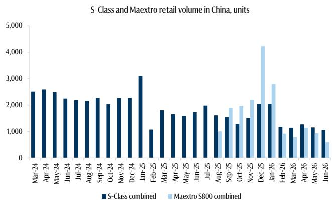
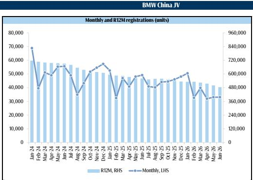

# 德国豪华品牌在中国面临结构性营收变化，仅靠定价能力难以逆转

2026年6月的销售数据显示，梅赛德斯、宝马和保时捷通过合资与进口渠道在华合计交付72,655辆汽车，同比变化幅度在32.7%（宝马合资公司）至46.2%（保时捷总交付量）之间。营收层面的影响同样显著：宝马当月来自中国的隐含零售收入同比下降34.9%，梅赛德斯（进口+合资）下降25.9%，保时捷下降49.5%。这些并非暂时的需求停顿，而是长期作为德国汽车集团利润引擎的市场板块正在经历可见的调整。

常见的解释指向本土高端品牌的崛起，这在一定程度上成立。中国汽车进口市场自2019年以来呈现约11%的年复合调整，原因是外资制造商推进本地化生产，同时中国品牌向更高价位段发展。但2026年6月的数据揭示了更复杂的图景：整体销量正在变化，而各品牌、各车型的定价行为却出现明显分化。真正的战略问题并非德国豪华品牌能否在中国恢复销售规模——答案是否定的——而是哪些细分领域的定价能力能够守住，以及需要付出多大代价。

## 宝马进口定价逆势上扬，合资与进口销量同步下滑，显现组合内的战略分化

宝马在6月数据中呈现了最值得关注的反差。其合资公司销量同比下降32.7%，进口销量下降45.6%。然而，进口车型的平均成交价（ATP）上升6.5%至49.9万元，合资车型ATP下降7.0%至31万元。这并非整个品牌承受同等压力，而是高端进口渠道实际上在获得更强的定价能力，同时大众化合资渠道正在收缩。

分化的驱动力来自M性能系列。M车型6月销售423辆，同比增长9.9%，ATP为82.9万元，上涨5.4%。在宝马进口总销量近乎减半的月份里，M子品牌实现了销量与价格的双重增长。这不是靠规模取胜，而是一种精准的利基策略：它不追求大规模，但正因为不扩张而有效。M系列面向驾驶爱好者，依靠工程真实性和驾驶体验竞争，而非电动续航、软件或车内屏幕。这些特质本土竞争对手较难快速复制，因此能够维持整个宝马组合中难以持续的溢价。

这对宝马管理层而言是一个不安的战略信号。公司实际上正在大众化合资领域通过降价向本土竞争者让出份额，同时试图守住高利润的进口利基。这在一定时期内是有效的利润防守，但核心销量业务仍然暴露在外。如果合资ATP每年下降7%且销量缩减三分之一，来自中国合资公司的利润贡献将比进口渠道能够弥补的速度更快地被压缩。

## 梅赛德斯面临进口与合资双向挤压，S级迈巴赫定价防线不再牢固

梅赛德斯的处境在结构上比宝马更严峻，因为两个渠道均承受压力。6月进口销量下降17.9%，合资销量下降41.8%，两个渠道ATP均出现下滑：进口下降11.6%至90.8万元，合资下降7.8%至29.8万元。包括S级和迈巴赫在内的高质量车型系列销售2,779辆，同比下降27.6%，ATP下降12.6%至140万元。

S级本身仅售出1,059辆，同比下降38.8%，其中过半为迈巴赫版本。然而，迈巴赫的成交价在当月也明显下滑。这是梅赛德斯最值得关注的数据点。迈巴赫S级长期以来被视为中国市场的定价堡垒，富裕买家无论宏观环境或竞争选择如何都会购买。如今这座堡垒已被突破。本土竞争对手尊界S800在6月记录593辆，虽较此前超4000辆的峰值大幅回落，但其作为有实质销量的存在，显然已打乱了梅赛德斯高质量车型的定价格局。

梅赛德斯进口车隐含零售收入6月为62亿元，同比下降27.4%；合资收入为104亿元，下降25.0%。综合营收降幅约26%，但组合结构正在恶化。随着S级和迈巴赫失去定价能力，进口渠道的单车收入将继续压缩，合资渠道无法以销量弥补。梅赛德斯如今面临两难：要么接受整体利润率下降，要么加速GLE等车型的本地化——GLE在6月表现良好，销量增长11.5%，计划本地生产。本地化保住了销量，但进一步压缩了利润率，因为本地生产车型的ATP低于进口车型。

## 保时捷营收变化最为显著，电动化转型是核心原因

保时捷6月交付2,188辆，同比下降46.2%，ATP下降6.2%至98万元。隐含零售收入为21亿元，降幅49.5%。在该数据集中，没有任何其他德国豪华品牌在单月失去一半的中国营收。

具体症结在于Taycan。其ATP同比下降24.8%，严重拉低了整体ATP。相比之下，911的ATP为168万元，仅下降5.6%，相对稳定。这一分化揭示了保时捷在三大品牌中独有的结构性问题：保时捷的电动化战略在中国未能像其内燃机光环车型那样获得同样的定价能力。Taycan本应是电动版911，但实际上却成为拉低品牌平均成交价的打折车型，且未能产生足够的销量来弥补。

保时捷的中国战略如今面临艰难选择：要么继续为Taycan打折以维持销量，这将进一步侵蚀品牌价值和ATP；要么接受销量下降，保护911及其他内燃机车型的定价，这将使中国业务规模大幅缩小。截至6月的数据显示，它两种方式都在尝试，但均未奏效。12个月销量趋势为-27.5%，表明调整正在加速而非企稳。

## 相对少见可行的定价策略：锁定不可替代的驾驶体验，而非仅靠品牌传承

三大品牌的表现指向同一个战略结论：品牌历史、内饰品质和身份象征已不足以在中国守住定价。本土竞争对手在这些维度上以更低价格实现了同等或更优的表现。依然可守的是特定高性能内燃机车型所提供的不可替代的驾驶体验：宝马M系列、保时捷911，以及在逐渐减弱程度上的梅赛德斯迈巴赫S级。

M系列在宝马进口总销量下降45.6%的月份里，实现9.9%的销量增长和5.4%的ATP增长，是最清晰的证据。这些买家并非在对比本土电动车，他们购买的是中国制造商尚未能复制的特定工程体验。911的ATP稳定在168万元也说明了同样的问题。相比之下，迈巴赫S级正在失去免疫力，因为其价值主张更多围绕奢华与身份，而非驾驶动态，而本土竞争者已证明能够以更低价格提供可比的奢华体验。

对于慕尼黑和斯图加特的战略规划者而言，这形成了一个清晰的决策框架。大众化合资细分市场正在结构性失去份额和定价能力，任何本地化或成本削减都无法扭转这一趋势。正确的应对并非在这些领域死守销量，而是管理其现金流，同时将释放的资源投入到仍具备定价能力的狭窄利基中。这意味着加大对M、AMG和911衍生车型的投入，即便整个行业转向电动化，也要加速内燃机性能版本的开发，同时接受中国销量在未来三到五年内继续调整。

另一种选择是在整个中国组合中经历缓慢的利润率压缩。2026年6月的数据显示，调整已经开始，短期内相对少见可管理的是定价能力。销量已无法恢复。问题在于定价溢价能守住多少、守住哪些车型。答案越来越窄，且不覆盖整个品牌。

*仅供信息参考。部分内容可能基于来源材料经AI辅助生成、翻译、摘要或编辑，可能存在遗漏或错误。请独立核实。本文不构成任何投资、法律、税务、会计或其他专业建议。*

仅供信息参考。部分内容可能基于来源材料经AI辅助生成、翻译、摘要或编辑，可能存在遗漏或错误。请独立核实。本文不构成任何投资、法律、税务、会计或其他专业建议。

