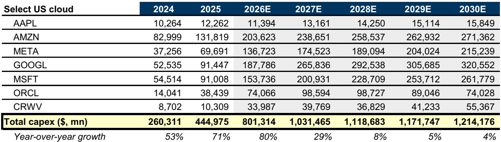
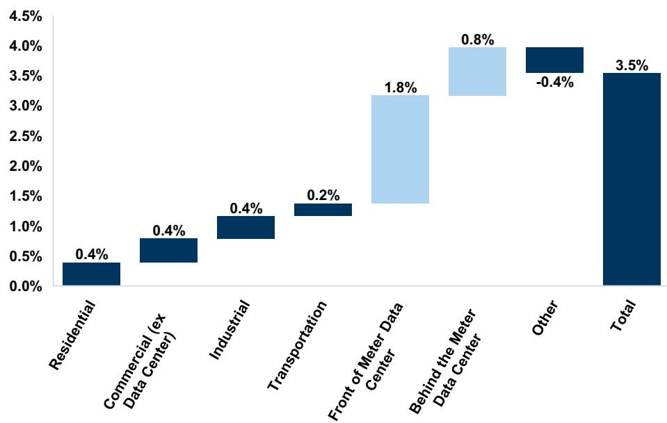
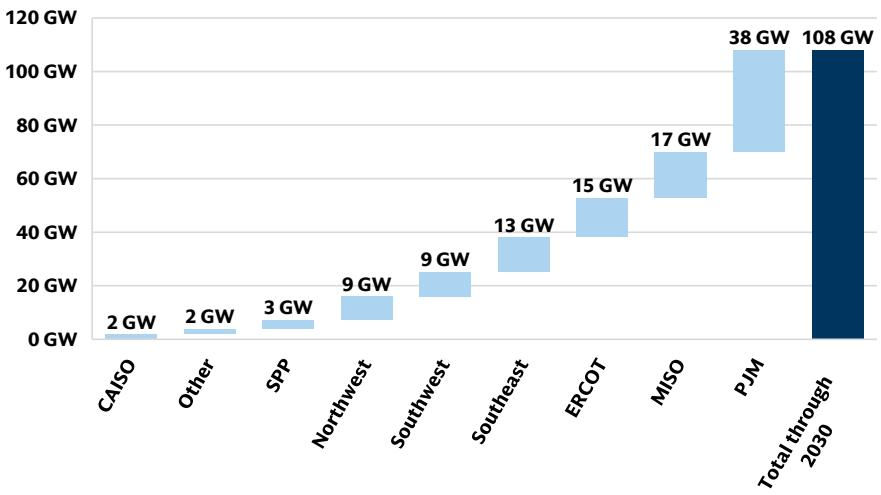

# 数字基础设施数据与主题变化观察

相关研究在最新发布的全球数据中心容量更新报告中，基于451 Research数据库截至2026年第一季度的数据，将2030年全球数据中心供应预期从此前的168GW上调至217GW。这一调整意味着，从2025年的101GW（该数字亦从74GW上修）到2030年，全球将净增116GW容量。按每GW约500亿美元的研究估算，这对应约5.8万亿美元的资本投入。报告认为，这一规模可以被当前市场对超大规模企业年均约1万亿美元资本投入的共识预期所覆盖——且该共识尚未计入SpaceX的AI资本投入、私营AI实验室支出或数据中心平台支出。

报告同时指出，尽管供应预期上修，但数据中心市场供需仍处于非常紧张的状态。CBRE数据显示，美国主要市场的数据中心空置率持续压缩，这将继续支撑服务商的定价能力。相关研究在2026年6月丹佛调研中从Flexential处获悉，该公司预计每千瓦费用将在今年晚些时候接近250美元，而2021年这一数字约为70美元。

## 1. 美国市场2030年容量预计达125GW，占全球净增量的六至七成

相关研究预测，到2030年底，仅美国市场的数据中心IT电力供应就将达到125GW，较2025年净增76GW。该机构公用事业团队同期估算的美国数据中心年均需求约为108GW。供需之间的差距将推动美国电力需求在2030年前实现3.5%的年均复合增长率。报告特别指出，部分受监管公用事业公司和独立电力生产商将在这一结构性变化中扮演重要角色，具体取决于其区域布局——例如PJM市场的FE/TLN、ERCOT市场的SRE/VST/NRG、MISO市场的XEL以及东南部的DUK。

从全球看，2026至2030年的年度容量预测较上一季度（2025年第四季度）平均上修5%，较2025年第三季度上修13%。新增容量中，70%至90%来自零售/批发供应商和超大规模企业自建，且约60%至70%位于北美。

## 2. 新商业模式降低Neocloud资金获取成本，NVIDIA信用支持机制是关键变量

报告关注到Neocloud（新型云服务商）领域的积极变化。过去三个月内，TeraWulf与Anthropic、Hut8与未披露的IG级租户等达成了多笔大型数据中心租赁协议，平均租赁费率约为每千瓦每月166美元，基础租期在15至20年之间。

更具结构意义的是NVIDIA推出的新商业模式。NVIDIA与Sharon AI和Firmus宣布了一项信用支持与收入分成安排：NVIDIA为GPU容量提供最低收入保障，从而降低Neocloud的资金获取成本，使其能够为更短租期、更小规模的交易建设容量。报告披露，该交易中NVIDIA设定的最低价格保障低于每兆瓦10美元，而市场上大型计算稀缺时的成交价可超过每兆瓦50美元。这一价差本身即反映了当前可扩展计算资源的稀缺程度。

> **KC评论：** NVIDIA此举相当于为Neocloud提供了一种价格保障工具，降低了银行和债权人对这类资产的不确定性评估。这可能会推动中小型AI云服务商的产能扩张，但同时也意味着NVIDIA在产业链中的角色进一步巩固。

## 3. 智能体工作负载成为需求持续旺盛的底层支撑

报告通过专家网络调研（包括与微软前AI转型总监的交流）指出，企业级AI部署正从实验阶段向多智能体系统演进。多智能体系统是一组可自主工作的AI智能体网络，但仍需要一个基于云的AI智能体来协调工作负载。报告认为，企业目前仍处于智能体部署的早期阶段，多数仍在试验中。一旦实验转向全面生产，将对计算需求形成持续推动。

这一判断与报告对算力效率的讨论形成对照。相关研究假设AI领域的单位功耗计算效率提升速度快于非AI领域，但认为对token和算力的潜在需求将持续，直到企业或公共机构有足够信心认为削减预算不会损害竞争地位，或直到需求规模被充分定义。在此之前，算力需求增长仍将快于效率提升。

## 4. 数据中心电力需求预计增长170%，七项影响因素值得关注

GSSUSTAIN团队基于容量上修和AI服务器出货量预测调整，将2030年全球数据中心电力需求较2025年的增长预期从此前的117%上调至170%。报告提出了影响数据中心电力需求增长与制约的七个因素：AI的渗透广度、芯片/服务器/模型的能效提升速度、电力价格、政策与许可、发电设备可用性、熟练劳动力供给，以及物理环境（高温、高湿、干旱）。

其中，物理环境因素被报告特别强调。分析显示，56%的全球新建数据中心和55%的美国新建数据中心位于高温、高湿或干旱不确定性较高的区域。这限制了冷却技术的选择，并推高了电力需求。报告预计，43%的新增容量将采用机柜内直接芯片冷却或浸没式冷却，56%将采用外部冷却设备。这些措施在部分抵消效率提升的同时，也对电力使用效率（PUE）和总电力需求形成向上不确定性。

劳动力方面，报告预计美国电力需求增长需要超过50万个新增岗位，其中超过20万个用于输配电领域。熟练电工的短缺被视为执行不确定性的关键来源，这也推动了更多“表后”（behind-the-meter）电力解决方案的采用——主要是天然气发电。相关研究公用事业团队预计，到2030年，约30%的数据中心增长将依赖此类方案。

For informational purposes only. Portions may be generated,translated,summarized,or edited with AI assistance based on source materials and may contain omissions or errors. Please verify independently. This is not investment,legal,tax,accounting,or other professional advice.

For informational purposes only. Portions may be generated,translated,summarized,or edited with AI assistance based on source materials and may contain omissions or errors. Please verify independently. This is not investment,legal,tax,accounting,or other professional advice.

