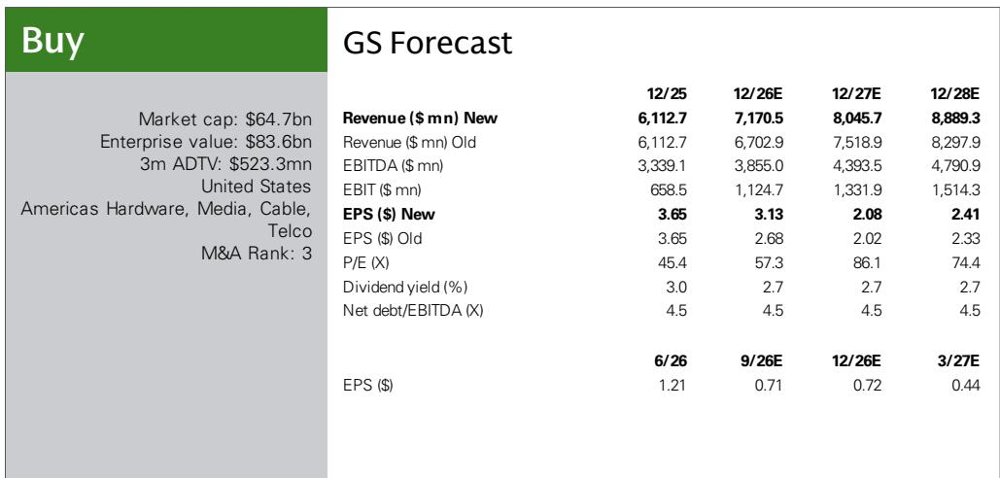
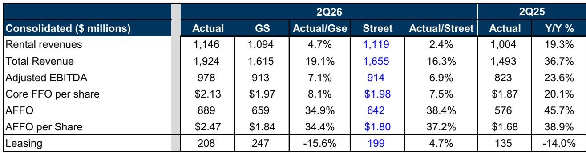
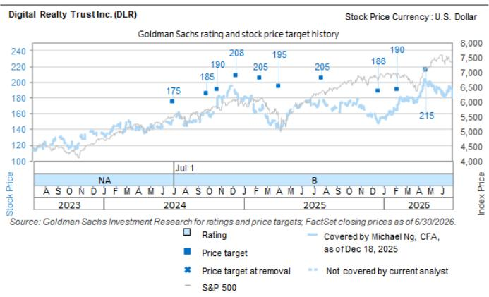

# 研报：其中，0-1MW租约价差为5%，而大于1MW的租约价差达67%

数据中心服务商 Digital Realty 在 2026 年第二季度交出了一份超出市场预期的表现。核心运营指标每股 2.65 美元，高于机构和共识预期的 1.97 美元和 1.98 美元。即便剔除相关收益，核心运营指标每股 2.13 美元仍高于预期。这份研报的核心判断是：Digital Realty 正受益于数据中心行业供需紧张的结构性窗口，其不断增长的积压订单和定价能力，为中期增长提供了可见性。

## 1. 租赁收入与续租价差均超预期，反映市场供需状态

第二季度租赁收入 11.46 亿美元，高于机构预期的 10.94 亿美元和共识预期的 11.19 亿美元，同比增长 19.3%。更值得关注的是续租价差：Digital Realty 续租了 2.61 亿美元的年化租金收入，现金续租价差达到 25%。其中，0-1MW 租约价差为 5%，而大于 1MW 的租约价差达 67%。研报指出，这一巨大差异直接反映了新加坡等核心市场的供需状态。大容量客户愿意支付显著更高的续租溢价，表明优质数据中心空间仍是稀缺资源。

> **观察：** 67% 的大容量续租价差是这份报告中最具冲击力的数字之一。它说明的不是温和涨价，而是供需关系已传导到定价层面。对于跟踪数据中心板块的读者，这个数字比总订单额更能反映市场真实温度。

## 2. 积压订单结构优化，新市场与客户多样性增强可见性

第二季度 Digital Realty 份额的新订单为 2.08 亿美元，低于机构预期的 2.47 亿美元，但高于共识预期的 1.99 亿美元。其中 0-1MW 及互联订单为 1.08 亿美元，环比和同比均有所增长。更关键的是，公司在 7 月签署了两份超大规模客户租约，贡献了 2.05 亿美元的订单。截至第二季度末，Digital Realty 的积压订单达到 14 亿美元（按公司份额计算），第二季度新增了 142 个客户并进入新市场。研报认为，积压订单的客户和地域多样性，降低了单一客户或市场波动带来的不确定性，增强了公司对中期增长的可见性。

## 3. 上调全年指引，下半年投产节奏将显著加快

Digital Realty 上调了 2026 年全年核心运营指标每股指引至 8.15-8.20 美元（此前为 8.00-8.10 美元），同时上调了收入、调整后 EBITDA 和续租价差指引。公司预计下半年将有 6.35 亿美元的年化租金开始投产，其中 45% 在第三季度、55% 在第四季度。这意味着下半年的投产节奏将显著快于上半年。研究机构相应上调了 2026-2028 年的收入和 EBITDA 预测，平均上调幅度分别为 7% 和 4%。

## 4. 私有资本平台费用收入增长，成为新观察维度

研报中提及，Digital Realty 的战略性私有资本平台正在产生不断增长的费用收入。这一收入来源此前并非市场关注焦点，但其增长趋势值得留意。对于一家以资产密集型为特征的数据中心企业，轻资产的费用收入业务若能持续扩大，将有助于改善整体回报结构和资本效率。研究机构并未对此展开详细测算，但将其作为公司业务模式演变的一个信号提出。

> **观察：** 费用收入的增长是这份报告中的一个次要但值得追踪的信号。如果这一趋势持续，Digital Realty 的业务模式将从纯粹的资产持有者，向资产管理与运营服务商方向延伸。这会影响市场对其估值框架的思考方式。

## 5. 对同业的正面信号

研究机构在研报中特别指出，Digital Realty 注意到客户部署 AI 应用的参与度正在提升。这一观察对同行业构成正面信号，因其更侧重于零售托管业务。AI 工作负载对数据中心的需求，正在从超大规模批发市场向零售托管市场传导。这一逻辑链条为整个数据中心板块提供了需求侧支撑。

---

For informational purposes only. Portions may be generated,translated,summarized,or edited with AI assistance based on source materials and may contain omissions or errors. Please verify independently. This is not investment,legal,tax,accounting,or other professional advice.

For informational purposes only. Portions may be generated,translated,summarized,or edited with AI assistance based on source materials and may contain omissions or errors. Please verify independently. This is not investment,legal,tax,accounting,or other professional advice.

