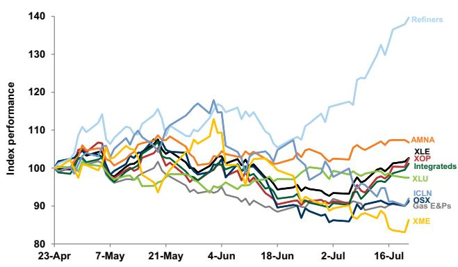
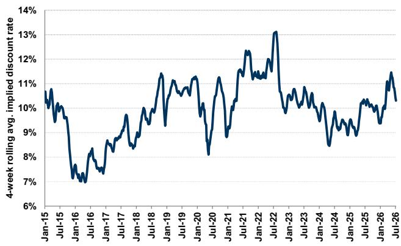
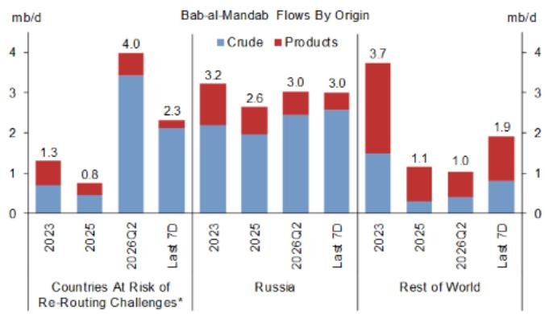
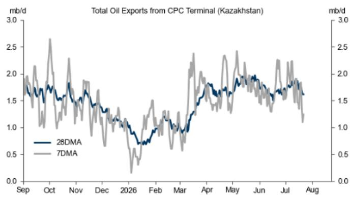
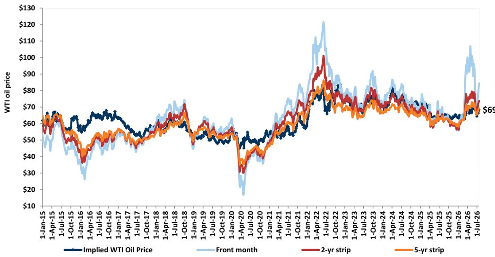
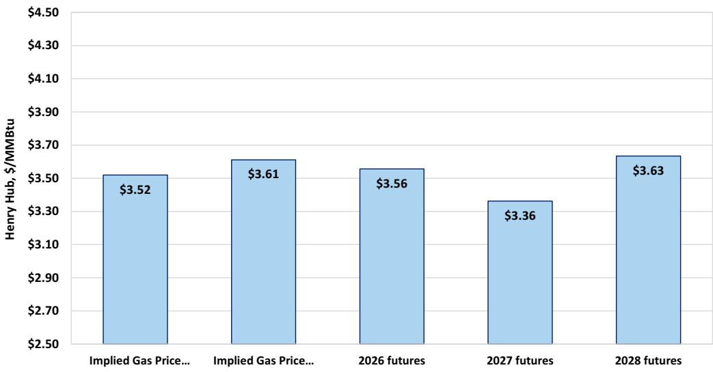
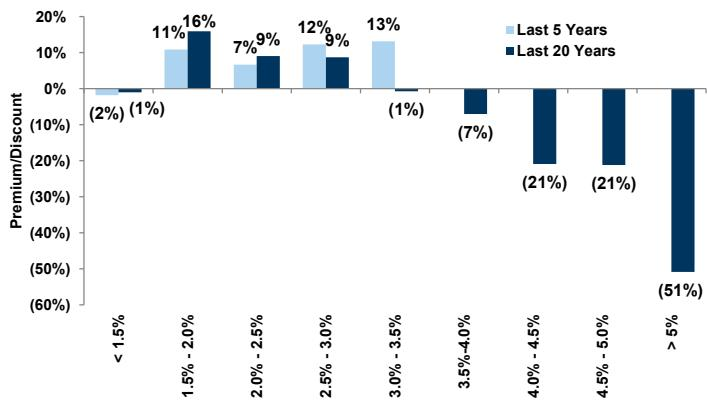
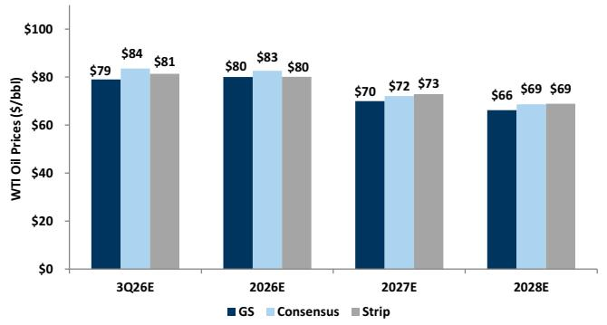
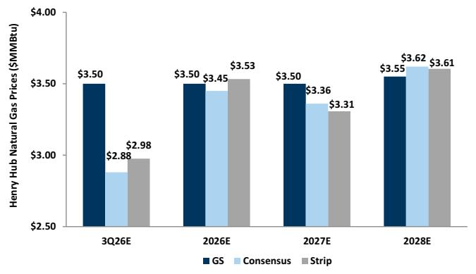

# 能源、公用事业与资源行业观察：市场参与者关注2027年共识预期的修正方向

今年，行业内部表现分化，自然资源相关公司的报价通常与未来共识预期变化高度相关。基于此，我们请资深分析团队寻找在2027年共识预期上有上行空间的公司，以及存在下行可能性的公司。

我们认为高于共识预期的公司包括：MPC、TLN、LB、SHLS、NUE；低于共识预期的公司包括：APA、CEG、CQP、SEDG、CLF。

## 油气行业

在综合石油和炼油领域，我们注意到MPC的2027年共识预期有上修可能。这一判断主要基于公司在特定区域市场中的结构性优势、出口渠道拓展、低成本运营以及中游业务贡献增长。此外，公司对运营执行的持续关注也支撑了我们对现金流表现的看法。

对于2027年经营利润预期低于共识的公司，我们关注APA。公司在油气购销环节的展望、区域定价变化的节奏以及新管道产能的投运时间线等因素，使得市场对其预期可能存在调整空间。

## 公用事业

在电力/公用事业领域，我们关注TLN。公司近期完成并购及资产整合执行，叠加部分市场电力价格走势，使得2027年经营利润预期有上调空间。若电力价格持续偏强或边际机组运行增加，可能进一步带来弹性。同时，监管环境的明朗化以及大型负荷的购电协议签署被视为潜在催化剂。

对于CEG，其2027年经营利润预期略低于共识，主要受到区域电力价格差异、燃料成本及运营费用等因素影响。

## 中游

LB的2027年经营利润预期显著高于共识，得益于产水量增长和商业推进。新管线的投运和第三产水量活跃度提升是主要驱动因素。我们认为，随着客户项目落地，收入有进一步增长空间。

CQP的2027年经营利润预期低于共识，主要反映其资产组合中长协销售占比变化以及计划内维护活动的影响。实际表现取决于维护时间安排和生产优化情况。

## 清洁技术

SHLS的2027年每股盈利能力预期高于共识。我们的营收和经营利润预测均高于外部共识，主要由于市场对其毛利率和费用结构的预期存在差异。公司产品组合扩展和新市场进入有望支撑收入增长，规模效应可能带来利润率改善。

SEDG的2027年每股盈利能力预期低于共识。我们的营收预测略低于外部共识，且运营费用预期较高。行业数据反映公司在部分市场份额有所变化，同时大型安装商运营状况对需求形成影响。

## 金属与采矿

NUE的2027年经营利润预期略高于共识。我们对其商品价格假设更为积极，同时废钢成本相对可控、钢厂销量有望提升，部分抵消新工厂启动成本。板材价格和塔架业务被视为额外上行来源。

CLF的2027年经营利润预期低于共识。公司大量合同为固定价格且重置周期较长，作为高炉运营商固定成本较高，因此在价格弹性上的受益程度有限。此外，终端需求前景可能影响其销量。

## 编者精选图表

图表1：能源、公用事业与资源子板块近期表现  
  
来源：FactSet、GS全球研究

图表2：我们认为勘探生产公司反映了高于10%的资金成本  
  
来源：Bloomberg、GS全球研究

图表3：途经曼德海峡的沙特与苏丹原油流量在2026年第二季度升至每日400万桶  
  
假设霍尔木兹、曼德海峡和苏伊士航运存在摩擦；包括沙特和苏丹。  
来源：Kpler、GS全球研究

图表4：CPC原油出口在俄乌局势升级后出现下降  
  
里海管道联盟（CPC）将哈萨克斯坦和俄罗斯原油运至俄罗斯新罗西斯克港，再出口至全球。  
来源：Kpler、GS全球研究

## 行业背景

图表5：勘探生产公司的估值反映WTI原油价格略低于五年期远期定价  
  
来源：FactSet、GS全球研究

图表6：以天然气为主的勘探生产公司隐含长期天然气价格约3.55美元/百万英热单位，接近我们的中期观点  
  
来源：FactSet、GS全球研究

图表7：当10年期美国国债回报表现低于约3%时，公用事业相对标普500的市盈率溢价具有历史规律  
  
来源：公司数据、GS全球研究

## 与市场参与者的讨论

### 勘探生产

MGY。MGY本周受到关注，公司宣布收购WildFire Energy，市场讨论焦点集中在交易后的协同潜力以及债务安排。看好方认为公司可通过延长水平段长度等方式提升运营效率；谨慎方则关注近期股权融资以及对成本结构优化的看法。此外，市场关注收购资产带来的原油定价优势。

EQT。公司二季度产量超预期，市场关注压缩项目对产量递减率的改善，以及有机增长项目对2027年后维护资本的影响。公司宣布了新的电力供应协议和液化天然气承购协议，市场对其长期定价结构和区域需求增长保持关注。

### 大型综合与炼油

炼油。近期市场围绕相对估值展开讨论，关注供应中断、RIN价格以及小型炼厂豁免的可能性。大型炼油企业中讨论聚焦于回购节奏；中小型炼企中，部分读者认为CVI的弱势提供了入场机会，DK的资产组合和财务实力受到看好，PARR的情绪有所改善但需关注季度前景。

加拿大油砂。地缘政治波动和商品价格变化下，读者关注加拿大油砂板块的配置。CVE在West White Rose投产后有望实现产量和现金流增长，但部分短期读者倾向均值回归。市场期待上游执行稳定、下游利润率回归常态，并关注去杠杆进展。SU和IMO.TO的集成模式受到认可，但估值分歧存在。读者对CNQ追赶同行的兴趣增加。

### 能源服务

HAL。公司二季度业绩符合预期，三季度指引偏软。市场关注北美作业活动下半年及2027年走势，以及压裂定价是否回升。我们预计定价涨幅温和，北美压裂增长更多来自空白时间缩减。国际业务方面，中东合同增加可能带来增量。

### 公用事业

PJM。随着监管清晰度提升，市场关注IPP和受监管公用事业在PJM市场的敞口。IPP方面，情绪改善，VST因ERCOT和PJM双重敞口受到最多关注；NRG关注数据中心交易节奏；TLN关注收购后指引更新及电力价格曲线变化；CEG关注大型核电数据中心购电协议时间。受监管公用事业方面，读者对PEG和EXC的关注度相对平淡，担忧可负担性和选举因素影响回报。

### 中游管道

PowerBridge数据中心项目取得进展。LBRT宣布合资支持德克萨斯数据中心开发，最初聚焦2GW园区。市场认可该进展，但仍关注PowerBridge能否获得商业客户。水解决方案角色受到越来越多关注，但合同细节缺失使读者保持谨慎。目前预计LB收入区间低端更可能实现。

Waha价格走强与二叠纪中游弹性。新管道容量投用使Waha价格显著回升，快于预期。基本面利好中游企业，可释放现有产量并支持新增产量。我们关注季度间处理量提升和下半年流量早期迹象。部分企业因营销收益收窄面临挑战，但属过渡性。

### 清洁技术

XYL。公司年初以来表现平淡，市盈率从高点回落，市场讨论聚焦执行和利润率扩张能否重燃兴趣。管理层通过80/20计划改善盈利，但组合优化效果接近成熟。战略退出某些业务线和区域的动机受到审视。

水行业。数据中心机会受到持续关注，但直接敞口目前仍较小。XYL数据中心收入约占1%，多数读者视为长期增长机会而非近期驱动力。

### 金属与采矿

STLD。公司业绩展示定价好于预期，市场视为行业积极信号。铝业务ASP显著高于市场预期，带动收入超出。部分读者认为共识仍偏低。

## 关键研究动态

- 北美能源：石油——更新加拿大石油公司估算，关注自由现金流变化
- 北美能源：石油-炼油——对大型炼油企业保持积极看法
- Halliburton (HAL)：下调三季度估算，但国际业务展望至2027年仍强劲
- Magnolia Oil & Gas (MGY)：宣布以40亿美元收购WildFire Energy，资产重叠度高
- 北美清洁技术：太阳能——二季度住宅太阳能更新会议
- 北美清洁技术：太阳能——二季度预览：关注公用事业级太阳能和电池储能上行潜力
- 北美管道与中游：读者反馈
- 研究面对面：数据中心、电力需求与冷却技术机会
- Duke Energy (DUK)：北卡罗来纳州和解协议支持计划，虽ROE降低
- Steel Dynamics (STLD)：二季度健康业绩，下半年延续动能
- 北美能源：石油-炼油——入财报前的关注点
- 北美管道与中游：读者反馈

## 商品市场——原油和天然气远期定价

图表8：原油：GS vs. 共识 vs. 远期  
  
来源：FactSet、Bloomberg、GS全球研究  
图表9：天然气：GS vs. 共识 vs. 远期  
  
来源：FactSet、Bloomberg、GS全球研究  
图表10：天然气库存较五年均值温和过剩  
  
来源：EIA、GS全球研究
