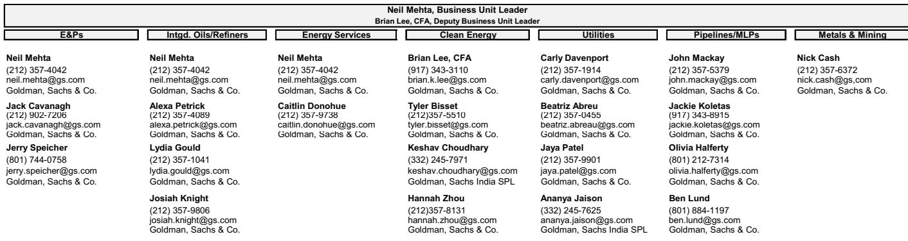
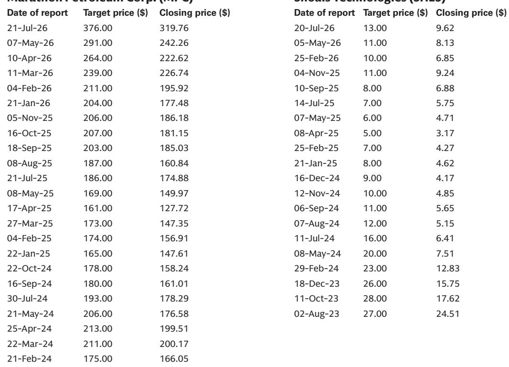

# 自然资源板块共识预期与实际存在偏离：各细分领域修正方向指引

炼油板块今年表现显著优于天然气相关公司，其原因并非市场情绪或宏观噪声，而是一个机制性事实：自然资源类公司的报价与前瞻共识修正高度相关。当预期出现偏差，公司报价便会调整。对能源、公用事业、矿业及清洁技术2027年共识预期的系统梳理揭示了一个清晰模式：在每个子板块中，共识对约一半的公司过于乐观，对另一半则过于悲观。对于观察者而言，分析师预期与数据支持之间的差距并非可以容忍的预测误差，而是一个值得关注的修正信号。

这种定价偏离的规模相当显著。在油气领域，一家主要炼油企业2027年每股盈利共识存在7%的上修空间，而另一家上游公司息税折旧摊销前利润则比共识低6%。在中游，一家公司年化EBITDA增长预期达到41%，而另一家则面临8%的同比下滑。在清洁技术领域，盈利预期分歧超过30%。这些并非边际差异，而是公司实际运营与共识模型之间的结构性脱节。

以下内容并非个股推荐，而是一个理解共识在哪些地方存在结构性错误、为何错误以及哪些机制将推动修正的框架。每个子板块有其自身逻辑，但共同主题是：共识低估了已经正在发生的特定运营、监管和市场结构因素的影响。

## 炼油与一体化石油存在非对称上修空间：共识忽视了结构性紧张与出口潜力

在综合石油和炼油领域，最显著的分歧集中在一家2027年共识每股盈利存在7%上修空间的公司。驱动因素并非一次性事件，而是得益于PADD 5地区结构性趋紧的环境、墨西哥湾沿岸逐渐增强的出口灵活性、低成本运营以及中游盈利贡献的扩大。这些并非会逆转的周期性顺风，而是该公司资产基础和市场定位的结构性特征。

此处的共识错误在于未能充分考虑产品灵活性项目和持续运营执行。这些因素支撑了强劲的现金流生成能力，进而转化为有吸引力的资本回报表现。基于更新后的预期，该公司2026年自由现金流回报表现为12%，2027年为9%。这是一个估值偏离，共识修正将逐步收窄该差距。

对应这一上修空间的，是另一家2027年EBITDA预期比共识低6%的上游公司。核心问题在于2027年及以后油气购销净收益缺乏透明度。当地Waha定价相对墨西哥湾沿岸天然气定价趋于紧张，而二叠纪新增外输管道产能预计在2026年下半年至2027年投产的时间表仍不确定。共识似乎正在定价一个可能无法如期实现的解决方案。

该公司2027年中周期布伦特原油报价预期为每桶75美元，低于共识2%。这一微小差距会逐级放大。以当前报价水平计算，基于2027年预期，该公司自由现金流回报表现为10%，而同行为11%。约10%的下修空间反映了共识必须下调的现实风险。

## 电力与公用事业呈现明显分化：资产整合赢家与德州电价输家

在电力与公用事业板块，最显著的上修空间出现在一家2027年EBITDA预期比共识高7%的公司。驱动因素具体且可衡量：近期完成的并购及资产整合与运营执行成效，再加上2027年电价的潜在上行——远期曲线近期在PJM地区各节点已坚挺至每兆瓦时60美元中段。

进一步上修的机制直接明确：如果电价继续走强，或点火价差扩大，该公司可更多运行边际机组以捕捉上行。催化因素包括PJM地区监管清晰度的提升（预计本月末提交RBP申报）以及增量大型负荷PPA的签署。以2027年数据计算的10%自由现金流回报表现支撑了这一判断。

另一方面，另一家公用事业公司EBITDA比共识低2%。驱动因素是相对PJM而言更疲软的德州电价，加上更高的燃料成本及运维费用。风险在于共识可能对近期大型交易的协同效应实现给予了过高预期。尽管该公司基本面扎实且涉足核电资产，但基于增量PPA对EBITDA的杠杆作用及估值考量，上修空间有限。

这两家公司之间的差异并非基础资产质量优劣，而是各自面临的市场动态不同：PJM电价走强，德州电价走弱。共识将它们视为类似，这正是错误所在。

## 中游增长隐含于水基础设施，而LNG混合利润率面临结构性压缩

整份报告中最剧烈的分歧出现在中游领域：一家公司2027年年化EBITDA增长预期高达41%。这并非笔误。增长基础来自于关联管道的最低承购量逐步提升——其中一条主要管道预计2026年中期投产并在2027年逐步放量。模型还假设了强劲的第三方业务增长以及二叠纪采出水业务的大范围回暖。

每英亩收入预计将从2026年的696美元增长至2027年的921美元，仍远低于该公司2024年前的历史平均水平（每英亩1159美元）。这一差距意味着额外上修空间。更快的商业转化以及新管道上的更强业务量可能推动预期进一步走高，尤其是第二阶段的商业进展表明存在可通过第一阶段闲置容量吸收的增量需求。

中游领域另一家公司面临不同的结构性问题。其EBITDA预计同比下降8%，反映出主要LNG业务组合的混合利润率下降以及后续更高的维护工作量。2027年更大比例的业务量将根据长期购销协议出售，导致每单位业务量的混合EBITDA利润率同比走低。这并非暂时性问题，而是收入结构的结构性转变。

在维护方面，2027年两条主要LNG生产线计划停产检修，将导致运营费用增加、产量同比下降。共识似乎同时低估了合同组合带来的利润率压缩以及维护带来的运营拖累。共识EBITDA约4%的下修空间可能仍偏保守。

## 清洁技术盈利预期分歧最大：运营费用假设是核心差距

在清洁技术领域，分析师预期与共识之间的相对百分比差距最大。一家公司2027年调整后每股盈利为0.60美元，比共识0.52美元高出17%。营收和EBITDA预期分别比共识高1%和5%。利润率故事至关重要：2027年EBITDA利润率22.2%，仍比共识高出约75个基点。

该公司预计未来四个季度交付6.28亿美元，高于2025年底的6.03亿美元。管理层有可能上调2026年营收指引下限，从而支撑未来营收增长。随着产品组合拓展和新地域进入，营收改善将推动规模效应带来的利润率扩张。重要的是，2027年预计调整后EBITDA利润率同比扩张200个基点，仅比共识预测高30个基点——差距真实但不极端。

另一家公司的情况则截然不同。其调整后每股盈利1.10美元，比共识1.57美元低30%。营收预期比共识低约3%，但盈利差距的真正驱动因素是运营费用。共识预计2026年运营费用同比下降约11%，2027年保持持平。而分析师观点认为，2026年运营费用下降7%，2027年增加2%，以支撑持续营收增长和新产品推出（包括一款固态变压器产品）。

近期行业数据显示，该公司在美国逆变器市场份额有所流失，主因一家大客户正从关联渠道转移，以及两家大型安装商（该公司对其依赖度较高）遭遇运营问题（其中一家已破产）。共识并未充分反映这些逆风因素，预期仍然偏高，短期内可能收缩。

## 钢铁与矿业：商品报价观点与成本结构现实之间的分歧

在金属与矿业领域，分歧由对商品报价和成本结构的不同看法驱动。一家钢铁公司2027年EBITDA共识存在约4%的上修空间。分析师对中周期热轧卷板报价比共识更乐观：每吨1000美元对比共识的950美元。这并非细微差异，而是反映了中厚板报价相对于热轧卷板将更长时间保持坚挺的看法。

上修空间还来自塔架和结构业务——到2027年底三个工厂将全面投产。尽管三个工厂以十几位数的利润率运行、总贡献约1.5亿美元的指引，分析师认为存在额外利润率提升空间，因为该公司将实现垂直整合，而竞争对手则依赖进口关税产品并实现高十几位数利润率。分析师认为该公司塔架和结构业务利润率有望达到25%左右的中段。

另一家钢铁公司面临不同的结构挑战。尽管商品报价有正面变化，但该公司大量合同为固定价格合同，每1至3年才重置一次。作为高炉运营商，其固定成本基础庞大，结果是对其他钢厂所享受的定价杠杆暴露不足，同时成本基础更高。

鉴于汽车行业敞口较大，通胀、利率上升和消费者信心走低可能进一步压低本已疲弱的美国汽车产量，2027年业务量上行空间有限。此外，过去三至四年实施的大幅成本削减举措可能已用尽，进一步改善成本结构空间有限。共识似乎在将近期商品报价走强外推为持续盈利动能，而未考虑合同性和结构性限制。

## 应对共识修正的决策框架

所有五个子板块的模式一致：共识错误并非随机，而是集中在特定机制附近——合同组合变化、维护周期、区域报价分化、运营费用轨迹假设以及未考虑结构性成本差异的商品报价观点。对于观察者而言，问题不在于是否信任共识，而在于每个公司中哪种机制最可能促使修正。

框架很简单：第一，判断公司盈利是由业务量、报价还是成本驱动；第二，评估共识对该驱动因素的看法是基于近期趋势的外推还是对特定机制的结构性分析；第三，确定公司是否具有合同、运营或监管特征使其免受或暴露于相关驱动因素。

在炼油领域，驱动因素是结构性紧张和出口潜力，而共识低估了二者。在上游，驱动因素是区域天然气报价和管道投产时间表，共识高估了问题的解决速度。在电力领域，驱动因素是区域报价分化，共识将不同地区等同对待。在中游，驱动因素是合同组合和维护时间表，共识忽视了二者。在清洁技术领域，驱动因素是运营费用轨迹，共识假设了数据并不支持的成本下降。在钢铁领域，驱动因素是商品报价假设和成本结构，共识高估了商品周期并低估了合同限制。

统一的认识是：共识修正不会均匀发生，而将集中在特定机制被错误定价的公司中。具有上修空间的公司，其驱动机制是结构性的、持续性的；具有下修风险的公司，其驱动机制也是结构性的，但共识尚未调整。

*仅供参考，不构成任何专业意见。部分内容可能基于源材料通过AI辅助生成、翻译、摘要或编辑，可能存在遗漏或错误。请独立核实。*

仅供参考，不构成任何专业意见。部分内容可能基于源材料通过AI辅助生成、翻译、摘要或编辑，可能存在遗漏或错误。请独立核实。

