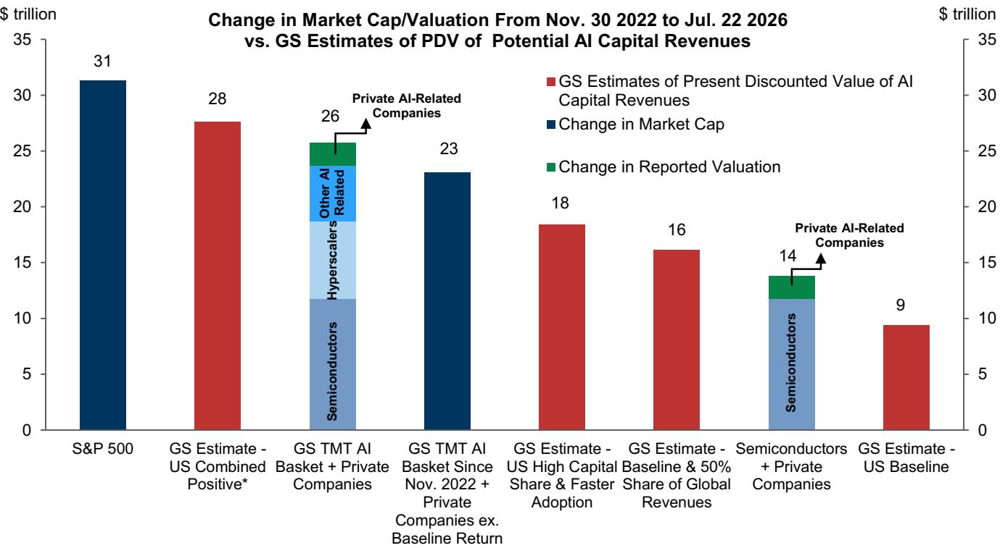
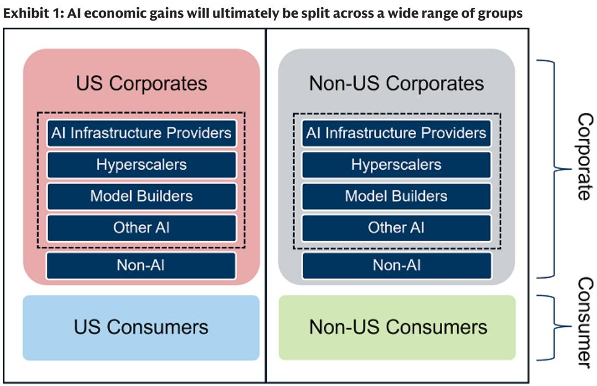
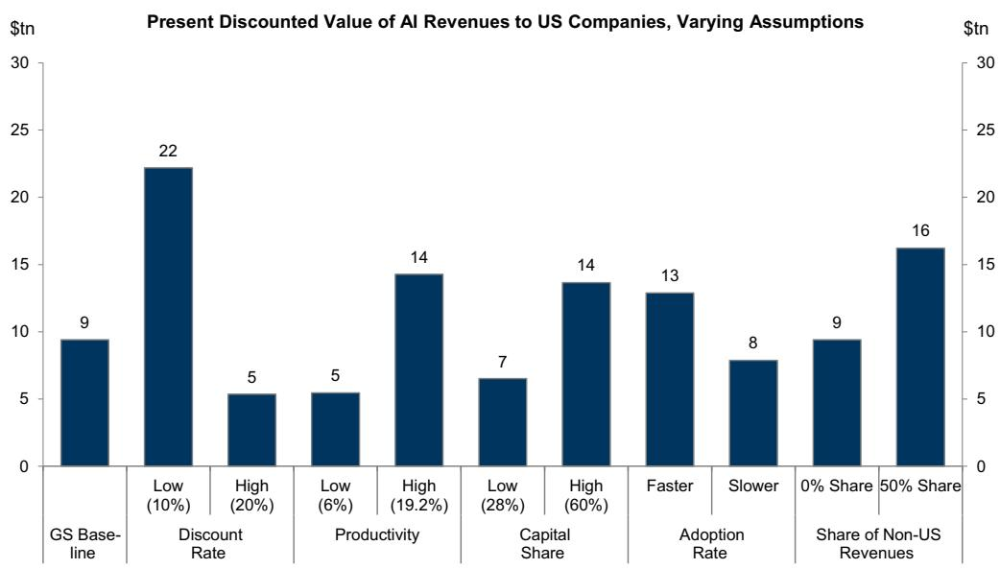

# GS：AI技术与行业应用观察

过去一个月半导体领域的不确定性，重新引发了市场对AI相关公司不确定性及应对方式的讨论。GS在最新发布的全球市场评论中提出一个分析框架：关键在于区分影响是改变了对AI创新总价值的预期，还是改变了价值在不同主体间的分配。简单说，有些关注点在于整体规模，有些在于如何分配。

报告认为，随着AI相关公司蕴含的价值持续增长，市场需要越来越乐观的假设才能支撑当前定价。这使得市场更容易受到挑战乐观叙事的事件影响。虽然强劲的盈利可能在短期内主导估值因素，但读者可以关注主题面临的潜在变化及其对组合观察的影响。

## 1. 总价值影响与分配影响对资产的作用路径不同

GS从宏观角度估算AI收益的框架包含五个关键参数：生产率增长、采用速度、资本份额、国际份额和贴现率。对总价值的预期变化，通常由这些参数中的一个或多个被修正驱动。而分配影响则是在总价值预期不变的前提下，改变市场对赢家和输家的判断。

报告通过2025年1月至2026年7月间的五个市场事件验证了这一区分。DeepSeek发布R1模型（2025年1月27日）和2026年2月初的广泛AI关注，属于典型的总价值影响，导致标普500指数分别下跌1.5%和1.7%，美国国债回报表现同步节奏变化。而谷歌宣布股权融资（2026年6月2日）和Meta宣布建设新云业务（2026年7月1日）这类分配性事件，对大盘指数影响极小，标普500当日变动不足0.2%。

## 2. 分配影响对特定板块的作用更集中但更难应对

分配影响虽然对宏观资产作用有限，但对特定板块的作用幅度可能更大。以DeepSeek事件为例，GS美国AI广泛篮子下跌9.5%，半导体指数下跌7.8%，而标普500指数仅下跌1.5%。相比之下，谷歌发行事件中，半导体指数反而上涨5.8%，AI篮子上涨3.2%。

> **KC评论：** 分配影响的资产作用路径更窄，但并不意味着不确定性更小。对于持有AI主题敞口的读者，分配影响可能造成集中损失，而传统的宏观应对工具（如利率、汇率）对此类影响的反应不稳定。报告隐含的提醒是：主题越集中，应对工具的选择越需要精确匹配影响类型。

报告指出，分配影响对公司隐含波动率的推升作用有限，但会推高指数内相关性。这意味着，在分配影响发生时，分散化研究于不同AI子板块的效果可能不如预期。

## 3. 宏观影响对AI受益者的作用可能被放大

GS特别提醒，宏观影响虽然不属于AI特有不确定性，但由于AI相关公司已积累大量头寸、估值偏高且融资需求旺盛，宏观影响可能对AI受益者产生不成比例的作用。2026年6月5日强劲非农数据引发的利率变化，导致半导体指数下跌10.4%，AI篮子下跌6.8%，均显著超过标普500的2.6%跌幅。

报告认为，区分影响类型对理解跨资产作用至关重要。总价值影响通常伴随美债回报表现节奏变化（除非利率本身是不确定性来源），而分配影响对利率几乎可以忽略。对于持有广泛美国公司敞口的读者，总价值影响是更需要关注的不确定性，且可以通过宏观资产进行应对。

## 4. 一个可复用的观察框架

GS提供的框架可以用于分类当前市场讨论中的各种AI不确定性叙事。对采用速度或应用场景范围的关注，属于总价值影响；对模型竞争压低成本、或非美国公司创新的关注，可能同时具有总价值和分配双重属性；而产能扩张或芯片替代，则更偏向分配影响。

报告没有试图穷尽所有不确定性场景，而是提供了一个思考工具：在评估任何潜在影响时，先问两个问题——它改变的是整体规模，还是分配方式？这个问题的答案，决定了资产反应路径和应对工具选择。

For informational purposes only. Portions may be generated,translated,summarized,or edited with AI assistance based on source materials and may contain omissions or errors. Please verify independently. This is not investment,legal,tax,accounting,or other professional advice.

