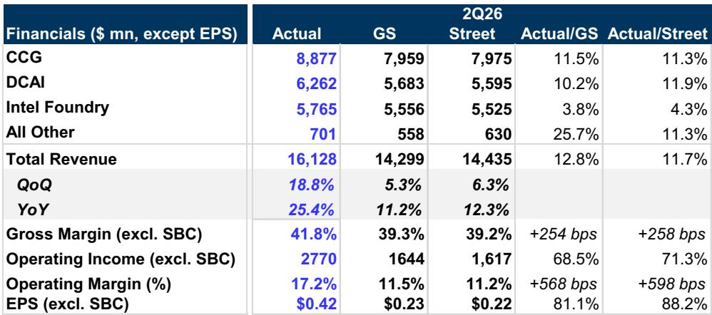
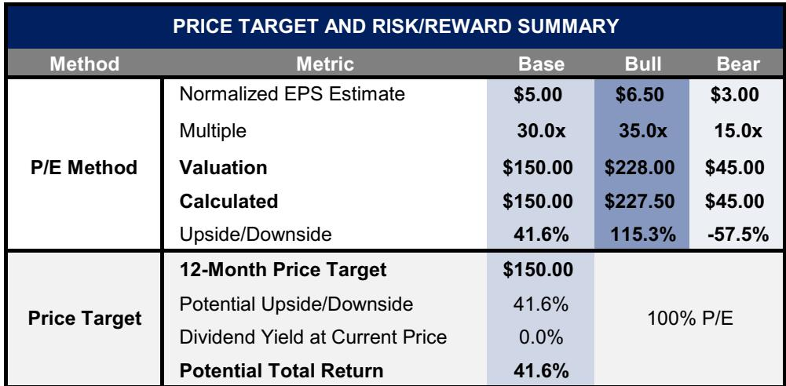
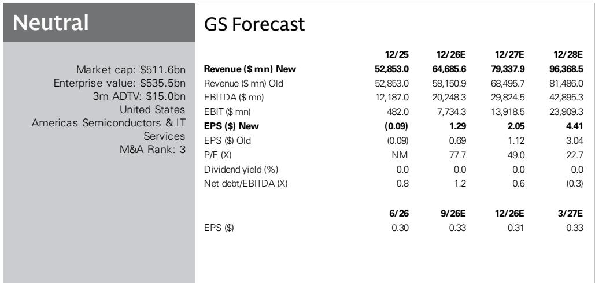

# 英特尔多年来的表现突出季度并非关键：资本支出激增与代工轨迹重塑市场观察

英特尔2026年第二季度报告收入161亿美元，超过市场一致预期11.7%，超出独立分析师预估12.8%。毛利率41.8%，高于市场预期258个基点。营业利润率17.2%，比市场预期高出近600个基点。非GAAP每股回报表现0.42美元，几乎是市场预期的0.22美元的两倍。这些并非小幅超额。它们代表着公司基本运营层面的转折，促使重新评估其近期盈利能力和长期战略定位。

第三季度指引强化了势头。收入指引中位数163亿美元，高于市场7.8%。毛利率指引42%意味着持续改善。但整个公告中最具影响力的数字并非季度利润表中的项目，而是资本支出计划。英特尔将2026年资本支出指引从之前的170亿美元提高到超过200亿美元，并表明2027年将进一步显著增加。公司预计仅2026年晶圆设备工具支出就将增加约40%。这不是周期性的上升。这是对产能的结构性承诺，将定义未来十年的代工行业。

对英特尔的评估已分为两个方面。数据中心和AI集团已成为持续增长引擎，至少到2028年可实现两位数收入增长。同时，代工业务正从市场参与者容忍的成本中心转变为一个产能受限的资产，其在最先进制程节点之前就吸引了外部客户需求。这两个动态相互增强。强大的服务器CPU需求为构建代工规模的资本支出提供资金。代工规模反过来降低英特尔自身产品的单位成本。这种良性循环不再是理论上的。它在数字中可见。

## 数据中心业务已进入由代理人工智能驱动的结构性增长阶段，而不仅仅是周期性服务器更新

英特尔数据中心和AI部门环比增长24%，同比增长59%。收入63亿美元，高于独立分析师预估10.2%，高于市场预期11.9%。超额幅度不如构成重要。增长由通用服务器需求和代理人工智能工作负载驱动。这是一个关键区别。许多AI叙述集中在GPU驱动的训练集群。但推理，特别是自主执行多步骤任务的代理AI系统，对CPU吞吐量、内存带宽和延迟敏感计算有很高要求。英特尔的服务器CPU已准备好抓住这一波。

公司自己的评论强化了趋势的结构性。英特尔看到服务器CPU市场加速，单位出货量强劲且平均售价提高。管理层预计至少到2028年实现强劲的两位数复合年增长率。第四季度预计DCAI将出现更强的环比增长，因为更多供应上线，目前公司处于产能不足状态。一个在其最盈利产品线上产能受限的公司不是一个周期性故事。这是一个供应限制的增长故事，这是一个远更有利的问题。

预估修正反映了这一点。分析师将2026财年DCAI收入预估上调12.5%，2027财年上调24.6%，2028财年上调30.3%。2028年DCAI收入预估近490亿美元，比先前预测高出30%以上。这些不是小幅调整。它们表明服务器CPU周期受市场尚未完全建模的需求机制驱动。代理AI是机制。它创造了独立于企业IT预算周期的持久需求顺风。

## 代工业务不再是一个投机选项：强劲的客户需求信号引发了数十亿美元的产能扩张，重塑长期利润率轨迹

英特尔代工报告收入58亿美元，略高于预期。收入超额并非重点。战略信号是资本支出计划。英特尔将其2026年资本支出指引提高了30亿美元至超过200亿美元，并明确将增长与先进封装及即将推出的14A工艺节点的强劲客户需求信号联系起来。公司计划2026年WFE工具支出增加约40%，此前在晶圆厂外壳和洁净室外壳上进行了超额投资。这是先于需求建设产能的审慎策略，而非对需求做出反应。

工艺技术路线图为此押注提供了技术基础。英特尔继续看到其18A工艺技术在服务器和客户端产品上均有强劲的良率和产量提升。公司在第二季度进入18A-P的风险生产。更重要的是，14A的内部工艺指标比18A在相同开发阶段进展更快。英特尔计划在10月发布14A工艺设计套件0.9版，2027年下半年进行风险生产，2028年实现量产。这一节奏是可信的。它表明英特尔的工艺技术复兴不是一个节点事件，而是一个多节点轨迹。

代工收入预估上调幅度比DCAI更温和，但长期影响更大。分析师2028年代工收入预估473亿美元，仅比先前预测高5.3%。然而，利润率影响重大。2028年总收入预估上调18.3%至964亿美元。毛利率预计到2028年达到50.1%，营业收入近280亿美元。代工业务曾被视为利润率拖累，现在正被构建为高产量、高利用率资产，为利润率扩张轨迹做出贡献而非减损。

## 利润率轨迹在预测期改善超过200个基点，改善由产品组合变化驱动，而非成本削减

第三季度毛利率指引42%，比市场预期提高169个基点。2026年全年毛利率预估上调至42.4%，比先前预测提高239个基点。2027年预估45.2%，提高182个基点。到2028年，毛利率预计达到50.1%，与先前预估基本持平但收入基础更大。营业收入预估2026年上调51%，2027年49%，2028年35%。利润率扩张前置且真实。

机制是产品组合变化。数据中心CPU利润率高于客户端处理器，且DCAI部门增长更快。代工收入虽然初期具有稀释性，但随着利用率上升和先进封装产能上线，将变得增值。公司并非依赖成本重组实现这些利润率，而是依赖高利润细分市场的收入增长以及充分利用固定成本资产基础带来的运营杠杆。这是一个比裁员或关厂驱动的利润率故事更持久的叙事。

每股回报表现轨迹强调了这一点。2026年每股回报预估上调56%至1.65美元。2027年预估上调54%至2.70美元。2028年预估上调37%至4.60美元。这些不是边际调整。它们反映了六个月前尚不明显的复合盈利增长故事。标准化预估5.00美元意味着当前盈利轨迹并非峰值，而是一个基础。

## 决策框架：区分近期收入转折与多年代工期权价值

对于评估英特尔的市场参与者，分析挑战是区分两个不同但相互关联的研究主题。第一个是近期收入和利润率转折，由服务器CPU周期和代理AI驱动。这一主题已由季度业绩和指引验证。第二个是多年代工期权价值，取决于14A的成功量产、客户需求信号转化为绑定晶圆协议，以及公司能否在成本和性能上与台湾代工竞争对手竞争。

近期主题今天即可观察。DCAI部门同比增长近60%。公司产能受限，意味着随着供应增加，收入可以在不增加市场份额的情况下增长。到2027年利润率轨迹每年改善超过200个基点。2026年每股回报预估1.65美元，根据当前公司报价意味着远期估值倍数约60多倍，但到2028年压缩至23倍。对于两到三年视野的市场参与者，仅近期主题就可能证明估值合理。

代工主题需要更多耐心并承担更多风险。下行风险包括先进代工节点爬坡慢于预期以及服务器CPU份额下降。这些不是宏观风险，而是代工策略固有的执行风险。乐观情形（目标价228美元）假设标准化每股回报6.50美元和35倍估值倍数，这需要代工业务实现资本支出计划所暗示的产能和客户吸引力。

决策框架因此是一个时间线问题。如果市场参与者相信14A将在2028年按时实现量产，且外部代工客户承诺批量晶圆协议，则乐观情形合理。如果对英特尔多年延迟后执行工艺技术的能力持怀疑态度，则下行情形是相关风险。近期收入和利润率数据支持乐观，但并未解决代工不确定性。资本支出增加是最重要的信号，因为它代表管理团队押注资产负债表于代工结果。这是信念还是过度自信，未来四个季度的数据将决定。

*仅供参考。部分内容可能基于原始资料通过AI辅助生成、翻译、总结或编辑，可能包含遗漏或错误。请独立核实。这不是研究、法律、税务、会计或其他专业建议。*

*仅供参考。部分内容可能基于原始资料通过AI辅助生成、翻译、总结或编辑，可能包含遗漏或错误。请独立核实。这不是研究、法律、税务、会计或其他专业建议。*

