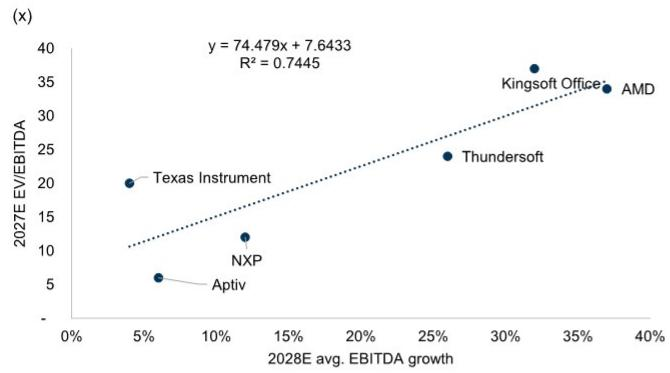
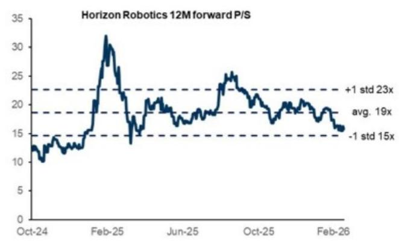

# Horizon Robotics (9660.HK): HSD V2.0 上线与新车型体验升级；上半年营收同比增幅约25-35%

公司发布上半年展望：  
（1）营收预计同比增长25%至35%，中位数约200亿人民币（环比-9%，同比+30%）。该增长主要得益于全场景NOA的部署以及BPU与AI模型的综合解决方案。中国新能源汽车市场同期数据为同比-14%，公司表现优于该市场。  
（2）调整后净亏损约14亿至17亿人民币（对比上半年为13亿亏损）。  
（3）净利润约35亿至40亿人民币。调整后净利润与净利润之间的差异主要来自因公司报价波动导致的与CARIAD可转换贷款的公允价值变动。2026年6月底，公司推出HSD (Horizon SuperDrive) V2.0，基于世界模型新增18项功能；近期亦宣布与大众汽车合作向L3/L4迁移，预计将推动下半年及2027年的增长。

**HSD V2.0 上线**  
公司于6月底发布基于Journey 6P平台的新版HSD V2.0，该版本基于升级的世界模型和端到端模型，提升了车辆响应速度、驾驶环境管理及泊车体验等。HSD V2.0已搭载于奇瑞iCAR V27，用户采用率较高。管理层指出，该方案有助于10万至20万价格区间的车型在车辆上实现城市NOA。

**预测调整**  
结合上半年展望，我们更新了对公司的预测：2026年净利润调整为17亿人民币（此前为净亏损45亿），主要因可转换债券公允价值变动带来的超预期非经营性收益。2026-2028年营收预测分别下调8%/2%/2%，主要由于汽车授权营收变化；2029-2030年预测基本不变。

---

**附录：关键财务数据**

| 人民币百万元 | 2026E | 2027E | 2028E | 2029E | 2030E |
|------------|-------|-------|-------|-------|-------|
| 营收       | 6,394 | 10,735 | 18,996 | 24,856 | 28,444 |
| 毛利率     | 63.2% | 65.7% | 62.4% | 61.3% | 61.1% |
| 营业利润   | (3,570)| (591)  | 4,165 | 7,053 | 8,415 |
| 归属净利润 | 1,698 | (72)   | 4,781 | 7,525 | 8,941 |
| 调整后净利润 | (2,223)| (6)   | 5,012 | 7,827 | 9,364 |

*数据来源：公司资料，GS全球投资研究*

---

**估值框架**  
我们维持基于2030年EV/EBITDA的估值方法，折现至2027年。目标2027年折现EV/EBITDA倍数约22.0倍（此前为23.1倍），基于公司2031年EBITDA增长率与同业倍数相关性推导。折现时采用权益资本成本11.5%（股权风险溢价6.5%，无风险利率3.0%，贝塔系数1.3）。对应2027/2028年EV/营收分别为12.9倍/7.3倍（此前为13.3倍/7.5倍）。

---

**方法与风险提示**  
我们基于2030年折现EV/EBITDA约22.0倍（使用公司2030年EBITDA预测），折现至2027年，折现率11.5%（参数同上）。  
主要风险：  
- 竞争加剧或需求趋缓导致的供应链定价压力  
- 产品组合向AD升级慢于预期  
- 客户基础扩展慢于预期  
- 地缘政治因素带来的供应链风险  

*本报告仅用于研究参考，不构成任何建议。*

---

**图片附录**  
*Exhibit 3: 目标倍数推导（基于同业EV/EBITDA与EBITDA增长）*  
  
*来源：公司数据，GS全球投资研究*  

*Exhibit 4: 12个月远期P/S*  
  
*来源：Eikon Datastream*
