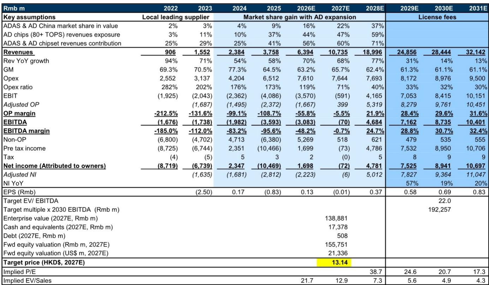
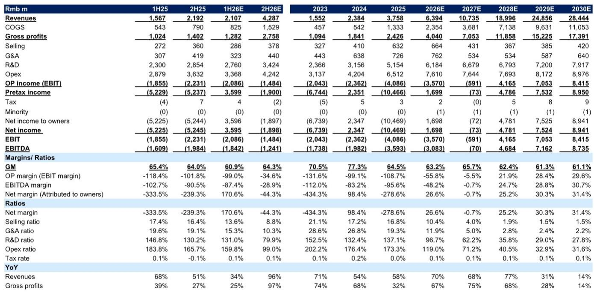
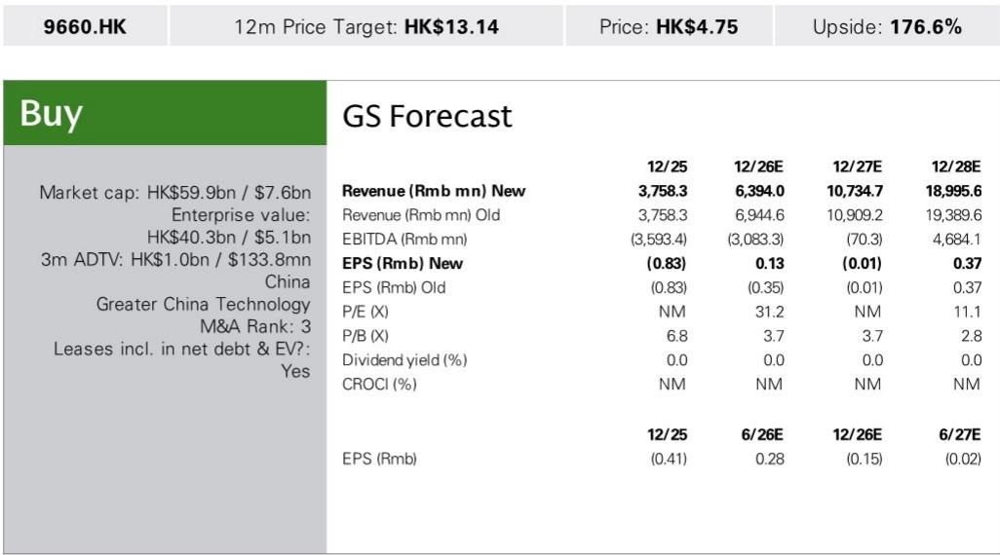

# 研究：地平线HSDV2.0发布与1H26营收指引

地平线于2026年6月底推出HSD V2.0，基于Journey 6P平台和升级后的世界模型与端到端模型，新增18项功能。公司同时给出1H26业绩指引：营收预计同比增长25%-35%，中位数约200亿元人民币，环比下降9%，而同期中国新能源汽车市场出货量同比下降14%。这一表现背后，是全场景NOA方案的规模化部署，以及BPU与AI模型组合的持续扩展。

某券商分析师团队在最新报告中指出，HSD V2.0已搭载于奇瑞iCAR V27，且用户采用率较高。管理层认为，这套方案能够帮助10万至20万元价格区间的车型实现城市NOA功能，从而将高阶智驾从高端市场向下渗透。报告同时提及，地平线与大众汽车的合作正在向L3/L4级别迁移，这将成为2H26及2027年的增长驱动。

## 1. 营收增长与市场环境形成反差

1H26营收指引中位数200亿元，对应30%的同比增速。同期中国新能源汽车出货量同比下降14%，地平线的增速是行业均值的两倍以上。这一反差说明，公司的增长并非依赖行业整体趋势，而是来自ADAS与自动驾驶方案的市场份额提升。

报告中的市场份额数据提供了佐证：地平线在中国ADAS与自动驾驶市场的价值份额，从2022年的2%上升至2025年的9%，预计2026年将达到16%，2028年进一步升至37%。高算力芯片（80+ TOPS）的营收占比也从2022年的3%快速攀升至2025年的37%，2026年预计达到44%。

> **KC评论：** 市场份额的跃升并非线性外推。报告隐含的假设是，地平线在10-20万元车型市场的渗透速度，决定了其能否在2028年达到37%的份额。这一价格带是目前中国乘用车销量最大的区间，也是城市NOA尚未大规模普及的领域。

## 2. 净利润波动源于可转换融资工具公允价值变动

1H26净利润指引为35亿至40亿元盈利，而调整后净亏损为14亿至17亿元。两者差异主要来自一笔可转换融资工具的公允价值变动——该融资工具是大众旗下CARIAD认购的，其价值随地平线的整体价值波动。报告上调2026年净利润至17亿元（此前为45亿元净亏损），主要也是因为非经营收益高于预期。

经营层面，1H26营业利润预计仍为亏损，亏损额约20.9亿元，EBITDA亏损约18.4亿元。但2H26的营业利润率有望从-99%收窄至-34.6%，EBITDA利润率从-87.4%改善至-28.9%。报告认为，随着营收规模扩大带动费用率下降，公司有望在2028年实现正的营业利润。

## 3. 估值框架依赖远期EBITDA增长

基于2030年EV/EBITDA倍数22倍，再折现回2027年。这一倍数来自同行业公司EBITDA增速与交易EV/EBITDA的相关性分析。隐含的2027/2028年EV/销售收入倍数分别为12.9倍和7.3倍。

报告中的关键假设是，地平线在2028年之后进入“授权费”为主的收入模式，营收增速从2028年的77%逐步节奏变化至2030年的14%，但EBITDA利润率从2028年的24.7%提升至2030年的30.7%。这一利润率水平能否实现，取决于研发费用率能否从2025年的137%降至2030年的27.8%。

## 4. 一个可复用的观察框架：从芯片出货到授权费收入

地平线的收入结构正在经历从硬件向软件的迁移。报告将公司发展分为三个阶段：2022-2024年为本地领先供应商阶段，2025-2028年为市场份额扩张阶段，2029年后进入授权费主导阶段。每个阶段的营收增速、毛利率和费用结构都有显著差异。

对于关注智能驾驶产业链的读者，可以参照这一框架评估其他中国ADAS供应商：先看高算力芯片的营收占比是否在提升，再看城市NOA方案的定价区间是否下探至15万元以下，最后观察研发费用率是否随营收规模扩大而下降。这三个指标构成了从硬件公司向软件平台转型的验证链条。

For informational purposes only. Portions may be generated,translated,summarized,or edited with AI assistance based on source materials and may contain omissions or errors. Please verify independently. This is not investment,legal,tax,accounting,or other professional advice.

For informational purposes only. Portions may be generated,translated,summarized,or edited with AI assistance based on source materials and may contain omissions or errors. Please verify independently. This is not investment,legal,tax,accounting,or other professional advice.

#学习笔记 #研究笔记 #学习研究 #研报解读
