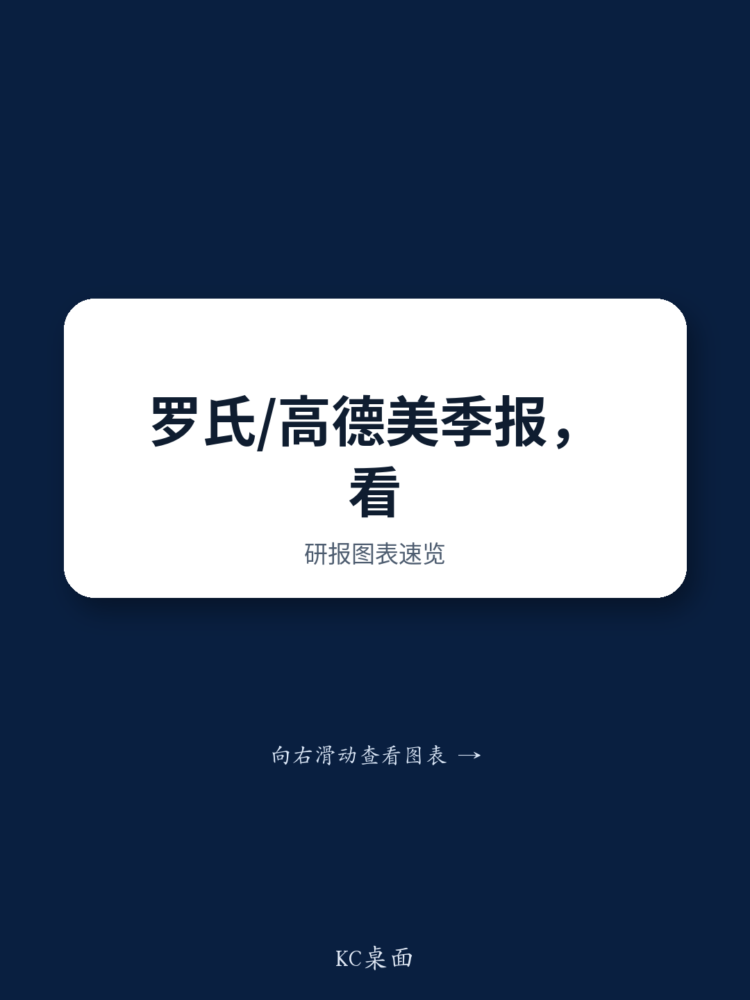

# 中外制药全球管线进展：Hemlibra与Nemluvio表现符合预期，中国诊断改革为希森美康创造可见机会

罗氏和Galderma于7月23日公布的第二季度数据，为关注日本医疗保健领域的观察者提供了难得的清晰参照。对中外制药而言，核心信息在于商业化势头与管线深度，这些已可用实际数据衡量。由中外制药研发的血友病治疗药物Hemlibra，其全球销售额超出公司汇总的市场平均预期4%，表明该药物在成熟市场中仍保持增长态势。特应性皮炎和结节性痒疹治疗药物Nemluvio的表现基本符合或略高于预期，进一步说明中外制药的创新引擎并非仅依赖单一重磅产品。这些结果并非简单的增量信息，而是验证了一个观点：中外制药的全球产品组合正在成为复合增长动力，而非一次性成功故事。

对希森美康这家诊断设备和试剂公司而言，参照信息来自罗氏报告的另一部分。罗氏重申其展望，认为中国医疗定价改革的影响将在2026年前缓解。这是一个具有战略意义的信号。希森美康相当一部分收益来自中国，近年来压缩利润空间的定价因素一直是公司关注的焦点。罗氏的相关评论，与雅培和丹纳赫在各自第二季度电话会议上的表述一致，显示出改革周期最严峻的阶段可能已过去。对观察者而言，这意味着一个时间窗口：收益拖累效应正在见顶，恢复基础正在形成。

更广泛的启示在于，具有全球业务的日本医疗保健公司正在进入一个阶段，其表现将更多由产品层面的具体因素驱动，而非宏观或监管因素。第二季度的数据不仅是事后的确认，更是这些公司未来12至18个月发展路径的前瞻指标。本文梳理关键结果及其对中外制药和希森美克的战略意义，并提供观察者应如何为即将到来的财报周期进行布局的分析框架。

## Hemlibra超出市场平均预期4%，显示成熟产品的定价韧性而非单纯销量增长

Hemlibra的全球销售额在第二季度超出公司汇总的市场平均预期4%，但较卖方估计低1%。这一差距具有参考价值：市场可能对该药物在基因疗法和生物类似药竞争压力下维持增长的能力过于悲观。而Hemlibra仍超越更广泛的市场平均预期，表明其在医生处方和患者持续性方面依然强劲，即便在美国和欧洲这类替代药物竞争激烈的市场。

战略层面的启示是，Hemlibra并非正在衰落的资产。其增长现在更多依赖市场份额维持和定价稳定，而非新增患者获取。对中外制药而言，这意味着该药物将继续产生稳定现金流，为其余管线提供资金支持。与卖方估计相差1%属于小幅偏差，反映的是建模保守，而非基本面恶化。观察者应视其为药物韧性的信号，而非平台期的标志。

## Nemluvio的表现巩固了中外制药在炎症疾病市场的地位，创造第二增长引擎

Nemluvio获批用于特应性皮炎和结节性痒疹，第二季度表现基本符合或略高于预期。这一进展至关重要，因为它使中外制药的收入基础不再过度依赖Hemlibra。特应性皮炎是个庞大且不断增长的市场，受诊断率和认知度提升驱动。结节性痒疹虽是较小适应症，但代表高度未满足需求领域，有效疗法可获得溢价定价。

此处最关键的数据并非具体销售额数字，而是走势。Nemluvio仍处于上市初期阶段。其第二季度能够达到或超越预期，表明初步接纳并非一次性事件，而是持续采用模式的开始。对中外制药而言，这构成了第二增长引擎，即使Hemlibra增速在未来三至五年放缓，也能支撑收益。此外，针对肥胖的GYM329和血友病的NXT007的管线进展进一步印证：该公司并非单一产品故事，而是多资产平台。

## 罗氏对中国定价展望标志着希森美克诊断收益的转折点

罗氏关于中国医疗定价改革的评论对希森美克最具战略参照意义。罗氏表示这些改革的影响将在2026年缓解，这一观点与雅培和丹纳赫在各自第二季度业绩中的表述一致。三大诊断企业意见趋同，形成高确信度信号：定价压力是周期性的，而非结构性的。

对希森美克而言，影响直接且重要。该公司在中国的诊断业务一直面临政府主导的试剂和设备降价压力，这些降价压缩了利润空间并放缓了收入增长。如果改革缓解正如罗氏所预期，希森美克的中国业务板块可能从2026年开始出现利润率恢复。希森美克当前的市场定价可能已包含对中国监管环境的悲观预期。任何定价方面的积极惊喜都可能引发重新评估。

机制很简单：随着改革周期最激进的阶段过去，希森美克中国收益的同比基数将改善。观察者不应仅关注定价的相对水平，还需关注变化率。罗氏第二季度数据表明，变化率即将转为有利。

## 围绕日本医疗保健财报周期进行布局的分析框架

第二季度数据为观察者评估中外制药和希森美克提供了清晰的分析框架。对中外制药而言，关键变量在于管线走势。Hemlibra是现金牛，但真正上行空间来自Nemluvio的持续接纳以及GYM329和NXT007的临床数据读出。针对肥胖的GYMINDA试验计划于2026年，NXT007与Hemlibra的头对头III期试验将在2027年底至2028年初出结果。观察者应评估当前市场定价是否充分反映这些管线资产的成功概率。如果市场过度折现，中外制药可能提供不对称的上行空间。

对希森美克而言，框架更简单。决策取决于中国改革缓解的时间点。罗氏指引提供了2026年的时间表，但观察者应关注更早的信号，例如中国监管机构的评论或竞争对手的定价数据。如果缓解早于预期，希森美克的收益可能比市场一致预期更早出现拐点。反之，如果改革持续或加剧，公司表现将维持区间波动。当前风险回报比倾向于积极方向，因为下行风险已被定价，而上行空间来自恢复尚未被充分反映。

第二季度的数据点并非孤立事件。它们是更广泛模式的一部分：拥有全球产品组合的日本医疗保健公司正在证明，其增长由产品层面因素驱动，而非宏观因素。这比依赖汇率波动或政府政策变化的故事更具可预测性和可参照性。聚焦产品周期和监管时间表的观察者，将更有利于把握下一阶段的回报表现。

*仅供参考。部分内容可能基于源材料通过AI辅助生成、翻译、总结或编辑，可能存在遗漏或错误。请独立核实。本文不构成专业建议。*

仅供参考。部分内容可能基于源材料通过AI辅助生成、翻译、总结或编辑，可能存在遗漏或错误。请独立核实。本文不构成专业建议。

