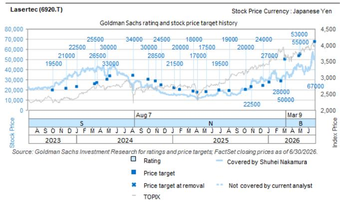
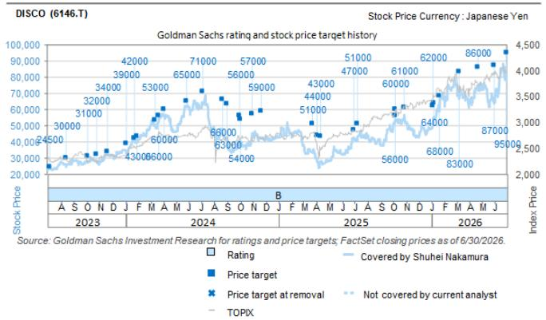
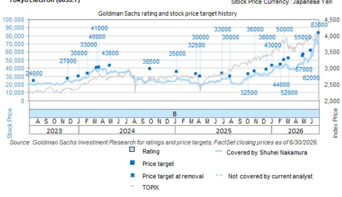
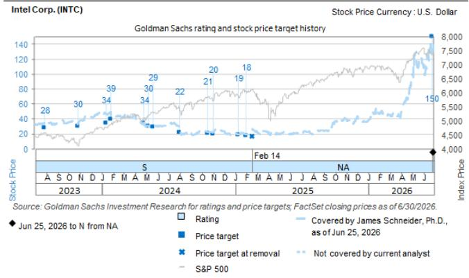

# 日本半导体设备行业：Intel二季度影响分析——资本开支展望调整，关注Lasertec/TEL

## 当前业务环境

Intel（由我们美国半导体分析师Jim Schneider覆盖）于7月24日早间（日本时间）发布了第二季度（4月至6月）经营数据并召开了电话会议。以下我们整理关键要点，侧重对日本半导体设备制造商的关联影响。

Intel表示，在需求旺盛的背景下，公司正在进行产能扩张，需求持续超过供给，因此营收增速为近15年来最高。从技术路线图看，公司指出18A产品起量已启动，18A-P已开始风险试产，并计划于2027年下半年启动14A风险试产。该公司表示已在第二季度增加资本开支，以扩大14A产量。

## 关于资本开支的观点

Intel将全年资本开支指引上调约30亿美元，预计全年资本开支将超过200亿美元。公司表示过去几年通过建设投资已确保充足的生产厂房空间，因此大部分资本开支预计将用于设备。Intel说明设备资本开支2026年将同比增长40%（此前2026年WFE设备投入指引为同比增长约25%）。管理层未提供2027年量化指引，但方向性指出，考虑到18A及先进制程的良率和当前客户询问水平，资本开支将同比显著增长。

## 对日本SPE制造商的关联影响

我们认为，先进制程起量路径清晰以及Intel资本开支展望显著上调，对Lasertec（正面）和Tokyo Electron（正面）具有积极关联，这两家公司对Intel的销售敞口较高。此外，Intel在先进封装领域的投入也将在后端流程加速，对Disco（正面）同样具有积极关联，该公司有望受益于EMIB-T产能扩张。

## 作者

Shuhei Nakamura, Kaho Otake （GS Japan Co., Ltd.）

图1：日本SPE覆盖公司中对Intel的销售敞口（2026财年预期，GS估算）  
  
来源：GS Global Investment Research

图2：所提及公司的观察参考价、分析方法和风险因素

| 公司名称（评级） | 代码 | 12个月观察参考价（¥） | 分析方法 | 风险因素 |
| --- | --- | --- | --- | --- |
| DISCO（正面） | 6146.T | 100,000 | 基于全球SPE行业平均倍数18倍及我们对2028年3月财年的预估，再施加相对于行业50%的溢价。 | （-）人工智能相关需求变化或份额流失；（-）中国需求变化或出口管制收紧；（-）日元兑美元快速升值。 |
| Lasertec（正面）* | 6920.T | 70,000 | 基于全球SPE行业平均倍数18倍及我们2028年6月财年预估的平均值，再施加相对于行业50%的溢价。 | （-）新进入者导致市场份额下降；（-）ACTIS在晶圆厂采用进展不足；（-）客户对领先制程节点的投入意愿减弱；（-）日元兑美元快速升值。 |
| Tokyo Electron（正面） | 8035.T | 83,000 | 基于全球SPE行业平均倍数18倍及我们对2028年3月财年的预估，再施加相对于行业30%的溢价。 | （-）半导体行业库存调整周期延长；（-）出口限制进一步强化；（-）利率上升等因素压低估值倍数。 |

*列入亚太区推荐关注名单

来源：GS Global Investment Research

## 附录

## 分析师声明

我们，Shuhei Nakamura和Kaho Otake，特此证明本报告中表达的所有观点均准确反映我们个人对相关公司或其证券的看法。我们也证明我们的薪酬中没有任何部分直接或间接与本报告中的具体评级或观点相关。

除非另有说明，本报告封面所列人员为GS Global Investment Research部门分析师。

贡献作者：Shuhei Nakamura （GS Japan Co., Ltd.）、Kaho Otake （GS Japan Co., Ltd.）

除非另有说明，本报告“贡献作者”中列示的人员为GS Global Investment Research部门分析师。

## GS因子概要

GS因子概要通过将股票关键属性与市场（即我们评级的全部股票）及行业同行进行比较，提供该股票的研究背景。四个关键属性为：增长、财务回报、估值倍数（如市场定价）以及综合（增长、财务回报和估值倍数的复合指标）。增长、财务回报和估值倍数通过对每只股票特定指标采用标准化排序计算，再将各指标标准化排序的平均值转换为相应属性的百分位。每项指标的具体计算可能因财年、行业和地区而异，但标准方法如下：

增长基于股票未来销售额增长、EBITDA增长和每股收益增长（金融类股票仅使用每股收益和销售额增长），较高百分位表示增长较高的公司。财务回报基于股票未来ROE、ROCE和CROCI（金融类股票仅使用ROE），较高百分位表示财务回报较高的公司。估值倍数基于股票未来市盈率、市净率、股息率、EV/EBITDA、EV/FCF和EV/债务调整现金流（金融类股票仅使用市盈率、市净率和股息率），较高百分位表示估值倍数较高的公司。综合百分位为增长百分位、财务回报百分位和（100% - 估值倍数百分位）的平均值。

财务回报和估值倍数使用GS分析师对未来至少三个季度后的财年末预测。增长使用对未来至少七个季度后财年（相对于未来至少三个季度后的财年，各项指标均按每股计算）的输入。

有关GS因子概要的更详细说明，请联系您的GS代表。

## 并购排名

在我们的全球覆盖范围内，我们使用并购框架审视股票，综合考虑定性因素和定量因素（可能因行业和地区而异），以纳入某些公司可能被收购的可能性。我们随后将并购排名作为评级覆盖公司的评分，从1到3：1代表公司成为收购目标的高概率（30%-50%），2代表中等概率（15%-30%），3代表低概率（0%-15%）。对于排名为1或2的公司，按照我们标准部门指引，我们在目标价中纳入并购组成部分。并购排名3视为不重要，因此不计入价格目标，可能在研究中提及或不提及。

## Quantum

Quantum是GS的专有数据库，可访问详细的财务历史、预测和比率。可用于对单一公司进行深入分析，或比较不同行业和市场的公司。

## 披露信息

DISCO、Lasertec和Tokyo Electron的评级相对于其覆盖范围内的其他公司：Advantest、DISCO、Ebara、HOYA、JEOL、Kioxia Holdings、Kokusai Electric、Lasertec、SCREEN Holdings、Tokyo Electron、Tokyo Seimitsu、Ulvac

Intel Corp.的评级相对于其覆盖范围内的其他公司：ARM Holdings、Accenture Plc、Advanced Micro Devices Inc.、Amkor Technology Inc.、Analog Devices Inc.、Applied Materials Inc.、Broadcom Inc.、Cadence Design Systems Inc.、Camtek、Cognizant Technology Solutions、Credo Technology Group、EPAM Systems Inc.、Entegris Inc.、GlobalFoundries Inc.、Globant SA、Intel Corp.、International Business Machines Corp.、KLA Corp.、Lam Research Corp.、MKS Instruments Inc.、Marvell Technology Inc.、Microchip Technology Inc.、Micron Technology Inc.、NXP Semiconductors NV、Nvidia Corp.、ON Semiconductor Corp.、Qnity、Qualcomm Inc.、SanDisk Corp.、Seagate Technology、SiTime Corp.、Synopsys Inc.、TaskUs Inc.、Teradyne Inc.、Texas Instruments Inc.、Western Digital Corp.

## 公司特定监管披露

以下披露涉及GS Group, Inc.（及其附属公司，“GS”）与GS Global Investment Research所覆盖公司之间的关系。

截至本报告前一个月末，GS实益持有Lasertec（¥45,130）1%或以上的普通股权益（不包括由附属公司和无需根据美国证券法汇总的业务部门管理的仓位）。

GS在过去12个月曾因投资银行服务获得Intel Corp.（$100.23）的报酬。

GS预计在未来3个月内将从或意图寻求DISCO（¥69,410）、Intel Corp.（$100.23）、Lasertec（¥45,130）和Tokyo Electron（¥65,950）获得投资银行服务报酬。

GS在过去12个月曾因非投资银行服务获得Intel Corp.（$100.23）和Tokyo Electron（¥65,950）的报酬。

GS在过去12个月与DISCO（¥69,410）、Intel Corp.（$100.23）、Lasertec（¥45,130）和Tokyo Electron（¥65,950）存在投资银行服务客户关系。

GS在过去12个月与Intel Corp.（$100.23）和Tokyo Electron（¥65,950）存在非投资银行证券相关服务客户关系。

GS在过去12个月与DISCO（¥69,410）、Intel Corp.（$100.23）和Tokyo Electron（¥65,950）存在非证券服务客户关系。

GS在Intel Corp.（$100.23）的证券或其衍生品中做市。

DISCO（6146.T）  
评级/投资银行关系分布  
GS Investment Research全球权益研究覆盖范围

|  | 评级分布 |  |  | 投资银行关系 |  |  |
| --- | --- | --- | --- | --- | --- | --- |
|  | 正面 | 中性 | 负面 | 正面 | 中性 | 负面 |
| 全球 | 50% | 34% | 16% | 65% | 59% | 43% |

截至2026年7月1日，GS Global Investment Research对3,104只权益证券有投资评级。GS将股票分配为正面和负面纳入各区域投资名单；未如此分配的股票视为中性。根据FINRA规则，此类分配等同于正面、持有和负面。参见下方“评级、覆盖范围和相关定义”。投资银行关系图表反映每个评级类别中GS在过去12个月内提供投资银行服务的公司百分比。

## 价格目标与评级历史图表

  
所示价格目标应结合所有此前已发布的GS研究报告（可能包含也可能不包含价格目标）以及公司、行业和金融市场相关进展加以考虑。

  
所示价格目标应结合所有此前已发布的GS研究报告（可能包含也可能不包含价格目标）以及公司、行业和金融市场相关进展加以考虑。

  
所示价格目标应结合所有此前已发布的GS研究报告（可能包含也可能不包含价格目标）以及公司、行业和金融市场相关进展加以考虑。

  
所示价格目标应结合所有此前已发布的GS研究报告（可能包含也可能不包含价格目标）以及公司、行业和金融市场相关进展加以考虑。

## 价格目标历史表格

## Intel Corp. (INTC)

| 报告日期 | 观察参考价（¥） | 收盘价（¥） | 报告日期 | 观察参考价（$） | 收盘价（$） |
| --- | --- | --- | --- | --- | --- |
| 06-Jul-26 | 100,000 | 78,000 | 25-Jun-26 | 150.00 | 132.87 |
| 30-Jun-26 | 95,000 | 81,260 | 31-Jan-25 | 18.00 | 19.43 |
| 31-May-26 | 87,000 | 65,090 | 10-Jan-25 | 19.00 | 19.15 |
| 22-Apr-26 | 86,000 | 74,830 | 01-Nov-24 | 20.00 | 23.20 |
| 09-Mar-26 | 83,000 | 66,500 | 17-Oct-24 | 21.00 | 22.44 |
| 21-Jan-26 | 68,000 | 58,570 | 02-Aug-24 | 22.00 | 21.48 |
| 08-Jan-26 | 64,000 | 55,590 | 20-May-24 | 29.00 | 32.10 |
| 06-Jan-26 | 62,000 | 54,200 | 08-May-24 | 30.00 | 30.00 |
| 29-Oct-25 | 61,000 | 56,390 | 26-Apr-24 | 34.00 | 31.88 |
| 08-Oct-25 | 60,000 | 52,140 | 26-Jan-24 | 39.00 | 43.65 |

DISCO (6146.T)

| 报告日期 | 观察参考价（¥） | 收盘价（¥） |
| --- | --- | --- |
| 06-Oct-25 | 56,000 | 54,000 |
| 09-Jul-25 | 51,000 | 41,290 |
| 30-Jun-25 | 47,000 | 42,630 |
| 13-Apr-25 | 43,000 | 27,470 |
| 04-Apr-25 | 44,000 | 27,635 |
| 24-Mar-25 | 51,000 | 33,060 |
| 21-Nov-24 | 59,000 | 42,380 |
| 01-Nov-24 | 57,000 | 42,810 |
| 04-Oct-24 | 54,000 | 39,710 |
| 02-Oct-24 | 56,000 | 37,410 |
| 02-Sep-24 | 63,000 | 41,350 |
| 22-Aug-24 | 66,000 | 43,560 |
| 04-Jul-24 | 71,000 | 64,580 |
| 27-May-24 | 65,000 | 61,790 |
| 04-Apr-24 | 60,000 | 56,750 |
| 21-Mar-24 | 56,000 | 52,960 |
| 13-Mar-24 | 53,000 | 50,000 |
| 31-Jan-24 | 43,000 | 40,380 |
| 24-Jan-24 | 42,000 | 40,730 |
| 04-Jan-24 | 39,000 | 33,630 |
| 21-Nov-23 | 34,000 | 32,030 |
| 26-Oct-23 | 32,000 | 26,960 |
| 05-Oct-23 | 31,000 | 27,940 |
| 15-Aug-23 | 30,000 | 25,865 |

Intel Corp. (INTC)

| 报告日期 | 观察参考价（$） | 收盘价（$） |
| --- | --- | --- |
| 12-Jan-24 | 34.00 | 47.12 |
| 27-Oct-23 | 30.00 | 35.54 |
| 28-Jul-23 | 28.00 | 36.83 |

Tokyo Electron (8035.T)

| 报告日期 | 观察参考价（¥） | 收盘价（¥） |
| --- | --- | --- |
| 30-Jun-26 | 83,000 | 77,150 |
| 31-May-26 | 62,000 | 52,420 |
| 04-May-26 | 57,000 | 47,450 |
| 30-Apr-26 | 55,000 | 44,390 |
| 09-Mar-26 | 52,000 | 38,920 |
| 21-Feb-26 | 50,000 | 43,960 |
| 06-Feb-26 | 44,000 | 41,030 |
| 06-Jan-26 | 43,000 | 37,350 |
| 15-Dec-25 | 38,000 | 31,140 |
| 31-Oct-25 | 36,000 | 34,180 |
| 08-Oct-25 | 32,500 | 29,255 |
| 31-Jul-25 | 30,000 | 27,330 |
| 30-Jun-25 | 33,000 | 27,680 |
| 07-Apr-25 | 30,000 | 17,060 |
| 24-Mar-25 | 32,500 | 22,190 |
| 10-Jan-25 | 35,000 | 27,025 |
| 02-Oct-24 | 38,500 | 25,080 |
| 02-May-24 | 43,000 | 35,010 |
| 21-Mar-24 | 41,000 | 39,340 |
| 13-Mar-24 | 40,000 | 37,390 |
| 09-Feb-24 | 33,000 | 29,755 |
| 04-Jan-24 | 30,000 | 24,005 |
| 25-Nov-23 | 27,000 | 24,005 |

Lasertec (6920.T)

| 报告日期 | 观察参考价（¥） | 收盘价（¥） |
| --- | --- | --- |
| 22-Jul-26 | 70,000 | 42,990 |
| 30-Jun-26 | 67,000 | 49,700 |
| 04-May-26 | 55,000 | 42,930 |
| 30-Apr-26 | 53,000 | 42,690 |
| 09-Mar-26 | 50,000 | 30,360 |
| 21-Feb-26 | 28,000 | 30,640 |
| 06-Jan-26 | 27,000 | 32,760 |
| 15-Dec-25 | 24,000 | 30,300 |
| 31-Oct-25 | 22,500 | 28,410 |
| 08-Oct-25 | 20,000 | 20,030 |
| 07-Aug-25 | 19,000 | 14,295 |
| 30-Jun-25 | 19,500 | 19,410 |
| 12-May-25 | 17,500 | 14,775 |
| 07-Apr-25 | 17,000 | 10,585 |
| 24-Mar-25 | 18,000 | 14,040 |
| 31-Jan-25 | 20,000 | 15,470 |
| 10-Jan-25 | 21,500 | 15,655 |
| 21-Nov-24 | 24,500 | 17,280 |
| 31-Oct-24 | 28,500 | 23,475 |
| 02-Oct-24 | 30,000 | 22,785 |
| 07-Aug-24 | 34,000 | 22,170 |
| 10-May-24 | 33,000 | 40,940 |
| 30-Apr-24 | 30,000 | 34,600 |
| 21-Mar-24 | 26,500 | 43,060 |
| 13-Mar-24 | 25,500 | 38,270 |
| 04-Jan-24 | 22,500 | 35,220 |
| 25-Nov-23 | 21,000 | 30,970 |
| 05-Oct-23 | 19,500 | 22,890 |

表格中的观察参考价未根据公司行动进行调整。

## 监管披露

## 美国法律法规要求的披露

参见上方公司特定监管披露中关于本报告所提公司的以下任何要求披露：待定交易中的管理人或联合管理人；1%或其他所有权；特定服务的报酬；客户关系类型；先前期间的公开承销管理/联合管理；董事职位；对于权益证券，做市和/或专家角色。GS以自营方式交易或可能交易本报告所讨论发行人的债务证券（或相关衍生品）。

以下为额外要求的披露：所有权与重大利益冲突：GS政策禁止其分析师、向分析师报告的专业人员及其家庭成员持有分析师覆盖范围内的任何公司证券。分析师薪酬：分析师的薪酬部分基于GS的盈利能力，其中包括投行业务收入。分析师作为高管或董事：GS政策通常禁止其分析师、向分析师报告的人员及其家庭成员在分析师覆盖范围内的任何公司担任高管、董事或顾问。非美国分析师：非美国分析师可能不是GS & Co. LLC的联系人，因此可能不受FINRA规则2241或FINRA规则2242关于与主题公司沟通、公开露面和交易所覆盖证券的限制。

## 美国以外法律法规要求的额外披露

以下为所指定司法管辖区要求的披露，除非已依据美国法律在上文作出。澳大利亚：GS Australia Pty Ltd及其附属公司不是澳大利亚授权存款机构（该术语定义于1959年银行法（联邦）），在澳大利亚不提供银行服务也不从事银行业务。除非GS另行同意，本研究及对其的任何访问仅面向《澳大利亚公司法》定义的“批发客户”。在制作研究报告时，GS Australia全球投资研究部门成员可能参加由其研究报告所涉公司及其他实体主办或组织的现场参观和会议。在某些情况下，此类现场参观或会议的费用可能由相关发行人部分或全部承担，前提是GS Australia认为在具体情况下这样做合适且合理。如果本文件内容包含任何金融产品建议，则仅为一般建议，由GS在不考虑客户目标、财务状况或需求的情况下编制。客户在依据任何此类建议行事前，应考虑该建议是否适合自己的目标、财务状况和需求。GS Australia和New Zealand的利益披露文件副本以及GS的澳大利亚卖方研究独立性政策声明副本可在以下网址获取：https://www.goldmansachs.com/disclosures/australia-new-zealand/index.html。巴西：关于CVM决议第20号的披露信息见https://www.gs.com/worldwide/brazil/area/gir/index.html。如适用，主要负责本研究报告内容的巴西注册分析师（定义见CVM第20号决议第20条）为本报告开头指名第一作者，除非文末另有说明。加拿大：本信息仅供您参考，绝不构成GS & Co. LLC为在加拿大购买证券而向加拿大读者进行的广告、要约或招揽。GS & Co. LLC未根据适用加拿大证券法在任何加拿大司法管辖区注册为交易商，通常不允许交易加拿大证券，并可能被禁止在加拿大某些司法管辖区销售某些证券和产品。如果您希望在加拿大交易任何加拿大证券或其他产品，请联系GS Canada Inc.（GS Group Inc.的附属公司）或其他注册的加拿大交易商。香港：关于本研究所涉公司证券的进一步信息可向GS (Asia) L.L.C.索取。印度：关于本研究所涉公司（们）的进一步信息可从GS (India) Securities Private Limited获取，研究分析师 - SEBI注册号INH000001493，地址：10th Floor, Ascent-Worli, Sudam Kalu Ahire Marg, Worli, Mumbai-400 025, India，公司识别号U74140MH2006FTC160634，电话+91 22 6616 9000，传真+91 22 6616 9001。GS可能实益持有本研究报告中涉及的公司证券（定义见1956年印度证券合同（监管）法第2(h)条）1%或以上。SEBI的注册和NISM的认证绝不保证中介的业绩或向读者提供任何回报保证。GS (India) Securities Private Limited的合规官和读者投诉联系方式、年度合规审计报告副本及其他相关信息和披露可在此链接获取：https://www.goldmansachs.com/worldwide/india/research-analyst。日本：见下方。韩国：除非GS另行同意，本研究及对其的任何访问仅面向《金融服务和资本市场法》定义的“专业读者”。关于本研究所涉公司（们）的进一步信息可从GS (Asia) L.L.C.首尔分行获取。新西兰：GS New Zealand Limited及其附属公司不是新西兰的“注册银行”或“存款接受者”（定义见1989年新西兰储备银行法）。除非GS另行同意，本研究及对其的任何访问面向《2008年金融顾问法》定义的“批发客户”。GS Australia和New Zealand的利益披露文件副本可在https://www.goldmansachs.com/disclosures/australia-new-zealand/index.html获取。俄罗斯：在俄罗斯联邦分发的研究报告不是俄罗斯法律定义的广告，而是信息和分析，其主要目的不是产品推广，也不提供俄罗斯评估活动立法意义上的评估。研究报告不构成俄罗斯法律法规定义的个人化研究交流，不针对特定客户，并且是在未分析客户财务状况、投资概况或风险状况的情况下编写的。GS对客户或任何其他人基于本研究可能做出的任何投资决策不承担任何责任。新加坡：GS (Singapore) Pte.（公司编号198602165W），受新加坡金融管理局监管，对本研究承担法律责任，如有任何与此研究相关或由此引起的问题，请与之联系。台湾：本材料仅供参考，未经许可不得转载。读者应仔细考虑自己的投资风险。投资结果由个人读者负责。英国：在英国（定义见金融行为监管局规则）可能被归类为零售客户的人士，应结合先前关于本研究所涉公司的GS研究报告阅读本研究，并应参考GS International已向其发送的风险警告。这些风险警告副本以及本报告中使用的某些金融术语词汇表可向GS International索取。

欧盟和英国：关于欧盟委员会授权条例(EU)2016/958第6(2)条（包括该授权条例在英国脱离欧盟和欧洲经济区后转化为英国国内法律和法规的部分）的信息披露参见https://www.gs.com/disclosures/europeanpolicy.html，其中阐述了欧洲投资研究利益冲突管理政策。

日本：GS Japan Co., Ltd.是关东财务局注册的金融工具交易商，注册号金商第69号，是日本证券业协会、日本金融期货协会、第二类金融工具交易商协会和日本投资管理协会的会员。买卖股票需支付与客户预先确定的佣金加上消费税。关于日本交易所、日本证券业协会或日本证券金融公司要求的任何适用披露，请参见公司特定披露。

## 评级、覆盖范围和相关定义

正面(B)、中性(N)、负面(S)。分析师建议股票作为正面或负面纳入各区域投资名单。股票被指定为投资名单上的正面或负面取决于其总回报潜力相对于其覆盖范围。任何未被指定为投资名单上的正面或负面且具有有效评级（即非暂停评级、未评级、早期生物技术、暂停覆盖或未覆盖）的股票被视为中性。每个区域管理区域推荐关注名单，从各自区域投资名单上正面评级的股票中选出，代表侧重于总回报潜力大小和/或回报实现可能性的投资推荐。将股票加入或移出此类关注名单由各区域的投资审查委员会或其他指定委员会管理，并不代表分析师对这类股票投资评级的改变。

总回报潜力代表当前股价与目标价之间的正差或负差（包括所有已支付或预期股息），在目标价对应的时间范围内。所有覆盖股票均需设立目标价。总回报潜力、目标价和相应的时间范围在每份增加或重申投资名单成员资格的报告中进行说明。

覆盖范围：各覆盖范围的全部股票名单可通过分析师、股票和覆盖范围在https://www.gs.com/research/hedge.html获取。

未评级(NR)。当GS在涉及该公司的并购或战略交易中担任顾问、因GS参与交易而存在法律、监管或政策约束，以及在某些其他情况下，根据GS政策移除投资评级、目标价和盈利预测（如相关）。早期生物技术(ES)。根据GS政策，当该公司没有已通过二期临床试验的药物、治疗或医疗设备，也没有分销二期后药物、治疗或医疗设备的许可时，不分配投资评级和目标价。暂停评级(RS)。GS已暂停该股票的投资评级和目标价，因为没有足够的基本面依据来确定投资评级或目标价。先前的投资评级和目标价（如有）不再对该股票有效，不应依赖。暂停覆盖(CS)。GS已暂停对该公司的覆盖。未覆盖(NC)。GS未覆盖该公司。

## 全球产品；分销实体

GS Global Investment Research为GS客户制作和分销全球研究产品。遍布全球GS办公室的分析师对行业和公司进行研究，并对宏观经济、货币、大宗商品和组合策略进行研究。本研究在澳大利亚由GS Australia Pty Ltd（ABN 21 006 797 897）分发；在巴西由GS do Brasil Corretora de Títulos e Valores Mobiliários S.A.分发；公共沟通渠道GS巴西：0800 727 5764 和/或 contatogoldmanbrasil@gs.com，工作日（节假日除外）9:00至18:00；在加拿大由GS & Co. LLC分发；在香港由GS (Asia) L.L.C.分发；在印度由GS (India) Securities Private Ltd.分发；在日本由GS Japan Co., Ltd.分发；在韩国由GS (Asia) L.L.C.首尔分行分发；在新西兰由GS New Zealand Limited分发；在俄罗斯由OOO GS分发；在新加坡由GS (Singapore) Pte.（公司编号198602165W）分发；在美国由GS & Co. LLC分发。GS International已批准本研究在英国的分发。

GS International（“GSI”），由审慎监管局（PRA）授权，受金融行为监管局（FCA）和PRA监管，已批准本研究在英国的分发。

欧洲经济区：GS Bank Europe SE（“GSBE”）是一家在德国设立的信贷机构，在单一监管机制下接受欧洲央行的直接审慎监管，并在其他方面受德国联邦金融监管局（BaFin）和德国联邦银行监管，并在欧洲经济区内分发研究。

## 一般披露

本研究仅供我们的客户使用。除与GS相关的披露外，本研究基于我们认为可靠的当前公开信息，但我们不陈述其准确或完整，且不应以此为依据。本文所含信息、意见、估计和预测截至本文日期，如有更改恕不另行通知。我们寻求适当地更新研究，但各种法规可能阻止我们这样做。除某些定期发布的行业报告外，绝大多数报告按照分析师判断以不规则间隔发布。

GS开展全球全方位服务、综合性的投资银行、投资管理和经纪业务。我们与Global Investment Research覆盖的相当大比例的公司存在投资银行和其他业务关系。GS & Co. LLC（美国经纪交易商）是SIPC成员（https://www.sipc.org）。

我们的销售人员、交易员和其他专业人员可能向客户和我们的自营交易部门提供口头或书面的市场评论或交易策略，这些评论或策略反映与本研究中表达的观点不同的意见。我们的资产管理业务、自营交易部门及投资业务可能做出与本研究报告中的推荐或观点不一致的投资决策。

本报告中指名的分析师可能不时与客户（包括GS销售人员和交易员）讨论，或在本研究中讨论，那些提及可能对本文讨论的权益证券市场价格产生短期影响的催化剂或事件的交易策略，该影响的方向可能与分析师公布的该类股票目标价预期相反。任何此类交易策略与该类股票的基本面权益评级不同且不影响该评级，该评级反映股票相对于其覆盖范围的总回报潜力（如本文所述）。

我们和我们的关联方、高级管理人员、董事和员工可能不时持有本研究所提及的证券或衍生品的多头或空头头寸，担任自营商，以及买入或卖出该等证券或衍生品，除非法规或GS政策禁止。

在GS举办的会议上由第三方演讲者（包括来自GS其他部门的个人）表达的观点不一定反映Global Investment Research的观点，也不是GS的官方观点。

本文提及的任何第三方（包括任何销售人员、交易员和其他专业人士或其家庭成员）可能持有与本文所提分析师表达观点不一致的产品头寸。

本研究不构成在任何司法管辖区出售或购买任何证券的要约或邀请，在该等要约或邀请属于非法的司法管辖区亦不构成。本研究不构成个人推荐，也未考虑个别客户的具体投资目标、财务状况或需求。客户应考虑本研究中的任何建议或推荐是否适合其特定情况，并在适当情况下寻求专业建议（包括税务建议）。本研究所提及的投资价格和价值以及从中获得的收益可能波动。过往表现并非未来表现的指引，未来回报不保证，可能发生原始资本损失。汇率波动可能对某些投资的价值或价格，或从中获得的收益产生不利影响。

某些交易，包括涉及期货、期权和其他衍生品的交易，具有重大风险，不适合所有读者。读者应审阅当前期权和期货披露文件，可从GS销售代表或https://www.theocc.com/about/publications/character-risks.jsp和https://www.goldmansachs.com/disclosures/cftc_fcm_disclosures获取。在期权策略中，涉及多次购买和出售期权（如价差）的交易成本可能较高。将根据需要提供支持文件。

Global Investment Research提供的不同服务层级：GS Global Investment Research向您提供的服务层级和类型可能与向GS内部及其他外部客户提供的有所不同，取决于多种因素，包括您对沟通频率和方式的个人偏好、您的风险状况和投资重点及视角（如市场整体、行业特定、长期、短期）、您与GS整体客户关系的规模与范围，以及法律和监管限制。例如，某些客户可能要求在特定证券的研究发布时收到通知，某些客户可能要求我们内部客户网站上分析师基本面分析所依据的特定数据通过数据源或其他方式以电子方式传送给他们。分析师基本面研究观点（如评级、目标价或权益证券盈利预测的重大变化）的任何变更，在通过电子方式在内部客户网站广泛发布或通过其他必要方式向所有有权接收该等报告的客户传达之前，不会向任何客户提前告知。

所有研究报告通过内部客户网站的电子发布同时向所有客户传播。并非所有研究内容都重新分发给我们的客户或提供给第三方聚合平台，GS也不对第三方聚合平台重新分发我们的研究负责。对于与一个或多个证券、市场或资产类别相关的研究、模型或其他数据（包括相关服务），请联系您的GS代表或访问https://research.gs.com。

披露信息也可在https://www.gs.com/research/hedge.html获取，或联系Research Compliance, 200 West Street, New York, NY 10282。

## © 2026 GS.

您仅可为自身使用而存储、展示、分析、修改、重新格式化及打印通过本服务向您提供的信息。未经GS明确书面同意，您不得转售或反向工程此信息以计算或开发任何用于披露和/或营销的指数，也不得创建任何其他衍生作品或商业产品、数据或产品。未经GS明确书面同意，您不得以任何形式全部或部分发布、传输或以其他方式复制此信息给任何第三方。前述限制包括但不限于：使用、提取、下载或检索此信息的全部或部分，用于训练或微调机器学习或人工智能系统，或作为任何此类系统的提示或输入提供或复制此信息的全部或部分。

#学习笔记 #研究笔记 #学习研究 #研报解读
