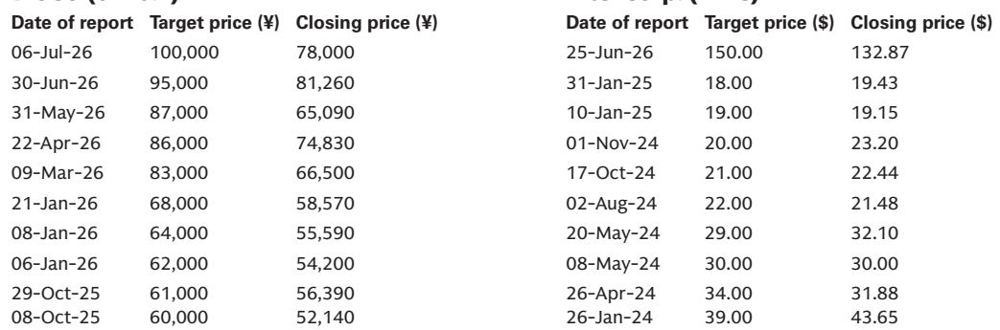
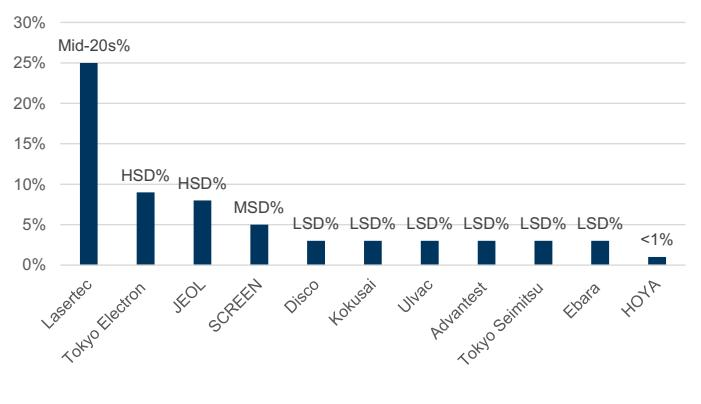
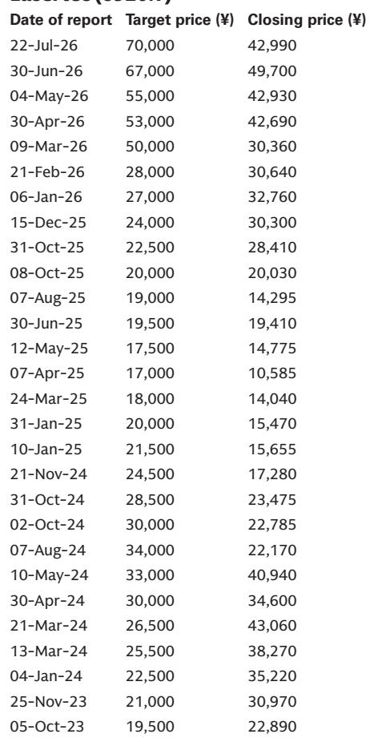

# Intel 200亿美元资本支出信号改写日本半导体设备行业的需求格局

Intel 2026年7月业绩说明会为半导体资本设备行业带来了一个清晰的转折点。公司将其全年资本支出指引上调约30亿美元，总支出超过200亿美元，并披露仅设备投资一项就将在2026年同比增长40%——这比此前指引的晶圆厂设备支出增长25%显著加快。这不是一个季度性的超预期。这是一个结构性信号：全球最大整合器件制造商的先进制程量产已从规划进入执行阶段，对日本半导体设备制造商产生直接且可衡量的影响。

对于关注日本半导体设备板块的观察者而言，其含义简单但有力：Intel的支出轨迹创造了一个集中的需求池，惠及少数对该客户销售敞口较高的供应商。本报告将Lasertec和东京电子列为前端环节的主要受益者，将Disco列为先进封装环节的关键受益者。这三家公司有一个共同特点——每家都在Intel的工艺技术路线图中占据战略上不可替代的位置，且每家公司现在面临的需求曲线都比行业平均水平更陡峭。

这里的论点并非Intel的资本支出能带动所有公司。而是Intel的支出结构——严重偏向设备而非建筑，集中在工具资格认证壁垒最高的先进制程——为那些已经通过Intel严格认证流程的供应商创造了“赢家通吃”的格局。40%的设备资本支出增长数字是锚点。本分析的一切都源于识别哪些日本公司最有能力捕获这一增量，以及市场可能仍低估了这一周期的持续时间。

## Intel以设备为中心的资本支出转变改变了日本半导体设备供应商的风险回报计算

Intel更新指引中最重要的细节不是相对金额，而是支出构成。Intel明确表示，过去几年的建筑投资已确保了足够的洁净室空间，这意味着新增的30亿美元以及更广泛的200亿+美元计划绝大多数流向设备采购。这是一个关键区别。在典型的半导体资本支出周期中，相当一部分支出用于建设、洁净室和基础设施——这些支出惠及当地建筑公司和工业气体供应商，但对设备制造商的传导有限。Intel当前阶段不同。该公司已经提前承担了基础设施成本。剩下的就是设备安装阶段，而这个阶段现在比先前预期的规模大了40%。

对于日本半导体设备公司而言，这意味着仅来自Intel的可服务市场就扩大了超过行业整体增长率的幅度。本报告关于销售敞口的数据强化了这一点。在所覆盖的日本半导体设备公司中，Lasertec和东京电子对Intel的收入依赖比例最高，两者均被列为研究报告关注方向。其机制直接明了：当Intel在单一年度内将设备支出提高40%时，那些在Intel设备采购份额中占比最大的供应商将获得不成比例的好处，因为新进入者的认证周期太长，无法在一个规划期内实现有意义的市场份额变化。

战略含义在于，观察者不应将Intel的资本支出上调视为一次性事件。Intel指出，2027年资本支出将同比显著增长，这得益于18A及先进工艺的良率和当前客户咨询量。这一前瞻指引虽非定量，但表明设备支出周期具有多年持续性。拥有Intel敞口的日本半导体设备供应商不仅获得2026年的增长，而且正进入一个至少延伸到2027年的持续高订单流时期。

## Lasertec和东京电子在Intel先进制程设备架构中占据最稳固位置

本报告将Lasertec和东京电子确定为受Intel支出加速影响最大的两个前端受益者。这不是一个笼统的行业观点。这是关于工具关键性和认证壁垒的具体判断。Lasertec在先进制程检测和计量领域的地位尤其稳固，因为18A和14A几何尺寸下的缺陷检测需要精度，而竞争对手难以匹敌。Intel决定启动18A-P的风险量产并计划在2027年下半年进行14A风险量产，意味着多个节点的检测需求同时叠加。每个新节点并非取代前一个，而是增加了一条并行的检测需求流。

东京电子的敞口更广泛，涵盖与晶圆启动量规模相关的沉积、刻蚀和清洗步骤。40%的设备资本支出增加意味着晶圆启动产能扩充幅度大于此前模型假设，而东京电子的产品组合覆盖了工艺流程的广阔范围。本报告对这两家公司列为研究报告关注方向，反映了其收入轨迹现在更加清晰可见，且对Intel执行风险的依赖降低——因为Intel已经承诺了资本。

关键分析点在于，这两家公司不仅受益于Intel的产量，更受益于Intel的技术方向。随着Intel向14A推进，工艺复杂性增加，这推动了每片晶圆的工具强度提高。更多步骤、更严格的公差、额外的检测层，都转化为每单位产能更高的设备支出。Lasertec和东京电子受益于这种复杂性溢价，而不仅仅是产能增加。这一区别很重要，因为这意味着它们的收入增长可以超过Intel自身的晶圆启动增长率。

## Disco的先进封装敞口创造了常被忽视的第二条需求向量

本报告将Disco列为Intel EMIB-T产能扩张的受益者，凸显了前端分析可能忽略的资本支出故事的一个维度。Intel的投资不仅限于逻辑晶圆制造。该公司也在扩大先进封装产能，EMIB-T（嵌入式多芯片互连桥）是高性能计算和AI加速器中集成小芯片的关键技术。Disco的精密切割和研磨工具对于先进封装流程中的基板制备和芯片分离步骤至关重要。

这是一个与前端设备周期结构上不同的需求驱动因素。先进封装需要不同的工具设备，而Disco在切割领域的竞争地位已得到公认。本报告对Disco列为研究报告关注方向，反映了EMIB-T产能扩张增加了一条与前端的支出轨迹部分独立的第二增长向量。即使Intel的逻辑晶圆产出面临暂时良率挑战，只要内部和外部来源的芯片供应可用，封装线仍可启动。

对观察者的战略启示是，Disco在Intel资本支出主题中提供了多元化。它不是前端工艺节点过渡的纯敞口。其对先进封装的敞口意味着受益于异构集成这一更广泛的趋势，该趋势在行业范围内加速推进，无论哪个具体逻辑节点赢得最多市场份额。Intel明确承诺扩大EMIB-T生产验证了这一趋势，并为Disco提供了具体的短期收入催化剂，该催化剂独立于40%的设备资本支出增长。

## 通过Intel资本支出周期定位日本半导体设备股票的决策框架

Intel的资本支出信号提供了一个清晰但有时效性的机会。以下框架帮助观察者基于三个标准评估哪些日本半导体设备公司提供最佳风险回报：敞口集中度、工具关键性和周期持续时间。

第一，优先考虑对Intel销售敞口高的公司。本报告数据显示，在所覆盖的公司中，Lasertec和东京电子的比例敞口最高。这并非巧合。它反映了Intel的工艺技术路线图需要它们特定的工具能力。观察者应优先选择Intel代表其重要收入份额的公司，因为40%的设备资本支出增长直接转化为这些公司的收入加速。

第二，评估工具关键性。并非所有设备支出都平等。经过资格认证且几乎没有替代品的工具——例如Lasertec用于极紫外光刻缺陷检测的检测系统——具有定价权和产量可见性。面临更大竞争压力的工具可能即使产量上升也会面临利润率压缩。本报告对Lasertec和东京电子的研究报告关注方向隐含了高工具关键性。观察者应对任何考虑纳入组合的公司应用这一视角。

第三，评估周期持续时间。Intel对2027年资本支出显著增长的方向性指引表明，设备支出浪潮至少有两年的视野。这比产品爬坡后典型的一年资本支出激增更长。其含义是，观察者应愿意为具有更长期收入可见性的公司支付溢价。这一溢价只有在收入可见性超过单一财年时才合理。Intel的评论支持这一延伸。

该框架的风险在于Intel自身的执行。报告指出，2027年资本支出展望是定性的，取决于18A及先进工艺的良率。如果Intel面临意外良率挑战，设备支出轨迹可能持平或右移。这一风险是真实的，但部分被以下事实所缓解：Intel已承诺2026年200亿+美元，其中设备部分已锁定。下行情景并非订单取消，而是2027年增量的延迟。对于视野12-18个月的观察者而言，2026年的支出足以支持当前的估值逻辑。

*仅供参考。部分内容可能基于源材料通过AI辅助生成、翻译、摘要或编辑，可能存在遗漏或错误。请独立核实。这不构成专业建议。*

仅供参考。部分内容可能基于源材料通过AI辅助生成、翻译、摘要或编辑，可能存在遗漏或错误。请独立核实。这不构成专业建议。

