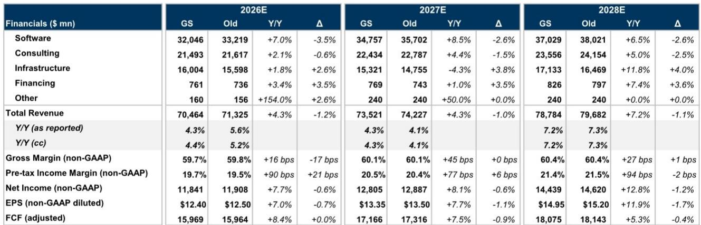
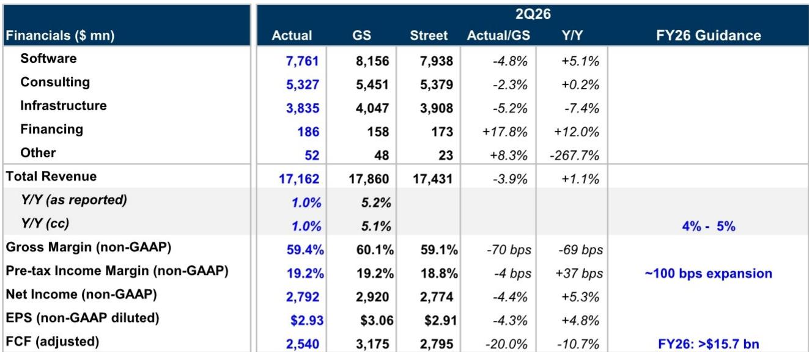
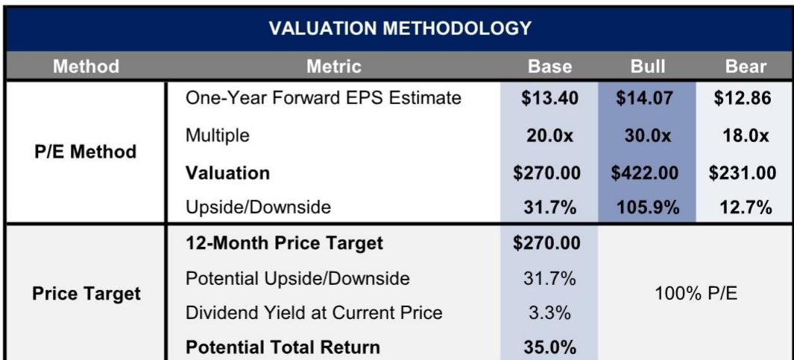

# IBM的预期调整反映业务结构变化：收入组合向硬件倾斜

IBM在2026年初期曾围绕转型展开布局。经过十年重组、收购Red Hat以及向混合云和AI的转型，市场期待公司能以软件为主导实现可持续增长。但第二季度的业绩引发了新的审视：收入为172亿美元，低于市场预期的3.9%，也低于公司自身内部预估的4.8%。软件类收入增长5%，不到市场此前模型预测11%的一半。公司下调了2026年全年固定汇率收入增长预期，从高于5%降至4%-5%。在7月14日发布预警后，公司报价已下跌29%。此次预期调整虽然幅度没有部分担忧那么剧烈，但并未解决一个核心矛盾：IBM来自硬件业务的实际收入高于计划，而来自软件的收入低于计划，这种组合变化影响了其收入流的可预期性。

通常对本季度的解读是，大型主机周期的时间节点导致了业绩偏差。这个说法有一定道理，但并不全面。z17大型主机延期交付导致IBM Z业务收入同比减少42%，并拖累Transaction Processing软件业务下降9%。但更深层的问题在于，内存和组件价格上升，使客户重新调整近期优先级，优先考虑服务器和硬件采购，从而减少了软件和咨询类投入。这并非一个季度的短期问题，而是反映了这样一种需求环境：IBM的硬件业务受益，但同时软件业务承受压力，公司收入结构中的重复性、高利润、可预测部分在减少。市场对公司报价的估值倍数从25倍压缩至20倍，正是市场认为较低的可视性和较低的收入质量应匹配较低市场定价的体现。

本文认为，IBM近期估值修复的关键不在于大型主机周期是否反转，而在于管理层能否重新建立对软件收入增长轨迹的信心。在此实现之前，无论成本控制或自由现金流表现如何，公司报价可能仍会在一定区间内整理。分析分为五个部分：一、为何收入组合变化比预期调整本身更重要；二、咨询业务表现如何暴露了另一方面的压力；三、具体哪些软件细分领域增长在放缓；四、评估IBM恢复路径的决策框架；五、修正后的市场定价如何反映市场对执行风险的理解。

## 收入从软件转向硬件，降低收入质量，支撑较低的市场定价

本季度最重要的数据点并非收入偏差本身，而是预期调整的具体构成。2026年，IBM将软件收入增长预期从约10%（固定汇率）下调至6%-8%，同时将基础设施收入预期从此前的低个位数下降调整为低个位数增长。净效果是，2026年收入中更大比例将来自硬件，更小比例来自软件。这之所以重要，是因为软件业务的毛利率约在80%以上，而基础设施毛利率在40%-50%之间。在其他条件不变的情况下，收入组合从软件向硬件每转移100个基点，整体毛利率将大致下降15-20个基点。

市场对公司的估值倍数从25倍降至20倍，研究报告明确提到“较低的可视性和较低的同行估值倍数”是原因。但背后的驱动因素是，IBM的收入结构已变得更像硬件而非软件——硬件收入具有周期性、波动性且依赖产品周期，而软件收入则具有重复性、高利润和可预测性。当收入组合向硬件倾斜时，合适的估值倍数自然收缩。

公司2026年自由现金流指引为157亿美元，这提供了一个底部支撑，但并非催化剂。自由现金流更多依赖效率提升和营运资本管理，而非有机收入加速。2026年上半年经调整自由现金流为48亿美元，与2025年上半年的48.1亿美元基本持平。全年目标意味着下半年需要较强劲的现金流表现，这依赖于收入如预期实现。如果软件增长进一步不如预期，现金流也会受影响。估值倍数从25倍压缩至20倍已包含了这一风险。

## 咨询业务增长持平，签单比显示恢复轨迹温和

咨询业务收入53.3亿美元，固定汇率下同比持平，比市场预期低2.3%，也低于市场此前预测的2.0%增长。管理层仍预计全年低到中个位数的增长，但第二季度结果让这一指引显得乐观。咨询业务的签单比（过去12个月滚动）为1.05倍，仅略高于替代水平。1.05倍的签单比意味着每确认1美元收入，公司新签单仅1.05美元，为加速增长留下的空间极小。

咨询业务的疲弱并非IBM独有。研究报告提到，“在宏观环境挑战及同行表现温和的背景下，公司本季度的咨询业绩略有走弱”。但IBM咨询业务具有结构性特点，使其在缓慢增长的环境中尤为脆弱。大约一半的IBM咨询收入来自应用运营和业务流程外包，这些业务具有一定弹性——当客户收紧预算时，这些是最先被削减或推迟的领域。另一半来自战略与技术咨询，这一领域面临专业公司的竞争，后者在细分领域拥有更深的专业知识。

对更广泛的IT服务领域而言，IBM的咨询业绩表明，企业客户对大型多年转型项目仍持谨慎态度。这与硬件业务中观察到的需求优先级调整一致：客户购买服务器和存储以满足即时的容量需求，但推迟需要较长回报周期的咨询项目。除非宏观环境改善，或IBM能够持续展示良好的项目赢得势头，否则咨询业务将继续拖累整体收入增长。

## 软件增速放缓集中在Transaction Processing和数据领域，Red Hat表现正常

软件收入77.6亿美元，固定汇率下同比增长4.6%，其中包括来自HashiCorp和Confluent的约400-500个基点的并购贡献。因此有机软件增长大致持平或略为负增长。放缓并非在业务组合中均匀分布。包括Red Hat在内的混合云业务固定汇率下增长11%。包括HashiCorp在内的自动化业务增长3%。由Confluent驱动的数据业务增长18%。这些板块表现尚可。

问题主要集中在Transaction Processing业务，固定汇率下同比下降9%。Transaction Processing是IBM大型主机的传统软件业务，其业绩与大型主机硬件周期直接挂钩。当客户推迟z17大型主机采购时，也会推迟相关的软件许可和维护合同。IBM Z硬件收入下降42%，带动Transaction Processing一同下降。管理层目前预计Transaction Processing全年将下降低到中个位数，而此前预期为持平或小幅下降。

数据软件业务虽然增长18%，但也引起不同的关注。Confluent对增长贡献显著，但Confluent是近期收购的。排除并购贡献后，数据软件业务的有机增长率明显更低。市场参与者需要区分并购驱动与有机动力。HashiCorp和Confluent在当季为总软件增长贡献了400-500个基点。没有这些交易，软件增长大致持平。软件收入增长预期从高于10%下调至6%-8%，反映了有机软件增长尚未形成自持力的现实。

Red Hat仍是亮点。混合云业务双位数增长确认了Red Hat的OpenShift平台在企业混合云市场持续获得关注。但仅靠Red Hat无法支撑整个软件板块——它约占软件总收入的25%。其余75%包括Transaction Processing、自动化、数据和安全，各有不同的增长轨迹和竞争格局。要让市场对软件增长轨迹重拾信心，管理层必须证明Red Hat以外的有机增长率正在改善而非恶化。

## 评估IBM恢复路径的决策框架

对于在预期调整后关注IBM报价的市场参与者而言，关键问题并非公司能否实现修订后的2026年数字，而是是否存在条件让业务组合重新向软件倾斜，并推动估值倍数扩张。一个结构化的决策框架有助于评估。

第一个条件是大型主机周期正常化。z17延期在硬件和Transaction Processing收入中造成了暂时的空档。问题是延期代表一个季度的推迟，还是大型主机需求的结构性下降。研究报告假设是前者，指出管理层的评论显示部分原本应于第二季度完成的订单已转向后续季度。如果大型主机订单在下半年恢复，Transaction Processing应趋于稳定，软件增长也应改善。这是修订后指引中包含的基本情景。

第二个条件是咨询业务收入加速。1.05倍的签单比需要提升至至少1.10倍才能支撑中个位数增长。这要么需要宏观环境改善从而放松企业预算，要么需要IBM提高竞争胜率以获取市场份额。研究报告提到“咨询业务市场份额的长期提升”是一个观察角度，但第二季度结果尚未显示这一动态。市场参与者应跟踪签单比作为领先指标。

第三个条件是有机软件增长（排除并购贡献）。由于HashiCorp和Confluent的贡献已编入数字，未来的加速必须来自基础业务。Red Hat进展顺利，自动化和数据需要维持或改善增长率，Transaction Processing需要停止下降。如果有机会件增长可达4%-5%（不含并购），那么包含收购在内的软件总增长可达8%-10%，这将支持指引，并可能使估值倍数趋于稳定。

第四个条件是自由现金流转化。IBM指引2026年自由现金流为157亿美元，意味着经调整净利润的转化率约为87%。如果收入达到修订后指引且营运资本未恶化，这一目标可以达成。但如果收入不如预期，自由现金流下降速度会更快，因为硬件收入利润率更低且需要更多营运资本投入。自由现金流是股息和债务削减的最终保障。任何现金流生成偏弱的迹象都可能导致报价面临额外压力。

如果上述四个条件在2026年下半年及2027年得到改善，公司报价可能重新向25倍估值方向回归；如果未能实现，则可能继续在区间内整理或进一步走弱。当前20倍估值提供了一定的安全垫，但并不能保证上行空间。

## 修正后的市场定价包含了执行风险，唯有持续兑现才能化解

研究报告给出的目标估值约为每股13.40美元，较当前报价205.77美元隐含约32%的上行空间，加上3.3%的股息率，潜在总回报约35%。表面上看，风险回报具有一定吸引力。但估值倍数从25倍压缩至20倍反映了市场的判断：IBM的执行可靠性有所下降。只有当管理层连续多个季度交出稳定表现、证明业务组合正在向软件回归时，公司报价的估值才可能重新提升。

研究报告依然维持观察观点，理由是软件业务长期改善和咨询业务市场份额提升。但报告也承认，2026年较低质量的业务组合以及近期销售执行偏弱，可能继续压制公司的估值倍数。这种张力正是关注该公司的核心难点。IBM是一只带有增长叙事但增长叙事已被推迟的价值型标的。公司拥有资产负债表、现金流和业务组合来执行其战略，缺失的是通过持续兑现建立的可信度。

对于专业读者而言，结论是清晰的。IBM的预期调整并非危机，而是一个信号：公司实际来自硬件的收入高于计划、来自软件的收入低于计划，这种组合变化降低了其收入质量。公司报价将继续在一定区间内整理，直到管理层展示出软件增长能够有机加速、咨询业务恢复中个位数增长。修正后的市场定价已包含了执行风险。唯有执行才能降低这一风险。

*仅供参考。部分内容可能基于原始材料通过AI辅助生成、翻译、总结或编辑，可能包含遗漏或错误。请独立核实。本文不构成投资、法律、税务、会计或其他专业建议。*
