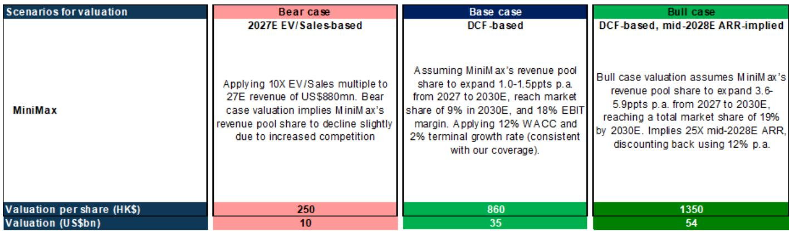
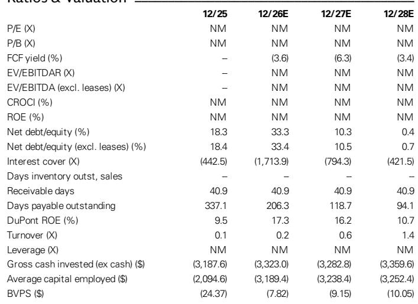
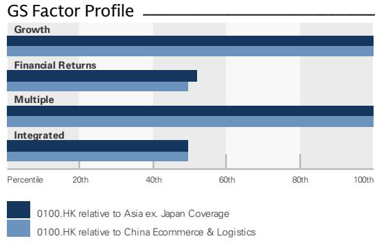

# MiniMax 的成本优势是其护城河，而非模型本身——这改变了研究逻辑

MiniMax 战略中最关键的数字并非某个模型的基准得分、年化经常性收入（ARR）数字，甚至不是其当前约 80 亿美元的市场定价。而是 2025 年 9 月——MiniMax 开始积极以低价获取长期算力容量的时间点，到 2026 年中期，这个价格对任何竞争对手来说都已难以复制。这一决策发生在 GPU 租赁市场相对低位、AI 基础设施仍在建设的时期，锁定了结构性成本优势。该优势将在未来数年中的每一次推理调用、每一次训练运行和每一笔 API 交易中持续显现。在这个基础模型行业中，价格与性能的比值正在快速取代单纯的基准领先，成为商业应用的主要驱动力。MiniMax 构建了一个对于只关注模型架构论文的人来说看不见的护城河。

市场尚未完全消化这一变化。价格差异反映了估值上的分歧，这种分歧既极端，又根据公司自身披露的数据和管理层评论，越来越显得依据不足。MiniMax 的市场定价约为 80 亿美元，而国内视频生成领域的同行 Kling 投后估值约 180 亿美元，智谱的估值则达到 710 亿美元。这一差距并非来自收入——MiniMax 在 2026 年 6 月初 M3 发布前的年化经常性收入已超过 4 亿美元，该速度大约为智谱 2026 年中期水平的一半。这个差距背后，是市场尚未认识到 MiniMax 的基础设施策略、多模态路线图和定价纪律正在如何汇聚，形成一种与其同行根本不同的商业模式。

这个论点并非说 MiniMax 会构建最好的模型，而是说 MiniMax 会构建规模上最具经济效率的模型。这种效率将驱动采用、收入，并最终推动利润率扩张，而纯粹的模型性能无法持续支撑这一点。

## MiniMax 在算力基础设施上的先发优势创造了结构性成本护城河，同行难以复制

从 2025 年 9 月开始加强自运营算力基础设施的决策，并非一项常规的资本配置选择。这是一项关于 GPU 定价方向的结构性押注，其回报现在已经嵌入 MiniMax 的成本结构中。那时，GPU 和 AI 服务器的长期租赁价格显著低于当前水平。MiniMax 在国内外获取并长期租赁了算力，锁定了有吸引力的硬件成本，而当前进入市场的竞争对手无法匹配这一成本。该公司能够在同一集群上运行训练和推理工作负载（得益于多年自运营 AI 基础设施的经验），进一步提升了利用率和成本效率。

这不是一个暂时的套利机会。这是一个结构性优势，随着算力需求的增长，优势将扩大。MiniMax 处理的每一个增量推理 token 都承载着比竞争对手今天试图复制该能力时更低的边际成本。公司管理层明确将此基础设施构建列为成本竞争力的关键驱动因素之一，同时还有高利用率和运营效率。对于观察者来说，其含义明确：MiniMax 的毛利率走向并不仅仅依赖于模型架构的改进，它还受到一项在特定时间点做出且无法复制的资本决策的支撑。

数字印证了这一点。MiniMax 的收入预计将从 2025 年的 7900 万美元增长至 2026 年的 3 亿美元、2027 年的 8.8 亿美元和 2028 年的 24.7 亿美元。毛利率方面，2025 年约为 25%，预计 2026 年改善至 26%，2027 年因公司投资于规模扩张而小幅下降至 24%，然后在 2028 年跃升至 34%。息税折旧摊销前利润率（EBITDA margin）在 2025 年为深度负值（-372.8%），预计到 2028 年改善至 -16.1%。这个转折点并非假设，而是被设计进了成本基础之中。

## M3 模型家族体现的是刻意分层的策略，而非错失的发布窗口

当 MiniMax 的 M2 模型系列在 2026 年早期在上市速度和性价比上超越同行时，公司面临一个策略选择：匆忙推出一款单一的 M3 模型以保持势头，还是开发一个双模型家族——M3 和 M3 Pro——以服务不同的市场细分。它选择了后者。市场将由此导致的 M3 Pro 发布延迟解读为竞争落后，但这种解读是错误的。

M3 目前在开放平台和 API 业务上每天处理数万亿的 token，拥有健康的毛利率，已经在产生收入并证明 MiniMax 方法的经济可行性。M3 Pro 目标参数规模在 3 万亿级别，预计发布窗口为 2026 年 9 月至 10 月，旨在与同类模型相比实现显著的成本效率。公司的专有技术——MiniMax 稀疏注意力、激活参数和 KV 缓存优化——并非渐进式改进，而是直接降低每个 token 计算成本的架构选择。

延迟并非弱势信号，而是纪律性的体现。MiniMax 选择优化大规模下的单位经济性，而非追求单一旗舰产品的发布速度。在用户切换模型速度快、受定价和成本效率影响不亚于基准分数的市场中，能够在多个模型层级提供最佳性价比的公司将赢得体量之战。M3 Pro 不会是其类别中较强大的模型，但其设计目标是成为最具成本效率的模型——这是一个更持久的竞争位置。

## 多模态能力并非功能附加，而是定义平台的架构

H3 模型被管理层描述为不仅仅是一个视频生成模型，它代表了一项根本性的架构转变。它是一个 Omni 模型，能够理解所有模态——文本、图像、视频、音频和音乐——并根据用户提示生成稳定的视频、图像和音频输出。这不是一组缝合在一起的独立模型，而是一个统一架构，将多模态理解视为核心能力而非扩展。

这对竞争格局的影响是显著的。现有同行的视频生成产品是独立的产品。MiniMax 的 H3 模型（截至 2026 年中期正处于发布准备的最后阶段）将提供一个原生集成该公司文本和编码能力的替代方案。这种集成创造了平台效应：使用 MiniMax 进行文本生成的用户可以无缝过渡到视频生成，无需更换供应商，并且统一架构意味着一个模态的改进会惠及其他模态。

对于观察者来说，H3 的发布不仅仅是一个产品事件，而是一个平台事件。它将 MiniMax 从一家提供多种 AI 能力的公司，转变为一家提供单一多模态智能层的公司。当市场认识到多模态集成（而非参数数量）是下一代 AI 平台的定义特征时，MiniMax 与其同行之间的定价差距将会弥合。

## 评估 MiniMax 价值修复路径的决策框架

当前 MiniMax 与其同行之间的定价分歧，可以从三个维度来理解：基础设施成本优势、收入增长轨迹和多模态平台潜力。每个维度都表明，市场相对于 MiniMax 的内在价值正在给予折扣，但价值修复的时机取决于市场首先认可哪个催化剂。

基础设施成本优势是最可量化但也最不被重视的。MiniMax 锁定的计算成本创造了结构性的毛利率优势，这将在 2027-2028 年的财务报表中显现。观察者应关注该公司的推理成本占收入的百分比。2025 年，推理成本为 5500 万美元，收入为 7900 万美元，约占收入的 70%。到 2028 年，预测推理成本为 12.6 亿美元，收入为 24.7 亿美元，约占收入的 51%。这 19 个百分点的改善并非来自定价能力，而是来自成本结构，并且已经嵌入财务计划之中。

收入增长轨迹是第二个维度。MiniMax 的收入预计将从 2025 年到 2028 年实现约 215% 的复合年增长率。构成很重要：AI 原生产品预计从 5300 万美元增长至 16.2 亿美元，而开放 API 和企业服务从 2600 万美元增长至 8.48 亿美元。API 业务直接受惠于推理成本优势，将从基础设施护城河中获益更多。观察者应监测 API 收入占总收入的比例，作为 MiniMax 如何有效将其成本优势转化为市场份额的信号。

多模态平台潜力是第三个维度，也是最难以量化的，但同时也是最具变革性的。H3 的发布将提供第一个测试，检验 MiniMax 能否将其架构愿景转化为商业应用。如果 H3 在现有视频生成产品中获得发展动力，平台叙事将成为价值修复的主要驱动力。如果没有，该公司在文本和编码领域仍有坚实基础，但上行空间将更为有限。

## 市场并未低估的风险不是模型表现，而是现金消耗

对 MiniMax 论点最重要的风险，并非其模型在基准测试中的表现，而是为扩展计算基础设施和弥补 2028 年之前的负 EBITDA 所需的现金消耗，可能超过公司自我融资或进入资本市场的能力。财务报表显示，2025 年自由现金流为负 2.828 亿美元，预计 2027 年恶化至负 5.128 亿美元，然后在 2028 年改善至负 2.829 亿美元。净债务预计从 2025 年的负 4.86 亿美元转变为 2026 年的负 8.19 亿美元，然后在 2028 年降至负 2200 万美元，因为公司消耗现金储备以支持运营。

该公司从 2026 年 8 月起有资格参与港股通，这可能提供流动性催化剂。但根本问题在于，MiniMax 能否在现金储备耗尽之前实现 EBITDA 盈亏平衡。预测显示，EBITDA 从 2026 年的负 4.525 亿美元改善至 2028 年的负 3.967 亿美元，仍为负值但正在收窄。盈利之路取决于收入增速快于运营费用，特别是研发成本，后者预计从 2025 年的 2.528 亿美元增长至 2028 年的 7.918 亿美元。

这是研究案例核心的张力：MiniMax 的成本优势是真实的，但需要前期投资才能实现。该公司押注其锁定的计算成本和多模态平台将产生足够的收入增长来超越现金消耗。市场则押注消耗率将迫使稀释或战略性出售。这个张力的解决将决定潜在价值能否实现，还是股票将保持低估直到财务数据赶上策略。

*本文仅供参考。部分内容可能基于源材料通过 AI 辅助生成、翻译、总结或编辑，可能存在遗漏或错误。请独立核实。本文不构成任何专业建议。*

本文仅供参考。部分内容可能基于源材料通过 AI 辅助生成、翻译、总结或编辑，可能存在遗漏或错误。请独立核实。本文不构成任何专业建议。

