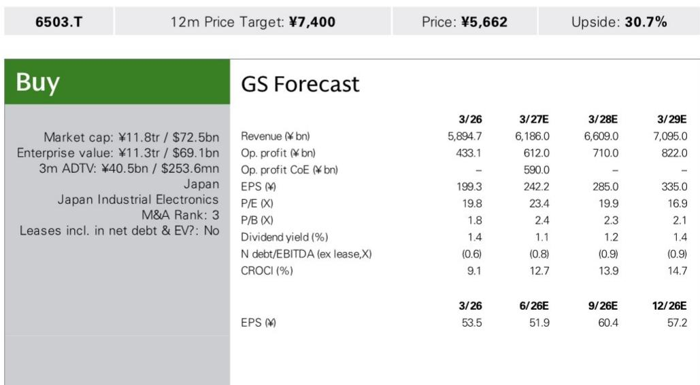
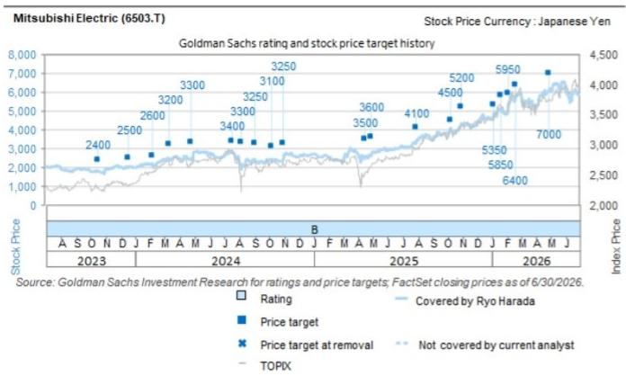

# 研究观察：三菱电机与索尼成立AI视觉传感器合资公司-2026年10月运营

2026年7月22日，三菱电机宣布与索尼半导体解决方案签署战略合作协议，将共同成立一家名为Advanced Vision Solutions的合资公司，专注于为制造业提供AI视觉传感器解决方案。某研究机构分析师Ryo Harada和Hiroki Muramatsu在当日发布的报告中指出，这一动作填补了三菱电机FA（工厂自动化）业务数字化战略中长期缺失的一环——传感器域。

三菱电机此前已通过收购Nozomi Networks获得了工厂全域数据的获取能力，而此次与索尼的合作，则是在数据采集的最前端——视觉感知层——补上了关键拼图。合资公司计划于2026年10月开始运营，三菱电机持股60%，索尼半导体持股40%，并将纳入三菱电机的合并报表。

## 1. 传感器是FA数字化战略的缺失环节

三菱电机近年来一直在推动FA业务的数字化，但其战略版图中始终缺少一个关键组件：能够实时、智能地采集生产线视觉数据的传感器层。研究认为，此次合资正是为了填补这一空白。

新公司将开发一种能够在图像传感器上直接进行AI视觉数据分析的技术。这意味着，制造商无需依赖外部计算资源，即可在传感器端实时感知生产线上的产品位置、状态、质量以及设备运行信息。这种“边缘AI+图像传感器”的组合，有望实现生产现场的无人工干预监控与自主运行。

> **观察评论：** 三菱电机此前在FA领域拥有PLC、伺服、机器人等核心硬件，但缺乏“眼睛”。索尼在CMOS图像传感器和边缘AI芯片上的积累，恰好补上了这一环。合资公司的技术路径——在传感器上直接做AI推理——是工业视觉领域的一个趋势，它降低了数据传输延迟和对云端算力的依赖。

## 2. 索尼选择三菱电机的逻辑：劳动力短缺驱动的智能工厂需求

索尼方面在公告中明确表示，选择与三菱电机合作，是基于对智能工厂市场前景的判断。在日本少子老龄化背景下，制造业劳动力短缺问题持续存在，这为图像传感器和边缘AI技术在工厂自动化场景中的大规模部署创造了需求。

索尼半导体在消费电子图像传感器领域占据全球领先地位，但工业场景的客户需求、系统集成能力和渠道，并非其传统优势。三菱电机在FA领域拥有数十年的客户基础和产线理解，恰好能够提供这些能力。合资公司的模式，本质上是将索尼的传感器芯片能力与三菱电机的工业自动化系统能力进行垂直整合。

## 3. 从数据采集到数据整合：三菱电机的客户价值扩展路径

研究报告中指出，三菱电机在2025年9月收购了Nozomi Networks，这是一家专注于工业网络安全和OT数据管理的公司。通过Nozomi，三菱电机可以获得工厂层面的全域数据流。而此次合资带来的视觉传感器数据，将与这些数据流形成互补。

将视觉数据、设备运行数据、网络安全数据整合在一起，三菱电机有望向制造企业提供比单一硬件销售更宽的价值包——从产线自动化到数据驱动的运营优化。研究认为，未来需要关注的是，合资公司能否推出具体的产品和解决方案，并将其转化为可量化的收入贡献。

## 4. 一个可复用的观察框架：工业自动化公司的“感知-决策-执行”闭环

三菱电机的这一系列动作，为观察工业自动化公司的战略演进提供了一个清晰的框架：一家传统的自动化硬件供应商，正在通过并购和合资构建“感知（传感器）-决策（数据平台）-执行（机器人与PLC）”的完整闭环。

在这个框架中，感知层是多数传统FA公司最薄弱的环节。它们擅长控制电机、驱动机械臂，但缺乏对产线状态的实时、精细化感知能力。三菱电机通过索尼补感知、通过Nozomi补数据管道，是在试图将自身从“卖设备”转向“卖产线智能”。这一路径是否成立，取决于合资公司能否在2026年运营启动后，拿出真正可部署的工业视觉解决方案，并说服客户为数据价值而非硬件规格付费。

---

For informational purposes only. Portions may be generated,translated,summarized,or edited with AI assistance based on source materials and may contain omissions or errors. Please verify independently. This is not investment,legal,tax,accounting,or other professional advice.

For informational purposes only. Portions may be generated,translated,summarized,or edited with AI assistance based on source materials and may contain omissions or errors. Please verify independently. This is not investment,legal,tax,accounting,or other professional advice.

