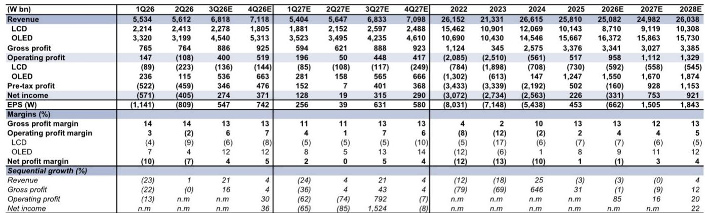
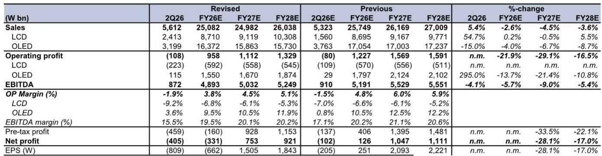

# GS：LG Display业务与季度数据观察

LG Display 在 2026 年第二季度公布了季度数据。这家韩国面板制造商报告期内实现营收 5.6 万亿韩元，营业亏损 1080 亿韩元，与彭博一致预期的 1100 亿韩元亏损基本吻合，但略逊于GS此前预测的 800 亿韩元亏损。报告中最值得关注的信号并非亏损本身，而是公司给出的平均售价指引——3 季度整体 ASP 环比增长预期仅为高十位数百分比，远低于GS此前预测的 30% 环比增幅。这意味着即便出货量在多个品类上有所提升，定价表现也出现了一定调整。

GS认为，这一 ASP 指引背后是存储芯片价格上涨带来的成本传导效应。当关键客户品牌面临更高的存储成本负担时，面板采购端的议价空间被压缩。报告将这一机制视为当前 OLED 业务最核心的定价不确定性来源。

## 1. 智能手机 OLED 出货量上调，但 ASP 指引弱于预期

GS将 2026 年智能手机 OLED 出货量预测从 8200 万片上调至 8600 万片，同比增长 13%。这一调整基于三个因素：iPhone 17 的稳定销售、公司对升级规格产品的量产能力改善，以及有利的竞争格局。然而，出货量的增长并未带来收入预期同步提升。3 季度 ASP 指引暗示智能手机和平板 OLED 价格同比下滑 5% 至 8%，GS将此归因于存储芯片涨价对客户成本结构的挤压。

> **KC评论：** 出货量上调与 ASP 下调同时发生，说明 LG Display 在量价两端面临结构性分化。量增价跌的组合意味着收入增长可能低于出货量增速，值得关注的是单位利润而非出货规模。

## 2. 大尺寸 OLED 受益于世界杯效应与电竞显示器需求

大尺寸 OLED 在 2 季度出货量显著好于预期。GS认为世界杯赛事效应和 OLED 电竞显示器的强劲需求是主要驱动力。公司管理层提到，高端电竞显示器领域正加速从 LCD 向 OLED 过渡，OLED 显示器在整体产品组合中的占比预计从去年的低十位数百分比提升至今年的 20%。GS据此将全年大尺寸 OLED 出货量预测上调至 750 万片，同比增长 17%，其中增长主要由电竞显示器贡献。

在利润端，广州 OLED 电视工厂折旧到期带来的成本改善正在显现。GS预计大尺寸 OLED 的营业利润率同比将有明显提升，并达到双位数百分比水平。

## 3. IT OLED 平板需求有所调整，全年出货量预期下调

平板 OLED 是报告中最受关注的业务线。2 季度需求持续处于调整状态，叠加今年没有新款 iPad Pro 机型发布，GS将全年 IT OLED 出货量预期从 400 万片下调至 320 万片，同比降幅达 26%。尽管产能利用率改善降低了固定成本，但出货量不足和定价不确定性仍将导致该业务全年处于营业亏损状态。

## 4. 盈利预测下修，3 季度与全年营业利润预期均调低

综合出货量上调与 ASP 下调的交叉影响，GS将 3 季度营业利润预期从 5640 亿韩元下调至 4000 亿韩元，2026 年全年营业利润预期从 1.2 万亿韩元下调至 9580 亿韩元。2026 年、2027 年、2028 年每股回报表现预测分别从 251 韩元、2093 韩元、2221 韩元调整为 -662 韩元、1505 韩元、1843 韩元。

报告同时指出，IT LCD 面板价格波动和电视 OLED 出货量变化是影响公司表现的关键变量。

For informational purposes only. Portions may be generated,translated,summarized,or edited with AI assistance based on source materials and may contain omissions or errors. Please verify independently. This is not investment,legal,tax,accounting,or other professional advice.

For informational purposes only. Portions may be generated,translated,summarized,or edited with AI assistance based on source materials and may contain omissions or errors. Please verify independently. This is not investment,legal,tax,accounting,or other professional advice.

