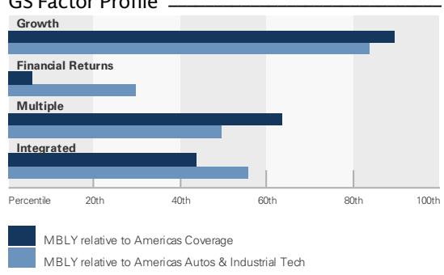
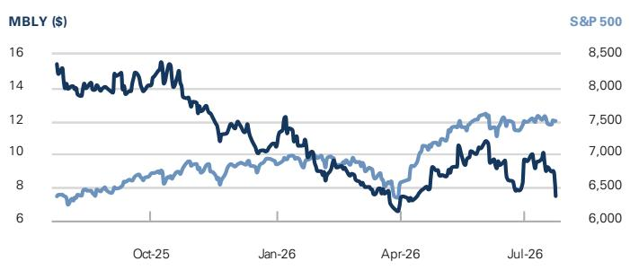
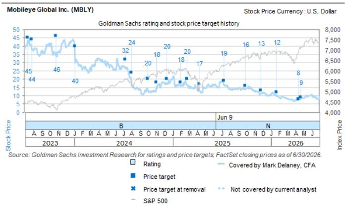

### Mobileye Global Inc. (MBLY)：机器人出租车与机器人技术执行进展，新政府研发激励推动预期上调——2Q26 回顾

**MBLY**

12个月目标估值区间：\$9.00

当前报价：\$7.47

差价幅度：20.5%

**核心要点与影响**

Mobileye 公布的第二季度业绩（不包括一项新的以色列政府研发激励，该激励在本季度贡献了 9300 万美元）超出了市场普遍预期。公司同时上调了 2026 年全年营收和调整后 EBIT 的业绩展望（但剔除研发激励后的 EBIT 展望中点值略有降低）。该研发激励收益没有设定到期日。具体来看，第二季度营收、EBIT 及非 GAAP 每股收益分别为 5.08 亿美元、1.55 亿美元和 0.19 美元，高于 FactSet 共识预期的 4.81 亿美元、4300 万美元和 0.06 美元，也高于GS预期的 4.81 亿美元、4300 万美元和 0.05 美元。剔除研发激励后，隐含的下半年营收和核心 EBIT 展望分别为 9.29 亿美元和 4800 万美元，低于市场普遍预期的 9.46 亿美元和 7700 万美元。

公司还宣布，其首席执行官兼创始人 Amnon Shashua 教授已通知董事会，他有意在继任者被任命后辞去 CEO 职务。

我们维持对该公司的中性评级。积极方面，Mobileye 的项目获奖表明其“视觉主导”的 ADAS（高级驾驶辅助系统）业务将有所改善，继最近为大众和通用汽车赢得“环绕式 ADAS”项目后，又与 Stellantis 达成了“云增强型 ADAS”项目。我们预计这将支持 ASP（平均售价）的提升，尤其是从 2028 年开始。此外，Mobileye 在“视觉脱离”的消费级车辆、自动驾驶汽车以及人形机器人领域也存在机遇，这些在中长期内可能具有重要意义。然而，我们认为 Mobileye 的执行风险有所增加，因为它现在计划直接进入机器人出租车业务（这将使其与大众汽车展开竞争，尽管 Mobileye 也表示大众可以从这一努力中获得的额外资源中受益）。此外，Mobileye 先进 ADAS 产品（如 SuperVision、Chauffeur）的项目获取活动仍然有限。我们认为，公司在自动驾驶和机器人领域把握机遇的能力，以及在自动驾驶/ADAS 方面的项目进展，将是其未来市场表现的关键。

## 中性

Mark Delaney, CFA
+1(212)357-0535 | mark.delaney@gs.com
GS & Co. LLC

Will Bryant
+1(212)934-4705 | will.bryant@gs.com
GS & Co. LLC

Aman Gupta
+1(212)357-1549 | aman.s.gupta@gs.com
GS & Co. LLC

## 关键数据

GS预测

<table><tr><td colspan="5">GS预测</td></tr><tr><td></td><td>12/25</td><td>12/26E</td><td>12/27E</td><td>12/28E</td></tr><tr><td>营收（百万美元）新预测</td><td>1,894.0</td><td>1,993.1</td><td>2,131.4</td><td>2,328.7</td></tr><tr><td>营收（百万美元）原预测</td><td>1,894.0</td><td>1,985.4</td><td>2,113.5</td><td>2,335.7</td></tr><tr><td>EBITDA（百万美元）</td><td>77.0</td><td>121.7</td><td>135.4</td><td>203.9</td></tr><tr><td>EBIT（百万美元）</td><td>3.0</td><td>39.7</td><td>47.4</td><td>97.9</td></tr><tr><td>每股收益（美元）新预测</td><td>0.01</td><td>0.05</td><td>0.05</td><td>0.10</td></tr><tr><td>每股收益（美元）原预测</td><td>0.01</td><td>(0.20)</td><td>(0.20)</td><td>(0.10)</td></tr><tr><td>P/E (X)</td><td>NM</td><td>158.2</td><td>165.0</td><td>72.3</td></tr><tr><td>股息率 (%)</td><td>0.0</td><td>990.6</td><td>1,338.7</td><td>1,338.7</td></tr><tr><td>净债务/EBITDA (X)</td><td>(23.8)</td><td>(11.0)</td><td>(10.8)</td><td>(9.3)</td></tr><tr><td></td><td>6/26</td><td>9/26E</td><td>12/26E</td><td>3/27E</td></tr><tr><td>每股收益（美元）</td><td>0.08</td><td>(0.01)</td><td>(0.03)</td><td>(0.00)</td></tr></table>

GS因子概况

  
来源：公司数据，GS预测。详见披露说明。

## Mobileye Global Inc. (MBLY)

自2025年6月9日起的评级

比率与估值

<table><tr><td></td><td>12/25</td><td>12/26E</td><td>12/27E</td><td>12/28E</td></tr><tr><td>P/E (X)</td><td>NM</td><td>158.2</td><td>165.0</td><td>72.3</td></tr><tr><td>EV/EBITDA (X)</td><td>131.5</td><td>39.3</td><td>34.7</td><td>21.1</td></tr><tr><td>EV/营收 (X)</td><td>5.3</td><td>2.4</td><td>2.2</td><td>1.8</td></tr><tr><td>FCF回报表现 (%)</td><td>4.4</td><td>3.8</td><td>3.7</td><td>8.6</td></tr><tr><td>EV/DACF (X)</td><td>26.8</td><td>11.2</td><td>12.6</td><td>5.6</td></tr><tr><td>CROCI (%)</td><td>2.8</td><td>3.6</td><td>3.5</td><td>7.0</td></tr><tr><td>ROE (%)</td><td>0.1</td><td>0.4</td><td>0.5</td><td>1.1</td></tr><tr><td>净债务/EBITDA (X)</td><td>(23.8)</td><td>(11.0)</td><td>(10.8)</td><td>(9.3)</td></tr><tr><td>净债务/权益 (%)</td><td>(15.5)</td><td>(16.4)</td><td>(18.1)</td><td>(23.3)</td></tr><tr><td>利息覆盖倍数 (X)</td><td>NM</td><td>NM</td><td>NM</td><td>NM</td></tr><tr><td>库存天数</td><td>220.9</td><td>172.5</td><td>171.9</td><td>168.9</td></tr><tr><td>应收账款天数</td><td>33.1</td><td>25.6</td><td>27.4</td><td>29.2</td></tr><tr><td>应付账款周转天数</td><td>124.4</td><td>114.7</td><td>116.9</td><td>132.0</td></tr></table>

<table><tr><td colspan="5">增长与利润率 (%)</td></tr><tr><td></td><td>12/25</td><td>12/26E</td><td>12/27E</td><td>12/28E</td></tr><tr><td>总营收增长</td><td>14.5</td><td>5.2</td><td>6.9</td><td>9.3</td></tr><tr><td>EBITDA增长</td><td>420.8</td><td>58.0</td><td>11.2</td><td>50.6</td></tr><tr><td>每股收益增长</td><td>112.1</td><td>326.4</td><td>(4.1)</td><td>128.2</td></tr><tr><td>每股股息增长</td><td>NM</td><td>NM</td><td>35.1</td><td>0.0</td></tr><tr><td>毛利率</td><td>67.6</td><td>65.8</td><td>66.0</td><td>65.5</td></tr><tr><td>EBIT利润率</td><td>0.2</td><td>2.0</td><td>2.2</td><td>4.2</td></tr></table>

价格表现  

<table><tr><td></td><td>3个月</td><td>6个月</td><td>12个月</td></tr><tr><td>相对收益</td><td>(14.1)%</td><td>(23.8)%</td><td>(53.6)%</td></tr><tr><td>相对标普500指数表现</td><td>(18.6)%</td><td>(29.7)%</td><td>(60.7)%</td></tr></table>

来源：FactSet。报价截至2026年7月23日收盘。

利润表（百万美元）

<table><tr><td colspan="5">利润表（百万美元）</td></tr><tr><td></td><td>12/25</td><td>12/26E</td><td>12/27E</td><td>12/28E</td></tr><tr><td>总营收</td><td>1,894.0</td><td>1,993.1</td><td>2,131.4</td><td>2,328.7</td></tr><tr><td>营业成本</td><td>(613.0)</td><td>(681.4)</td><td>(724.0)</td><td>(803.9)</td></tr><tr><td>销售、一般及管理费用</td><td>(127.0)</td><td>(162.0)</td><td>(182.0)</td><td>(200.0)</td></tr><tr><td>研发费用</td><td>(1,151.0)</td><td>(1,110.0)</td><td>(1,178.0)</td><td>(1,227.0)</td></tr><tr><td>其他营运收入/（支出）</td><td>-</td><td>-</td><td>-</td><td>-</td></tr><tr><td>EBITDA</td><td>77.0</td><td>121.7</td><td>135.4</td><td>203.9</td></tr><tr><td>折旧与摊销</td><td>(74.0)</td><td>(82.0)</td><td>(88.0)</td><td>(106.0)</td></tr><tr><td>EBIT</td><td>3.0</td><td>39.7</td><td>47.4</td><td>97.9</td></tr><tr><td>净利息收入/（支出）</td><td>-</td><td>-</td><td>-</td><td>-</td></tr><tr><td>来自联营公司的收入/（亏损）</td><td>-</td><td>-</td><td>-</td><td>-</td></tr><tr><td>税前利润</td><td>66.0</td><td>92.7</td><td>99.4</td><td>153.9</td></tr><tr><td>所得税拨备</td><td>(57.0)</td><td>(54.0)</td><td>(62.0)</td><td>(68.0)</td></tr><tr><td>少数股东权益</td><td>-</td><td>-</td><td>-</td><td>-</td></tr><tr><td>优先股股息</td><td>-</td><td>-</td><td>-</td><td>-</td></tr><tr><td>净利润（扣除非常项目前）</td><td>9.0</td><td>38.7</td><td>37.4</td><td>85.9</td></tr><tr><td>净利润（扣除非常项目后）</td><td>(392.0)</td><td>(282.3)</td><td>(274.6)</td><td>(226.1)</td></tr><tr><td>每股收益（基本，扣除非常项目前）（美元）</td><td>0.01</td><td>0.05</td><td>0.05</td><td>0.10</td></tr><tr><td>每股收益（稀释，扣除非常项目前）（美元）</td><td>0.01</td><td>0.05</td><td>0.05</td><td>0.10</td></tr><tr><td>每股收益（扣除股权激励费用，稀释）（美元）</td><td>--</td><td>--</td><td>--</td><td>--</td></tr><tr><td>每股股息（美元）</td><td>0.00</td><td>74.00</td><td>100.00</td><td>100.00</td></tr><tr><td>股息支付率 (%)</td><td>0.0</td><td>156,752.4</td><td>220,855.6</td><td>96,778.8</td></tr><tr><td>加权平均发行在外股数（基本）（百万）</td><td>813.0</td><td>819.3</td><td>825.1</td><td>831.1</td></tr><tr><td>加权平均发行在外股数（稀释）（百万）</td><td>813.0</td><td>819.3</td><td>825.1</td><td>831.1</td></tr></table>

资产负债表（百万美元）

<table><tr><td colspan="5">资产负债表（百万美元）</td></tr><tr><td></td><td>12/25</td><td>12/26E</td><td>12/27E</td><td>12/28E</td></tr><tr><td>现金及现金等价物</td><td>1,836.0</td><td>1,336.3</td><td>1,466.7</td><td>1,901.4</td></tr><tr><td>应收账款</td><td>131.0</td><td>148.5</td><td>172.1</td><td>200.3</td></tr><tr><td>存货</td><td>327.0</td><td>317.3</td><td>364.7</td><td>379.2</td></tr><tr><td>其他流动资产</td><td>184.0</td><td>252.0</td><td>252.0</td><td>252.0</td></tr><tr><td>流动资产合计</td><td>2,478.0</td><td>2,054.1</td><td>2,255.4</td><td>2,732.9</td></tr><tr><td>物业、厂房及设备净值</td><td>473.0</td><td>482.0</td><td>529.0</td><td>663.0</td></tr><tr><td>无形资产净值</td><td>9,366.0</td><td>5,778.0</td><td>5,430.0</td><td>5,082.0</td></tr><tr><td>总投资</td><td>0.0</td><td>0.0</td><td>0.0</td><td>0.0</td></tr><tr><td>其他长期资产</td><td>175.0</td><td>387.0</td><td>547.0</td><td>387.0</td></tr><tr><td>资产总计</td><td>12,492.0</td><td>8,701.1</td><td>8,761.4</td><td>8,864.9</td></tr><tr><td>应付账款</td><td>228.0</td><td>200.4</td><td>263.4</td><td>318.0</td></tr><tr><td>短期债务</td><td>-</td><td>-</td><td>-</td><td>-</td></tr><tr><td>当期租赁负债</td><td>-</td><td>-</td><td>-</td><td>-</td></tr><tr><td>其他流动负债</td><td>178.0</td><td>201.0</td><td>201.0</td><td>201.0</td></tr><tr><td>流动负债合计</td><td>406.0</td><td>401.4</td><td>464.4</td><td>519.0</td></tr><tr><td>长期债务</td><td>-</td><td>-</td><td>-</td><td>-</td></tr><tr><td>非流动租赁负债</td><td>-</td><td>-</td><td>-</td><td>-</td></tr><tr><td>其他长期负债</td><td>205.0</td><td>176.0</td><td>176.0</td><td>176.0</td></tr><tr><td>长期负债合计</td><td>205.0</td><td>176.0</td><td>176.0</td><td>176.0</td></tr><tr><td>负债合计</td><td>611.0</td><td>577.4</td><td>640.4</td><td>695.0</td></tr><tr><td>优先股</td><td>-</td><td>-</td><td>-</td><td>-</td></tr><tr><td>普通股权益合计</td><td>11,881.0</td><td>8,123.7</td><td>8,121.0</td><td>8,169.9</td></tr><tr><td>少数股东权益</td><td>-</td><td>-</td><td>-</td><td>-</td></tr><tr><td>负债及权益总计</td><td>12,492.0</td><td>8,701.1</td><td>8,761.4</td><td>8,864.9</td></tr><tr><td>每股账面价值（美元）</td><td>14.61</td><td>9.92</td><td>9.84</td><td>9.83</td></tr></table>

<table><tr><td colspan="5">现金流量表（百万美元）</td></tr><tr><td></td><td>12/25</td><td>12/26E</td><td>12/27E</td><td>12/28E</td></tr><tr><td>净利润</td><td>(392.0)</td><td>(4,059.3)</td><td>(274.6)</td><td>(226.1)</td></tr><tr><td>加回折旧与摊销</td><td>74.0</td><td>82.0</td><td>88.0</td><td>106.0</td></tr><tr><td>加回少数股东权益</td><td>-</td><td>-</td><td>-</td><td>-</td></tr><tr><td>营运资本净变动</td><td>224.0</td><td>(93.4)</td><td>(8.0)</td><td>11.9</td></tr><tr><td>其他</td><td>696.0</td><td>4,406.0</td><td>560.0</td><td>883.0</td></tr><tr><td>经营活动现金流</td><td>602.0</td><td>335.3</td><td>365.3</td><td>774.8</td></tr><tr><td>资本支出</td><td>(79.0)</td><td>(101.0)</td><td>(135.0)</td><td>(240.0)</td></tr><tr><td>收购</td><td>-</td><td>(591.0)</td><td>-</td><td>-</td></tr><tr><td>资产剥离</td><td>-</td><td>-</td><td>-</td><td>-</td></tr><tr><td>其他</td><td>(12.0)</td><td>(77.0)</td><td>-</td><td>-</td></tr><tr><td>投资活动现金流</td><td>(91.0)</td><td>(769.0)</td><td>(135.0)</td><td>(240.0)</td></tr><tr><td>已付股息</td><td>-</td><td>0.0</td><td>0.0</td><td>0.0</td></tr><tr><td>股份发行/（回购）</td><td>(100.0)</td><td>(74.0)</td><td>(100.0)</td><td>(100.0)</td></tr><tr><td>债务增加/（减少）</td><td>-</td><td>-</td><td>-</td><td>-</td></tr><tr><td>其他</td><td>(1.0)</td><td>8.0</td><td>-</td><td>-</td></tr><tr><td>融资活动现金流</td><td>(101.0)</td><td>(66.0)</td><td>(100.0)</td><td>(100.0)</td></tr><tr><td>现金流量净额</td><td>410.0</td><td>(499.7)</td><td>130.3</td><td>434.8</td></tr><tr><td>自由现金流</td><td>523.0</td><td>234.3</td><td>230.3</td><td>534.8</td></tr><tr><td>每股自由现金流（基本）（美元）</td><td>0.64</td><td>0.29</td><td>0.28</td><td>0.64</td></tr></table>

来源：公司数据，GS预测。

## 业绩情况

Mobileye 公布 2026 年第二季度营收为 5.08 亿美元（环比下降 9%，同比基本持平），高于GS和市场普遍预期（FactSet）的 4.81 亿美元。公司评论称，收入反映了系统出货量的增加，但 EyeQ 产品的平均售价因中国 OEM 出口量高于预期而有所下降，两者相互抵消。

本季度调整后毛利率同比下降约 300 个基点至约 65.6%，GS的预期为 66.1%。公司表示，同比下降主要是由于 EyeQ 平均售价因中国 OEM 出货量增加而降低，以及 SuperVision 相关收入占比提高所致。

本季度调整后营业利润率同比从 20.9% 上升至约 30.5%，GS和市场普遍预期均为 8.9%。公司评论称，同比增长主要得益于以色列近期通过立法的一项新的研发激励，公司在第二季度确认了 2026 年上半年的全部金额，总计约 9300 万美元（其中第一和第二季度的金额大致相当）。我们估算，剔除研发激励后的营业利润率约为 12.2%。据公司称，此项研发激励法律没有设定到期日。

非 GAAP 每股收益（剔除股权激励费用）为 0.19 美元，GS预期为 0.05 美元，市场普遍预期为 0.06 美元。剔除研发激励后，我们估计非 GAAP 每股收益约为 0.08-0.09 美元。

若包含股权激励费用，每股收益为 0.08 美元，GS预期为 -0.07 美元。

截至 2026 年第二季度末，公司持有 14 亿美元现金及现金等价物，并在本季度回购了 2400 万美元的股份。

## 业务更新

在另一份新闻稿中，Mobileye 宣布其首席执行官兼创始人 Amnon Shashua 教授已通知董事会，他有意在继任者被任命后辞去 CEO 职务。Shashua 教授将继续担任公司董事，董事会已在新 CEO 任命后邀请 Shashua 教授担任董事长职务。

关于机器人出租车业务，Mobileye 强调了其近期计划：于 2027 年在美国主要大都市推出 100 辆垂直整合的机器人出租车车队，并在随后的五年内扩大到约 17，000 辆。回顾一下，公司在 6 月份宣布，计划利用其自动驾驶技术（Mobileye Drive）更直接地进入机器人出租车业务。同时，公司还将利用其子公司 Moovit 来提供面向用户的应用程序、车队管理和远程操作支持等。

公司还评论称，与大众汽车和 MOIA 合作的商业机器人出租车服务准备工作在本季度进展顺利，MOIA 最近在德国汉堡启动了有安全驾驶员随车的公共用户测试，这些车辆配备了 Mobileye 的自动驾驶系统。管理层表示，大众汽车在奥兰多的项目仍计划在 2026 年下半年启动，而洛杉矶项目预计将推迟到 2027 年启动（此前计划于 2026 年底前启动）。

Mobileye 还讨论了近期与 Stellantis 的合作，将集成 Mobileye 的 REM 产品。REM 是 Mobileye 的众包地图技术，用于创建高清数字地图。首个应用计划在部分美国车型上推出，后续将有更多集成。

关于 Mentee 机器人，公司认为其 v4 机器人有望在 2028 年实现商业发布（预计约 500 台），v3 版本预计于今年晚些时候推出，而 v4 的生产意向样机则计划在 2027 年第一季度推出。

## 业绩展望

Mobileye 将 2026 年全年营收展望从之前的 19.35 亿至 20.15 亿美元（同比增长 2% 至 6%）上调至 19.70 亿至 20.20 亿美元（同比增长 4% 至 7%），其中点略高于GS此前预测的 19.85 亿美元和市场普遍预期的 19.84 亿美元。公司预计第三季度营收将同比下降 5-6%。

第二季度 SuperVision 出货量为 2 万套，高于公司预期，但 Mobileye 维持了全年略低于 6 万套的展望，理由是该季度可能存在渠道库存积压。公司目前预计 2026 年 EyeQ 芯片出货量约为 3900 万片（高于此前预测的 3800 万片），这反映了第二季度的超预期表现（公司预计第三季度 EyeQ 出货量为 930 万至 950 万片，这意味着第四季度出货量为 860 万至 880 万片）。

Mobileye 还将 2026 年全年调整后营业利润展望从此前的 1.85 亿至 2.35 亿美元上调至 3.65 亿至 4.25 亿美元，高于GS此前预测的 2.12 亿美元和市场普遍预期的 2.15 亿美元。隐含的中点营业利润率从之前的 10.6% 提升至 19.8%，相比之下，GS预期为 10.7%，市场普遍预期为 10.8%。

新的指引包括全年 1.80 亿至 2.00 亿美元的研发激励。剔除该激励后，新指引中隐含的 EBIT 中点约为 2.05 亿美元，而市场普遍预期为 2.15 亿美元（与此前的指引中点 2.10 亿美元相比）。

关于研发激励，管理层指出，现金流入存在滞后，公司预计其 2026 年激励的现金最早要到 2028 年才能开始收到。

图 1：MBLY 业绩差异汇总
百万美元，每股收益及利润率除外

<table><tr><td rowspan="2"></td><td colspan="3">2Q26</td><td colspan="2">差异</td></tr><tr><td>实际</td><td>GS</td><td>市场普遍预期（FactSet）</td><td>vs. GS</td><td>vs. 市场普遍预期</td></tr><tr><td>总营收</td><td>508.0</td><td>480.6</td><td>481.0</td><td>5.7%</td><td>5.6%</td></tr><tr><td>环比</td><td>(9.0%)</td><td>(13.9%)</td><td>(13.8%)</td><td></td><td></td></tr><tr><td>同比</td><td>0.4%</td><td>(5.0%)</td><td>(4.9%)</td><td></td><td></td></tr><tr><td>调整后毛利润（含股权激励费用）</td><td>332.0</td><td>316.7</td><td></td><td></td><td></td></tr><tr><td>% 利润率</td><td>65.4%</td><td>65.9%</td><td></td><td></td><td></td></tr><tr><td>调整后毛利润（不含股权激励费用）</td><td>333.0</td><td>317.5</td><td>305.0</td><td>4.9%</td><td>9.2%</td></tr><tr><td>% 利润率</td><td>65.6%</td><td>66.1%</td><td>63.4%</td><td>-50 bps</td><td>214 bps</td></tr><tr><td>营业利润（非GAAP，含股权激励费用）</td><td>67.0</td><td>(53.3)</td><td></td><td></td><td></td></tr><tr><td>% 利润率</td><td>13.2%</td><td>(11.1%)</td><td></td><td>2428 bps</td><td></td></tr><tr><td>营业利润（非GAAP，不含股权激励费用）</td><td>155.0</td><td>42.7</td><td>43.0</td><td>262.9%</td><td>260.5%</td></tr><tr><td>% 利润率</td><td>30.5%</td><td>8.9%</td><td>8.9%</td><td>2162 bps</td><td>2157 bps</td></tr><tr><td>每股收益（非GAAP，含股权激励费用）</td><td>$0.08</td><td>($0.07)</td><td></td><td>$0.15</td><td></td></tr><tr><td>每股收益（非GAAP，不含股权激励费用）</td><td>$0.19</td><td>$0.05</td><td>$0.06</td><td>$0.14</td><td>$0.13</td></tr></table>

我们注意到，营业利润受益于 9300 万美元的研发费用返还
来源：公司数据，GS全球投资研究，FactSet

图 2：MBLY EyeQ 及 SuperVision 出货量与平均售价，对比GS预测

<table><tr><td rowspan="2"></td><td colspan="3">2Q26</td><td colspan="2">差异</td></tr><tr><td>实际</td><td>GS</td><td>市场普遍预期（FactSet）</td><td>vs. GS</td><td>vs. 市场普遍预期</td></tr><tr><td>EyeQ 及 SuperVision 系统出货量（百万）</td><td>10.0</td><td>9.3</td><td>9.3</td><td>7.4%</td><td>7.5%</td></tr><tr><td>环比</td><td>(7.4%)</td><td>(13.8%)</td><td>(13.9%)</td><td></td><td></td></tr><tr><td>同比</td><td>3.1%</td><td>(4.0%)</td><td>(4.1%)</td><td></td><td></td></tr><tr><td>平均售价</td><td>$48.5</td><td>$49.1</td><td>$49.7</td><td>(1.3%)</td><td>(2.4%)</td></tr><tr><td>环比</td><td>(1.6%)</td><td>(0.4%)</td><td>0.8%</td><td></td><td></td></tr><tr><td>同比</td><td>(1.0%)</td><td>0.3%</td><td>1.4%</td><td></td><td></td></tr></table>

来源：公司数据，GS全球投资研究

图 3：MBLY 业绩展望汇总（百万美元）

<table><tr><td rowspan="2"></td><td colspan="3">2026年业绩展望</td><td colspan="2">估值预期</td><td colspan="2">中点差异</td></tr><tr><td>下限</td><td>上限</td><td>中点</td><td>GS</td><td>市场普遍预期（FactSet）</td><td>vs. GS</td><td>vs.市场普遍预期</td></tr><tr><td>总营收</td><td>1,970.0</td><td>2,020.0</td><td>1,995.0</td><td>1,985.4</td><td>1,984.0</td><td>0.5%</td><td>0.6%</td></tr><tr><td>同比</td><td>4.0%</td><td>6.7%</td><td>5.3%</td><td>4.8%</td><td>4.8%</td><td></td><td></td></tr><tr><td>营业利润（非GAAP，不含股权激励费用）</td><td>365.0</td><td>425.0</td><td>395.0</td><td>212.3</td><td>215.0</td><td>86.0%</td><td>83.7%</td></tr><tr><td>隐含利润率</td><td>18.5%</td><td>21.0%</td><td>19.8%</td><td>10.7%</td><td>10.8%</td><td>910 bps</td><td>900 bps</td></tr></table>

我们注意到，营业利润指引假设来自研发费用返还的 1.8 亿至 2.0 亿美元收益
来源：公司数据，GS全球投资研究，FactSet

## 更新的估值预测、估值与目标估值区间

我们将包含股权激励费用的每股收益预测从此前的 -0.20/-0.20/-0.10 美元上调至 0.05/0.05/0.10 美元，这反映了政府激励带来的研发费用降低。我们剔除股权激励费用后的每股收益预测现在为 0.48/0.50/0.55 美元。

我们维持对 MBLY 的中性评级。我们的 12 个月目标估值区间仍为 9 美元，该估值基于对更新后的 Q5-Q8 EBITDA（不含股权激励费用）预测应用 12 倍估值倍数（此前为 18 倍，调整反映了来自政府研发激励的 EBIT/收益体量以及直接进军自动驾驶业务所需的更高资本支出）。

关键风险因素包括：1）公司在获得新设计项目方面的成功与否（积极或消极），如果公司获得的项目多于或少于我们的预期，都可能导致结果高于或低于我们当前的预期；2）ADAS/自动驾驶在市场上的渗透率，更高的渗透率可能带来更多上升空间，反之亦然；3) 汽车产量增长相对于我们的预期，更多或更少的增长可能导致 Mobileye 的芯片出货量高于或低于我们的预期；4) 财务方面——平均售价或利润率降低或提高；5) 公司行为，包括控股股东可能进行的减持。

## 披露附录

## Reg AC

我们，Mark Delaney, CFA、Will Bryant、Aman Gupta 及 Ayush Ghose，特此证明本报告中表达的所有观点均准确反映了我们个人对相关公司及其证券的看法。我们也证明，我们的薪酬中没有任何部分直接或间接地与报告中表达的具体建议或观点相关。

除非另有说明，本报告封面上列出的个人是GS全球投资研究部门的分析师。

贡献作者：Mark Delaney, CFA（GS & Co. LLC）、Will Bryant（GS & Co. LLC）、Aman Gupta（GS & Co. LLC）、Ayush Ghose（GS & Co. LLC）。

除非另有说明，本报告“贡献作者”披露中列出的个人是GS全球投资研究部门的分析师。

## GS因子概况

GS因子概况通过将股票的关键属性与市场（即我们的评级股票池）及其行业同行进行比较，为股票提供投资背景。所描绘的四个关键属性是：增长、财务回报、倍数（例如估值）和综合（增长、财务回报和倍数的复合指标）。增长、财务回报和倍数是通过使用每只股票特定指标的标准化排名来计算的。然后将指标的标准化排名进行平均，并转换为相关属性的百分位数。每个指标的具体计算可能因财政年度、行业和地区而异，但标准方法如下：

增长基于股票的前瞻性销售增长、EBITDA 增长和每股收益增长（对于金融股，仅采用每股收益和销售增长），百分位数越高表明公司增长越快。财务回报基于股票的前瞻性 ROE、ROCE 和 CROCI（对于金融股，仅采用 ROE），百分位数越高表明公司财务回报越高。倍数基于股票的前瞻性 P/E、P/B、股息率（P/D）、EV/EBITDA、EV/FCF 和 EV/债务调整后现金流（DACF）（对于金融股，仅采用 P/E、P/B 和 P/D），百分位数越高表明股票交易倍数越高。综合百分位数计算为增长百分位数、财务回报百分位数和（100%——倍数百分位数）的平均值。

财务回报和倍数使用GS分析师对至少三个季度后的财政年度末的预测。增长使用对至少七个季度后的财政年度（与至少三个季度后的财政年度相比）的输入（所有指标均采用每股基础）。

有关我们如何计算GS因子概况的更详细说明，请联系您的GS代表。

## 并购排名

在我们的全球覆盖范围内，我们使用并购框架审视公司，综合考虑定性因素和定量因素（可能因行业和地区而异），以纳入某些公司可能被收购的可能性。然后我们分配一个并购排名，用于对我们评级范围内的公司进行评分，从 1 到 3，其中 1 表示公司成为收购目标的可能性高（30%-50%），2 表示可能性中等（15%-30%），3 表示可能性低（0%-15%）。对于排名为 1 或 2 的公司，根据我们的标准部门指引，我们将并购因素纳入我们的目标估值。并购排名为 3 被认为不重要，因此不计入我们的目标估值，并且可能在研究中讨论也可能不讨论。

## Quantum

Quantum 是GS的专有数据库，提供详细的财务报表历史、预测和比率。它可用于对单一公司进行深入分析，或比较不同行业和市场的公司。

## 披露信息

对 Mobileye Global Inc. 的评级是相对于其/他们覆盖范围中的其他公司而言的：Amphenol Corp.、Aptiv Plc、Aurora Innovation Inc.、Belden Inc.、BorgWarner Inc.、Cerence Inc.、ChargePoint Holdings、Flex、Ford Motor Co.、General Motors Co.、Gentex Corp.、Innoviz Technologies、Jabil Circuit Inc.、Keysight Technologies Inc.、Lear Corp.、Magna International Inc.、Mobileye Global Inc.、QuantumScape Corp.、Rivian Automotive Inc.、Sensata Technologies Holding、Symbotic Inc.、TE Connectivity Plc、Tesla Inc.、Versigent PLC、Vertiv Holdings、Visteon Corp。

## 公司特定监管披露

以下披露涉及GS集团（及其附属公司，“GS”）与GS全球投资研究覆盖的公司之间的关系，这些公司在本研究中被提及。

截至本报告前一月末，GS实益拥有普通股 1% 或以上（不包括根据美国证券法无需合并的关联公司和业务部门持有的头寸）：Mobileye Global Inc. (\$7.47)

GS在过去 12 个月内因投资银行服务获得报酬：Mobileye Global Inc. (\$7.47)

GS预计在未来 3 个月内将寻求因投资银行服务获得报酬：Mobileye Global Inc. (\$7.47)

GS在过去 12 个月内因非投资银行服务获得报酬：Mobileye Global Inc. (\$7.47)

GS在过去 12 个月内与以下公司存在投资银行服务客户关系：Mobileye Global Inc. (\$7.47)

GS在过去 12 个月内与以下公司存在非投资银行证券相关服务客户关系：Mobileye Global Inc. (\$7.47)

GS做市于证券或其衍生品：Mobileye Global Inc. (\$7.47)

评级/投资银行关系分布
GS投资研究全球股票覆盖范围

<table><tr><td colspan="3">评级分布</td></tr><tr><td>买入</td><td>持有</td><td>卖出</td></tr><tr><td>50%</td><td>34%</td><td>16%</td></tr></table>

<table><tr><td colspan="3">投资银行关系</td></tr><tr><td>买入</td><td>持有</td><td>卖出</td></tr><tr><td>65%</td><td>59%</td><td>43%</td></tr></table>

截至 2026 年 7 月 1 日，GS全球投资研究对 3，104 只股票有投资评级。GS将股票指定为各区域投资名单上的买入和卖出；未如此指定的股票被视为中性。此类指定等同于下文“评级、覆盖范围和相关定义”中为 FINRA 规则目的所需的买入、持有和卖出。上方的投资银行关系图显示了每个评级类别中GS在过去十二个月内提供过投资银行服务的公司百分比。

## 目标估值与评级历史图

  
所示目标估值应结合GS之前所有可能包含或可能不包含目标估值的已发表研究，以及与公司、其行业和金融市场相关的事态发展一并考虑。

## 目标估值历史表 Mobileye Global Inc. (MBLY)

<table><tr><td>报告日期</td><td>目标估值（美元）</td><td>收盘价（美元）</td></tr><tr><td>23-Apr-26</td><td>9.00</td><td>8.70</td></tr><tr><td>13-Apr-26</td><td>8.00</td><td>7.47</td></tr><tr><td>22-Jan-26</td><td>12.00</td><td>10.51</td></tr><tr><td>25-Nov-25</td><td>13.00</td><td>11.25</td></tr><tr><td>29-Sep-25</td><td>16.00</td><td>14.14</td></tr><tr><td>11-Jul-25</td><td>19.00</td><td>16.11</td></tr><tr><td>10-Apr-25</td><td>17.00</td><td>13.20</td></tr><tr><td>23-Feb-25</td><td>20.00</td><td>16.51</td></tr><tr><td>30-Jan-25</td><td>18.00</td><td>16.31</td></tr><tr><td>10-Dec-24</td><td>20.00</td><td>16.98</td></tr><tr><td>01-Nov-24</td><td>18.00</td><td>15.57</td></tr><tr><td>01-Oct-24</td><td>20.00</td><td>13.44</td></tr><tr><td>01-Aug-24</td><td>24.00</td><td>16.28</td></tr><tr><td>10-Jul-24</td><td>32.00</td><td>26.75</td></tr><tr><td>04-Jan-24</td><td>40.00</td><td>29.97</td></tr><tr><td>27-Oct-23</td><td>46.00</td><td>35.05</td></tr><tr><td>28-Jul-23</td><td>44.00</td><td>37.67</td></tr></table>

表中所示目标估值未根据公司行为进行调整。

## 监管披露

## 美国法律法规要求披露的信息

请参阅上述公司特定监管披露，了解对于本报告中提及的公司需要披露的任何以下信息：待完成交易的管理人或联合管理人；1% 或其他所有权；特定服务的报酬；客户关系类型；先前期间的已管理/联合管理公开发售；董事职位；对于股票证券，做市和/或专家角色。GS作为本金交易或可能交易本报告中讨论的发行人的债务证券（或相关衍生品）。

以下为额外要求的披露：所有权和重大利益冲突：GS政策禁止其分析师、向分析师报告的专业人员及其家庭成员持有分析师覆盖范围内的任何公司的证券。分析师薪酬：分析师的薪酬部分基于GS的盈利能力，其中包括投资银行收入。分析师作为高管或董事：GS政策通常禁止其分析师、向分析师报告的人员或其家庭成员担任分析师覆盖范围内的任何公司的高管、董事或顾问。非美国分析师：非美国分析师可能不是 GS & Co. LLC 的关联人员，因此可能不受 FINRA 规则 2241 或 FINRA 规则 2242 关于与主题公司通信、公开露面和交易所覆盖证券的限制。

美国以外司法管辖区法律和法规要求的额外披露
以下披露为指定司法管辖区所要求，除非已依据美国法律法规在上文做出。澳大利亚：GS Australia Pty Ltd 及其关联公司不是澳大利亚的授权存款机构（定义见《1959 年银行业法案（联邦）》），也不在澳大利亚提供银行服务或开展银行业务。本研究及其访问权限仅适用于澳大利亚《公司法》含义内的“批发客户”，除非GS另有约定。在制作研究报告时，GS澳大利亚全球投资研究部门的成员可能会参加由作为其研究对象的公司和其他实体主办或安排的现场参观和其他会议。在某些情况下，如果GS澳大利亚认为在特定情况下与现场参观或会议相关的费用是适当和合理的，部分或全部费用可能由相关发行人承担。如果本文档内容包含任何金融产品建议，则仅为一般性建议，由GS在未考虑客户的目标、财务状况或需求的情况下编制。客户在根据任何此类建议采取行动之前，应考虑该建议是否适合其自身的目标、财务状况和需求。请访问以下链接获取GS澳大利亚和新西兰的某些利益披露副本以及GS澳大利亚卖方研究独立性政策声明：https://www.goldmansachs.com/disclosures/australia-new-zealand/index.html。巴西：有关 CVM 第 20 号决议的披露信息，请访问 https://www.gs.com/worldwide/brazil/area/gir/index.html。在适用的情况下，根据 CVM 第 20 号决议第 20 条的定义，对本研究报告内容负主要责任的巴西注册分析师为本报告开头列出的第一作者，除非文本末尾另有说明。加拿大：此信息仅供参考，在任何情况下均不应被解释为 GS & Co. LLC 为在加拿大交易任何加拿大证券而向加拿大证券购买者发出的广告、要约或招揽。GS & Co. LLC 未在加拿大任何司法管辖区注册为交易商，因此通常不被允许在加拿大交易证券，并且可能被禁止在加拿大某些司法管辖区出售某些证券和产品。如果您希望在加拿大交易任何加拿大证券或其他产品，请联系 GS Canada Inc.（GS集团附属公司）或其他注册的加拿大交易商。香港：可向 GS (Asia) L.L.C. 索取本研究中提及的所覆盖公司证券的进一步信息。印度：可从 GS (India) Securities Private Limited（SEBI 注册号 INH000001493）、地址：10th Floor, Ascent-Worli, Sudam Kalu Ahire Marg, Worli, Mumbai-400 025, India，企业识别号 U74140MH2006FTC160634，电话 +91 22 6616 9000，传真 +91 22 6616 9001 处获取本研究中提及的标的公司或公司的进一步信息。GS可能实益拥有本研究报告所提及的标的公司或公司 1% 或以上的证券（定义见《1956 年印度证券合约（监管）法》第 2 (h) 条）。SEBI 的注册和 NISM 的认证不以任何方式保证中介的业绩或向读者提供任何回报保证。GS (India) Securities Private Limited 的合规官和读者投诉联系详情、年度合规审计报告副本以及其他相关信息和披露可在此链接找到：https://www.goldmansachs.com/worldwide/india/research-analyst。日本：见下文。韩国：本研究及其访问权限仅适用于《金融服务和资本市场法》含义内的“专业读者”，除非GS另有约定。可向 GS (Asia) L.L.C. 首尔分行索取本研究中提及的标的公司或公司的进一步信息。新西兰：GS New Zealand Limited 及其关联公司在新西兰既不是“注册银行”也不是“存款接受者”（定义见《1989 年新西兰储备银行法案》）。本研究及其访问权限适用于《2008 年金融顾问法案》含义内的“批发客户”，除非GS另有约定。可访问以下链接获取GS澳大利亚和新西兰的某些利益披露副本：https://www.goldmansachs.com/disclosures/australia-new-zealand/index.html。俄罗斯：在俄罗斯联邦分发的研究报告并非俄罗斯立法定义的广告，而是信息和分析，其主要目的不是推广产品，也不提供俄罗斯立法关于评估活动含义内的评估。研究报告不构成俄罗斯法律法规定义的个人化研究交流，不针对特定客户，并且在未分析客户的财务状况、投资概况或风险概况的情况下编制。GS不对客户或任何其他人可能基于本研究报告做出的任何投资决策承担任何责任。新加坡：GS (Singapore) Pte.（公司编号：198602165W），由新加坡金融管理局监管，接受对本研究的法律责任，应就本研究引起或与其相关的任何事宜与之联系。台湾：此资料仅供参考，未经许可不得转载。读者应审慎考虑其自身的投资风险。投资结果由个人读者负责。英国：在英国将被归类为零售客户的个人（定义见英国金融行为监管局规则），应结合GS先前关于本报告所提及的被覆盖公司的报告阅读本研究，并应参考GS国际已发送给他们的风险警告。这些风险警告的副本以及本报告中使用的某些金融术语的词汇表，可向 GS International 索取。

欧盟和英国：有关补充欧洲议会和理事会条例 (EU) No 596/2014（包括该授权条例在英国脱欧后纳入英国国内法律和监管）的欧盟委员会授权条例 (EU) (2016/958) 第 6 (2) 条的披露信息，涉及研究交流或推荐/暗示投资策略的其他信息客观呈现的技术安排以及特定利益或利益冲突迹象披露的技术标准，可在以下网址获取：https://www.gs.com/disclosures/europeanpolicy.html，其中载明了《与投资研究相关的利益冲突管理欧洲政策》。

日本：GS Japan Co., Ltd. 是在关东财务局注册的金融工具交易商，注册号金商第 69 号，是日本证券业协会、日本金融期货协会、第二类金融工具业协会和日本投资管理协会的成员。股票买卖需支付预先与客户确定的佣金加上消费税。有关日本证券交易所、日本证券业协会或日本证券金融公司要求的任何适用披露，请参阅公司特定披露。

## 评级、覆盖范围和相关定义

买入 (B)、中性 (N)、卖出 (S) 分析师推荐股票作为买入或卖出，以纳入各种区域投资名单。被指定为投资名单上的买入或卖出取决于股票相对于其覆盖范围的总回报潜力。任何未被指定为投资名单上买入或卖出且具有有效评级（即非评级暂停、未评级、早期生物技术、覆盖暂停或未覆盖）的股票，均被视为中性。每个区域管理区域“确信名单”，该名单选自相应区域投资名单上获报告评级的股票，代表侧重于总回报潜力大小和/或在各自覆盖区域内实现回报的可能性的研究交流。此类确信名单中添加或移除股票由各区域的投资审查委员会或其他指定委员会管理，并不代表分析师对该等股票投资评级的变更。

总回报潜力代表当前股价与目标估值之间的上涨或下跌差异，包括在目标估值相关时间范围内预期的所有已付或预期股息。所有被覆盖的股票都需要有目标估值。总回报潜力、目标估值和相关时间范围在每份添加或重申投资名单成员资格的报告中有说明。

覆盖范围：每位主要分析师、股票和覆盖范围的覆盖范围列表可在 https://www.gs.com/research/hedge.html 获取。

未评级 (NR)。当GS在公司并购或战略交易中担任顾问、因GS参与交易而存在法律、监管或政策限制，以及在某些其他情况下，根据GS政策，投资评级、目标估值和收益预测（如相关）将被移除。早期生物技术 (ES)。当该公司没有已通过二期临床试验的药物、治疗或医疗设备，也没有许可分销后期药物、治疗或医疗设备的权利时，根据GS政策，不分配投资评级和目标估值。评级暂停 (RS)。GS已暂停对该股票的投资评级和目标估值，因为没有足够的基本面依据来确定投资评级或目标估值。此前的投资评级和目标估值（如有）对此股票不再有效，不应予以依赖。覆盖暂停 (CS)。GS已暂停对该公司的覆盖。未覆盖 (NC)。GS不覆盖该公司。

## 全球产品；分发实体

GS全球投资研究在全球范围内为其客户制作和分发研究产品。设在世界各地GS办事处的分析师对行业和公司，以及宏观经济、货币、大宗商品和投资组合策略进行研究。本研究在澳大利亚由 GS Australia Pty Ltd（ABN 21 006 797 897）分发；在巴西由 GS do Brasil Corretora de Títulos e Valores Mobiliários S.A. 分发；GS 巴西公共沟通渠道：0800 727 5764 和/或 contatogoldmanbrasil@gs.com。可用时间：工作日（节假日除外），上午 9 点至下午 6 点。Canal de Comunicação com o Público GS Brasil: 0800 727 5764 e/ou contatogoldmanbrasil@gs.com。Horário de funcionamento: segunda-feira à sexta-feira (exceto feriados), das 9h às 18h；在加拿大由 GS & Co. LLC 分发；在香港由 GS (Asia) L.L.C. 分发；在印度由 GS (India) Securities Private Ltd. 分发；在日本由 GS Japan Co., Ltd. 分发；在大韩民国由 GS (Asia) L.L.C. 首尔分行分发；在新西兰由 GS New Zealand Limited 分发；在俄罗斯由 OOO GS 分发；在新加坡由 GS (Singapore) Pte.（公司编号：198602165W）分发；在美国由 GS & Co. LLC 分发。GS International 已批准本研究在英国的分发。

GS International (“GSI”)，由审慎监管局授权，受金融行为监管局和审慎监管局监管，已批准本研究在英国的分发。

欧洲经济区：GS Bank Europe SE (“GSBE”) 是一家在德国注册的信贷机构，在单一监管机制下，接受欧洲中央银行的直接审慎监管，并受德国联邦金融监管局和德意志联邦银行的其他监管，在欧洲经济区内分发研究。

## 一般性披露

本研究仅供我们的客户使用。除与GS相关的披露外，本研究基于我们认为可靠的当前公开信息，但我们不保证其准确或完整，也不应依赖于此。本文中的信息、观点、估计和预测截至文末日期，如有更改，恕不另行通知。我们力求适当更新我们的研究，但各种法规可能阻止我们这样做。除某些定期发布的行业报告外，大多数报告是应分析师判断不定期发布的。

GS开展全球全方位、综合性的投资银行、投资管理和经纪业务。我们与被全球投资研究覆盖的相当一部分公司存在投资银行和其他业务关系。GS & Co. LLC，美国经纪交易商，是 SIPC 成员（https://www.sipc.org）。

我们的销售人员、交易员和其他专业人士可能向我们的客户和自营交易部门提供口头或书面的市场评论或交易策略，这些评论或策略可能反映与本研究中表达的观点相反的观点。我们的资产管理领域、自营交易部门和投资业务可能做出的投资决策与本研究报告中的建议或观点不一致。

本报告中指定的分析师可能不时与我们的客户（包括GS销售人员和交易员）讨论，或可能在本报告中讨论利用催化剂或事件的交易策略或事件，这些催化剂或事件可能对本报告中讨论的股票证券的市场价格产生短期影响，该影响的方向可能与分析师为该等股票发布的股价目标预期相反。任何此类交易策略均与分析师对该等股票的基本股权评级不同且不影响该评级，该评级反映股票相对于其覆盖范围的总回报潜力，如此处所述。

除非GS政策或法规禁止，我们及我们的关联公司、高级职员、董事和员工将不时持有本研究中提及的任何证券或衍生品的多头或空头头寸、担任其自营商，以及买卖这些证券或衍生品。

在GS安排的会议上，第三方演讲者（包括来自GS其他部门的个人）所持观点不一定反映全球投资研究的观点，也不代表GS的官方观点。

任何在此被提及的第三方，包括任何销售人员、交易员和其他专业人士或其家庭成员，可能持有本报告中提到的产品头寸，这些头寸与本报告分析师表达的观点不一致。

本研究不构成在任何司法管辖区出售或购买任何证券的要约或招揽。它不构成个人建议，也未考虑个别客户的具体投资目标、财务状况或需求。客户应考虑本研究中的任何建议或推荐是否适合其自身情况，并在适当情况下寻求专业意见，包括税务建议。本研究中提及的研究价值和价格以及从中获得的收入可能波动。过往表现并非未来业绩的指引，未来回报不获保证，原始资本可能发生损失。汇率波动可能对某些投资的价值或价格，或从中获得的收入产生不利影响。

某些交易，包括涉及期货、期权和其他衍生品的交易，会产生重大风险，并不适合所有读者。读者应查阅当前的期权和期货披露文件，可向GS销售代表索取，或访问 https://www.theocc.com/about/publications/character-risks.jsp 和 https://www.goldmansachs.com/disclosures/cftc_fcm_disclosures。对于要求多次买卖期权（如价差）的期权策略，交易成本可能很高。将应要求提供支持文档。

全球投资研究提供的不同服务级别：GS全球投资研究向您提供的服务级别和类型可能与向GS内部和其他外部客户提供的服务有所不同，具体取决于多种因素，包括您个人对接收沟通的频率和方式的偏好、您的风险状况和投资重点与视角（例如，全市场、特定行业、长期、短期）、您与GS的整体客户关系的规模和范围，以及法律和监管限制。例如，某些客户可能希望在特定证券的研究发布时收到通知，某些客户可能希望将分析师基本面分析所依据的特定数据通过数据馈送或其他方式直接从我们的内部客户网站以电子方式传送给他们。分析师基本面研究观点（例如，评级、目标估值或对股票证券盈利预测的重大变化）的任何变化，将不会在任何客户之前通过电子方式发布到我们的内部客户网站或以其他方式广泛分发给所有有权接收此类报告的客户之前传达给任何客户。

所有研究报告均通过电子方式发布到我们的内部客户网站，同时向所有客户提供。并非所有研究内容都重新分发给我们客户或提供给第三方聚合商，GS也不对第三方聚合商重新分发我们的研究负责。对于与一种或多种证券、市场或资产类别相关的研究、模型或其他数据（包括相关服务），如可能提供给您，请联系您的GS代表或访问 https://research.gs.com。

披露信息也可在 https://www.gs.com/research/hedge.html 获取，或通过联系 Research Compliance, 200 West Street, New York, NY 10282。

## © 2026 GS。

您仅可为自己使用而保存、展示、分析、修改、重新格式化并打印通过本服务向您提供的信息。未经GS明确书面同意，您不得转售或逆向工程此信息以计算或开发任何指数用于披露和/或营销，或创建任何其他衍生作品或商业产品、数据或产品。未经GS明确书面同意，您不得以任何形式、全部或部分地发布、传输或以其他方式向任何第三方复制此信息。前述限制包括但不限于使用、提取、下载或检索此信息（全部或部分）来训练或微调机器学习或人工智能系统，或将此信息（全部或部分）作为此类系统的提示或输入提供或复制。
