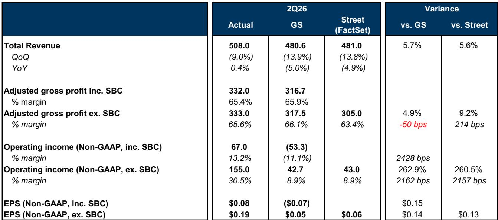
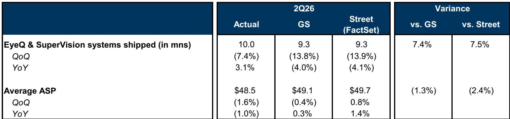

# Mobileye的研发补贴掩盖了一项观察者不应忽视的战略调整

Mobileye Global Inc.报告2026年第二季度营收5.08亿美元，超出市场普遍预期的4.81亿美元，同时实现调整后运营利润1.55亿美元，是市场预期的4300万美元的三倍以上。但这些整体数字掩盖了一个关键细节：超出预期几乎完全由一笔9300万美元的以色列政府研发补贴推动，该补贴在当季全额确认。剔除这一收益后，核心运营利润率约为12.2%，虽属可观，但远低于报告中的30.5%。公司将2026年全年营收展望中位数上调至19.95亿美元，调整后运营利润展望中位数上调至3.95亿美元，但隐含的下半年核心息税前利润仅为4800万美元，低于市场预期的7700万美元。一次性政策红利与持续恶化的基础运营表现之间的张力，是当前观察者需要评估的核心动态。

这一动态发生在一个重大战略变革的背景下。创始人兼首席执行官Amnon Shashua已宣布在继任者确定后辞任，这一领导层过渡给一家已在汽车技术领域进行资本密集型转型的公司增添了不确定性。Mobileye计划于2027年推出自己的垂直整合无人驾驶出租车车队，先从美国某大都市的100辆车起步，五年内扩展至约17000辆。这一直接进入网约车运营的举措，使其与现有客户大众汽车形成直接竞争，尽管Mobileye认为大众可能从公司为自动驾驶投入的额外资源中受益。战略逻辑存有争议，执行风险则无可回避。

一个合理的观点是，Mobileye在其ADAS业务、地图技术和机器人领域拥有真正的长期资产。但短期路径受到利润率压缩、高端自动驾驶产品新增订单有限以及资产负债表的制约——尽管公司持有14亿美元现金，但无人驾驶出租车车队的建设将在产生回报之前消耗大量现金。观察者面临的问题并非Mobileye是否拥有技术，而是公司能否在从零部件供应商向垂直整合出行运营商的转型过程中，避免破坏股东价值。

## 以色列研发补贴造成2027年将反转的盈利幻象

以色列政府新的研发补贴（无计划到期日）在第二季度为Mobileye带来9300万美元收益，相当于2026年上半年全部补贴在一个期内确认。这一单项贡献了公司报告调整后运营利润1.55亿美元的近60%。若剔除该收益，非GAAP每股收益约为0.08至0.09美元，而非报告的0.19美元；调整后运营利润率将为12.2%而非30.5%。全年展望隐含研发补贴总额1.8亿至2亿美元，意味着下半年确认金额约为上半年的一半。但观察者需要关注的关键细节是现金流滞后：管理层确认2026年补贴的现金流入要到2028年才开始。公司将报告较高的盈利，但相应现金尚未到账，这一报告盈利与现金创造之间的脱节将至少持续两年。

这一时间错配对估值具有直接影响。基于2026年预估每股收益0.05美元的远期市盈率158倍已然极端，但更值得警惕的是，这一盈利中很大一部分在短期内是非现金性质的。2026年自由现金流回报率3.8%、2028年升至8.6%，更真实地反映了公司的现金创造能力。观察者应淡化报告的息税前利润率扩张，转而关注现金运营利润率，后者揭示的情况远不乐观。研发补贴是一项无到期日的真实经济收益，但其会计处理和现金流滞后意味着2026年和2027年的盈利将高估公司的基础现金盈利能力。任何未对此进行调整的估值框架都将为短期报告盈利支付过高代价。

## 脱眼ADAS订单势头渐起，但高端自动驾驶产品仍停滞不前

Mobileye基于EyeQ系统级芯片的核心ADAS业务持续获得出货量增长和设计中标势头。公司将2026年EyeQ出货展望从之前的3800万台上调至约3900万台，反映第二季度的超预期表现。近期大众汽车和通用汽车的环绕ADAS中标，加上Stellantis集成Mobileye的REM众包地图技术的新订单，表明脱眼产品线正在获得牵引力。Stellantis订单（首次计划用于部分美国车型）验证了Mobileye地图基础设施作为独立产品的价值，而不仅仅是其全自动驾驶系统的一部分。这些中标支持了平均售价的提升，尤其是在2028年之后，更高集成度的环绕ADAS系统开始量产。

与Mobileye高端自动驾驶产品的对比则极为鲜明。SuperVision、Chauffeur以及公司的全自动驾驶系统新增订单活动有限。SuperVision第二季度出货量2万台，高于公司预期，但管理层维持全年略低于6万台的展望，指出当季可能存在库存积累。这意味着第二季度出货量可能只是提前了需求，而非加速采用。对于一家长期将自己定位为可量产自动驾驶技术领导者的公司而言，其最先进产品缺乏新增项目订单构成战略上的短板。若SuperVision和Chauffeur没有清晰的订单管道，高端自动驾驶的论点就完全依赖于Mobileye作为直接无人驾驶出租车运营商的能力，这种商业模式需要的核心能力与向汽车制造商供应芯片和软件截然不同。

## 无人驾驶出租车转型将Mobileye从供应商变为竞争对手，根本改变其风险特征

Mobileye推出自有无人驾驶出租车车队的决定是公司历史上最具深远意义的战略转变。计划于2027年在美国某大都市投入100辆车，五年内扩展至约17000辆，并利用Moovit子公司支持面向消费者的应用、车队管理和远程操作。这一垂直整合使Mobileye与现有客户大众汽车直接竞争，后者自身正为2026年下半年在奥兰多、2027年在洛杉矶推出商业无人驾驶出租车服务做准备。Mobileye管理层认为大众可能从公司投入自动驾驶的额外资源中受益，但这一说法显得牵强。一个供应商在相同市场、使用相同技术基础成为竞争对手，不可避免地会制造客户关系上的矛盾。

这一转型的资本需求巨大且未被充分理解。Mobileye第二季度末持有14亿美元现金及等价物，但无人驾驶出租车车队的建设需要大量前期投入用于车辆、传感器套件、维护基础设施和监管合规。公司2026年资本支出展望仅为1.01亿美元，2028年升至2.4亿美元，这似乎不足以支撑17000辆车的车队。要么公司需要额外融资，要么车队扩展将比预期更慢、规模更小。观察者还应注意到，Mobileye的核心ADAS业务虽然调整后盈利，但2025年在18.9亿美元营收中仅贡献300万美元息税前利润。公司从未证明其现有业务能产生可观的运营利润，更不用说为资本密集型新事业提供资金。无人驾驶出租车转型既是对公司技术的押注，也是对管理层执行其毫无经验依据之商业模式能力的押注。

## 评估Mobileye至2028年研究前景的决策框架

对于评估Mobileye的观察者而言，三个不同时间跨度需要各自的分析框架。短期内（至2027年底），研究前景取决于研发补贴的可持续性和EyeQ出货量增长轨迹。补贴提供了真实的盈利下限，但现金流滞后意味着报告盈利将超过现金创造。观察者应关注自由现金流而非调整后息税前利润，并对任何依赖短期报告市盈率的估值倍数保持谨慎。这一阶段的关键风险在于，补贴可能制造盈利稳定性假象，从而掩盖因研发支出上升和EyeQ平均售价受特定地区OEM出口量增加带来的竞争压力而恶化的核心利润率——公司已将此列为第二季度毛利率下降的因素之一。

中期内（2028年至2030年），研究前景完全取决于高端自动驾驶产品的新增订单活动以及无人驾驶出租车车队的早期运营表现。Stellantis、大众和通用的环绕ADAS及地图技术订单将从2028年开始贡献平均售价提升，提供独立于无人驾驶出租车业务的潜在营收加速器。如果Mobileye能展示与全球主要汽车制造商达成的SuperVision和Chauffeur订单管道，高端自动驾驶论点将获得可信度。否则，公司将完全依赖于自身的无人驾驶出租车运营，这一前景风险远高于前者。观察者应设定明确的里程碑：截至2028年底至少新增两个高端自动驾驶订单，且无人驾驶出租车车队的利用率与每英里成本需接近商业可行性。

长期来看（2030年后），研究前景取决于人形机器人机遇，公司已通过Mentee项目开始探索。Mobileye认为其有望在2028年实现v4机器人商业化推出，预计约500台，v3预计今年晚些时候推出，v4生产意向样机将于2027年第一季度推出。这一时间表颇为激进，人形机器人市场仍处于初期且未经验证。机器人机遇真实存在，但在Mobileye展示出明确的商业部署和客户采用路径之前，其价值应视为零。核心ADAS业务和地图基础设施为估值提供了下限，但如果存在上行空间，则来自自动驾驶和机器人战略的成功执行。无法承受多年、资本密集型且结果不确定的转型风险的观察者，不应持有该公司。

领导层过渡增添了另一层不确定性。Shashua教授卸任首席执行官后仍将担任董事并可能出任董事长，此举移除了自公司创立以来指导Mobileye的创始人愿景和技术权威。新任首席执行官，尤其是具有出行服务（而非半导体技术）运营经验的人选，可能加速无人驾驶出租车转型，也可能重新聚焦于核心ADAS优势。结果难以预知，但过渡期战略漂移的风险真实存在。观察者应在对长期期权价值赋予溢价之前，要求厘清继任计划和战略方向。

Mobileye是一家拥有真实技术资产、成长中ADAS业务和可行长期愿景的公司。它也是一家要求观察者在尚未证明其能从现有业务产生可持续利润之前，就为资本密集型战略转型提供资金的公司。研发补贴提供了短期盈利支持，但掩盖了基础运营挑战。无人驾驶出租车机遇真实存在，执行风险同样真实。对于严谨的观察者而言，框架清晰：关注自由现金流，为高端自动驾驶订单设定具体里程碑，在得到证明之前将机器人机遇的价值定为零。对于那些拥有五至十年视野且能够接受高度不确定性的观察者而言，该公司可能值得关注。对于其他人来说，风险回报比仍令人不安地平衡。

*仅供参考。部分内容可能基于源材料由人工智能辅助生成、翻译、摘要或编辑，可能存在遗漏或错误。请独立核实。本文不构成专业研究建议。*

仅供参考。部分内容可能基于源材料由人工智能辅助生成、翻译、摘要或编辑，可能存在遗漏或错误。请独立核实。本文不构成专业研究建议。

