# 红海区域相关因素带来的新价格上行风险

我们维持2026年Q4布伦特价格预期为80美元不变，前提是假设Q4局势缓和，同时提示新的价格上行风险。

■ 新的价格上行风险。有报告称红海区域发生针对两艘油轮的事件，同时哈萨克斯坦出口出现波动（图表4），叠加相关地缘局势变化，使近期价格预期面临更多上行因素。过去一个月，通过曼德海峡（BaM）的原油流量平均接近900万桶/天，其中约400万桶/天的流量若同时遭遇霍尔木兹海峡、曼德海峡和苏伊士运河的航运摩擦，可能面临重新调整路线的挑战（图表1）。过去7天，沙特阿拉伯位于红海的延布港的原油装载量保持稳定，约在500万桶/天的高位（图表3）。

- 维持2026年Q4布伦特价格预期为80美元。我们维持的基准情景反映了2026年下半年中东产量下降带来的价格支撑（图表5），同时被6月中东产量高于预期以及中国、韩国和中东部分区域需求数据调整带来的下行影响所平衡。我们预期2026年Q4 WTI平均价格为76美元。

## 夏季供应趋紧

我们预计价格在7月至8月将维持近期的大部分涨幅，原因在于全球（图表7）及OECD商业库存进一步下降，基于三个因素。第一，中东产量可能在7月下降。第二，需求应得到夏季旅行活动的支撑（图表8）。第三，OECD战略石油储备（SPR）的净释放量在第二季度大幅下降后明显放缓，韩国和日本目前正在补充储备（图表9）。

## 2027年价格因供应过剩而趋于温和（假设霍尔木兹海峡保持开放）

我们仍预期2027年布伦特/WTI平均价格为75/70美元，前提是2027年霍尔木兹海峡保持开放。同时我们维持2027年平均过剩量预期为320万桶/天，假设霍尔木兹海峡开放（图表10），其中对阿联酋的产量预期上调，对俄罗斯的产量预期下调。尽管2027年预计存在较大过剩，但我们不认为布伦特价格会跌破60美元区间高位，原因在于2027年全球战略储备规模预计为120万桶/天（图表11），以及美国页岩油生产对价格变化的敏感度（图表12）和供应中断的影响。

## 净风险偏向上行

我们认为价格预期面临的风险总体上偏向上行，尤其是近期。

图表1：过去30天通过曼德海峡的原油出口平均接近900万桶/天，其中约400万桶/天在霍尔木兹、曼德海峡和苏伊士同时出现航运摩擦时可能面临重新调整路线的挑战
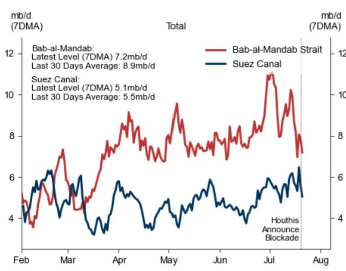  
红海流量
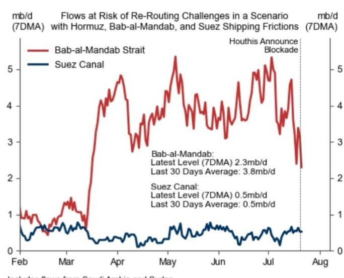  
来源：Kpler, GS全球投资研究

图表2：2026年Q2通过曼德海峡的沙特阿拉伯和苏丹合计原油流量升至400万桶/天（主要经由东西向管道和延布港转运）
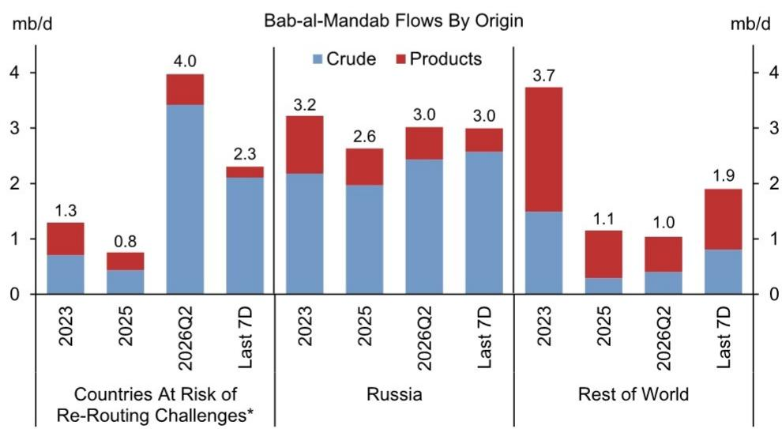  
*在霍尔木兹、曼德海峡和苏伊士航运摩擦的情景中；包含沙特阿拉伯和苏丹。  
来源：Kpler, GS全球投资研究

图表3：尽管有关摩擦的报道，过去7天沙特延布港的原油装载量保持稳定，约500万桶/天；红海区域内油轮容量近期未见大幅变化
  
来源：Kpler, GS全球投资研究

图表4：CPC原油出口在相关局势变化后出现下降
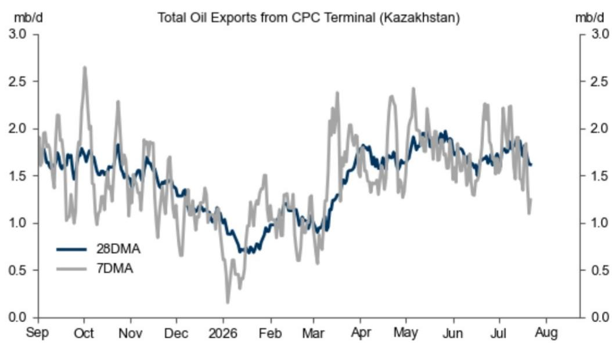  
里海管道联盟（CPC）将哈萨克斯坦和俄罗斯的原油运输至俄罗斯的新罗西斯克港，并从该港出口至全球其他地区。CPC码头是该港口的原油装运点。  
来源：Kpler, GS全球投资研究

## 维持2026年Q4布伦特价格预期为80美元（假设Q4局势缓和）

图表5：尽管6月中东产量超出预期，但局势再度紧张推迟了2026年下半年的恢复
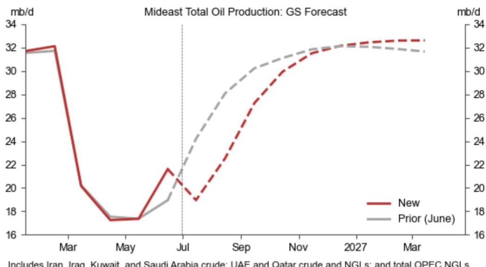  
来源：GS全球投资研究

图表6：我们下调中国、韩国及中东地区2026年需求预期，主要反映已实现数据的修正
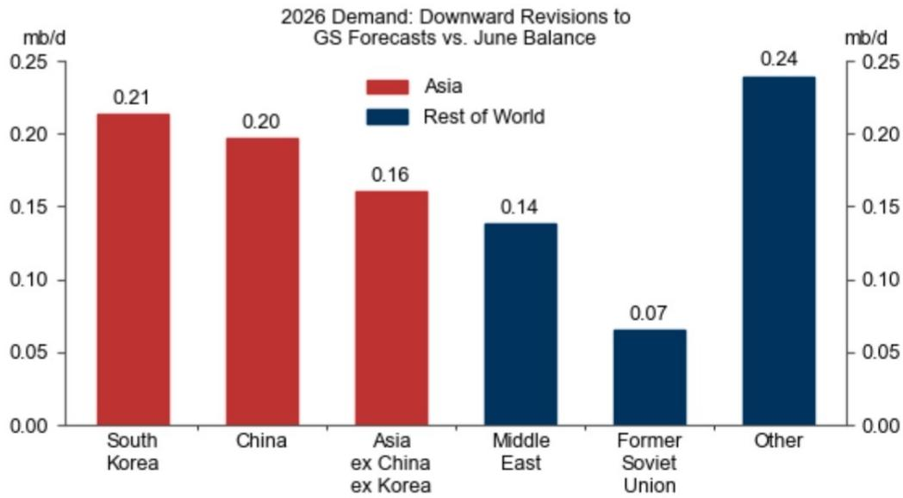  
来源：GS全球投资研究

全球原油需求

## 夏季供应趋紧

图表7：全球可见原油库存已降至年初至今低点
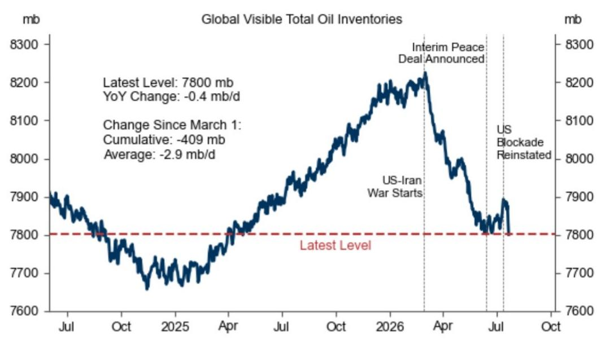  
来源：IEA, Kpler, DOE, Euroilstocks, ARA PJK, PAJ, Haver, GS全球投资研究

趋紧因素一：7月中东供应下降

趋紧因素二：需求反弹

图表8：季节性因素预计将使Q3全球原油需求环比Q3增加80万桶/天
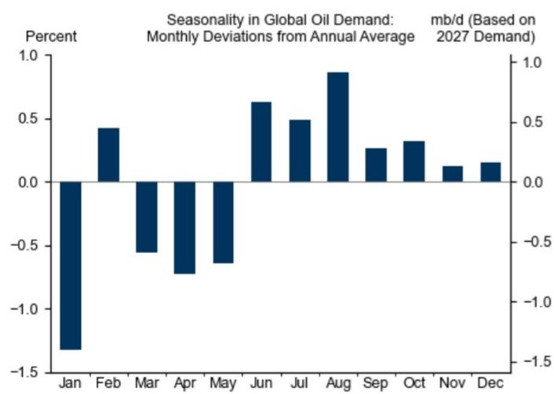  
基于2013-2019年和2022-2025年平均全球需求。
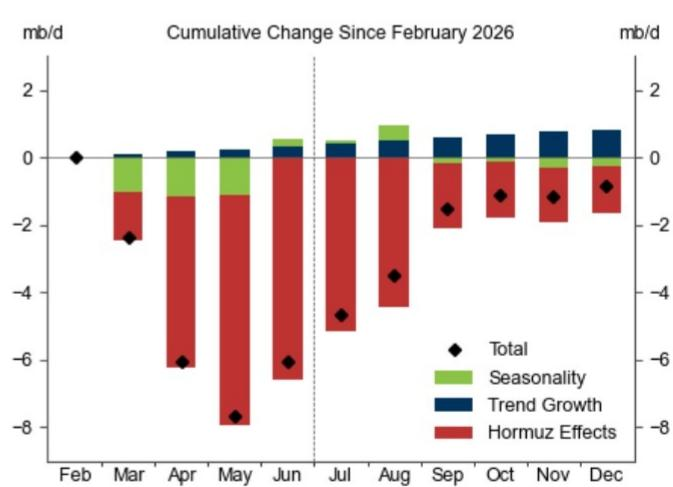  
“霍尔木兹效应”为从供需平衡中扣除季节性和趋势增长后的累计变化残差。  
来源：IEA, GS全球投资研究

趋紧因素三：SPR释放明显放缓

图表9：OECD战略石油储备的净释放量过去30天大幅放缓，此前Q2有较大规模释放，韩国和日本目前正在补充储备
  
我们考虑了截至5月底的原油及成品油库存变化，6月1日起仅考虑原油。  
来源：Kpler, GS全球投资研究

## 2027年价格因供应过剩而趋于温和

图表10：假设2027年霍尔木兹海峡保持开放，我们预计2027年过剩量为320万桶/天，较此前预测有所扩大，原因是全球需求下调、阿联酋产量上调以及拉丁美洲供应增长强劲
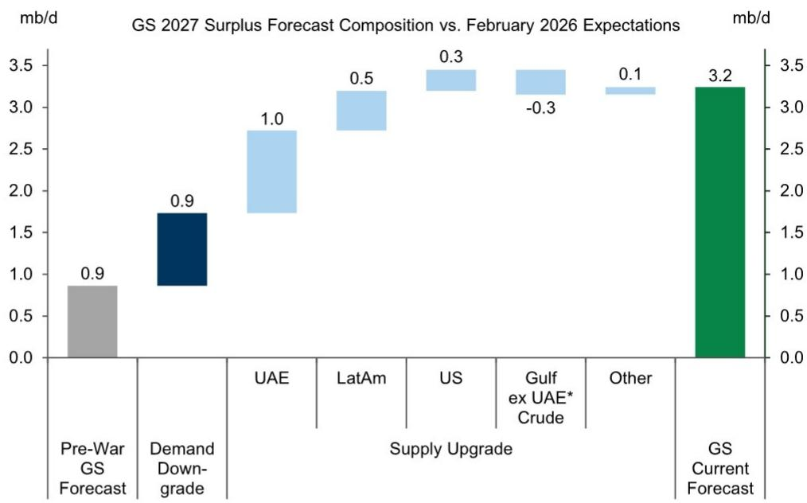  
*定义为沙特阿拉伯、伊朗、伊拉克、科威特。  
来源：GS全球投资研究

## 新的价格底部

图表11：我们预计2027年全球战略储备规模为120万桶/天
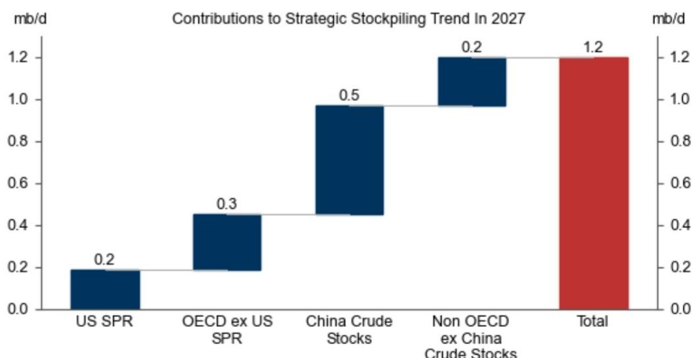  
包含可见和不可见储备。OECD除美国外SPR包含原油和成品油。  
来源：GS全球投资研究

图表12：如果原油价格持续低于60美元/桶，美国页岩油产量可能显著放缓
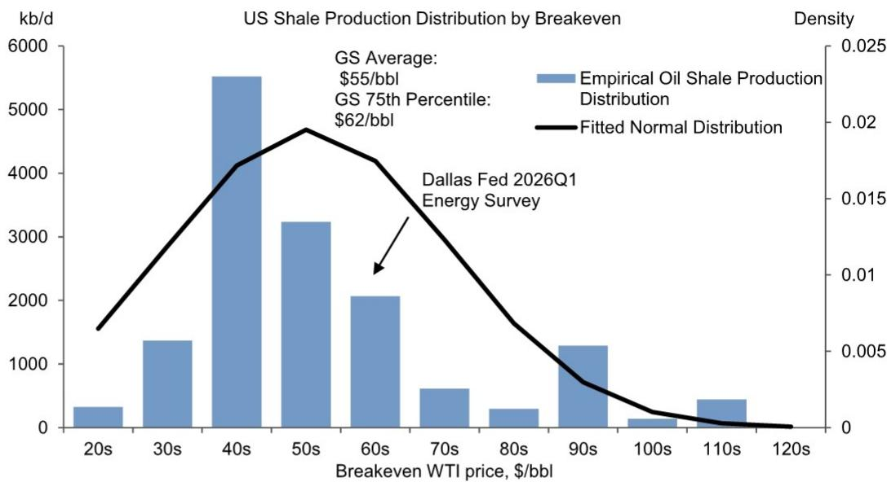  
来源：GS全球投资研究

## 净风险偏向上行，尤其是近期

图表13：如果霍尔木兹海峡持续中断至2027年，布伦特价格可能在2026年Q4超过120美元/桶，2027年平均为100美元
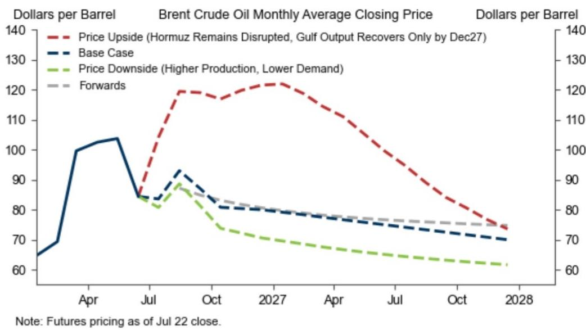  
来源：IC, GS全球投资研究

来源：GS全球投资研究

附录

图表14：我们预计2026年Q3全球供需缺口为210万桶/天

<table><tr><td colspan="15">GS 2025-2027年原油供需展望季度数据</td></tr><tr><td rowspan="2">（百万桶/天）</td><td colspan="2">2025</td><td colspan="2">2026</td><td colspan="2">2027</td><td colspan="4">2026</td><td colspan="4">2027</td></tr><tr><td>水平</td><td>同比</td><td>水平</td><td>同比</td><td>水平</td><td>同比</td><td>Q1</td><td>Q2</td><td>Q3</td><td>Q4</td><td>Q1</td><td>Q2</td><td>Q3</td><td>Q4</td></tr><tr><td>全球供应</td><td>105.9</td><td>3.2</td><td>102.1</td><td>-3.8</td><td>109.0</td><td>6.9</td><td>103.5</td><td>95.8</td><td>100.4</td><td>108.7</td><td>109.1</td><td>109.2</td><td>109.0</td><td>108.7</td></tr><tr><td>非OPEC（不含俄罗斯）</td><td>65.8</td><td>2.0</td><td>66.7</td><td>0.8</td><td>68.4</td><td>1.8</td><td>65.3</td><td>65.1</td><td>67.3</td><td>69.0</td><td>68.3</td><td>68.6</td><td>68.5</td><td>68.4</td></tr><tr><td>美国总计</td><td>22.3</td><td>0.8</td><td>23.1</td><td>0.7</td><td>23.3</td><td>0.2</td><td>22.5</td><td>23.2</td><td>23.3</td><td>23.3</td><td>23.0</td><td>23.6</td><td>23.4</td><td>23.3</td></tr><tr><td>加拿大</td><td>6.4</td><td>0.3</td><td>6.5</td><td>0.1</td><td>6.5</td><td>0.0</td><td>6.5</td><td>6.3</td><td>6.5</td><td>6.6</td><td>6.6</td><td>6.3</td><td>6.5</td><td>6.6</td></tr><tr><td>非OPEC拉丁美洲</td><td>7.0</td><td>0.6</td><td>7.9</td><td>0.8</td><td>8.1</td><td>0.3</td><td>7.6</td><td>7.9</td><td>8.0</td><td>8.0</td><td>8.0</td><td>8.0</td><td>8.2</td><td>8.3</td></tr><tr><td>阿联酋液态</td><td>4.3</td><td>0.2</td><td>4.5</td><td>0.2</td><td>5.6</td><td>1.1</td><td>4.0</td><td>3.5</td><td>5.0</td><td>5.4</td><td>5.5</td><td>5.6</td><td>5.7</td><td>5.7</td></tr><tr><td>俄罗斯</td><td>10.4</td><td>-0.2</td><td>10.3</td><td>-0.1</td><td>9.7</td><td>-0.6</td><td>10.4</td><td>10.4</td><td>10.4</td><td>10.1</td><td>10.0</td><td>9.8</td><td>9.7</td><td>9.5</td></tr><tr><td>OPEC供应</td><td>29.6</td><td>1.3</td><td>25.1</td><td>-4.5</td><td>30.8</td><td>5.7</td><td>27.8</td><td>20.3</td><td>22.7</td><td>29.6</td><td>30.8</td><td>30.8</td><td>30.9</td><td>30.8</td></tr><tr><td>沙特原油</td><td>9.4</td><td>0.5</td><td>8.5</td><td>-1.0</td><td>10.5</td><td>2.0</td><td>9.3</td><td>6.7</td><td>7.7</td><td>10.1</td><td>10.5</td><td>10.5</td><td>10.5</td><td>10.5</td></tr><tr><td>OPEC液态（不含沙特原油）</td><td>20.2</td><td>0.9</td><td>16.6</td><td>-3.6</td><td>20.4</td><td>3.7</td><td>18.4</td><td>13.6</td><td>15.0</td><td>19.4</td><td>20.3</td><td>20.4</td><td>20.4</td><td>20.4</td></tr><tr><td>全球需求</td><td>104.5</td><td>0.8</td><td>102.6</td><td>-1.8</td><td>105.8</td><td>3.1</td><td>104.3</td><td>99.1</td><td>102.5</td><td>104.7</td><td>104.8</td><td>105.0</td><td>106.6</td><td>106.7</td></tr><tr><td>OECD需求</td><td>45.9</td><td>0.0</td><td>45.4</td><td>-0.4</td><td>45.8</td><td>0.4</td><td>45.8</td><td>44.0</td><td>45.9</td><td>46.1</td><td>45.8</td><td>45.1</td><td>46.4</td><td>46.0</td></tr><tr><td>美国</td><td>20.7</td><td>0.2</td><td>21.0</td><td>0.2</td><td>21.0</td><td>0.0</td><td>20.8</td><td>20.9</td><td>21.1</td><td>21.0</td><td>20.9</td><td>20.9</td><td>21.2</td><td>21.1</td></tr><tr><td>OECD欧洲</td><td>13.4</td><td>0.0</td><td>13.2</td><td>-0.2</td><td>13.2</td><td>0.0</td><td>12.9</td><td>12.9</td><td>13.8</td><td>13.4</td><td>13.0</td><td>13.1</td><td>13.7</td><td>13.1</td></tr><tr><td>非OECD需求</td><td>58.6</td><td>0.8</td><td>57.2</td><td>-1.4</td><td>60.0</td><td>2.8</td><td>58.6</td><td>55.1</td><td>56.5</td><td>58.5</td><td>59.0</td><td>59.9</td><td>60.2</td><td>60.7</td></tr><tr><td>中国</td><td>16.9</td><td>0.2</td><td>16.1</td><td>-0.8</td><td>16.4</td><td>0.3</td><td>17.1</td><td>15.2</td><td>15.7</td><td>16.3</td><td>16.5</td><td>16.5</td><td>16.4</td><td>16.4</td></tr><tr><td>印度</td><td>5.9</td><td>0.1</td><td>5.8</td><td>-0.1</td><td>6.5</td><td>0.6</td><td>6.1</td><td>5.7</td><td>5.4</td><td>6.1</td><td>6.5</td><td>6.6</td><td>6.2</td><td>6.6</td></tr><tr><td>其他非OECD亚洲</td><td>9.4</td><td>0.2</td><td>9.4</td><td>0.0</td><td>10.0</td><td>0.6</td><td>9.6</td><td>9.1</td><td>9.3</td><td>9.7</td><td>9.9</td><td>10.0</td><td>10.0</td><td>10.1</td></tr><tr><td>供需差额</td><td>1.4</td><td>2.4</td><td>-0.6</td><td>-2.0</td><td>3.2</td><td>3.8</td><td>-0.9</td><td>-3.3</td><td>-2.1</td><td>4.0</td><td>4.2</td><td>4.2</td><td>2.4</td><td>2.1</td></tr><tr><td>OECD商业库存变动</td><td>0.2</td><td>-</td><td>-0.2</td><td>-</td><td>0.6</td><td>-</td><td>-0.3</td><td>-0.9</td><td>-0.3</td><td>0.6</td><td>0.6</td><td>0.9</td><td>0.4</td><td>0.3</td></tr></table>

“delta”列对应相对于此前（6月）供需平衡的修正。

图表15：我们维持布伦特价格预期：2026年Q4为80美元，2027年为75美元

<table><tr><td rowspan="2"></td><td colspan="3">布伦特（美元/桶）</td><td colspan="3">WTI（美元/桶）</td></tr><tr><td>新GS预期</td><td>旧GS预期</td><td>远期（当月交易的主力合约）</td><td>新GS预期</td><td>旧GS预期</td><td>远期（当月交易的主力合约）</td></tr><tr><td>2025</td><td>68</td><td>68</td><td></td><td>65</td><td>65</td><td></td></tr><tr><td>2026</td><td>86</td><td>85</td><td>87</td><td>81</td><td>80</td><td>81</td></tr><tr><td>2027</td><td>75</td><td>75</td><td>77</td><td>70</td><td>70</td><td>72</td></tr><tr><td>2028</td><td>71</td><td>71</td><td>73</td><td>66</td><td>66</td><td>69</td></tr><tr><td>2029</td><td>74</td><td>74</td><td>72</td><td>69</td><td>69</td><td>67</td></tr><tr><td>2030</td><td>75</td><td>75</td><td>71</td><td>70</td><td>70</td><td>65</td></tr><tr><td>2031-2035</td><td>75</td><td>75</td><td>69</td><td>70</td><td>70</td><td>62</td></tr><tr><td>1Q26</td><td>78</td><td>78</td><td>78</td><td>72</td><td>72</td><td>72</td></tr><tr><td>2Q26</td><td>97</td><td>97</td><td>97</td><td>93</td><td>93</td><td>93</td></tr><tr><td>3Q26</td><td>88</td><td>84</td><td>90</td><td>83</td><td>79</td><td>84</td></tr><tr><td>4Q26</td><td>80</td><td>80</td><td>83</td><td>76</td><td>75</td><td>77</td></tr><tr><td>1Q27</td><td>78</td><td>78</td><td>80</td><td>73</td><td>74</td><td>74</td></tr><tr><td>2Q27</td><td>76</td><td>76</td><td>78</td><td>71</td><td>71</td><td>72</td></tr><tr><td>3Q27</td><td>73</td><td>73</td><td>76</td><td>68</td><td>69</td><td>71</td></tr><tr><td>4Q27</td><td>71</td><td>71</td><td>75</td><td>66</td><td>66</td><td>70</td></tr><tr><td>Jan-26</td><td>65</td><td>65</td><td></td><td>60</td><td>60</td><td></td></tr><tr><td>Feb-26</td><td>69</td><td>69</td><td></td><td>65</td><td>65</td><td></td></tr><tr><td>Mar-26</td><td>100</td><td>100</td><td></td><td>91</td><td>91</td><td></td></tr><tr><td>Apr-26</td><td>102</td><td>102</td><td></td><td>98</td><td>98</td><td></td></tr><tr><td>May-26</td><td>104</td><td>104</td><td></td><td>99</td><td>99</td><td></td></tr><tr><td>Jun-26</td><td>84</td><td>84</td><td></td><td>82</td><td>82</td><td></td></tr><tr><td>Jul-26</td><td>84</td><td>86</td><td></td><td>80</td><td>81</td><td></td></tr><tr><td>Aug-26</td><td>93</td><td>84</td><td>90</td><td>87</td><td>79</td><td>84</td></tr><tr><td>Sep-26</td><td>87</td><td>83</td><td>87</td><td>82</td><td>77</td><td>81</td></tr><tr><td>Oct-26</td><td>81</td><td>81</td><td>85</td><td>77</td><td>76</td><td>79</td></tr><tr><td>Nov-26</td><td>80</td><td>80</td><td>83</td><td>76</td><td>75</td><td>77</td></tr><tr><td>Dec-26</td><td>80</td><td>80</td><td>82</td><td>75</td><td>75</td><td>76</td></tr><tr><td>Jan-27</td><td>79</td><td>79</td><td>81</td><td>74</td><td>74</td><td>75</td></tr><tr><td>Feb-27</td><td>78</td><td>78</td><td>80</td><td>73</td><td>74</td><td>74</td></tr><tr><td>Mar-27</td><td>78</td><td>77</td><td>79</td><td>73</td><td>73</td><td>73</td></tr><tr><td>Apr-27</td><td>77</td><td>77</td><td>78</td><td>72</td><td>72</td><td>73</td></tr><tr><td>May-27</td><td>76</td><td>76</td><td>78</td><td>71</td><td>71</td><td>72</td></tr><tr><td>Jun-27</td><td>75</td><td>75</td><td>77</td><td>70</td><td>70</td><td>72</td></tr><tr><td>Jul-27</td><td>74</td><td>74</td><td>77</td><td>69</td><td>70</td><td>71</td></tr><tr><td>Aug-27</td><td>73</td><td>73</td><td>76</td><td>68</td><td>69</td><td>71</td></tr><tr><td>Sep-27</td><td>73</td><td>72</td><td>76</td><td>68</td><td>68</td><td>71</td></tr><tr><td>Oct-27</td><td>72</td><td>72</td><td>76</td><td>67</td><td>67</td><td>70</td></tr><tr><td>Nov-27</td><td>71</td><td>71</td><td>75</td><td>66</td><td>66</td><td>70</td></tr><tr><td>Dec-27</td><td>70</td><td>70</td><td>75</td><td>65</td><td>65</td><td>70</td></tr></table>

来源：GS全球投资研究
