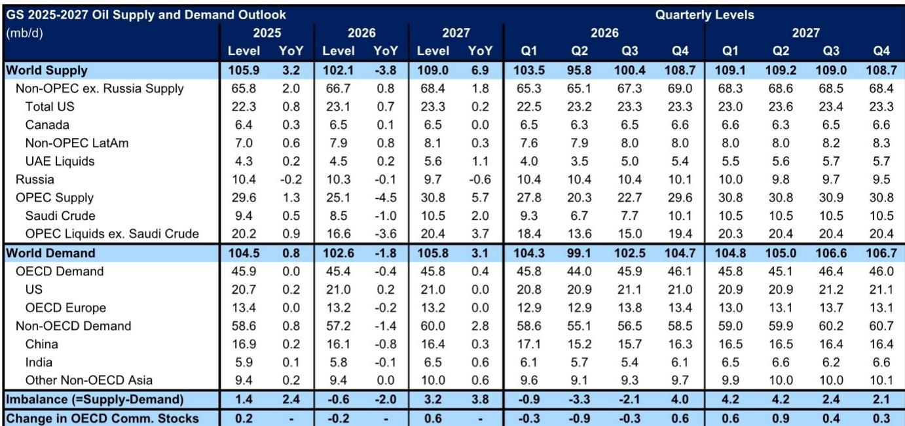
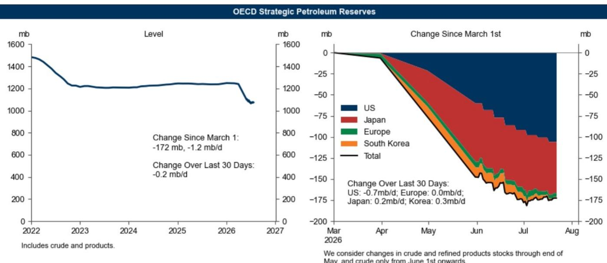
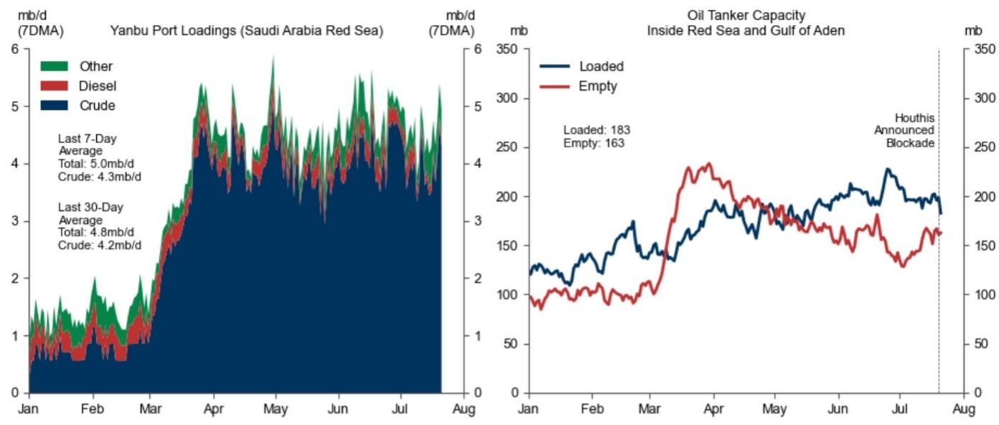

# GS：研究主题与行业变化观察

这份GS研报的核心判断是：尽管维持2026年第四季度布伦特原油每桶80美元的预测不变，但近期红海航运摩擦、哈萨克斯坦出口下降以及夏季库存收紧，使得价格预期面临的上行变量显著增加。报告同时勾勒了一个清晰的价格情景框架，从基准到上行变量再到节奏变化变量，为市场参与者提供了可参照的路径。

报告指出，过去一个月通过曼德海峡的石油流量平均接近每日900万桶，其中近400万桶的流量在霍尔木兹海峡、曼德海峡和苏伊士运河同时出现航运摩擦时，可能难以重新规划路线。尽管沙特延布港的原油装载量在过去7天仍维持在每日约500万桶的高位，但胡塞武装声称对两艘油轮的袭击，以及俄罗斯-乌克兰相关地缘局势变化背景下哈萨克斯坦出口的下降，已经使短期价格预期的变量进一步向上倾斜。

> **KC评论：** 报告强调的不是单一事件，而是多个航运咽喉同时受阻的叠加变量。曼德海峡每日近900万桶的流量中，有近400万桶属于“难以绕行”的部分，这一数字是理解潜在供应中断规模的关键。

## 1. 夏季库存收紧支撑近期价格

报告认为，价格在7月和8月将维持近期的大部分涨幅，背后有三个驱动因素。首先，中东产量在7月预计下降。其次，夏季出行旺季将为需求提供支撑。第三，经合组织战略石油储备的净释放量在第二季度大幅减少后正在急剧变化，韩国和日本已开始补充库存。全球可见石油库存已降至年内低点，这一基本面变化为价格提供了底部支撑。

## 2. 2027年预计出现过剩，但价格底部明确

假设霍尔木兹海峡在2027年保持开放，报告预计2027年布伦特原油均价为每桶75美元，WTI为每桶70美元。报告维持每日320万桶的2027年平均供应过剩预测，其中阿联酋产量预测上调，俄罗斯产量预测下调。尽管存在较大过剩，但报告认为布伦特原油不会跌破每桶60多美元的高位，原因在于2027年全球战略储备采购预计达每日120万桶，以及美国页岩油产量对价格的敏感性——当原油价格延续低于每桶60美元时，美国页岩油产量将显著变化。

## 3. 上行与节奏变化情景的边界清晰

报告设定了两种极端情景。在上行情景中，如果霍尔木兹海峡的干扰延续到2027年，布伦特原油可能在2026年第四季度超过每桶120美元，2027年均价达到每桶100美元；如果曼德海峡和苏伊士运河也延续受阻，价格还有进一步上行空间。在节奏变化情景中，如果供应超出预期且需求损失更为持久，布伦特原油可能在2027年底跌至每桶60美元出头的低位。报告认为，净变量偏向于上行，尤其是在短期内。

## 4. 一个可复用的观察框架：三重收紧与双重底部

这份报告提供了一个简洁的价格分析框架。短期看三个收紧因素：中东产量下降、夏季需求回升、战略储备释放节奏变化。中期看两个价格底部：全球战略储备采购（每日120万桶）和美国页岩油的价格敏感性（每桶60美元以下产量显著变化）。这个框架帮助读者理解，即使2027年出现较大供应过剩，价格也不会无限下跌，因为存在结构性支撑。对于关注能源市场的读者而言，曼德海峡的流量数据、哈萨克斯坦出口的恢复进度，以及夏季库存变化，将是未来几周最值得跟踪的指标。

For informational purposes only. Portions may be generated,translated,summarized,or edited with AI assistance based on source materials and may contain omissions or errors. Please verify independently. This is not investment,legal,tax,accounting,or other professional advice.

For informational purposes only. Portions may be generated,translated,summarized,or edited with AI assistance based on source materials and may contain omissions or errors. Please verify independently. This is not investment,legal,tax,accounting,or other professional advice.

