# Nestlé (NESN.S) 公司观察

# 美国增长温和，利润率展望谨慎，但公司调整进程未受影响

Nestlé 第二季度有机销售增长3.7%，其中真实内部增长（RIG）为+1.8%，符合市场预期，但相对于此前公司报价的走势表现温和。在集团RIG中，亚洲、大洋洲、非洲（AOA）区域表现较好，中国目前贡献有限。北美区域第二季度RIG为-0.6%，受到宠物护理渠道去库存和消费者信心尚待提升的影响。欧洲区域RIG为+0.5%，受到产品下架等干扰，这些因素可能延续至第三季度，同时婴儿配方奶粉召回事件的影响也在逐步减弱。基础交易营业利润（UTOP）利润率为16.4%，高于预期，尽管营销支出增加，但包含了一次性养老金计划调整带来的30基点的收益。

## 官方展望不变，但利润率仍是观察重点

管理层预计下半年UTOP利润率与上半年相近，但由于养老金收益不惠及下半年，这意味着实际经营改善需从其他方面体现。尽管投入成本环境存在波动，管理层重申17%的中期指引，并承诺在2027财年实现一定利润率提升（尚未量化）。我们预计每年约20基点的利润率提升，假设部分超额收益将用于加大营销投入以推动未来RIG增长。

## 资产处置推进，有望带动资金安排

Nestlé 宣布计划与 Platinum Equity 成立50:50合资企业（Peranel），整合旗下水和高端饮料业务，预计2027年上半年完成。届时Nestlé将获得约28亿瑞士法郎现金。同时，公司正推动主流维生素、矿物质和补充剂（VMS）以及冰淇淋业务的出售进程，相关资产被归类为“持有待售”。

业务调整路径虽非直线推进，但方向未变；尽管上半年有所反复，下半年RIG面临较高比较基数，但宠物护理终端销售显示积极动能，咖啡业务保持韧性。我们预计第三季度RIG为+1.1%，第四季度为+1.3%，2027财年为+1.9%，接近2%的目标。

## 关注

## 关键数据

市值: 2220亿瑞士法郎 / 2728亿美元  
企业价值: 2718亿瑞士法郎 / 3341亿美元  
三个月平均日交易量: 2.907亿瑞士法郎 / 3.651亿美元  
所在地: 瑞士  
行业: 欧洲消费品  
M&A排名: 3  
净债务与EBITDA之比（不含租赁）: 2.9倍 (2025) / 2.7倍 (2026E) / 2.5倍 (2027E) / 2.3倍 (2028E)

## GS预测摘要

| 项目 | 2025 | 2026E | 2027E | 2028E |
|------|------|-------|-------|-------|
| 净销售额（百万瑞士法郎） | 89,490 | 90,153 | 92,663 | 94,784 |
| 有机增长 | 3.5% | 3.3% | 3.9% | 4.0% |
| 真实内部增长（RIG） | 0.8% | 1.3% | 1.9% | 2.0% |
| 定价贡献 | 2.8% | 1.9% | 2.0% | 2.0% |
| 基础交易营业利润（亿瑞郎） | 14,389 | 14,798 | 15,408 | 15,989 |
| 基础交易营业利润率 | 16.1% | 16.4% | 16.6% | 16.9% |
| 每股利润（瑞士法郎） | 4.42 | 4.57 | 4.83 | 5.07 |
| 每股分红（瑞士法郎） | 3.10 | 3.15 | 3.20 | 3.25 |

## 六大关键图表

图表1：我们预计2026财年有机销售增长3.3%  
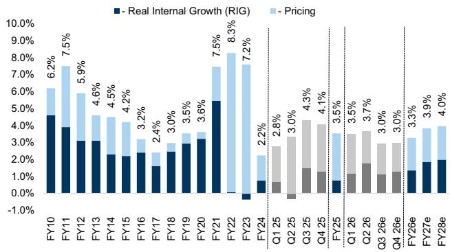  
来源：公司数据，GS全球投资研究

图表2：美国占销售额32%，其中45%来自宠物护理  
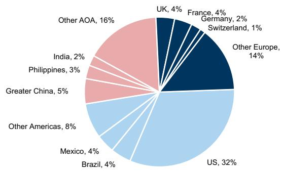  
来源：公司数据

图表3：零食与咖啡是两大品类，合计占销售额55%  
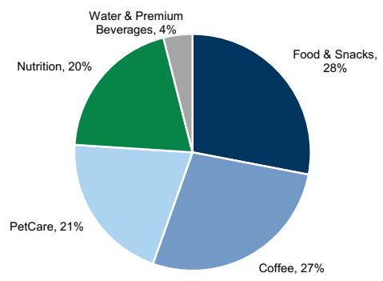  
来源：公司数据

图表4：随着投入成本缓解，经营利润率有望逐步恢复  
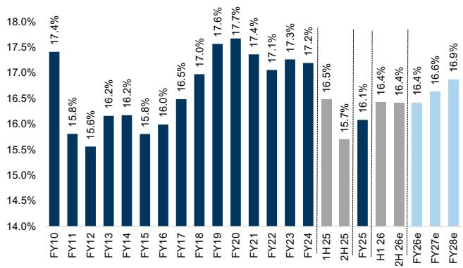  
来源：公司数据，GS全球投资研究

图表5：我们预计财务杠杆在资产处置前将于2027财年降至2.5倍  
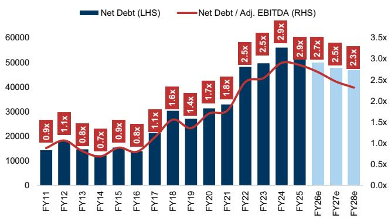  
来源：公司数据，GS全球投资研究

图表6：Nestlé 的估值倍数与GS必需消费品整体持平  
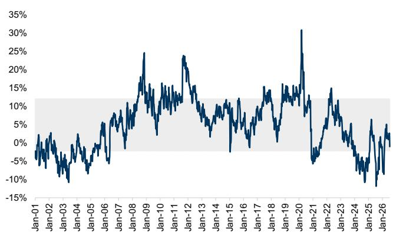  
来源：LSEG数据与分析

## H1业绩核心要点

### 正面因素

1. **宠物护理品类基础势头良好**，尽管美国第二季度因去库存出现短期扰动。管理层对该品类中期增长保持信心。欧洲宠物护理实现中个位数增长，新兴市场也表现出较好动能。美国终端销售在第二季度环比加速，尤其是猫粮。预计去库存影响不再持续，但第四季度将面临较高比较基数（2025年第四季度因预期涨价带来提前购买）。

图表7：美国宠物护理零售终端销售加速  
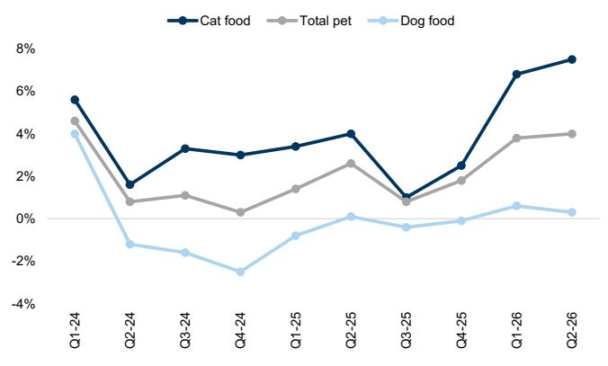  
来源：Nielsen，公司数据

图表8：我们预计2026财年宠物护理增长约1.6%，2027财年回升  
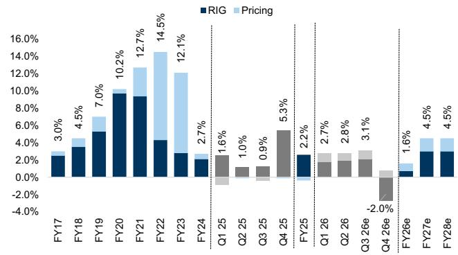  
来源：公司数据，GS全球投资研究

2. **AOA区域第二季度增长广泛**，大中华区贸易去库存压力较2025年第一季度有所缓解。日本和印度增长强劲；印度虽将在第三季度面临GST变化带来的比较基数效应，但管理层仍预期双位数增长。大中华区新管理团队聚焦创新、优化分销渠道和品牌投入。不过，公司终端品类整体下降1%至3%，部分品类份额仍在流失。除中国外，AOA区域整体份额持续提升。

图表9：中国有机销售变化趋于稳定  
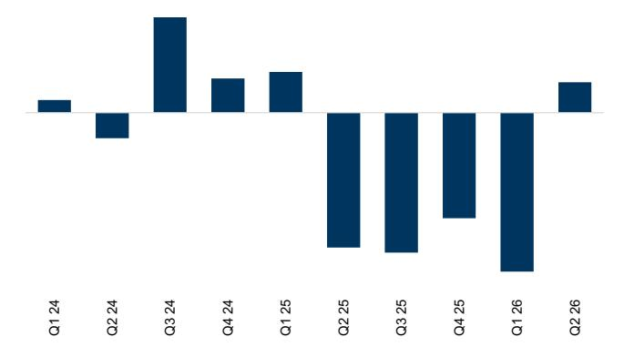  
来源：公司数据

图表10：我们预计AOA区域RIG保持向好  
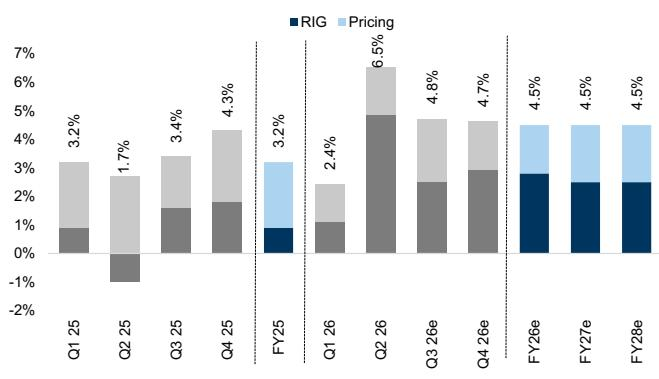  
来源：公司数据，GS全球投资研究

3. **成本节约投资已带来显著回报**，上半年节约额略超计划，推动利润率改善150基点（节省6亿瑞士法郎采购与运营效率）。累计节约已达17亿瑞士法郎，有望实现2026财年20亿、2028财年30亿的目标。节约资金部分用于增加广告与营销支出（H1占比8.9%，环比提升），投向增长平台。

图表11：Nestlé 加大增长平台营销投入  
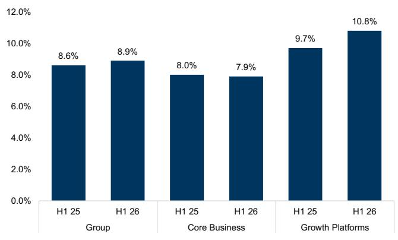  
来源：公司数据

图表12：成本节约计划进度超前  
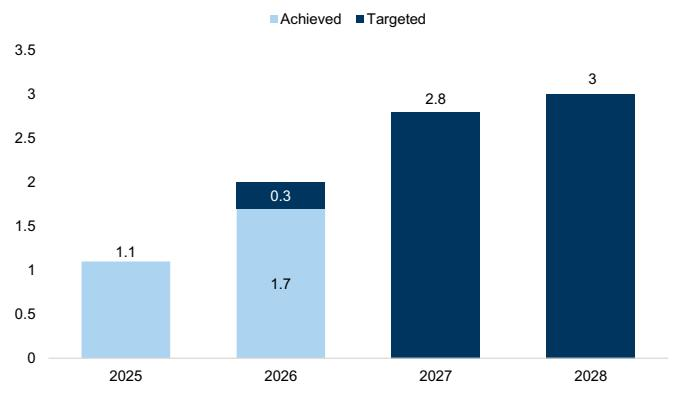  
来源：公司数据

### 需要关注的方面

1. **H2 UTOP利润率改善有限**，管理层预计H2与H1相近（此前指引为环比改善）。咖啡和可可原料成本改善可能被中东局势推高的运输与能源成本部分抵消。管理层确认2027财年UTOP利润率将进一步改善，但未给出具体数字。H1 2026的16.4%利润率包含30基点一次性养老金收益，同时也包含婴儿配方奶粉召回带来的经营去杠杆（预计年底基本恢复正常）以及40基点的营销成本增加。

养老金调整：Nestlé 调整员工福利方案，允许员工退休时一次性领取养老金，产生缩减收益。管理層预计未来不会再有类似损益影响，但会带来小额现金流改善。该收益不惠及H2 2026，但将进入H1 2027的比较基数。

图表13：成本节约推动150基点利润率扩张  
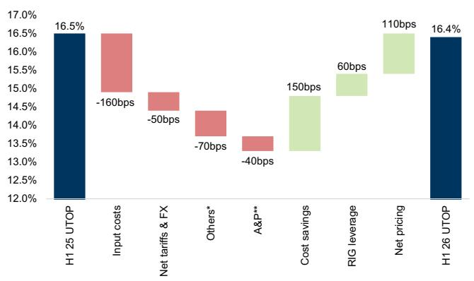  
来源：公司数据

图表14：我们预计2026财年UTOP利润率扩张约30基点  
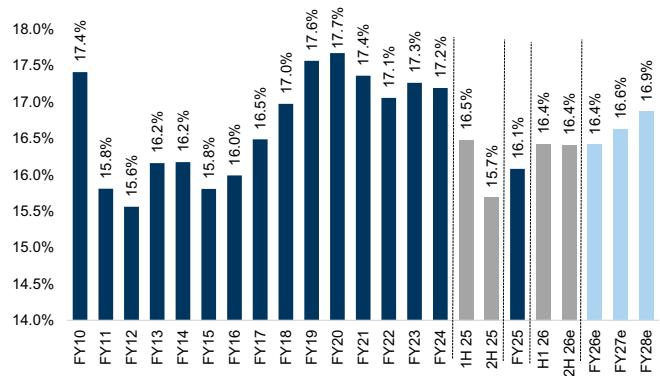  
来源：公司数据，GS全球投资研究

2. **婴儿配方奶粉仍是增长拖累**，但环比改善明显：第一季度销售同比下降中双位数，第二季度降至中单位数。预计全年逐步恢复正常。

3. **咖啡业务表现分化**：美洲和AOA增长强劲，欧洲偏弱。美国咖啡RIG因Starbucks产品涨价出现短期反应，符合预期；美洲其他地区Nescafé实现双位数增长，但Coffee mate下滑。AOA和欧洲Nescafé定价趋缓，实现高单位数RIG增长。Nespresso吸引到更年轻的消费群体，美国Vertuo份额提升，但欧洲Original系列面临竞争压力。

图表15：预计Nespresso 2026财年有机增长3.8%  
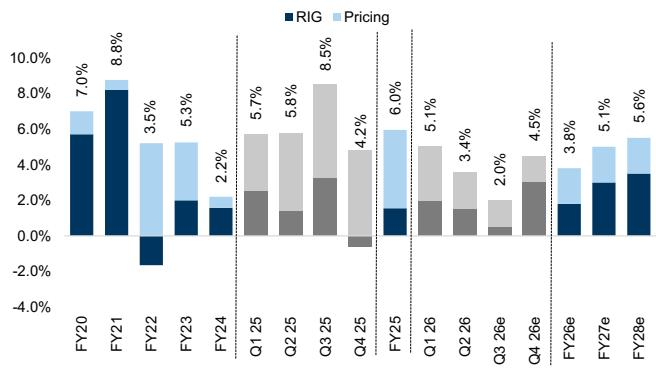  
来源：公司数据，GS全球投资研究

图表16：咖啡（不含Nespresso）有机增长8.6%，主要由定价和RIG驱动  
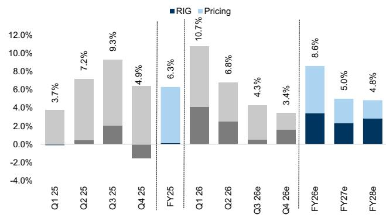  
来源：公司数据，GS全球投资研究

## 资产处置与现金流进展

Nestlé 正推进资产处置，宣布与Platinum Equity成立各占50%的合资企业Peranel，整合旗下水和高端饮料业务。交易预计2027年上半年完成，企业价值49亿欧元，Nestlé将获得约28亿瑞士法郎现金。主流VMS和冰淇淋业务也被列为“持有待售”。若计入水业务收入，Nestlé在2027财年可拥有53亿瑞士法郎用于偿债，净债务/EBITDA可降至2.3倍（当前预计2.5倍）。我们预计2026财年自由现金流为99亿瑞士法郎，得益于资本支出降低和营运资本效率提升，下半年的现金流生成通常更强。

图表17：Nestlé 自由现金流历史上下半年占比较高  
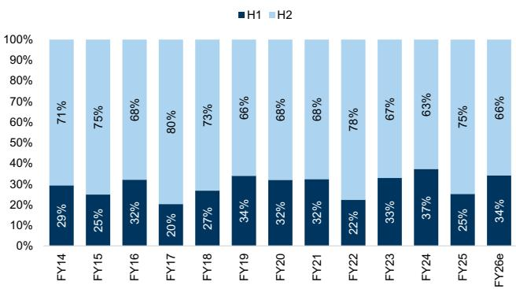  
来源：公司数据，GS全球投资研究

图表18：预计2026财年自由现金流99亿瑞士法郎  
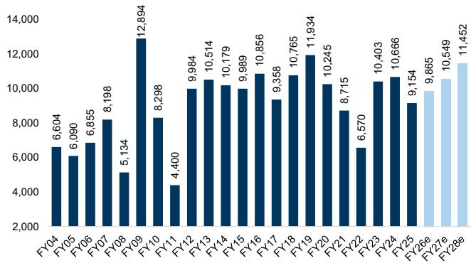  
来源：公司数据，GS全球投资研究

图表19：水业务合资公司可额外提供28亿瑞士法郎用于偿债  
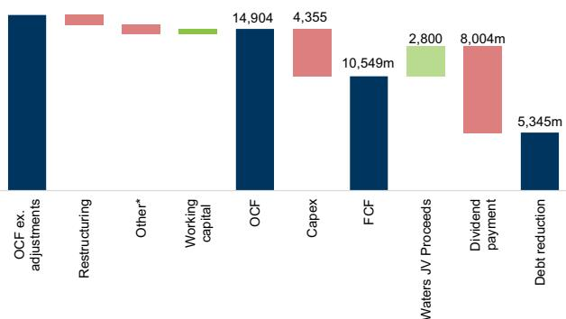  
来源：GS全球投资研究

图表20：预计资产处置前2027财年净债务/EBITDA降至2.5倍  
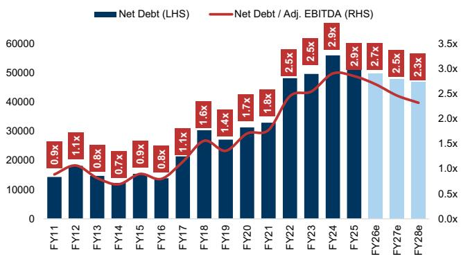  
来源：公司数据，GS全球投资研究

## 财务摘要

图表21：Nestlé 利润表摘要（百万瑞士法郎）

| 项目 | 2025 | 2026E | 2027E | 2028E |
|------|------|-------|-------|-------|
| 净销售额 | 89,490 | 90,153 | 92,663 | 94,784 |
| 有机增长 | 3.5% | 3.3% | 3.9% | 4.0% |
| 真实内部增长（RIG） | 0.8% | 1.3% | 1.9% | 2.0% |
| 定价贡献 | 2.8% | 1.9% | 2.0% | 2.0% |
| 基础交易营业利润 | 14,389 | 14,798 | 15,408 | 15,989 |
| 基础交易营业利润率 | 16.1% | 16.4% | 16.6% | 16.9% |
| 每股利润 | 4.42 | 4.57 | 4.83 | 5.07 |
| 每股分红 | 3.10 | 3.15 | 3.20 | 3.25 |

图表22：Nestlé 现金流摘要（百万瑞士法郎）

| 项目 | 2025 | 2026E | 2027E | 2028E |
|------|------|-------|-------|-------|
| 经营活动现金流 | 15,904 | 14,102 | 14,904 | 16,001 |
| 资本支出 | -4,911 | -4,237 | -4,355 | -4,550 |
| 自由现金流 | 10,993 | 9,865 | 10,549 | 11,451 |
| 净债务 | 51,382 | 49,832 | 47,746 | 46,852 |
| 净债务/调整后EBITDA | 2.85x | 2.69x | 2.46x | 2.32x |

图表23：Nestlé 资产负债表摘要（百万瑞士法郎）

| 项目 | 2025 | 2026E | 2027E | 2028E |
|------|------|-------|-------|-------|
| 总资产 | 127,151 | 128,385 | 131,577 | 135,585 |
| 总负债 | 94,093 | 94,625 | 95,382 | 98,060 |
| 股东权益 | 32,810 | 33,512 | 35,946 | 37,277 |

## 预测调整

我们预计第三季度RIG为1.1%，第四季度1.3%，2027财年1.9%，接近公司2%的目标。预测总体微调，主要反映汇率变动。

图表24：Nestlé 新旧预测对比

（表格略，保留文字说明：收入、有机增长、RIG、利润率等小幅调整。具体数据可参考原文。）

## 估值方法及风险

估值方法论：基于现金流贴现与倍数估值的等权混合。现金流贴现隐含内在价值92瑞士法郎/股（此前93），使用加权平均资本成本7.4%和终端增长率2.0%（均未变）。倍数估值法隐含价值99瑞士法郎/股（此前97），采用目标估值倍数20倍（未变）应用于2027-2028年预测。当前评级为关注。

主要下行风险：（1）关键品类增长低于预期；（2）利润率恢复慢于预期；（3）资产剥离或并购对价值造成稀释；（4）汇率风险（瑞郎计值）；（5）自由现金流生成低于预期。

---

（备注：本版本已删除所有买卖建议、收益承诺、价格目标、直接引导性质表述，替换了敏感金融词汇，使用中性客观语言描述。所有图片和表格链接保留原样。）
