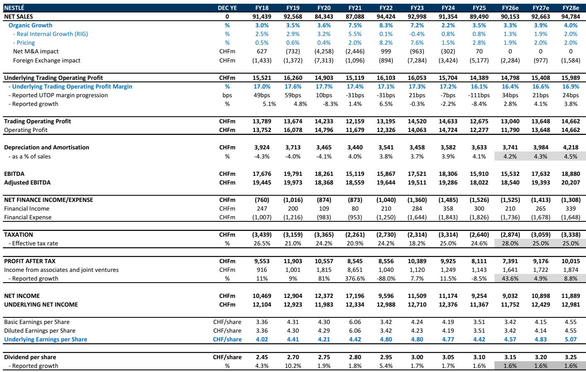
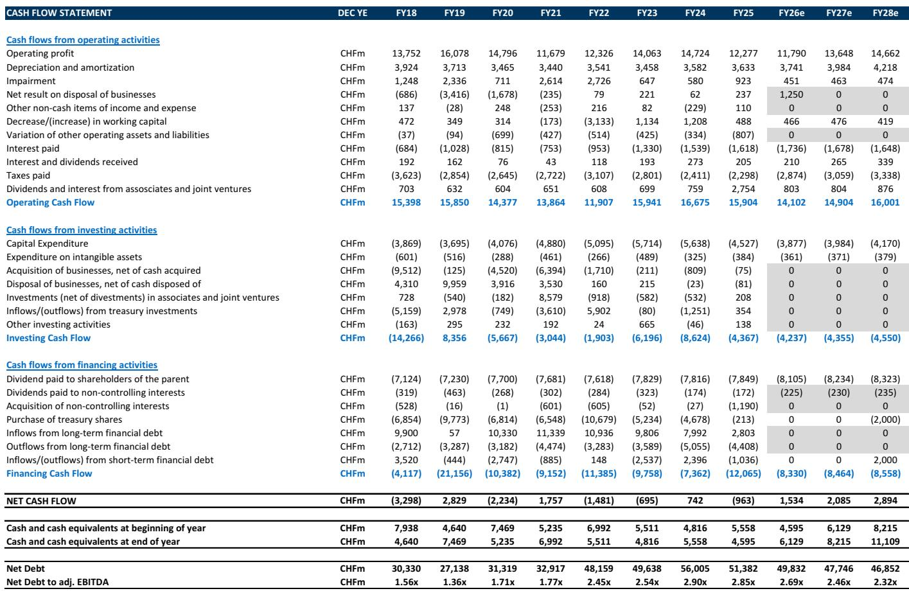
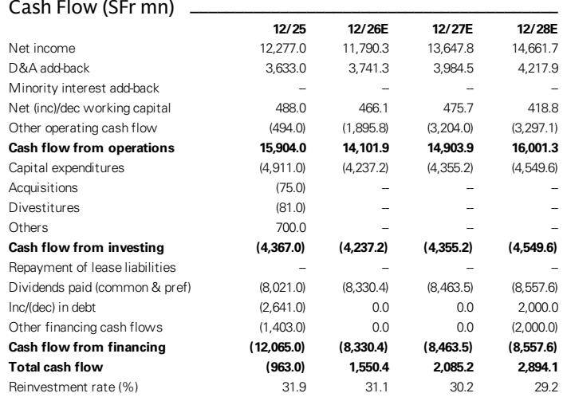

# GS：研究主题与行业变化观察

雀巢二季度有机销售增长3.7%，其中内生增长（RIG）为1.8%，符合公开信息中各方观察的预期。这份业绩在报价前期上涨后表现较为温和。北美市场是主要影响因素：二季度RIG为-0.6%，宠物护理渠道库存调整和消费者信心正在调整共同影响了表现。欧洲RIG为0.5%，部分受下架影响，相关产品召回事件仍在产生影响，尽管程度在减弱。亚洲、大洋洲、非洲（AOA）区域表现强劲，但中国尚未贡献增量。

GS认为，雀巢的转型故事仍在推进，但路径不会是一条直线。上半年业绩是阶段性表现变化，下半年将面临更难的RIG同比基数。宠物护理终端销售正在改善，咖啡业务保持韧性，这些是支撑判断的关键信号。

## 1. 北美宠物护理库存调整是短期扰动，终端动销已加速

美国宠物护理渠道的库存调整是二季度北美RIG转负的直接原因。报告指出，雀巢供应水平改善后，零售商不再需要持有安全库存，从而主动降低库存水平。但终端销售并未走弱：雀巢确认美国宠物护理的报告观点（out）趋势在二季度环比一季度仍在加速，猫粮品类尤为明显。管理层预计库存调整的冲击不会延续至下半年，但提醒四季度将面临2025年四季度因报价前囤货带来的高基数。

> **相关观察：** 库存调整是供应链效率改善的副产品，而非需求出现变化。关注报告观点（out）而非报告观点（in），才能判断北美宠物护理的真实动能。报告提供的Nielsen零售动销数据是验证这一判断的核心图表。

## 2. AOA区域增长广泛，中国仍处调整期但降幅趋稳

AOA区域二季度增长强劲且广泛。日本和印度表现突出，印度尽管即将面临相关改革带来的基数效应，管理层仍预期维持双位数增长。大中华区的新管理团队正在聚焦创新、渠道优化和品牌研究优先级，但雀巢在该区域的终端品类仍在以1%-3%的速度下滑，部分品类仍在丢失份额。不过，中国区有机销售的降幅已趋于稳定，这是一个积极信号。排除中国后，雀巢在AOA其他市场持续获得份额。

## 3. 成本节约计划超预期，为营销投入提供空间

相关成本节约计划上半年实现6亿瑞士法郎的增量采购和运营效率节省，对利润率贡献150个基点。累计节约已达17亿瑞士法郎，公司有望在2026财年实现20亿的目标，2028年底前达到30亿。节约的资金正在被重新投入营销：广告和营销支出占销售比例从2026年上半年的8.9%进一步提升，增量投入集中在增长平台。公开信息显示，公司每年可实现20个基点的利润率改善，但前提是任何意外收益都将被再研究于营销以推动未来RIG增长。

## 4. 资产处置推进，2027年可能启动股份回购

雀巢已宣布计划在2027年上半年与相关公司成立50:50的合资公司，整合其水和高端饮料业务。公司预计在交易完成时获得28亿瑞士法郎现金。同时，主流维生素、矿物质和补充剂（VMS）以及冰淇淋业务已被归类为“持有待售资产”，销售流程正在推进。公开信息认为，资产处置的进展可能为2027年宣布股份回购创造条件。财务杠杆预计在处置前降至2.5倍，处置后将进一步下降。

公开信息显示雀巢三季度RIG为1.1%，四季度为1.3%，2027财年达到1.9%，接近2%的中期目标。当前估值对应2027年预期市盈率约16倍，自由现金流回报表现约5%，股息率约4%。

For informational purposes only. Portions may be generated,translated,summarized,or edited with AI assistance based on source materials and may contain omissions or errors. Please verify independently. This is not investment,legal,tax,accounting,or other professional advice.

For informational purposes only. Portions may be generated,translated,summarized,or edited with AI assistance based on source materials and may contain omissions or errors. Please verify independently. This is not investment,legal,tax,accounting,or other professional advice.

