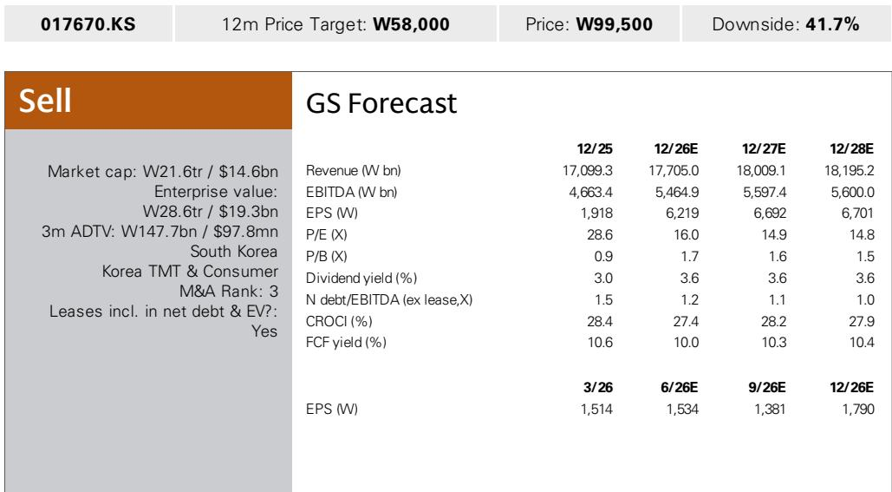
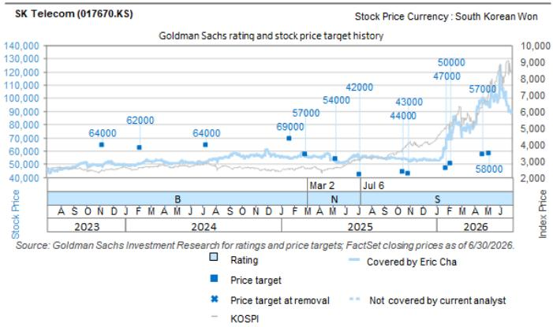

# GS：SKTelecom设立AI数据中心子公司SKHyper

7月23日，SK Telecom（SKT）董事会批准设立全资AI数据中心开发子公司SK Hyper，并计划至2030年投入最高7500亿韩元股权资金。首期3300亿韩元将于7月底到位，剩余部分根据项目进展分批注入。这一架构将SK Hyper置于SKT与各项目公司之间，每个AI数据中心预计设立独立SPV，SKT计划在SPV层面引入外部合作方，而非独自承担全部建设成本。

GS在当日发布的研究中认为，这一信息并未实质改变SKT此前披露的AI数据中心战略不确定性轮廓。SKT曾在6月29日公布第一阶段5GW产能计划，目标从2029年起分阶段投运，远期规划至2035年扩展至15GW。新设立的子公司结构虽然提升了组织清晰度，但项目层面的关键变量——租约、融资、回报表现——仍缺乏可验证信息。

> **KC评论：** GS对SKT更新公司观点，较当前报价99,500韩元隐含较大观察空间。报告的核心逻辑并非否定AI数据中心方向，而是认为当前报价已计入较多乐观预期，而项目执行和回报可见度仍然较低。

## 1. 资金承诺指向开发平台，而非全部建设成本

GS分析师Eric Cha和Vona Lee指出，7500亿韩元的承诺资金主要用于SK Hyper这一开发平台，而非此前公布的5GW战略的全部建设成本。首期3300亿韩元将主要覆盖首批约2GW项目的前期开发——包括用地、电网接入、许可和变电站基础设施，其中核心项目位于蔚山和忠清西部的约1GW产能。

这意味着资金将在最终租户承诺和项目级融资到位之前就已部署。GS认为，这种“先投入、后签约”的顺序可能延长开发周期，或在客户转化慢于预期时导致资产利用率偏低、额外资金需求上升。

## 2. 组织架构清晰，但项目宏观环境仍不透明

设立集中化的开发子公司有助于跨区域协调项目执行，但披露信息没有提供关于预期利用率、定价、投入资本回报表现或不确定性分配（SKT、租户与外部合作方之间）的增量细节。GS明确表示，在缺乏这些信息的情况下，不会对5GW整体管线赋予实质性估值。

报告列出了五个需要持续跟踪的关键变量：超大规模云厂商或锚定租户的约束性承诺、外部合作方的确认参与及融资条款、SKT在各SPV中的最终股权出资和担保、预期利用率和项目层面回报、以及7500亿韩元是否构成SKT不确定性敞口的上限。

## 3. 近期盈利贡献有限，现金流可能承压

GS认为，有意义的运营贡献仍取决于锚定租约、外部合作方参与、建设完工以及2029年起的分阶段投运。在此之前，SKT将承担开发支出而无对应收入，这可能影响自由现金流，并在资金需求增加时限制资本配置灵活性——包括股东回报。

从财务数据看，GS预测SKT 2026年营收17.7万亿韩元、EBITDA 5.46万亿韩元，自由现金流回报表现约10%。但AI数据中心的前期投入尚未被纳入这些预测的实质性考量。

## 4. 信息本身中性，但估值支撑仍需证据

GS将此次信息定性为中性，认为新架构与既有战略基本一致，并未实质性降低执行不确定性或改善财务回报可见度。报告判断，在出现可验证的签约需求和可接受的项目层面回报之前，AI数据中心战略难以支撑更高估值。

对于关注韩国运营商转型的读者而言，SK Hyper的设立提供了一个观察窗口——它展示了运营商如何尝试将通信基础设施能力延伸至AI算力领域，但也暴露了这类转型在融资结构、客户锁定和回报验证上的典型不确定性。GS的分析框架——先看租约和融资，再看回报表现和不确定性上限——对其他正在推进类似转型的电信公司同样具有参考价值。

For informational purposes only. Portions may be generated,translated,summarized,or edited with AI assistance based on source materials and may contain omissions or errors. Please verify independently. This is not investment,legal,tax,accounting,or other professional advice.

For informational purposes only. Portions may be generated,translated,summarized,or edited with AI assistance based on source materials and may contain omissions or errors. Please verify independently. This is not investment,legal,tax,accounting,or other professional advice.

