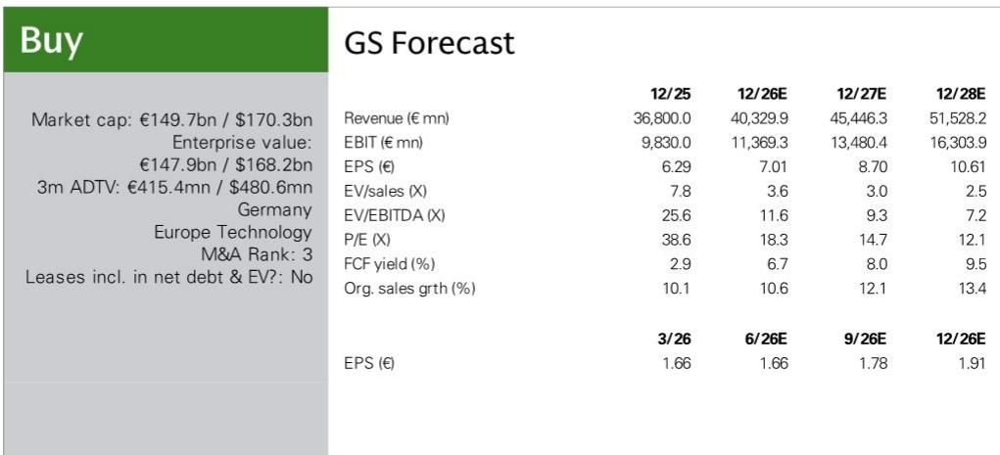
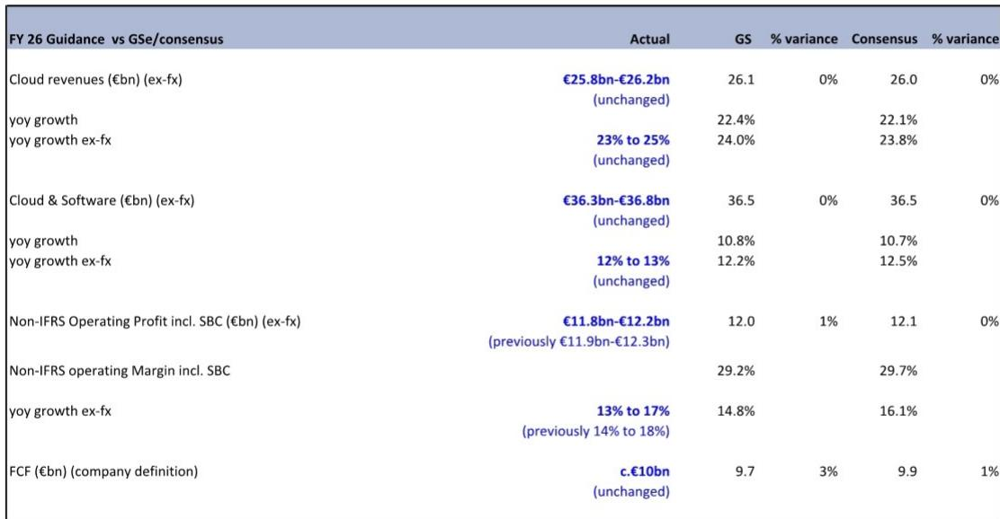
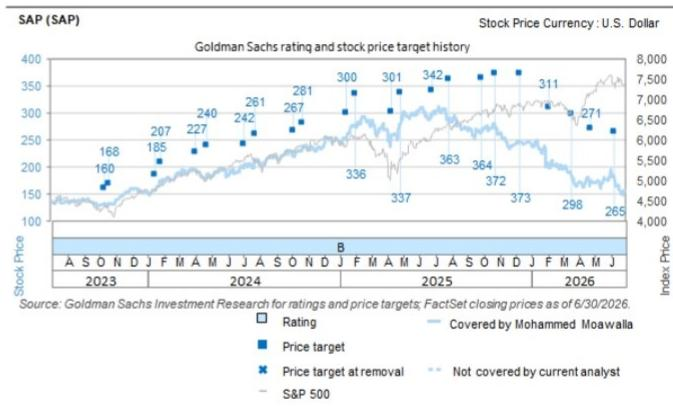

# GS：SAP业务与季度数据观察

SAP 在 2Q26 交出了一份混合成绩单。当前云合同（CCB）以 26% 的固定汇率同比增长，达到近 230 亿欧元，超出GS和一致预期。但非 IFRS 营业利润低于预期，同比增长仅 9%，低于市场预期的 14%。更关键的是，管理层将全年营业利润指引区间下调了 1 亿欧元，以反映 7 月完成的两笔收购——Dremio 和 Prior Labs——带来的稀释效应。

这份报告的核心矛盾在于：云业务的前瞻指标依然强劲，但利润端承受着来自收购、股权激励和研发投入的多重不确定性。市场需要在收入韧性与利润稀释之间重新审视。

## 1. 云合同连续两个季度超预期，但管理层提示下半年增速可能节奏变化

CCB 在 2Q26 达到 229.29 亿欧元，固定汇率同比增长 26%，有机增长约 24.7%，高于GS预期的 24.8% 和一致预期的 24.3%。这是 CCB 连续第二个季度超预期，主要驱动力来自 Cloud ERP Suite 的持续强势。管理层在交流会议上提到，SAPPHIRE 大会后的管道表现好于预期，AI 和 SAP Business Data Cloud 被嵌入超过 90% 的 50 大交易中。

但管理层同时重申，CCB 全年预计会略有减速，主要原因是宏观环境——特别是中东局势对部分行业和供应链的直接影响。H2 通常是订单集中期，但管理层认为今年 H2 的结果区间比往年更宽。

> **观察笔记：** CCB 是 SAP 未来 12 个月云收入的先行指标。连续两个季度超预期意味着短期收入可见度较高，但管理层主动提示 H2 不确定性，说明外部环境对客户决策的影响尚未完全反映在订单中。

## 2. 营业利润低于预期，收购稀释与 SBC 波动是主因

2Q26 非 IFRS 营业利润为 32.11 亿欧元，低于GS预期 1% 和一致预期 3%，固定汇率同比增长仅 5.1%。利润增速低于收入增速的原因包括：云收入增速环比节奏变化（受高基数和 Q1 特殊效应反转影响）、股权激励费用从 Q1 的异常低位回升、研发和销售投入增加，以及 Reltio 收购的稀释效应。

全年营业利润指引从 119-123 亿欧元下调至 118-122 亿欧元，区间中点对应约 15% 的固定汇率增长，略低于一致预期的 16%。管理层预计 H2 营业利润增速与 H1 大致相当，依靠成本控制和模型路由优化来抵消研发投入和 token 成本上升。

## 3. AI 产品定价模式正在转变，但货币化仍需时间验证

管理层在交流会议上详细介绍了新的 Business AI 平台，强调其能够将确定性的关键任务数据与概率性的 agentic AI 结合。Dremio 和 Prior Labs 的收购将提供语义数据层和高精度表格预测能力。更重要的是，管理层指出，这一转变使 SAP 能够向基于结果和价值的定价模式过渡——这对未来利润率表现和收入质量是较为积极的信号。

内部 AI 工具已在研发部门带来最高 30% 的生产力提升。SAP 计划在未来 12 个月调整人员安排，同时通过模型路由技术动态切换至更便宜的 LLM 以控制 token 成本。但报告也指出，AI 产品的货币化进程仍处于早期阶段，市场需要等待未来几个季度的数据来观察定价模式转型的实际效果。

## 4. 自由现金流表现强劲，为研究提供缓冲

尽管利润端有所变化，2Q26 自由现金流达到约 30 亿欧元，同比增长 27%，高于一致预期的 28.4 亿欧元。自由现金流转换率（FCF/非 IFRS 营业利润含 SBC）达到 109%，远高于一致预期的 98%。强劲的现金流为 SAP 在 AI 和收购上的持续投入提供了财务缓冲，也部分缓解了市场对利润稀释的疑虑。

GS认为，市场将继续在收入韧性与利润稀释之间权衡，并等待 AI 产品牵引力和货币化的进一步证据。当前报价对应约 18.3 倍 2026 年预期市盈率（含 SBC），估值处于历史区间中位。

For informational purposes only. Portions may be generated,translated,summarized,or edited with AI assistance based on source materials and may contain omissions or errors. Please verify independently. This is not investment,legal,tax,accounting,or other professional advice.

For informational purposes only. Portions may be generated,translated,summarized,or edited with AI assistance based on source materials and may contain omissions or errors. Please verify independently. This is not investment,legal,tax,accounting,or other professional advice.

