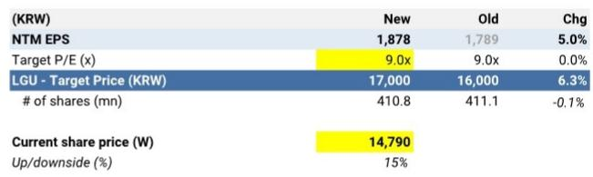
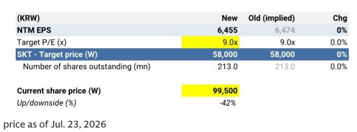

SOUTH KOREA TELECOM SERVICES

# 2Q26E 经营表现前瞻：表现有所分化，AIDC 选择权成为焦点

我们预计韩国电信运营商在 2Q26E 的经营表现将呈现分化态势：KT 的披露数据受较高房地产开发基数影响，LGU 将呈现相对清晰的逐季修复，SKT 则因不存在数据泄露相关成本而实现营业利润同比显著回升。整体来看，移动业务的趋势预计仍将平稳：在近期的罚款免除期后，用户增长势头趋于稳定，但此前用户流失、临时套餐降级及获客成本摊销的持续影响，将制约经营表现的大幅提升。与此同时，企业和数据中心业务应继续作为主要的增量驱动力，KT Cloud 实现两位数增长、LGU 的 AIDC 业务增长约 30%，以及 SK Broadband 的 Pangyo DC 利用率提升均形成支撑。展望下季度之后，我们认为基础设施驱动的增长选择权正成为日益重要的区分因素。我们认为 KT 提供了相对有利的风险回报特征，其受需求支撑且资本支出相对较轻的 AIDC 产能扩张计划（到 2031 年达 1GW）、海底光缆扩展以及持续的股东回报构成支撑。对于 LGU，经营质量改善及 AIDC 产能计划（到 2030 年达 400MW）与当前估值相互平衡。对于 SKT，现有 SK Broadband 数据中心业务提供切实的经营支持，但我们认为其联合体主导的 5GW 至 15GW 路线图在客户、资金需求及预期回报上缺乏足够可见度，尚难充分受益。我们对 KT 的 12 个月目标估值上调至 74,000 韩元（此前 72,000 韩元），对 LGU 上调至 17,000 韩元（此前 16,000 韩元），维持对 SKT 的 58,000 韩元估值。我们对 KT 保持积极看法，对 LGU 持中性看法，对 SKT 持谨慎看法。

Eric Cha
+82(2)3788-1799 | eric.cha@gs.com
GS (Asia) L.L.C., Seoul Branch

Vona Lee  
+82(2)3788-1201 | vona.lee@gs.com  
GS (Asia) L.L.C., Seoul Branch

KT (估值参考 74,000 韩元，积极看法)：预计 2Q KT 合并收入为 6.8 万亿韩元（同比 -8%，环比 +1%），营业利润为 5,580 亿韩元（同比 -45%，环比 +16%），同比下降主要由于 2Q25 确认了约 3,800 亿韩元的光津区房地产开发收益的高基数。移动用户虽在罚款免除期后恢复净增长，但我们认为移动服务收入仍受年初用户流失及免费 100GB 客户感谢套餐带来的临时套餐降级影响而承压。成本方面，营销费用因去年获客成本摊销而同比上升，但竞争缓和与更好的成本控制应有助于环比改善。子公司中，KT Cloud 收入因 DBO、托管及私有云需求而保持两位数增长，KT Estate 受益于酒店运营及房地产开发贡献。但 KT Cloud 利润率可能因 Gasan AIDC 利用率仍低（尽管产能已完全签约）而暂时受压，租赁及折旧费用已开始确认。我们认为，7 月客户感谢套餐的结束将为 3Q 开始的移动业务及经营表现提供更可见的修复。展望下季度之后，公司计划到 2031 年将 AIDC 产能扩至 1GW、海底光缆容量从 31Tbps 增至 90Tbps，在预售及轻资产模式下提供了可信的基础设施驱动增长选择权。我们维持积极看法，基于持续的 2,500 亿韩元股份回购、股东回报可见度及中期基础设施增长改善。我们维持 SOTP 估值法下的 12 个月目标估值 74,000 韩元（此前 72,000 韩元），隐含上行空间约 40%。对于主要由电信服务构成的传统业务，我们对未来十二个月每股盈利采用 11 倍市盈率估值，并将估值滚动至 3Q26-2Q27（此前 2Q26-1Q27）。对 KT Cloud 采用 9.1 倍 EV/EBITDA（参照国内数据中心同业）以及 50% 控股公司折价。对其他主要子公司/联营企业也采用 50% 控股公司折价。

LGU (估值参考 17,000 韩元，中性看法)：预计 2Q LGU 合并收入为 3.9 万亿韩元（同比 +1%，环比 +2%），营业利润 3,160 亿韩元（同比 +4%，环比 +16%），基本符合市场预期。2Q 服务收入增长保持低个位数（同比 +2.4%），移动增长因自 2Q25 起 SKT 用户流入带来的较高基数而有所放缓。企业业务应因 AIDC 的强劲增长（约 30% 以上）、现有中心利用率提升及 DBO 贡献而加速。成本方面，营销费用增速从 1Q 的 +11.7% 放缓至同比高个位数（+9.8%），反映号码可携竞争缓和及手机利润改善，同时重组带来的劳动力成本节约提供额外抵消。展望下季度之后，我们期待即将公布的股东回报计划，以及公司计划到 2030 年将 AIDC 产能从当前的 165MW 扩至 400MW。我们维持中性看法，基于市盈率的 12 个月目标估值为 17,000 韩元（此前 16,000 韩元），隐含上行空间约 15%，在经营质量改善和 AIDC 选择权与估值之间取得平衡。我们对未来十二个月每股盈利采用不变的 9 倍市盈率估值，并将估值滚动至 3Q26-2Q27（此前 2Q26-1Q27）。

SKT (估值参考 58,000 韩元，谨慎看法)：预计 SKT 合并收入为 4.4 万亿韩元（同比 +1%，环比持平），营业利润 5,450 亿韩元（同比 +61%，环比 +1%），符合彭博一致预期。同比大幅回升主要因 2Q25 数据泄露后确认的约 2,000-2,500 亿韩元 USIM 更换及经销商补偿成本已不存在。移动趋势保持平稳，用户继续修复，此前 KT 于 1 月终止费豁免。成本方面，营销费用保持相对温和，同比仅低个位数增长（+2%）。我们认为 SK Broadband 应保持较为清晰的增量驱动，收入同比 +3%，受 Pangyo DC 利用率提升、合同价格续约及宽带用户持续增长支持。预计季度每股分红 830 韩元，维持 2026 年全年分红预测 3,540 韩元。我们认为 2Q 经营表现反弹主要是对异常低基数的正常化，而基础移动收入增长仍然有限。现有 SK Broadband 数据中心业务提供切实经营支持，但联合体主导的 5GW 至 15GW AIDC 路线图在客户、SKT 持股及资金承诺、资本强度及预期回报方面缺乏可见度，尚难充分受益。因此，我们维持谨慎看法，基于市盈率的不变 12 个月目标估值 58,000 韩元，隐含下行空间约 42%。我们对未来十二个月每股盈利采用不变的 9 倍目标市盈率，并将估值滚动至 3Q26-2Q27（此前 2Q26-1Q27）。

Exhibit 1: KT 2Q26E 经营表现前瞻摘要

<table><tr><td colspan="3"></td><td colspan="3">GS 预测</td><td colspan="2">彭博</td></tr><tr><td>(十亿韩元)</td><td>2Q25</td><td>1Q26</td><td>2Q26E</td><td>同比</td><td>环比</td><td>2Q26E</td><td>差异</td></tr><tr><td>总收入</td><td>7,427</td><td>6,778</td><td>6,833</td><td>-8%</td><td>1%</td><td>6,828</td><td>0%</td></tr><tr><td>营业费用</td><td>6,413</td><td>6,296</td><td>6,275</td><td>-2%</td><td>0%</td><td>6,253</td><td>0%</td></tr><tr><td>营业利润</td><td>1,015</td><td>483</td><td>558</td><td>-45%</td><td>16%</td><td>575</td><td>-3%</td></tr><tr><td>营业利润率 (%)</td><td>13.7%</td><td>7.1%</td><td>8.2%</td><td>-5.5%p</td><td>1.1%p</td><td>8.4%</td><td>-0.2%p</td></tr><tr><td>净利润</td><td>733</td><td>388</td><td>391</td><td>-47%</td><td>1%</td><td>412</td><td>-5%</td></tr><tr><td>净利润率 (%)</td><td>9.9%</td><td>5.7%</td><td>5.7%</td><td>-4.2%p</td><td>0.0%p</td><td>6.0%</td><td>-0.3%p</td></tr></table>

来源：彭博、公司数据、GS 全球投资研究

Exhibit 2: LGU 2Q26E 经营表现前瞻摘要

<table><tr><td colspan="3"></td><td colspan="3">GS 预测</td><td colspan="2">彭博</td></tr><tr><td>(十亿韩元)</td><td>2Q25</td><td>1Q26</td><td>2Q26E</td><td>同比</td><td>环比</td><td>2Q26E</td><td>差异</td></tr><tr><td>收入</td><td>3,844</td><td>3,804</td><td>3,880</td><td>1%</td><td>2%</td><td>3,900</td><td>-1%</td></tr><tr><td>营业费用</td><td>3,540</td><td>3,531</td><td>3,564</td><td>1%</td><td>1%</td><td>3,590</td><td>-1%</td></tr><tr><td>营业利润</td><td>305</td><td>272</td><td>316</td><td>4%</td><td>16%</td><td>310</td><td>2%</td></tr><tr><td>营业利润率 (%)</td><td>7.9%</td><td>7.2%</td><td>8.1%</td><td>0.2%p</td><td>1.0%p</td><td>7.9%</td><td>0.2%p</td></tr><tr><td>净利润</td><td>217</td><td>176</td><td>214</td><td>-2%</td><td>21%</td><td>209</td><td>2%</td></tr><tr><td>净利润率 (%)</td><td>5.6%</td><td>4.6%</td><td>5.5%</td><td>-0.1%p</td><td>0.9%p</td><td>5.4%</td><td>0.1%p</td></tr></table>

来源：彭博、公司数据、GS 全球投资研究

Exhibit 3: SKT 2Q26E 经营表现前瞻摘要

<table><tr><td colspan="3"></td><td colspan="3">GS 预测</td><td colspan="2">彭博</td></tr><tr><td>(十亿韩元)</td><td>2Q25</td><td>1Q26</td><td>2Q26E</td><td>同比</td><td>环比</td><td>2Q26E</td><td>差异</td></tr><tr><td>收入</td><td>4,339</td><td>4,392</td><td>4,399</td><td>1%</td><td>0%</td><td>4,399</td><td>0%</td></tr><tr><td>营业费用</td><td>4,001</td><td>3,855</td><td>3,854</td><td>-4%</td><td>0%</td><td>3,856</td><td>0%</td></tr><tr><td>营业利润</td><td>338</td><td>538</td><td>545</td><td>61%</td><td>1%</td><td>543</td><td>0%</td></tr><tr><td>营业利润率 (%)</td><td>7.8%</td><td>12.2%</td><td>12.4%</td><td>4.6%p</td><td>0.2%p</td><td>12.3%</td><td>0.0%p</td></tr><tr><td>净利润</td><td>83</td><td>316</td><td>371</td><td>346%</td><td>17%</td><td>375</td><td>-1%</td></tr><tr><td>净利润率 (%)</td><td>1.9%</td><td>7.2%</td><td>8.4%</td><td>6.5%p</td><td>1.2%p</td><td>8.5%</td><td>-0.1%p</td></tr></table>

来源：彭博、公司数据、GS 全球投资研究

Exhibit 4: KT 预测调整摘要

<table><tr><td rowspan="2">(十亿韩元)</td><td colspan="4">2026E</td><td colspan="4">2027E</td><td colspan="4">2028E</td></tr><tr><td>此前</td><td>最新</td><td>变化</td><td>% 变化</td><td>此前</td><td>最新</td><td>变化</td><td>% 变化</td><td>此前</td><td>最新</td><td>变化</td><td>% 变化</td></tr><tr><td>收入</td><td>27,876</td><td>27,646</td><td>-230</td><td>-0.8%</td><td>28,282</td><td>28,023</td><td>-260</td><td>-0.9%</td><td>28,562</td><td>28,335</td><td>-227</td><td>-0.8%</td></tr><tr><td>同比</td><td>-1%</td><td>-2%</td><td></td><td>-0.8%p</td><td>1%</td><td>1%</td><td></td><td>-0.1%p</td><td>1%</td><td>1%</td><td></td><td>0.1%p</td></tr><tr><td>KT 自身</td><td>19,536</td><td>19,425</td><td>-111</td><td>-1%</td><td>19,786</td><td>19,668</td><td>-119</td><td>-1%</td><td>19,997</td><td>19,907</td><td>-90</td><td>0%</td></tr><tr><td>同比</td><td>1.1%</td><td>0.5%</td><td></td><td>-0.6%p</td><td>1.3%</td><td>1.2%</td><td></td><td>0.0%p</td><td>1.1%</td><td>1.2%</td><td></td><td>0.2%p</td></tr><tr><td>占收入比例</td><td>70%</td><td>70%</td><td></td><td>0.2%p</td><td>70%</td><td>70%</td><td></td><td>0.2%p</td><td>70%</td><td>70%</td><td></td><td>0.2%p</td></tr><tr><td>子公司</td><td>14,298</td><td>14,178</td><td>-120</td><td>-1%</td><td>14,592</td><td>14,451</td><td>-141</td><td>-1%</td><td>14,803</td><td>14,666</td><td>-137</td><td>-1%</td></tr><tr><td>同比</td><td>-6%</td><td>-7%</td><td></td><td>-0.8%p</td><td>2%</td><td>2%</td><td></td><td>-0.1%p</td><td>1%</td><td>1%</td><td></td><td>0.0%p</td></tr><tr><td>占收入比例</td><td>51%</td><td>51%</td><td></td><td>0.0%p</td><td>52%</td><td>52%</td><td></td><td>0.0%p</td><td>52%</td><td>52%</td><td></td><td>-0.1%p</td></tr><tr><td>调整</td><td>-5,958</td><td>-5,958</td><td>0</td><td>na</td><td>-6,096</td><td>-6,096</td><td>0</td><td>na</td><td>-6,238</td><td>-6,238</td><td>0</td><td>na</td></tr><tr><td>同比</td><td>na</td><td>na</td><td></td><td>na</td><td>na</td><td>na</td><td></td><td>na</td><td>na</td><td>na</td><td></td><td>na</td></tr><tr><td>营业费用</td><td>25,717</td><td>25,582</td><td>-135</td><td>-0.5%</td><td>25,996</td><td>25,856</td><td>-140</td><td>-0.5%</td><td>26,344</td><td>26,212</td><td>-132</td><td>-0.5%</td></tr><tr><td>同比</td><td>0%</td><td>-1%</td><td></td><td>-0.5%p</td><td>1%</td><td>1%</td><td></td><td>0.0%p</td><td>1%</td><td>1%</td><td></td><td>0.0%p</td></tr><tr><td>营业利润</td><td>2,159</td><td>2,063</td><td>-95</td><td>-4.4%</td><td>2,287</td><td>2,167</td><td>-120</td><td>-5.2%</td><td>2,218</td><td>2,123</td><td>-95</td><td>-4.3%</td></tr><tr><td>同比</td><td>-13%</td><td>-16%</td><td></td><td>-3.9%p</td><td>6%</td><td>5%</td><td></td><td>-0.9%p</td><td>-3%</td><td>-2%</td><td></td><td>1.0%p</td></tr><tr><td>营业利润率 (%)</td><td>7.7%</td><td>7.5%</td><td></td><td>-0.3%p</td><td>8.1%</td><td>7.7%</td><td></td><td>-0.4%p</td><td>7.8%</td><td>7.5%</td><td></td><td>-0.3%p</td></tr><tr><td>EBITDA</td><td>6,012</td><td>5,917</td><td>-95</td><td>-1.6%</td><td>6,130</td><td>6,011</td><td>-120</td><td>-2.0%</td><td>6,053</td><td>5,957</td><td>-95</td><td>-1.6%</td></tr><tr><td>同比</td><td>-5%</td><td>-7%</td><td></td><td>-1.5%p</td><td>2%</td><td>2%</td><td></td><td>-0.4%p</td><td>-1%</td><td>-1%</td><td></td><td>0.4%p</td></tr><tr><td>EBITDA 利润率 (%)</td><td>21.6%</td><td>21.4%</td><td></td><td>-0.2%p</td><td>21.7%</td><td>21.4%</td><td></td><td>-0.2%p</td><td>21.2%</td><td>21.0%</td><td></td><td>-0.2%p</td></tr><tr><td>净利润</td><td>1,348</td><td>1,315</td><td>-32</td><td>-2.4%</td><td>1,439</td><td>1,425</td><td>-14</td><td>-1.0%</td><td>1,390</td><td>1,393</td><td>3</td><td>0.2%</td></tr><tr><td>同比</td><td>-21%</td><td>-23%</td><td></td><td>-1.9%p</td><td>7%</td><td>8%</td><td></td><td>1.6%p</td><td>-3%</td><td>-2%</td><td></td><td>1.2%p</td></tr><tr><td>净利润率 (%)</td><td>4.8%</td><td>4.8%</td><td></td><td>-0.1%p</td><td>5.1%</td><td>5.1%</td><td></td><td>0.0%p</td><td>4.9%</td><td>4.9%</td><td></td><td>0.1%p</td></tr></table>

来源：GS 全球投资研究

Exhibit 5: LGU 预测调整摘要

<table><tr><td rowspan="2">(十亿韩元)</td><td colspan="4">2026E</td><td colspan="4">2027E</td><td colspan="4">2028</td></tr><tr><td>此前</td><td>最新</td><td>变化</td><td>% 变化</td><td>此前</td><td>最新</td><td>变化</td><td>% 变化</td><td>此前</td><td>最新</td><td>变化</td><td>% 变化</td></tr><tr><td>收入</td><td>15,690</td><td>15,698</td><td>8</td><td>0.1%</td><td>15,877</td><td>15,886</td><td>9</td><td>0.1%</td><td>15,971</td><td>15,981</td><td>10</td><td>0.1%</td></tr><tr><td>同比</td><td>2%</td><td>2%</td><td></td><td>0.1%p</td><td>1%</td><td>1%</td><td></td><td>0.0%p</td><td>1%</td><td>1%</td><td></td><td>0.0%p</td></tr><tr><td>服务收入</td><td>12,494</td><td>12,503</td><td>8</td><td>0.1%</td><td>12,611</td><td>12,621</td><td>9</td><td>0.1%</td><td>12,675</td><td>12,685</td><td>10</td><td>0.1%</td></tr><tr><td>同比</td><td>2%</td><td>2%</td><td></td><td>0.1%p</td><td>1%</td><td>1%</td><td></td><td>0.0%p</td><td>0%</td><td>1%</td><td></td><td>0.0%p</td></tr><tr><td>占收入比例</td><td>80%</td><td>80%</td><td></td><td>0.0%p</td><td>79%</td><td>79%</td><td></td><td>0.0%p</td><td>79%</td><td>79%</td><td></td><td>0.0%p</td></tr><tr><td>移动收入</td><td>6,722</td><td>6,722</td><td>0</td><td>0%</td><td>6,723</td><td>6,723</td><td>0</td><td>0%</td><td>6,662</td><td>6,662</td><td>0</td><td>0%</td></tr><tr><td>同比</td><td>1%</td><td>1%</td><td></td><td>0.0%p</td><td>0%</td><td>0%</td><td></td><td>0.0%p</td><td>-1%</td><td>-1%</td><td></td><td>0.0%p</td></tr><tr><td>固网收入</td><td>4,907</td><td>4,915</td><td>8</td><td>0.2%</td><td>5,022</td><td>5,031</td><td>9</td><td>0.2%</td><td>5,146</td><td>5,156</td><td>10</td><td>0.2%</td></tr><tr><td>同比</td><td>4%</td><td>4%</td><td></td><td>0.2%p</td><td>2%</td><td>2%</td><td></td><td>0.0%p</td><td>2%</td><td>2%</td><td></td><td>0.0%p</td></tr><tr><td>其他（含 LGHV）</td><td>866</td><td>866</td><td>0</td><td>0%</td><td>866</td><td>866</td><td>0</td><td>0%</td><td>866</td><td>866</td><td>0</td><td>0%</td></tr><tr><td>同比</td><td>-4%</td><td>-4%</td><td></td><td>0.0%p</td><td>0%</td><td>0%</td><td></td><td>0.0%p</td><td>0%</td><td>0%</td><td></td><td>0.0%p</td></tr><tr><td>终端收入</td><td>3,195</td><td>3,195</td><td>0</td><td>0.0%</td><td>3,266</td><td>3,266</td><td>0</td><td>0.0%</td><td>3,296</td><td>3,296</td><td>0</td><td>0.0%</td></tr><tr><td>同比</td><td>0%</td><td>0%</td><td></td><td>0.0%p</td><td>2%</td><td>2%</td><td></td><td>0.0%p</td><td>1%</td><td>1%</td><td></td><td>0.0%p</td></tr><tr><td>占收入比例</td><td>20%</td><td>20%</td><td></td><td>0.0%p</td><td>21%</td><td>21%</td><td></td><td>0.0%p</td><td>21%</td><td>21%</td><td></td><td>0.0%p</td></tr><tr><td>营业费用</td><td>14,587</td><td>14,590</td><td>2</td><td>0.0%</td><td>14,647</td><td>14,650</td><td>3</td><td>0.0%</td><td>14,743</td><td>14,746</td><td>3</td><td>0.0%</td></tr><tr><td>同比</td><td>0%</td><td>0%</td><td></td><td>0.0%p</td><td>0%</td><td>0%</td><td></td><td>0.0%p</td><td>1%</td><td>1%</td><td></td><td>0.0%p</td></tr><tr><td>营业利润</td><td>1,103</td><td>1,109</td><td>6</td><td>0.5%</td><td>1,230</td><td>1,236</td><td>7</td><td>0.5%</td><td>1,228</td><td>1,235</td><td>7</td><td>0.6%</td></tr><tr><td>同比</td><td>24%</td><td>24%</td><td></td><td>0.7%p</td><td>12%</td><td>12%</td><td></td><td>0.0%p</td><td>0%</td><td>0%</td><td></td><td>0.0%p</td></tr><tr><td>营业利润率 (%)</td><td>7.0%</td><td>7.1%</td><td></td><td>0.0%p</td><td>7.7%</td><td>7.8%</td><td></td><td>0.0%p</td><td>7.7%</td><td>7.7%</td><td></td><td>0.0%p</td></tr><tr><td>EBITDA</td><td>3,906</td><td>3,912</td><td>6</td><td>0.2%</td><td>3,944</td><td>3,950</td><td>7</td><td>0.2%</td><td>3,942</td><td>3,949</td><td>7</td><td>0.2%</td></tr><tr><td>同比</td><td>9%</td><td>9%</td><td></td><td>0.2%p</td><td>1%</td><td>1%</td><td></td><td>0.0%p</td><td>0%</td><td>0%</td><td></td><td>0.0%p</td></tr><tr><td>EBITDA 利润率 (%)</td><td>24.9%</td><td>24.9%</td><td></td><td>0.0%p</td><td>24.8%</td><td>24.9%</td><td></td><td>0.0%p</td><td>24.7%</td><td>24.7%</td><td></td><td>0.0%p</td></tr><tr><td>净利润</td><td>719</td><td>728</td><td>9</td><td>1.3%</td><td>823</td><td>828</td><td>5</td><td>0.6%</td><td>822</td><td>828</td><td>5</td><td>0.7%</td></tr><tr><td>同比</td><td>41%</td><td>43%</td><td></td><td>1.8%p</td><td>15%</td><td>14%</td><td></td><td>-0.8%p</td><td>0%</td><td>0%</td><td></td><td>0.1%p</td></tr><tr><td>净利润率 (%)</td><td>4.6%</td><td>4.6%</td><td></td><td>0.1%p</td><td>5.2%</td><td>5.2%</td><td></td><td>0.0%p</td><td>5.1%</td><td>5.2%</td><td></td><td>0.0%p</td></tr></table>

来源：GS 全球投资研究

Exhibit 6: SKT 预测调整摘要

<table><tr><td rowspan="2">(十亿韩元)</td><td colspan="4">2026E</td><td colspan="4">2027E</td><td colspan="4">2028E</td></tr><tr><td>此前</td><td>最新</td><td>变化</td><td>% 变化</td><td>此前</td><td>最新</td><td>变化</td><td>% 变化</td><td>此前</td><td>最新</td><td>变化</td><td>% 变化</td></tr><tr><td>收入</td><td>17,705</td><td>17,705</td><td>0</td><td>0.0%</td><td>18,001</td><td>18,009</td><td>8</td><td>0.0%</td><td>18,188</td><td>18,195</td><td>8</td><td>0.0%</td></tr><tr><td>同比</td><td>4%</td><td>4%</td><td></td><td>0.0%p</td><td>2%</td><td>2%</td><td></td><td>0.0%p</td><td>1%</td><td>1%</td><td></td><td>0.0%p</td></tr><tr><td>MNO（移动）</td><td>12,513</td><td>12,513</td><td>0</td><td>0.0%</td><td>12,656</td><td>12,664</td><td>8</td><td>0.1%</td><td>12,698</td><td>12,706</td><td>8</td><td>0.1%</td></tr><tr><td>同比</td><td>4%</td><td>4%</td><td></td><td>0.0%p</td><td>1%</td><td>1%</td><td></td><td>0.1%p</td><td>0%</td><td>0%</td><td></td><td>0.0%p</td></tr><tr><td>SK Broadband</td><td>4,657</td><td>4,657</td><td>0</td><td>0.0%</td><td>4,794</td><td>4,794</td><td>0</td><td>0.0%</td><td>4,921</td><td>4,921</td><td>0</td><td>0.0%</td></tr><tr><td>同比</td><td>3%</td><td>3%</td><td></td><td>0.0%p</td><td>3%</td><td>3%</td><td></td><td>0.0%p</td><td>3%</td><td>3%</td><td></td><td>0.0%p</td></tr><tr><td>其他</td><td>535</td><td>535</td><td>0</td><td>0.0%</td><td>551</td><td>551</td><td>0</td><td>0.0%</td><td>568</td><td>568</td><td>0</td><td>0.0%</td></tr><tr><td>同比</td><td>4%</td><td>4%</td><td></td><td>0.0%p</td><td>3%</td><td>3%</td><td></td><td>0.0%p</td><td>3%</td><td>3%</td><td></td><td>0.0%p</td></tr><tr><td>营业费用</td><td>15,736</td><td>15,756</td><td>20</td><td>0.1%</td><td>15,904</td><td>15,927</td><td>23</td><td>0.1%</td><td>16,088</td><td>16,111</td><td>23</td><td>0.1%</td></tr><tr><td>同比</td><td>-2%</td><td>-2%</td><td></td><td>0.1%p</td><td>1%</td><td>1%</td><td></td><td>0.0%p</td><td>1%</td><td>1%</td><td></td><td>0.0%p</td></tr><tr><td>营业利润</td><td>1,969</td><td>1,949</td><td>-20</td><td>-1.0%</td><td>2,097</td><td>2,082</td><td>-15</td><td>-0.7%</td><td>2,100</td><td>2,084</td><td>-15</td><td>-0.7%</td></tr><tr><td>同比</td><td>83%</td><td>82%</td><td></td><td>-1.9%p</td><td>7%</td><td>7%</td><td></td><td>0.3%p</td><td>0%</td><td>0%</td><td></td><td>0.0%p</td></tr><tr><td>营业利润率 (%)</td><td>11.1%</td><td>11.0%</td><td></td><td>-0.1%p</td><td>11.7%</td><td>11.6%</td><td></td><td>-0.1%p</td><td>11.5%</td><td>11.5%</td><td></td><td>-0.1%p</td></tr><tr><td>EBITDA</td><td>5,465</td><td>5,465</td><td>0</td><td>0.0%</td><td>5,593</td><td>5,597</td><td>4</td><td>0.1%</td><td>5,596</td><td>5,600</td><td>4</td><td>0.1%</td></tr><tr><td>同比</td><td>17%</td><td>17%</td><td></td><td>0.0%p</td><td>2%</td><td>2%</td><td></td><td>0.1%p</td><td>0%</td><td>0%</td><td></td><td>0.0%p</td></tr><tr><td>EBITDA 利润率 (%)</td><td>30.9%</td><td>30.9%</td><td></td><td>0.0%p</td><td>31.1%</td><td>31.1%</td><td></td><td>0.0%p</td><td>30.8%</td><td>30.8%</td><td></td><td>0.0%p</td></tr><tr><td>净利润</td><td>1,355</td><td>1,324</td><td>-30</td><td>-2.2%</td><td>1,452</td><td>1,425</td><td>-27</td><td>-1.8%</td><td>1,454</td><td>1,427</td><td>-27</td><td>-1.8%</td></tr><tr><td>同比</td><td>232%</td><td>224%</td><td></td><td>-7.4%p</td><td>7%</td><td>8%</td><td></td><td>0.4%p</td><td>0%</td><td>0%</td><td></td><td>0.0%p</td></tr><tr><td>净利润率 (%)</td><td>7.7%</td><td>7.5%</td><td></td><td>-0.2%p</td><td>8.1%</td><td>7.9%</td><td></td><td>-0.2%p</td><td>8.0%</td><td>7.8%</td><td></td><td>-0.2%p</td></tr></table>

来源：GS 全球投资研究

Exhibit 7: KT SOTP 估值摘要

<table><tr><td></td><td>最新</td><td>此前（隐含）</td><td>变化</td></tr><tr><td>KT（独立）权益价值（十亿韩元）</td><td>15,809</td><td>15,193</td><td>4.1%</td></tr><tr><td>未来十二个月独立净利润（十亿韩元）</td><td>1,437</td><td>1,381</td><td>4.1%</td></tr><tr><td>目标市盈率（倍）</td><td>11.0x</td><td>11x</td><td>0.0%</td></tr><tr><td>KT Cloud（50% 控股公司折价）</td><td>1,128</td><td>1,195</td><td>-5.6%</td></tr><tr><td>云/IDC 收入</td><td>1,239</td><td>1,313</td><td>-5.6%</td></tr><tr><td>KT Cloud EBITDA</td><td>248</td><td>263</td><td>-5.6%</td></tr><tr><td>EBITDA 利润率 (%)</td><td>20%</td><td>20%</td><td>0.0%</td></tr><tr><td>EV/EBITDA（倍）</td><td>9.1x</td><td>9.1</td><td>0.0%</td></tr><tr><td>主要子公司及联营企业（50% 折价）</td><td>636</td><td>636</td><td>0.0%</td></tr><tr><td>总权益价值</td><td>17,573</td><td>17,025</td><td>3.2%</td></tr><tr><td>发行在外股份数（百万）</td><td>236.4</td><td>236.9</td><td>0%</td></tr><tr><td>KT - 目标估值（韩元）</td><td>74,000</td><td>72,000</td><td>2.8%</td></tr><tr><td>当前股价（韩元）</td><td colspan="3">52,700</td></tr><tr><td>上行/下行空间 (%)</td><td colspan="3">40%</td></tr></table>

价格截至 2026 年 7 月 23 日

Exhibit 8: LGU 市盈率估值摘要  
  
来源：GS 全球投资研究、彭博  
价格截至 2026 年 7 月 23 日  
来源：GS 全球投资研究、彭博

## Exhibit 9: SKT 市盈率估值摘要

  
价格截至 2026 年 7 月 23 日  
来源：GS 全球投资研究、彭博

目标估值风险及方法论 - KT Corp.

估值方法论：我们对 KT 持积极看法。基于 SOTP 的 12 个月目标估值为 74,000 韩元。

对于主要由电信服务构成的传统业务，我们对未来十二个月每股盈利采用 11 倍市盈率估值。对 KT Cloud 采用 9.1 倍 EV/EBITDA（参照国内数据中心同业）以及 50% 控股公司折价。对其他主要子公司/联营企业也采用 50% 控股公司折价。

主要下行风险：经营表现出现意外放缓，非核心资产优化执行慢于预期，或管理层策略变化导致股东回报低于预期；政府要求提供更低 5G 资费方案的压力以及任何意外/偶发的竞争加剧；此外，广告/内容子公司恢复慢于预期可能对合并经营表现构成下行风险。

## 目标估值风险及方法论 - LG Uplus Corp.

估值方法论：我们对 LG Uplus 持中性看法。基于市盈率的 12 个月目标估值为 17,000 韩元。目标市盈率倍数 9 倍（应用于未来十二个月），参考 SKT 历史未来十二个月市盈率，该倍数在 5G 时代持续在 9 倍附近交易。

主要风险：上行风险包括数据中心业务加速增长、市场份额走势的颠覆性变化、成本控制优于预期带来更高的经营杠杆，以及我们目前可见度有限的非电信业务的潜在上行。下行风险包括政府要求提供更低 5G 资费方案的压力以及任何意外/偶发的竞争加剧。

## 目标估值风险及方法论 - SK Telecom

估值方法论：我们对 SK Telecom 持谨慎看法。基于市盈率的 12 个月目标估值为 58,000 韩元。目标市盈率倍数 9 倍（应用于未来十二个月），参考 SKT 历史未来十二个月市盈率，该倍数在 5G 时代持续在 9 倍附近交易。

主要上行风险：1) SKT 从新用户及号码可携中恢复市场份额的幅度更为显著；2) 恢复至数据泄露前的分红水平；3) 战略剥离的货币化路径更加清晰。

## 披露附录

## 分析师声明

我们，Eric Cha 和 Vona Lee，特此证明本报告中表达的所有观点准确反映了我们关于标的公司及其证券的个人观点。我们也证明我们的薪酬中没有任何部分直接或间接与本报告中特定的评级或观点相关。

除非另有说明，本报告封面所列个人均为 GS 全球投资研究部的分析师。

贡献作者：Eric Cha GS (Asia) L.L.C., Seoul Branch，Vona Lee GS (Asia) L.L.C., Seoul Branch。

除非另有说明，本报告“贡献作者”披露中所列个人均为 GS 全球投资研究部的分析师。

## GS 因子概况

GS 因子概况通过将股票的关键属性与市场（即我们评级的股票池）及其行业同业进行比较，为股票提供投资背景。展示的四个关键属性为：增长、财务回报、倍数（如估值）以及综合（增长、财务回报和倍数的复合）。增长、财务回报和倍数通过为每只股票特定指标计算标准化排名得出。各指标的标准化排名进行平均并转换为相应属性的百分位数。每项指标的具体计算可能因财年、行业和地区而异，但标准方法如下：

增长基于股票的前瞻销售收入增长、EBITDA 增长和每股盈利增长（对于金融股，仅使用每股盈利和销售收入增长），百分位数越高表示增长越快。财务回报基于股票的前瞻 ROE、ROCE 和 CROCI（对于金融股，仅使用 ROE），百分位数越高表示财务回报越高。倍数基于股票的前瞻市盈率、市净率、价格/股息（P/D）、EV/EBITDA、EV/FCF 和 EV/债务调整后现金流（DACF）（对于金融股，仅使用市盈率、市净率和 P/D），百分位数越高表示股票交易倍数越高。综合百分位数计算为增长百分位数、财务回报百分位数和（100% - 倍数百分位数）的平均值。

财务回报和倍数使用 GS 分析师对未来至少三个季度末财年的预测。增长使用未来至少七个季度末财年与未来至少三个季度末财年的比较（所有指标均基于每股）。

有关我们如何计算 GS 因子概况的更详细描述，请联系您的 GS 代表。

## M&A 排名

在我们的全球覆盖范围内，我们采用 M&A 框架审视股票，同时考虑定性因素和定量因素（可能因行业和地区而异），以纳入某些公司可能被收购的可能性。然后我们分配一个 M&A 排名，对我们评级的公司从 1 到 3 进行评分，其中 1 表示公司成为收购目标的可能性较高（30%-50%），2 表示中等可能性（15%-30%），3 表示低可能性（0%-15%）。对于排名为 1 或 2 的公司，按照我们的标准部门指引，我们将 M&A 部分纳入目标估值。M&A 排名为 3 被视为不重要，因此不纳入我们的价格目标，且可能在研究中讨论或不讨论。

## Quantum

Quantum 是 GS 的专有数据库，提供详细的财务报表历史、预测和比率的访问权限。它可用于对单个公司进行深入分析，或对不同行业和市场的公司进行比较。

## 披露

对 KT Corp.、LG Uplus Corp. 和 SK Telecom 的评级相对于其覆盖池中的其他公司：APR Corp.、Amorepacific、Cosmax Inc.、Coupang Inc.、HYBE Co.、JYP Ent.、KT Corp.、Kakao Corp.、Krafton、LG Uplus Corp.、NC、Pearl Abyss Corp.、SHIFT UP Corp.、SK Telecom

## 公司特定监管披露

以下披露涉及 GS 集团与本文研究提及的 GS 全球投资研究覆盖公司之间的关系。

截至本报告前一个月末，GS 实益持有普通股 1% 或以上（不包括根据美国证券法无需汇总的关联公司和业务单元的持仓）：SK Telecom (W94,100) 和 SK Telecom (ADR) (\$19.81)

GS 预计在未来 3 个月内将或有意寻求投资银行服务报酬：KT Corp. (W52,300)、KT Corp. (ADR) (\$10.16)、LG Uplus Corp. (W14,640)、SK Telecom (W94,100) 和 SK Telecom (ADR) (\$19.81)

GS 在过去 12 个月内与以下公司有投资银行服务客户关系：KT Corp. (W52,300)、KT Corp. (ADR) (\$10.16)、LG Uplus Corp. (W14,640)、SK Telecom (W94,100) 和 SK Telecom (ADR) (\$19.81)

GS 在过去 12 个月内与以下公司有非证券服务客户关系：KT Corp. (W52,300) 和 KT Corp. (ADR) (\$10.16)

GS 担任以下公司证券或其衍生品的做市商：KT Corp. (W52,300)、KT Corp. (ADR) (\$10.16)、SK Telecom (W94,100) 和 SK Telecom (ADR) (\$19.81)

评级/投资银行关系分布 GS 投资研究全球股票覆盖池

<table><tr><td rowspan="2"></td><td colspan="3">评级分布</td><td colspan="3">投资银行关系</td></tr><tr><td>积极</td><td>中性</td><td>谨慎</td><td>积极</td><td>中性</td><td>谨慎</td></tr><tr><td>全球</td><td>50%</td><td>34%</td><td>16%</td><td>65%</td><td>59%</td><td>43%</td></tr></table>

截至 2026 年 7 月 1 日，GS 全球投资研究对 3,104 只股票有投资评级。GS 将股票在各地区投资清单上分配为积极和谨慎；未这样分配的股票视为中性。此类分配在 FINRA 规则披露目的上等同于买入、持有和卖出。见下文“评级、覆盖池及相关定义”。投资银行关系图反映每个评级类别中 GS 在过去十二个月内提供投资银行服务的标的公司百分比。

## 目标估值与评级历史图表

（图表链接略，因平台格式要求以图片形式展示）

各图表中所示的估值目标应结合所有先前发布的 GS 研究（可能包含或可能不包含估值目标）以及公司、行业和金融市场相关动态来理解。

估值目标历史表格

KT Corp. (030200.KS)

<table><tr><td>报告日期</td><td>目标估值（韩元）</td><td>收盘价（韩元）</td></tr><tr><td>2026-04-22</td><td>72,000</td><td>61,800</td></tr><tr><td>2026-03-31</td><td>70,000</td><td>60,400</td></tr><tr><td>2026-01-26</td><td>62,000</td><td>54,400</td></tr><tr><td>2025-10-14</td><td>58,000</td><td>48,600</td></tr><tr><td>2025-03-02</td><td>59,000</td><td>47,000</td></tr><tr><td>2025-01-23</td><td>49,000</td><td>45,650</td></tr><tr><td>2024-08-11</td><td>40,000</td><td>38,100</td></tr><tr><td>2024-04-16</td><td>39,000</td><td>34,250</td></tr></table>

SK Telecom (017670.KS)

<table><tr><td>报告日期</td><td>目标估值（韩元）</td><td>收盘价（韩元）</td></tr><tr><td>2026-05-07</td><td>58,000</td><td>93,200</td></tr><tr><td>2026-04-22</td><td>57,000</td><td>100,300</td></tr><tr><td>2026-02-07</td><td>50,000</td><td>69,200</td></tr><tr><td>2026-01-26</td><td>47,000</td><td>61,800</td></tr><tr><td>2025-10-30</td><td>43,000</td><td>52,700</td></tr><tr><td>2025-10-16</td><td>44,000</td><td>54,800</td></tr><tr><td>2025-07-06</td><td>42,000</td><td>54,400</td></tr><tr><td>2025-05-12</td><td>54,000</td><td>52,200</td></tr><tr><td>2025-03-02</td><td>57,000</td><td>56,000</td></tr><tr><td>2025-01-23</td><td>69,000</td><td>54,900</td></tr><tr><td>2024-07-11</td><td>64,000</td><td>52,300</td></tr><tr><td>2024-02-05</td><td>62,000</td><td>50,400</td></tr><tr><td>2023-11-08</td><td>64,000</td><td>48,400</td></tr></table>

LG Uplus Corp. (032640.KS)

<table><tr><td>报告日期</td><td>目标估值（韩元）</td><td>收盘价（韩元）</td></tr><tr><td>2026-04-22</td><td>16,000</td><td>16,730</td></tr><tr><td>2026-02-05</td><td>17,000</td><td>15,680</td></tr><tr><td>2026-01-26</td><td>16,000</td><td>15,190</td></tr><tr><td>2025-10-21</td><td>14,700</td><td>14,940</td></tr><tr><td>2025-05-08</td><td>11,200</td><td>12,490</td></tr><tr><td>2025-04-29</td><td>10,700</td><td>11,960</td></tr><tr><td>2025-03-02</td><td>10,000</td><td>10,580</td></tr><tr><td>2025-01-23</td><td>11,800</td><td>9,870</td></tr><tr><td>2024-07-11</td><td>11,500</td><td>9,900</td></tr><tr><td>2024-02-07</td><td>11,400</td><td>10,360</td></tr><tr><td>2023-11-07</td><td>11,900</td><td>10,180</td></tr><tr><td>2023-10-23</td><td>11,700</td><td>10,110</td></tr></table>

表中所示目标估值未进行公司行动调整。

## 监管披露

## 美国法律及法规要求的披露

见上文公司特定监管披露，了解本文提及公司所需的任何以下披露：在待定交易中的经理或共同经理；1% 或其他所有权；特定服务的报酬；客户关系类型；前期的管理/共同管理公开发行；董事职位；对于权益证券，做市商和/或专家角色。GS 交易或可能作为本金交易本报告讨论的发行人的债务证券（或相关衍生品）。

以下是额外要求的披露：所有权与重大利益冲突：GS 政策禁止其分析师、向分析师汇报的专业人员及其家庭成员持有分析师覆盖范围内任何公司的证券。分析师薪酬：分析师的部分薪酬基于 GS 的盈利能力，其中包括投资银行收入。分析师作为高管或董事：GS 政策通常禁止其分析师、向分析师汇报的人员或其家庭成员担任分析师覆盖范围内任何公司的高管、董事或顾问。非美国分析师：非美国分析师可能不是 GS & Co. LLC 的关联人员，因此可能不受 FINRA 规则 2241 或 FINRA 规则 2242 关于与标的公司沟通、公开露面以及交易分析师所覆盖证券的限制。

## 美国以外司法管辖区法律及法规要求的额外披露

以下披露为指定司法管辖区所要求，除非已在美国法律和法规下进行上述披露。澳大利亚：GS Australia Pty Ltd 及其关联公司不是澳大利亚《1959 年银行法》定义的授权存款机构，在澳大利亚不提供银行服务或不从事银行业务。除非 GS 另有同意，本研究及其访问仅面向《澳大利亚公司法》定义的“批发客户”。在制作研究报告时，GS Australia 全球投资研究部成员可能会参加由本研究标的公司和其他实体主办或组织的现场参观及其他会议。在某些情况下，如果 GS Australia 认为在参观或会议的具体情况下适当且合理，此类参观或会议的费用可能部分或全部由相关发行人承担。若本文件内容包含任何金融产品建议，仅为一般性建议，由 GS 在未考虑客户目标、财务状况或需求的情况下编制。客户在据此建议采取行动前，应结合自身目标、财务状况和需求考虑该建议的适当性。某些 GS Australia 和 New Zealand 利益披露副本及 GS 澳大利亚卖方研究独立性政策声明副本可在 https://www.goldmansachs.com/disclosures/australia-new-zealand/index.html 获取。巴西：关于 CVM 决议第 20 号的披露信息可在 https://www.gs.com/worldwide/brazil/area/gir/index.html 获取。在适用情况下，巴西注册分析师作为本研究报告内容的主要负责人（根据 CVM 决议第 20 号第 20 条定义）为本报告开头指定的第一作者，除非文末另有说明。加拿大：本信息仅供您参考，绝不构成 GS & Co. LLC 为购买加拿大证券而向加拿大证券购买者进行的广告、要约或招揽。GS & Co. LLC 未在加拿大任何司法管辖区注册为交易商，通常不被允许交易加拿大证券，并可能被禁止在加拿大某些司法管辖区销售某些证券和产品。如您希望交易任何加拿大证券或其他产品，请联系 GS Canada Inc.（GS 集团的关联公司）或其他注册的加拿大交易商。香港：有关本文所提及的覆盖公司证券的进一步信息可向 GS (Asia) L.L.C. 索取。印度：有关本文所提及的标的公司或公司的进一步信息可从 GS (India) Securities Private Limited 获取，研究分析师 – SEBI 注册号 INH000001493，地址：10th Floor, Ascent-Worli, Sudam Kalu Ahire Marg, Worli, Mumbai-400 025, India，法人身份号 U74140MH2006FTC160634，电话 +91 22 6616 9000，传真 +91 22 6616 9001。GS 可能实益持有本研究报告中提及的标的公司或公司 1% 或以上的证券。SEBI 的注册及 NISM 的认证并不以任何方式保证中介机构的业绩或向读者提供任何回报保证。GS (India) Securities Private Limited 的合规官和读者投诉联系详情、年度合规审计报告副本及其他相关信息和披露可在以下链接找到：https://www.goldmansachs.com/worldwide/india/research-analyst。日本：见下文。韩国：除非 GS 另有同意，本研究及其访问仅面向《金融服务和资本市场法》定义的“专业读者”。有关本文所提及的标的公司或公司的进一步信息可从 GS (Asia) L.L.C., Seoul Branch 获取。新西兰：GS New Zealand Limited 及其关联公司不是新西兰《1989 年新西兰储备银行法》定义的“注册银行”或“存款机构”。除非 GS 另有同意，本研究及其访问面向《2008 年金融顾问法》定义的“批发客户”。某些 GS Australia 和 New Zealand 利益披露副本可在 https://www.goldmansachs.com/disclosures/australia-new-zealand/index.html 获取。俄罗斯：在俄罗斯联邦分发的研究报告不属于俄罗斯立法定义的广告，而是不以产品推广为主要目的的信息和分析，不提供俄罗斯估值立法意义上的评估。研究报告不构成俄罗斯法律法规定义的个人化研究交流，不针对特定客户，且未分析客户的财务状况、投资概况或风险概况。GS 对客户或任何其他人基于本研究报告可能做出的任何投资决策不承担任何责任。新加坡：受新加坡金融管理局监管的 GS (Singapore) Pte.（公司编号：198602165W）接受对本研究的法律责任，如有任何由此产生的问题，应与其联系。台湾：此材料仅供参考，未经许可不得转载。读者应仔细考虑自身投资风险。投资结果由个人读者负责。英国：在英国金融行为监管局规则中被归类为零售客户的个人应结合先前 GS 就本文提及的覆盖公司发表的研究来阅读本研究，并应参阅 GS International 已发送给他们的风险警告。这些风险警告的副本及本报告中使用的某些金融术语的词汇表可向 GS International 索取。

欧盟和英国：关于欧盟委员会授权条例 (EU) 2016/958（补充欧洲议会和理事会条例 (EU) No 596/2014，包括该授权条例在英国脱离欧盟和欧洲经济区后转化为英国国内法和监管的部分）第 6(2) 条关于研究交流或其他建议或暗示投资策略的信息客观呈现技术安排以及特定利益或利益冲突迹象披露的技术标准，其披露信息可在 https://www.gs.com/disclosures/europeanpolicy.html 获取，其中载明了投资研究中利益冲突管理的欧洲政策。

日本：GS Japan Co., Ltd. 是在关东财务局注册的金融工具交易商，注册号金商第 69 号，是日本证券业协会、金融期货交易协会、第二类金融工具交易商协会以及投资管理协会的成员。股票买卖需按事先与客户约定的佣金加上消费税收费。见公司特定披露，了解日本证券交易所、日本证券业协会或日本证券金融公司要求的任何适用披露。

## 评级、覆盖池及相关定义

积极 (Pos.)、中性 (Neu.)、谨慎 (Cau.) 分析师建议各股票作为积极或谨慎纳入各区域投资清单。将股票指定为投资清单上的积极或谨慎，取决于该股票相对于其覆盖池的总回报潜力。任何未在投资清单上被指定为积极或谨慎且具有活跃评级（即非评级暂停、未评级、早期生物技术、覆盖暂停或未覆盖）的股票被视为中性。每个区域管理区域确信清单，该清单选自各区域投资清单中被评为积极的股票，代表侧重于总回报潜力大小和/或在其各自覆盖区域内实现回报可能性的投资推荐。将股票加入或移出此类确信清单由各区域的投资审查委员会或其他指定委员会管理，并不代表分析师对该股票投资评级的改变。

总回报潜力代表当前股价与目标估值之间的上行或下行差异，包括已支付或预期股息，在目标估值相关的时间范围内。所有覆盖股票均需设定目标估值。在每次添加或重申投资清单成员资格的报告中，均会说明总回报潜力、目标估值及相关时间范围。

覆盖池：每个覆盖池的股票清单可按主分析师、股票和覆盖池在 https://www.gs.com/research/hedge.html 获取。

未评级 (NR)。当 GS 在涉及该公司的并购或战略交易中担任顾问角色、由于 GS 参与交易而存在法律、监管或政策限制，以及在特定其他情况下，投资评级、目标估值和盈利预测（如相关）将根据 GS 政策移除。早期生物技术 (ES)。当该公司没有通过 II 期临床试验的药物、治疗或医疗设备，也没有获得分销后 II 期药物、治疗或医疗设备的许可时，根据 GS 政策不分配投资评级和目标估值。评级暂停 (RS)。GS 已暂停该股票的投资评级和目标估值，因为缺乏确定投资评级或目标估值的基本依据。之前的投资评级和目标估值（如有）对该股票不再有效，不应依赖。覆盖暂停 (CS)。GS 已暂停对该公司的覆盖。未覆盖 (NC)。GS 不覆盖该公司。

## 全球产品；分发实体

GS 全球投资研究为 GS 客户制作和分发研究产品。GS 全球各地办公室的分析师对行业和公司，以及宏观经济、货币、商品和组合策略进行研究。本研究在澳大利亚由 GS Australia Pty Ltd (ABN 21 006 797 897) 分发；在巴西由 GS do Brasil Corretora de Títulos e Valores Mobiliários S.A. 分发；公众沟通渠道 GS Brazil：0800 727 5764 和/或 contatogoldmanbrasil@gs.com。工作日上午 9 点至下午 6 点（节假日除外）。在加拿大由 GS & Co. LLC 分发；在香港由 GS (Asia) L.L.C. 分发；在印度由 GS (India) Securities Private Ltd. 分发；在日本由 GS Japan Co., Ltd. 分发；在韩国由 GS (Asia) L.L.C., Seoul Branch 分发；在新西兰由 GS New Zealand Limited 分发；在俄罗斯由 OOO GS 分发；在新加坡由 GS (Singapore) Pte.（公司编号：198602165W）分发；在美国由 GS & Co. LLC 分发。GS International 已批准本研究在英国进行分发。

GS International (“GSI”) 由审慎监管局授权，并由金融行为监管局和审慎监管局监管，已批准本研究在英国进行分发。

欧洲经济区：GS Bank Europe SE ("GSBE") 是在德国注册的信贷机构，在单一监管机制下受欧洲央行直接审慎监管，在其他方面受德国联邦金融监管局 (BaFin) 和德国联邦银行监管，并在欧洲经济区内分发研究。

## 一般性披露

本研究仅针对我们的客户。除有关 GS 的披露外，本研究基于我们认为可靠的现有公开信息，但我们不表示其准确或完整，且不应作为依据。本文所含信息、意见、估计和预测截至本文日期，可随时更改，恕不另行通知。我们寻求适时更新研究，但各种法规可能阻止我们这样做。除某些定期发布的行业报告外，大部分报告基于分析师判断在不规则间隔发布。

GS 开展全球全方位服务、综合投资银行、投资管理和经纪业务。我们与全球投资研究覆盖的相当大比例公司有投资银行及其他业务关系。GS & Co. LLC（美国经纪交易商）是 SIPC 成员 (https://www.sipc.org)。

我们的销售人员、交易员及其他专业人员可能向客户及自营交易台提供口头或书面市场评论或交易策略，这些评论或策略反映的观点可能与本研究表达的观点相反。我们的资产管理业务、自营交易台和投资业务可能做出与本研究报告推荐或观点不一致的投资决策。

本报告中提到的分析师可能不时与我们的客户（包括 GS 销售人员和交易员）讨论，或可能在本报告中讨论，提及可能对本报告讨论的权益证券市场价格产生短期影响的催化剂或事件的交易策略，这种影响可能在方向上与分析师的公开价格目标预期相反。任何此类交易策略均不同于且不影响分析师对该股票的基本股权评级，该评级反映股票相对于其覆盖池的回报潜力。

我们及我们的关联方、高级管理人员、董事和员工可能不时持有本研究报告提及的证券或衍生品的多头或空头头寸、担任主交易商、以及买入或卖出，除非受法规或 GS 政策禁止。

在 GS 组织会议上由第三方演讲者（包括来自 GS 其他部门的个人）表达的观点不一定反映全球投资研究的观点，也不是 GS 的官方观点。

本文引用的任何第三方（包括任何销售人员、交易员及其他专业人员或其家庭成员）可能持有与本报告署名分析师表达的观点不一致的产品头寸。

本研究并非在任何要约或招揽非法的司法管辖区出售证券的要约或招揽购买证券的要约。它不构成个人推荐，也未考虑特定客户的投资目标、财务状况或需求。客户应考虑本研究中的任何建议或推荐是否适合其特定情况，并在适当情况下寻求专业建议（包括税务建议）。本研究提及的投资价格和价值以及来自这些投资的收入可能波动。过往表现并非未来表现指引，未来回报不保证，可能损失原始资本。汇率波动可能对某些投资的價值、价格或来自这些投资的收入产生不利影响。

某些交易（包括涉及期货、期权和其他衍生品的交易）带来重大风险，不适合所有读者。读者应查阅当前期权和期货披露文件，这些文件可从 GS 销售代表处获取或访问 https://www.theocc.com/about/publications/character-risks.jsp 和 https://www.goldmansachs.com/disclosures/cftc\_fcm\_disclosures。在需要多次买卖期权的策略（如价差策略）中，交易成本可能很高。将应根据要求提供支持文件。

全球投资研究提供的不同服务水平：GS 全球投资研究向您提供的服务水平可能与向 GS 内部及其他外部客户提供的服务水平有所不同，具体取决于多种因素，包括您接收沟通频率和方式的个人偏好、您的风险概况和投资焦点及视角（如市场范围、行业特定、长期、短期）、您与 GS 的整体客户关系的规模和范围，以及法律和监管限制。例如，某些客户可能请求在特定证券研究发布时接收通知，某些客户可能请求将分析师基本面分析的基础数据通过数据馈送或其他方式从我们的内部客户网站直接交付给他们。对分析师基本面研究观点（例如权益证券的评级、目标估值或盈利预测的重大变化）的任何变更，不会在通过电子方式发布到我们内部客户网站或通过其他方式广泛分发给所有有权接收此类报告的客户之前向任何客户传达。

所有研究报告同时通过电子方式发布到我们内部客户网站，并同时供所有客户使用。并非所有研究内容都分发给我们的客户或可供第三方聚合商使用，GS 也不对第三方聚合商重新分发我们的研究负责。如您需要与一只或多只证券、市场或资产类别相关的研究、模型或其他数据（包括相关服务），请联系您的 GS 代表或访问 https://research.gs.com。

披露信息也可在 https://www.gs.com/research/hedge.html 或联系研究合规部，地址：200 West Street, New York, NY 10282 获取。

## © 2026 GS。

您仅被允许为自己使用而存储、展示、分析、修改、重新格式化及打印通过本服务向您提供的信息。未经 GS 明示书面同意，您不得转售或逆向工程此信息以计算或开发用于披露和/或营销的任何指数，或创建任何其他衍生作品或商业产品、数据或产品。未经 GS 明示书面同意，您不得以任何格式向任何第三方出版、传播或以其他方式复制此信息（整体或部分）。前述限制包括但不限于使用、提取、下载或检索此信息（整体或部分）以训练或微调机器学习或人工智能系统，或向任何此类系统提供或复制此信息（整体或部分）作为提示或输入。
