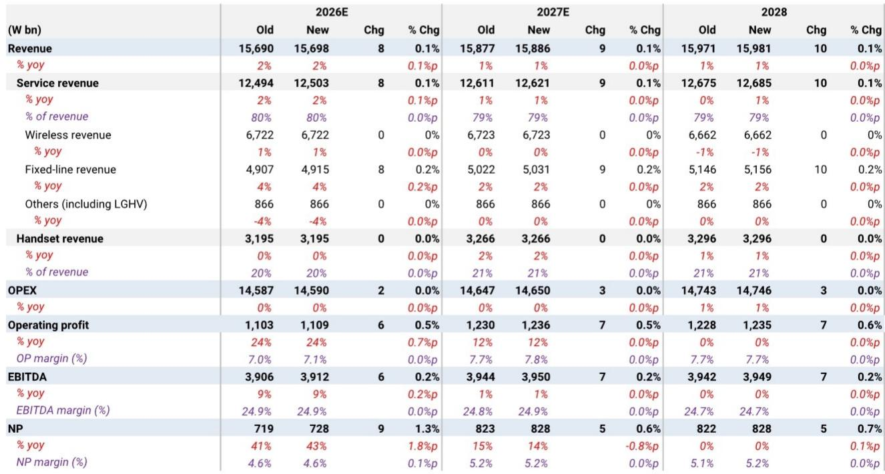
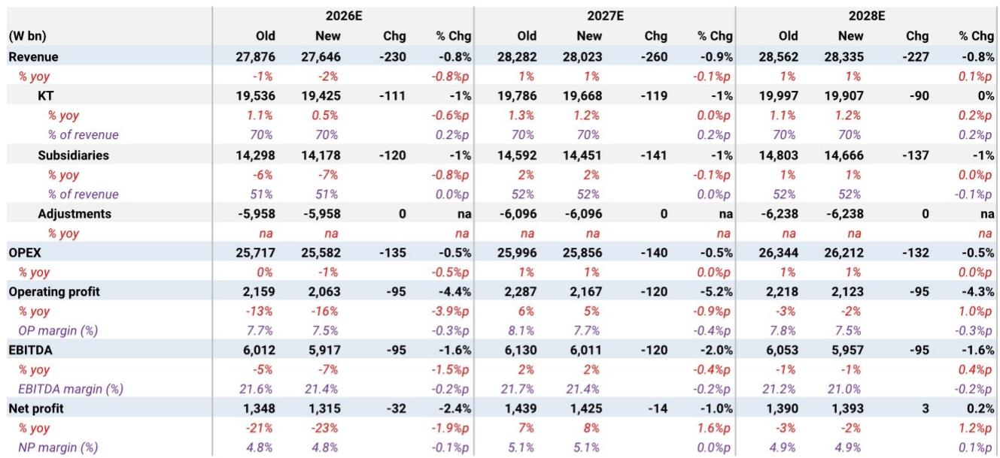
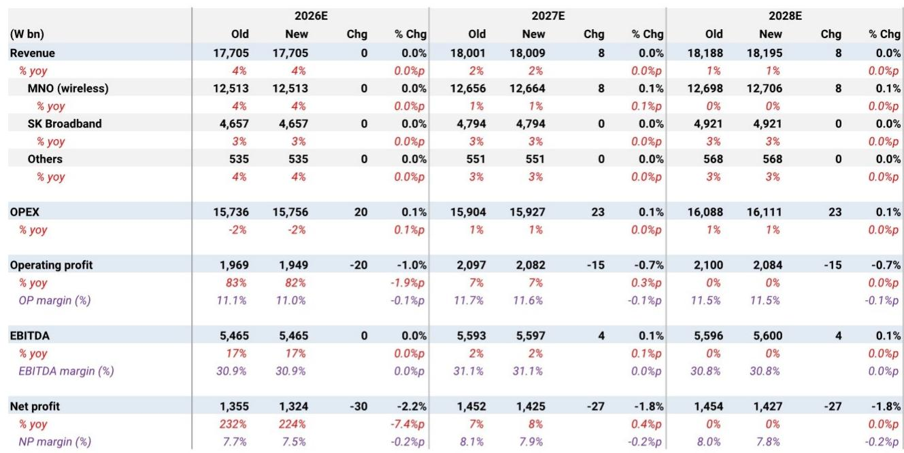

# 韩国电信公司面临战略发展节点：基础设施驱动的增长路径

即将到来的韩国电信行业季度业绩中，最值得关注的数字并非某个收入数据或利润率指标。而是KT预计将出现45%的同比营业利润下滑——而这家公司的市场定价却暗示有40%的上行空间。这种对比揭示了一个根本性的变化，即观察者需要重新评估这些企业的价值。2026年第二季度的业绩将显示三家运营商呈现出明显分化的表现轨迹，但该季度本身已变得次要，更关键的战略问题是：哪些公司已经建立了可信、高效的资本投入路径，进入人工智能数据中心基础设施领域，而哪些公司仍在提供缺乏实质证据的承诺。

预计KT的综合收入为6.8万亿韩元，同比下降8%，营业利润为5580亿韩元，同比下降45%。这一数据的大幅变化几乎完全归因于去年同期确认的约3800亿韩元的房地产开发收益。剔除这一因素，实际经营状况呈现温和的环比复苏。LGU的业绩预期更为清晰：收入3.9万亿韩元，同比增长1%，营业利润3160亿韩元，同比增长4%，两项指标均呈环比改善。SKT将呈现最大的百分比反弹，营业利润同比增长61%至5450亿韩元，但这种复苏主要是由于前期异常低基数（因数据泄露相关成本约2000至2500亿韩元）的正常化调整。

这三家公司的业绩背后有一个共同的主线。行业整体移动业务趋势仍然温和。在近期的罚金减免期之后，用户增长势头已趋于稳定，但前期用户流失、临时套餐降级以及用户获取成本摊销的持续影响，将限制盈利增长的明显提升。真正的增长引擎，以及任何差异化研究判断的基础，在于其他方面。

## 企业与数据中心业务是本季度相对少见可靠的增量增长动力

三家运营商的移动服务收入面临结构性挑战，单一季度难以逆转。在KT方面，年初以来的用户流失以及免费100G客户回馈套餐对收入的影响，继续制约着整体营收增长。该套餐已于7月结束，这应有助于从第三季度开始实现更明显的复苏，但第二季度的拖累是客观存在的。在LGU方面，由于2025年第二季度开始从SKT流入的用户基数较高，移动业务增速有所放缓。在SKT方面，营业利润的同比激增是一次性成本的机械性反转，并非基本面走强的证据。

对冲这种增长瓶颈的是企业与数据中心业务收入。KT Cloud预计将实现两位数增长，受企业专属运营、托管和私有云服务需求的推动。LGU的AIDC业务板块增长约30%，得益于现有中心利用率的提高以及企业专属运营的贡献。SKT的子公司SK Broadband受益于板桥数据中心利用率提升、合同价格续约以及宽带用户持续增长。

格局已经清晰。那些已投资于基础设施能力的运营商，其企业业务板块正看到切实的收入加速。而那些没有投资的运营商，其移动业务充其量是稳定，最差则是下滑。第二季度证实了这一分化，但更重要的问题是每家公司计划如何延续这一优势。

## KT提供了最可信赖的基础设施驱动增长选择，因其计划有需求支撑且资本高效

KT已制定计划，到2031年将其AIDC容量扩展至1千兆瓦，海底电缆容量从31 Tbps扩展至90 Tbps。关键细节不在于计划的规模，而在于执行的结构。容量扩张得到了预售的支持，这意味着在做出建设承诺之前，客户需求已被锁定。这一模式相对节省资本，降低了以往电信行业大规模基础设施建设中常见的资产负债表压力风险。

这种方法与典型的电信基础设施运营模式形成对比，后者往往是先建设，再期待需求出现。KT通过将扩张计划与签约客户承诺挂钩，实际上降低了其资本配置的风险。Gasam AIDC设施虽然已全部签约，但目前利用率较低，这意味着租赁和折旧费用在收入完全增加之前就已确认。这给KT Cloud带来了短期利润率压缩，但也意味着随着利用率提升，增量利润的传导效应将相当可观。

这种节省资本的结构也为股东回报保留了空间。KT正在执行2500亿韩元的股份回购，基础设施增长选择权与可见的资本回报相结合，形成了行业内难以匹敌的风险回报特征。分部分估值法对传统电信业务应用11倍市盈率，对KT Cloud应用9.1倍企业价值/EBITDA倍数并给予50%控股公司折价，其他子公司也给予类似折价。随着基础设施资产展现出收入可见性，市场将逐步给予其更高定价。

## LGU在改善盈利质量的同时兼顾AIDC发展选择，但市场定价容错空间有限

LGU第二季度的主题是稳定的运营改善。营销费用增长同比放缓至高个位数，低于第一季度的11.7%，原因是携号转网竞争减弱以及手机利润率改善。重组带来的劳动力成本节约提供了额外缓冲。结果是营业利润相对干净的环比复苏，利润率从第一季度的7.2%提升至第二季度的预计8.1%。

AIDC的增长轨迹令人关注。LGU计划将容量从目前的165兆瓦扩大到2030年的400兆瓦。现有中心利用率正在提高，企业专属运营的贡献正在加速。问题在于这种增长是否已被计入市场定价。在9倍预期市盈率下，如果AIDC扩张遇到延迟、成本超支或客户需求低于预期，这种定价不会提供多少安全边际。

即将公布的股东回报方案可能提供催化剂，但根本性的矛盾依然存在。LGU在盈利质量上执行良好，并拥有可信的基础设施路线图，但市场定价为意外上行预留的空间有限。在增长轨迹明显加速，或市场定价回调至纳入更保守假设的水平之前，保持观察是合适的立场。

## SKT的强劲盈利反弹是正常化而非转型，其AIDC路线图缺乏支持高市场定价所需的可见性

SKT 61%的同比营业利润增长看似显著，但其构成至关重要。前期确认的约2000至2500亿韩元USIM更换和经销商补偿成本在本期的缺失，构成了这一变化的主要部分。基础移动业务趋势稳定，继1月份KT的终止费减免后，用户持续恢复，但稳定并不等同于增长。营销费用预计仅同比小幅增长，这表明竞争激烈程度有所缓和，但也说明整体营收动能不足以需要防御性投入。

SKT内部最清晰的盈利驱动因素是SK Broadband，其收入预计同比增长3%，得益于板桥数据中心利用率提升、合同价格续约以及宽带用户增长。这是切实可见的。问题在于规模。SK Broadband的贡献有意义但并非变革性，且仅凭这一点不足以证明那种能使公司报价具备吸引力的市场倍数扩张。

由联合体主导的将AIDC容量从5千兆瓦扩大到15千兆瓦的计划是主要看点，但要对之进行资本化还为时过早。关于客户是谁、SKT的持股和资金承诺规模、所需资本投入强度以及预期资本回报，目前可见性不足。缺乏这些细节，该路线图只是一个选择权，而非一项资产。9倍市盈率的市场定价表明，当前报价已包含尚未被证据支持的关于基础设施上行空间的假设。

## 研究框架：从四个维度评估基础设施可信度

这三家运营商的分化创造了一个清晰的研究框架。观察者应围绕四个标准评估各公司的基础设施驱动增长判断：需求可见性、资本效率、盈利质量和市场定价安全边际。

在需求可见性方面，KT评分最高，因其产能扩张有预售支撑。LGU基于已证实的利用率趋势进行建设，但未披露同等水平的预先承诺。SKT有联合体计划，但未披露客户合同。在资本效率方面，KT节省资本的模式保留了资产负债表灵活性和股东回报能力。LGU的计划可信，但需要资本配置上的权衡。SKT的路线图过于模糊，无法评估资本效率。在盈利质量方面，LGU领先，利润率改善且成本趋缓；KT则处于云业务利润率压缩的过渡期，该趋势应会扭转。SKT的盈利反弹属一次性。在市场定价安全边际方面，KT隐含40%的上行空间，价值实现路径清晰。LGU有15%的上行空间，但容错空间较小。SKT隐含42%的下行空间，这与当前报价高估基础设施选择权的观点一致。

该框架表明，市场目前似乎将这些公司的基础设施轨迹视为同等可信。实际情况并非如此。KT拥有最完整且风险更低的计划。LGU运营改善，其扩张可信但尚未证实。SKT则拥有一个尚未被具体细节证实的叙事，这些细节本可让观察者更有信心地建模预测。

第二季度业绩将提供数据点，以完善这些评估。KT的云利润率和Gasam利用率的趋势将受到密切关注。LGU的AIDC增长率及其股东回报方案的细节，将决定市场定价能否扩张。对于愿意挑战当前市场定价观点的观察者而言，SKT能否为其联合体路线图提供更多信息，将是关键变量。

没有一家公司会报告一个能改变其基本轨迹的季度。业绩期的价值不在于相对数字，而在于它提供的证据：哪些基础设施策略正在取得进展，哪些仍停留在愿景阶段。对于关注中期表现的观察者而言，这一区分才是相对少见重要的。

*仅供参考。部分内容可能基于原始材料通过人工智能辅助生成、翻译、摘要或编辑，可能存在疏漏或错误。请独立核实。本文不构成研究、法律、税务、会计或其他专业建议。*

仅供参考。部分内容可能基于原始材料通过人工智能辅助生成、翻译、摘要或编辑，可能存在疏漏或错误。请独立核实。本文不构成研究、法律、税务、会计或其他专业建议。

