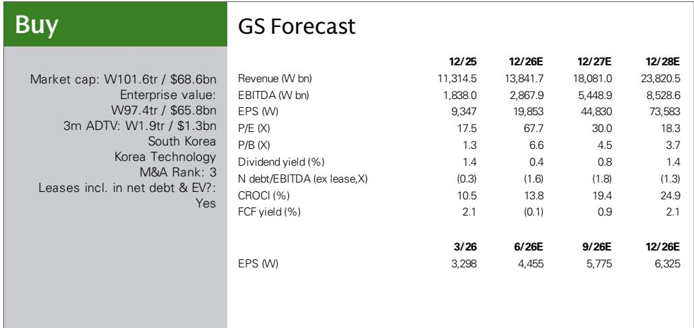
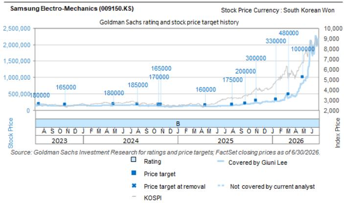

# AI服务器MLCC需求快速收紧，客户已在2026年中锁定2027年供应

在不到30天的时间里，三星电机披露了两份与同一全球客户签订的多层陶瓷电容（MLCC）合同，总额达7490亿韩元。第一份合同价值4540亿韩元，于6月30日公布；第二份价值2950亿韩元，紧随其后于7月23日公布。这两份订单合计占该公司上一财年MLCC总收入的16%，约占本财年预期收入的12%。从集中度来看，三星电机最大客户通常占其MLCC收入的10%左右。这并非正常的采购模式。

然而，最值得注意的细节是合同期限。两份协议均从2027年1月1日持续至2027年12月31日。客户在2026年中就为2027年的产量下订单。这对标准化电子元件而言并非标准做法。它表明买家预计供应环境将非常紧张，以至于等到正常交货时间可能导致配额不足。紧迫性不在于价格，而在于确保产能。

该报道将这些订单归因于AI服务器MLCC需求，其逻辑很直接。由于更高的功率传输复杂性、更多的电压调节级数以及高性能处理器周围更严格的噪声容限，每台AI服务器所需的MLCC数量远超传统服务器。随着AI服务器出货量持续快速增长，每一代GPU和ASIC平台对每块板卡MLCC数量的要求也在提高，元件层面的瓶颈正从硅片转向被动元件。MLCC长期以来被视为成熟产品类别，现已成为AI基础设施构建中的战略性约束条件。

该报道预测，三星电机AI服务器MLCC收入将在2025至2028年间增长6.4倍，到期末占其MLCC总收入的28%。这是公司收入结构的结构性转变，而非周期性上升。其影响远不止于单一供应商。

## 两份合同揭示AI基础设施瓶颈正从硅片转向被动元件

半导体行业过去两年一直聚焦于GPU供应约束、先进封装产能和高带宽存储器可用性。这些瓶颈并未消失，但市场已开始为其逐步缓解定价。而在芯片堆叠之下的被动元件层面受到的关注则少得多。MLCC并不引人注目，也不会在关于AI战略的业绩电话会上被讨论。但每一台AI服务器都包含数千颗MLCC，而行业以所需产量生产高可靠性、高容值MLCC的能力并非弹性无限。

该报道预计三星电机MLCC产能利用率在整个预测期内将保持在90%以上，这与此观点一致。当主要供应商长期在接近满产水平运行时，定价权会发生转移。报道明确指出，供应紧张条件应会对定价形成正面支撑。这与历史上MLCC被视为通缩型产品、价格逐年下滑的常规描述有重要区别。

提前采购2027年产量的行为强化了这一判断。客户不会提前18个月预订标准化元件，除非他们相信现货供应不可靠。单一客户愿意为单年供应承诺近7500亿韩元，且在数周内签署两份独立合同，这表明买家的内部需求预测超出了其认为市场在正常采购时间框架内所能供应的量。

## MLCC供应纪律是使本轮周期区别于以往上行的结构性因素

MLCC行业历史上存在繁荣-萧条周期：强劲需求导致产能扩张，进而导致供应过剩，价格下跌，产能削减，再引发下一次短缺。本轮周期在两个重要方面有所不同。

第一，需求驱动因素并非广泛的消费电子替换周期。AI服务器需求集中、规格高，且复合增长率超过行业增加合格产能的能力。建设一条新的MLCC产线需要12至18个月，但将该产线通过AI服务器客户所需的可靠性认证还需要额外时间。瓶颈不仅是物理产能，更是认证产能。

第二，主要MLCC制造商已经从2019-2020年的痛苦供应过剩中吸取教训。产能扩张更加克制，专注于高利润率特种产品而非大宗商品化扩张。报道预计三星电机产能利用率保持在90%以上，反映了这种结构性纪律。如果行业一直在积极扩张产能，随着新产线投产，利用率本应下降。但实际预期是保持紧张。

这两个因素的结合意味着当前定价环境并非暂时性冲高，而是服务于AI基础设施的MLCC市场的新基线。报道的财务预测证实了这一点：EBITDA预计将从2025年的1.8万亿韩元增长至2028年的8.5万亿韩元，约增长4.6倍；同期收入预计将翻番以上。这些并非周期性数字，而是由向高价值产品混合转变驱动的结构性增长数字。

## 汽车MLCC市场提供第二需求支柱，避免单一故障点风险

AI服务器需求是头条驱动因素，但报道也强调汽车MLCC是持续的需求来源。这对研究观点意义重大，因为它使需求基础多样化。如果AI服务器构建是相对少见驱动因素，那么超大规模资本支出放缓将带来显著的下行风险。但汽车向电动化和高级驾驶辅助系统的转型同样需要大量MLCC，且这一需求与AI基础设施处于不同周期。

一辆电动汽车所含MLCC数量约为内燃机汽车的两到三倍。ADAS系统进一步增加了复杂性。汽车MLCC市场稳步增长而非爆发式增长，其认证周期甚至比AI服务器更长。车规级MLCC需要通过AEC-Q200标准认证，一旦供应商获得认证，切换成本很高。这形成了粘性收入基础，即使AI服务器需求波动也有助于支撑产能利用率。

报道预计三星电机MLCC利用率在整个预测期内保持在90%以上，这隐含假设AI服务器和汽车需求均保持强劲。如果其中任何一端走弱，利用率可能下降，但由于两者需求驱动因素不同，同时走弱的可能性较低。汽车端提供了下限，AI服务器端提供了上升空间。

## 决策框架：如何在AI基础设施构建中评估MLCC供应商

对于评估MLCC供应链敞口的市场参与者和策略制定者，该报道提供了几个具体的分析视角。第一个是客户集中度风险。三星电机最大客户约占MLCC收入的10%，但来自单一客户的两份已披露合同已占本财年预期收入的12%和上一财年收入的16%。这表明该客户是超大规模企业或主要AI服务器OEM，正在整合其供应基础。对三星电机而言，这是需求可见性的积极信号，但也产生了依赖性。参与者应关注客户基础是随时间扩大还是继续集中。

第二个视角是合同期限和时点。合同在交付前18个月签署，这是供应紧张的领先指标。如果其他MLCC供应商开始报告类似的早期采购模式，则确认约束是行业性的而非单一供应商特有。如果没有，则表明三星电机在高可靠性服务器级MLCC方面具有竞争优势，能够捕获超额需求。

第三个视角是产能利用率轨迹。报道预计持续90%以上的利用率意味着定价权和利润率扩张。但如此高的利用率也带来风险。如果单一主要客户推迟部署时间表或转向替代元件架构，对收入和利润率的影响可能是突发的。参与者不仅要跟踪利用率，还要跟踪填补该利用率的构成需求。

第四个视角是MLCC收入增长与总收入增长之间的关系。三星电机总收入预计从2025年的11.3万亿韩元增长至2028年的23.8万亿韩元。MLCC是重要贡献者，但该公司还生产FC-BGA基板，报道预计该业务将从AI客户扩张中受益。这两条产品线的相互作用很重要。如果两者都因AI需求增长，则公司对同一终端市场有多元化敞口。如果其中一个走弱，另一个可能弥补，但两者之间的相关性可能很高。

## 供应紧张信号对AI服务器交货时间和超大规模部署日程的影响

MLCC供应约束最被低估的影响在于其对AI服务器生产计划的影响。超大规模企业订购新一代AI服务器平台时，必须确保GPU、HBM存储器、网络芯片、电源管理IC和被动元件。其中任何一个受约束，整个服务器构建都将延迟。GPU约束占据了头条新闻，MLCC约束则一直处于隐形状态。

但这些合同所揭示的早期采购行为表明，MLCC正成为制约项目进度的项目。如果超大规模企业愿意提前18个月为MLCC投入资金，那是因为替代方案是生产延迟。该延迟将导致更昂贵的GPU和存储器投资被搁置。MLCC成本相对于服务器总物料清单来说很小，但其可用性现在对部署时间线至关重要。

这种动态为MLCC供应商创造了有趣的战略位置。它们不是服务器中最昂贵的元件，但正成为最重要的元件之一。这赋予了它们与其BOM份额不相称的定价杠杆。报道对持续定价正面支撑的预期与这一结构性转变一致。

当然，风险在于MLCC行业以激进产能扩张回应，最终削弱定价。但报道的利用率预测表明，即使考虑已在计划中的产能增加，供应仍将在2028年前保持紧张。这是一个多年期的有利条件窗口，而非一两个季度。

## 财务轨迹暗示市场尚未完全为这一结构性转变定价

基于分部估值法使用2027-2028年EV/EBITDA倍数，EBITDA在三年内从1.8万亿韩元增至8.5万亿韩元的预期幅度显著。如果实现，这将是韩国科技行业最突出的利润扩张之一。

对市场参与者而言，问题是这一增长是否已被折现。报道的前瞻市盈率倍数显示从2026年预估的67.7倍压缩至2028年预估的18.3倍，这对高增长公司而言是典型现象——随着盈利赶上报价水平。但2026年预估的67.7倍表明市场已给予显著增长溢价。风险在于，AI服务器构建速度的任何不如预期都可能导致倍数在盈利实现之前压缩。

报道的评级为【报告观点】，其研究逻辑建立在AI服务器和汽车领域MLCC需求的坚实基础上，以及AI客户扩张带来的强劲FC-BGA增长。两份大型MLCC合同提供了需求逻辑正在兑现的具体证据。早期采购模式提供了供应约束真实存在的证据。利用率预测提供了定价将保持有利的证据。

这些因素的结合形成了一个连贯的研究案例，但并非没有执行风险。MLCC行业此前曾出现意外下滑。本次的关键区别在于AI服务器需求的结构性以及供应基础的纪律性。如果两者均如【报告观点】所述，财务轨迹是可以实现的。如果其中任何一个出现偏差，下行可能迅速发生。

目前，最重要的数据点不是合同规模，而是日期。客户在2026年中锁定2027年供应，这告诉你一些关于市场状况的信息，那是任何业绩电话会指引都无法捕捉到的。

*仅供参考。部分内容可能基于源材料通过AI辅助生成、翻译、摘要或编辑，可能存在遗漏或错误。请独立核实。本文不构成研究、法律、税务、会计或其他专业建议。*

仅供参考。部分内容可能基于源材料通过AI辅助生成、翻译、摘要或编辑，可能存在遗漏或错误。请独立核实。本文不构成研究、法律、税务、会计或其他专业建议。

