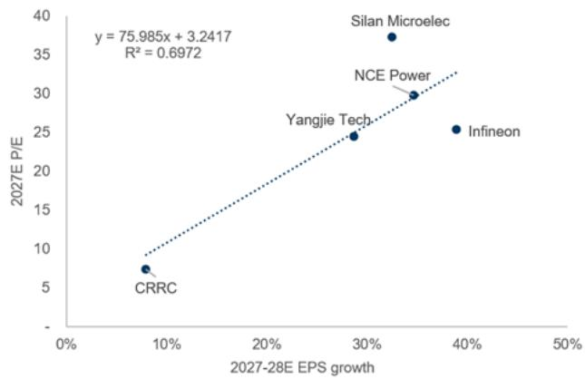
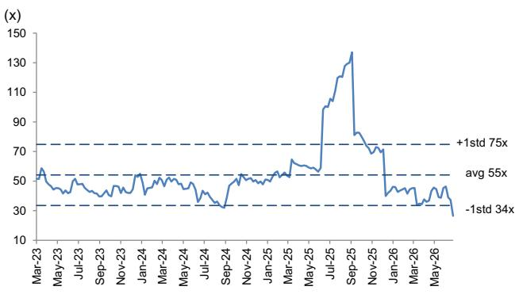

# 产品线扩展支撑增长前景；第二季度净利润指引符合预期；维持中性观察

某公司（603290.SS）1-6月净利润初步结果发布，第二季度净利润中点同比下降77%，环比增长48%，至3900万元，与我们的估计一致，但比彭博一致预期低57%。管理层将净利润同比变化归因于：（1）原材料价格变动导致毛利率波动；（2）下一代IGBT、SiC MOSFET、DrMOS、GaN功率IC及模块的研发投入增加，对盈利能力产生影响。管理层表示，终端客户已了解原材料成本上升情况，但产品报价调整需按照既定业务流程进行。我们仍关注该公司产品线从IGBT向SiC MOSFET、GaN HEMT、MCU的扩展，终端市场从新能源车向AI数据中心、工业、机器人、家电等领域的拓展，以捕捉终端需求的增长。随着新产品出货量的提升，公司毛利率有望在长期内逐步恢复。维持中性观察。

**表1：第二季度净利润指引**

| 人民币百万元 | 第二季度预告低端 | 第二季度预告高端 | 第二季度预告中点 | 第二季度GS估计 | 与中点差异 | 第二季度一致预期 | 与中点差异 | 第二季度 | 同比 | 第一季度 | 环比 |
|---|---|---|---|---|---|---|---|---|---|---|---|
| 净利润 | 29 | 49 | 39 | 39 | 1% | 91 | -57% | 172 | -77% | 27 | 48% |

来源：公司数据、GS全球研究、彭博

**盈利调整：** 我们根据公司第二季度净利润指引，下调2026-2028年净利润预测，主要由于毛利率调整及运营费用比率上升。我们将2026-2028年毛利率预测下调1.0-1.5个百分点，反映原材料成本上升对毛利率的影响，同时预计未来随着新产品出货量提升，毛利率将逐步改善。我们上调2026-2028年运营费用比率，主要反映下一代产品研发投入的增加。

**表2：盈利调整**

| (人民币百万元) | 2026年新 | 2026年旧 | 差异 | 2027年新 | 2027年旧 | 差异 | 2028年新 | 2028年旧 | 差异 |
|---|---|---|---|---|---|---|---|---|---|---|
| 营收 | 4,615 | 4,615 | 0% | 5,817 | 5,817 | 0% | 6,351 | 6,351 | 0% |
| 毛利润 | 1,163 | 1,231 | -6% | 1,615 | 1,678 | -4% | 1,778 | 1,841 | -3% |
| 运营收入 | 463 | 540 | -14% | 829 | 893 | -7% | 918 | 983 | -7% |
| 净利润 | 501 | 577 | -13% | 855 | 918 | -7% | 941 | 1,005 | -6% |
| **利润率** | | | | | | | | | |
| 毛回报率 | 25.2% | 26.7% | -1.5ppts | 27.8% | 28.8% | -1.1ppts | 28.0% | 29.0% | -1ppts |
| 运营回报率 | 10.0% | 11.7% | -1.7ppts | 14.2% | 15.4% | -1.1ppts | 14.5% | 15.5% | -1ppts |
| 净回报率 | 10.9% | 12.5% | -1.6ppts | 14.7% | 15.8% | -1.1ppts | 14.8% | 15.8% | -1ppts |

来源：公司数据、GS全球研究

**估值：** 我们继续使用短期市盈率推导12个月目标报价。2027年目标市盈率更新为33.8倍（此前31.4倍），主要基于2027-2028年净利润平均增长率的调整，该倍数仍来自同行业公司的远期交易市盈率及净利润增长率。结合更新后的目标倍数与盈利预测，12个月目标报价维持不变，为121.2元。维持中性观察。

**表3：公司及全球同行业公司2027年市盈率与2027-2028年盈利增长**

来源：公司数据、GS全球研究

**表4：公司12个月远期市盈率**

来源：公司数据、GS全球研究

**表5：公司损益表摘要**

| (人民币百万元) | 第一季度 | 第二季度 | 第三季度 | 第四季度 | 第一季度 | 第二季度E | 第三季度E | 第四季度E | 2022 | 2023 | 2024 | 2025 | 2026E | 2027E | 2028E |
|---|---|---|---|---|---|---|---|---|---|---|---|---|---|---|---|
| 营收 | 919 | 1,016 | 1,054 | 1,023 | 864 | 951 | 1,333 | 1,467 | 2,705 | 3,663 | 3,391 | 4,012 | 4,615 | 5,817 | 6,351 |
| 毛利润 | 279 | 296 | 259 | 212 | 182 | 203 | 370 | 408 | 1,090 | 1,374 | 1,070 | 1,047 | 1,163 | 1,615 | 1,778 |
| 运营收入 | 99 | 158 | 92 | 6 | 18 | 27 | 192 | 226 | 788 | 956 | 563 | 356 | 463 | 829 | 918 |
| 净利润 | 104 | 172 | 106 | 23 | 27 | 39 | 200 | 235 | 818 | 911 | 508 | 405 | 501 | 855 | 941 |
| 每股回报（元） | 0.43 | 0.72 | 0.44 | 0.10 | 0.11 | 0.16 | 0.84 | 0.98 | 4.79 | 5.33 | 2.12 | 1.69 | 2.09 | 3.57 | 3.93 |
| **利润率/比率** | | | | | | | | | | | | | | |
| 毛回报率 | 30.4% | 29.2% | 24.5% | 20.8% | 21.1% | 21.4% | 27.7% | 27.8% | 40.3% | 37.5% | 31.6% | 26.1% | 25.2% | 27.8% | 28.0% |
| 运营费用比率 | -19.6% | -13.7% | -15.8% | -20.2% | -19.0% | -18.6% | -13.3% | -12.4% | -11.2% | -11.4% | -14.9% | -17.2% | -15.2% | -13.5% | -13.6% |
| 运营回报率 | 10.8% | 15.5% | 8.8% | 0.6% | 2.0% | 2.8% | 14.4% | 15.4% | 29.1% | 26.1% | 16.6% | 8.9% | 10.0% | 14.2% | 14.5% |
| 净回报率 | 13.7% | 18.2% | 10.7% | 1.9% | 3.2% | 4.2% | 15.4% | 16.5% | 34.3% | 28.5% | 17.9% | 11.0% | 11.1% | 15.2% | 15.4% |
| **环比** | | | | | | | | | | | | | | |
| 营收 | -6% | 11% | 4% | -3% | -16% | 10% | 40% | 10% | | | | | | | |
| 毛利润 | -8% | 6% | -13% | -18% | -14% | 12% | 82% | 10% | | | | | | | |
| 运营收入 | -20% | 58% | -41% | -93% | 182% | 54% | 614% | 18% | | | | | | | |
| 净利润 | 23% | 66% | -38% | -78% | 14% | 47% | 411% | 18% | | | | | | | |
| 每股回报 | 23% | 66% | -38% | -78% | 14% | 47% | 411% | 18% | | | | | | | |
| **同比** | | | | | | | | | | | | | | |
| 营收 | 14% | 40% | 20% | 5% | -6% | -6% | 27% | 43% | 59% | 35% | -7% | 18% | 15% | 26% | 9% |
| 毛利润 | 9% | 30% | -8% | -30% | -35% | -31% | 43% | 92% | 74% | 26% | -22% | -2% | 11% | 39% | 10% |
| 运营收入 | -40% | 51% | -45% | -95% | -82% | -83% | 108% | 3537% | 82% | 21% | -41% | -37% | 30% | 79% | 11% |
| 净利润 | -36% | 53% | -28% | -72% | -74% | -77% | 88% | 906% | 105% | 11% | -44% | -20% | 24% | 70% | 10% |
| 每股回报 | -36% | 53% | -28% | -72% | -74% | -77% | 88% | 906% | 93% | 11% | -60% | -20% | 24% | 70% | 10% |

来源：公司数据、GS全球研究

## 目标报价风险与方法论

**估值方法：** 我们对公司持中性观察，12个月目标报价为121.2元。我们采用33.8倍目标市盈率乘以2027年每股回报预测。目标市盈率倍数来源于该行业市盈率与每股回报同比增长的相关性。

**主要风险：** 1）IGBT市场增长强于或弱于预期；2）新设计中标及市场份额增长快于或慢于预期；3）新产品开发进度快于或慢于预期；4）竞争格局变化。
