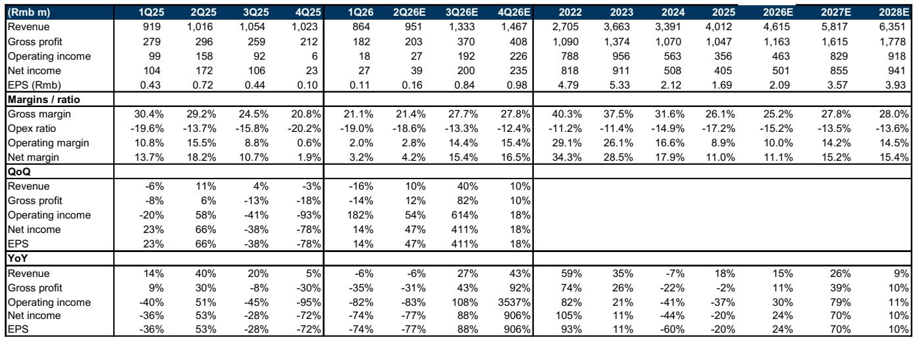
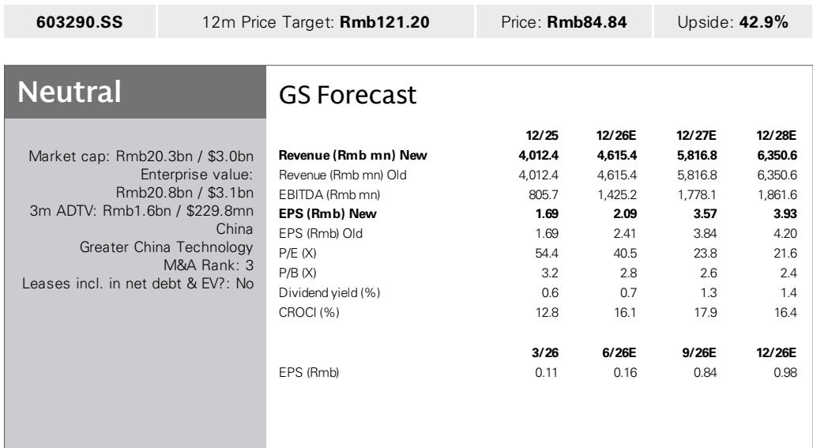
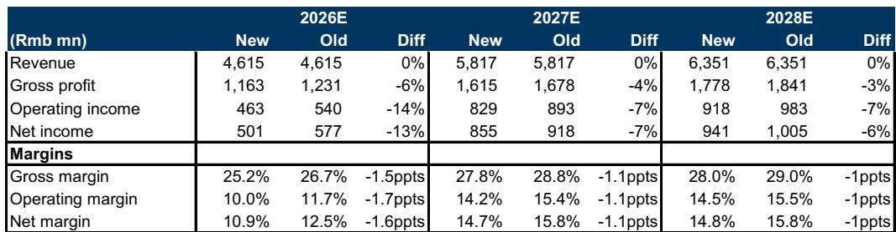

# 斯达半导业务与季度数据观察

斯达半导发布2026年上半年业绩预告，第二季度利润中值3900万元，同比下降77%，环比增长48%，与该机构预期一致，但低于彭博一致预期57%。这份报告的核心判断是：公司正处于产品线从IGBT向SiC、GaN、DrMOS及MCU扩张的关键阶段，短期利润受原材料价格和研发投入双重影响，但长期毛利率有望随新产品放量而逐步改善。该机构更新了对公司的观察。

报告将利润同比下降归因于两个因素：原材料成本上升导致毛利率下降，以及下一代IGBT、SiC MOSFET、DrMOS、GaN功率IC和模块的研发支出增加。值得注意的是，终端客户已认可原材料成本上涨，但产品价格调整需按既定业务流程推进，这意味着短期毛利率的变化尚未完全明确。

## 1. 第二季度利润指引与预期差异反映短期不确定性

斯达半导第二季度利润中值3900万元，位于公司指引区间2900万至4900万元的中位。与该机构预期的3900万元一致，但较彭博一致预期的9100万元低57%。同比来看，第二季度利润较去年同期的1.72亿元下降77%；环比则较第一季度的2700万元增长48%。

从利润表细节看，毛利率从2025年第一季度的30.4%持续下滑至2026年第一季度的21.1%，第二季度预计进一步降至21.4%。运营费用率从2025年的17.2%升至2026年第一季度的19.0%，研发投入是主要驱动因素。该机构据此调整了2026-2028年毛利率预期，下调1.0-1.5个百分点，并上调运营费用率。

> **观察评论：** 第二季度利润环比增长48%可能引起一些关注，但同比-77%的基数效应值得留意。2025年第二季度是近年利润高点，此后毛利率已从29.2%降至21%左右。读者可以关注毛利率何时趋稳，而非单季利润的同比波动。

## 2. 产品线从IGBT向多品类扩张是中期增长核心逻辑

该机构对斯达半导的积极看法基于产品线扩张：从IGBT延伸至SiC MOSFET、GaN HEMT、DrMOS及MCU，终端市场从电动汽车扩展至AI数据中心、工业、机器人和家电。报告认为，随着新产品出货量爬坡，公司毛利率将在长期内逐步恢复。

这一判断的支撑来自收入预期：2026-2028年收入预计分别为46.15亿、58.17亿和63.51亿元，年复合增长率约17%。但毛利率预期从2025年的26.1%降至2026年的25.2%，2027-2028年才逐步回升至27.8%和28.0%。这意味着新产品对毛利率的正面贡献可能在2027年之后显现。

## 3. 估值框架基于同业比较与盈利增长

该机构采用相对估值方法，将2027年目标估值倍数从31.4倍上调至33.8倍，主要依据2027-2028年平均净利润增长率高于此前预期。估值逻辑的参照系是斯达半导的国内外同业：报告通过图表3展示了同业2027年估值倍数与2027-2028年盈利增长的分布关系。目标估值倍数的上调反映了盈利增长预期的改善，但利润预测本身被下调了13%/7%/6%。

## 4. 可复用的观察框架：产品线扩张期的利润承压与恢复路径

这份报告提供了一个分析半导体公司从单一产品向多品类扩张时期的框架：短期利润受研发投入前置和原材料成本传导滞后影响，中期毛利率恢复取决于新产品放量速度，长期估值支撑来自终端市场多元化带来的收入增长确定性。

具体到斯达半导，可以跟踪三个指标：一是季度毛利率是否在2026年下半年企稳，二是SiC和GaN产品的收入占比何时达到可量化披露水平，三是研发费用率是否在2027年随收入增长而自然稀释。报告未完全展开的是，新产品在AI数据中心和机器人领域的客户导入进度，以及国内竞争对手在相同产品线上的竞争态势。

For informational purposes only. Portions may be generated,translated,summarized,or edited with AI assistance based on source materials and may contain omissions or errors. Please verify independently. This is not investment,legal,tax,accounting,or other professional advice.

For informational purposes only. Portions may be generated,translated,summarized,or edited with AI assistance based on source materials and may contain omissions or errors. Please verify independently. This is not investment,legal,tax,accounting,or other professional advice.

