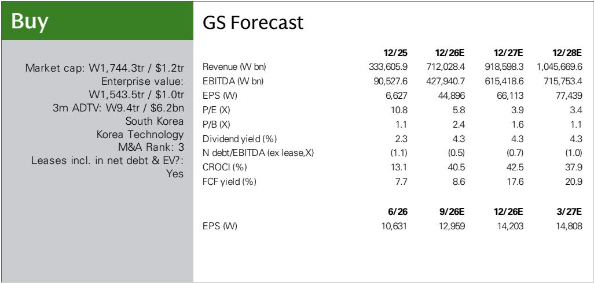
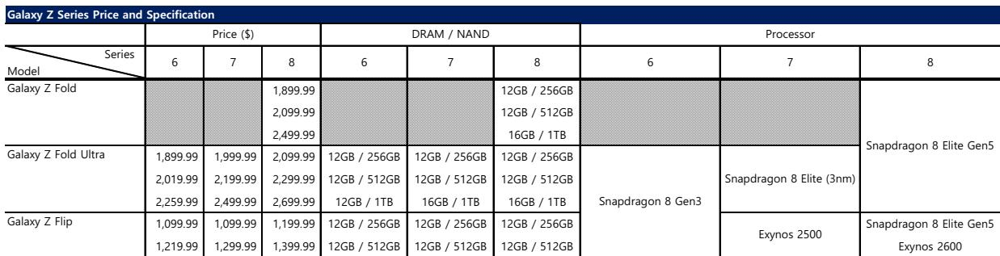
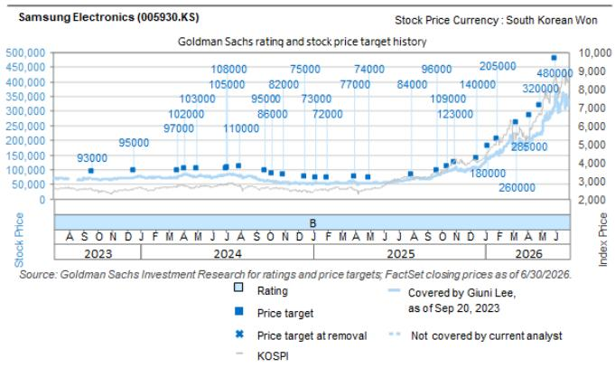

# GS：研究主题与行业变化观察

7月22日，三星电子发布Galaxy Z Fold/Flip 8系列三款机型，定价较上一代上涨5-8%，幅度约100-200美元。GS在当日报告中指出，此次提价并非来自内存规格升级——DRAM与NAND容量与前代完全一致，涨价更可能反映上游存储芯片价格上涨的传导。与此同时，三星MX/NW业务（移动与网络）营业利润预计同比下滑93%，但存储业务的利润增长足以覆盖这一缺口，推动公司整体营业利润同比增长8.6倍。

这份报告的核心判断是：三星的利润重心正在从终端设备向存储芯片迁移，折叠屏手机提价更多是成本被动转嫁，而非产品力驱动的溢价提升。

## 1. 折叠屏定价上调但内存配置未变，成本传导而非规格升级

GS对比了Galaxy Z Fold 6/7/8三代产品的规格表。Fold 8 Ultra起售价从1,999美元升至2,099美元，Flip 8起售价从1,099美元升至1,199美元。但DRAM与NAND配置在三代之间几乎没有变化：Fold系列仍以12GB DRAM搭配256GB/512GB/1TB NAND为主，Flip系列同样维持12GB DRAM配置。处理器方面，Fold 8 Ultra升级至Snapdragon 8 Elite（3nm），但这一变化不足以解释100-200美元的定价涨幅。

报告认为，涨价更可能反映存储芯片价格上涨对终端成本的挤压。GS预计，三星2026年智能手机整体出货量将同比下降3%至2.32亿部，折叠屏的高定价可能进一步抑制消费者需求。

> **KC评论：** 折叠屏定价上涨但内存规格不变，说明终端厂商在存储涨价周期中缺乏议价能力。这张规格对比表（Exhibit 1）最容易被忽略的信息是：三星没有选择通过减配来消化成本，而是直接提价，这暗示其对折叠屏需求弹性的判断偏乐观。

## 2. MX/NW业务利润预计下滑93%，存储业务成为利润核心

GS对三星各业务线的利润预测揭示了结构性变化。2026年，三星MX/NW业务营业利润预计同比下滑93%，主要受内存成本上升和出货量下降双重挤压。但同期存储业务利润增长预计将显著超过这一降幅，推动公司整体营业利润从2025年的较低基数增长8.6倍。

报告给出的财务预测显示，三星2026年营收预计为712万亿韩元，EBITDA为428万亿韩元，每股回报从2025年的6,627韩元跃升至44,896韩元。2027年每股回报进一步升至66,113韩元。这一利润结构意味着，三星的估值逻辑正在从“消费电子+半导体”双轮驱动，转向以存储芯片为核心的单一利润引擎。

## 3. 新折叠形态与AI功能引入，但短期对利润贡献有限

Galaxy Z Fold 8采用了新的屏幕比例（主屏4:3，外屏10:16），更便于单手操作。同时，该系列成为首款搭载Gemini Intelligence的智能手机，支持超过40款应用的自动化任务，覆盖购物、餐厅预订、旅行和票务场景。

GS在报告中提及这些功能，但并未将其作为利润增长的驱动因素。从定价策略看，AI功能的引入并未转化为更高的溢价空间——涨价幅度完全可以用内存成本上升解释。这意味着，折叠屏的差异化竞争仍停留在硬件形态层面，AI尚未成为消费者愿意额外付费的理由。

## 4. 估值框架：存储利润主导下的SOTP定价

，基于2026-2027年EV/EBITDA的SOTP估值法。，基于过去一个月优先股折价的平均值。报告同时列出了三项节奏变化不确定性：存储供需大幅出现变化、智能手机利润率急剧调整、以及移动OLED市场份额流失。

从估值角度看，三星当前报价26.05万韩元对应2026年估值倍数约5.8倍、2027年估值倍数约3.9倍。GS预测的2026年FCF回报表现为8.6%，2027年升至17.6%。这些数字反映市场对存储周期持续性的定价仍偏保守，但报告并未讨论周期见顶后的利润回落情景。

> **KC评论：** GS对三星的估值框架本质上是“存储利润乘以一个周期中值倍数”。读者需要关注的是，当存储周期转向时，MX业务的亏损是否会放大整体利润波动——这份报告没有展开这一情景，但给出了足够的数据让读者自行推演。

For informational purposes only. Portions may be generated,translated,summarized,or edited with AI assistance based on source materials and may contain omissions or errors. Please verify independently. This is not investment,legal,tax,accounting,or other professional advice.

For informational purposes only. Portions may be generated,translated,summarized,or edited with AI assistance based on source materials and may contain omissions or errors. Please verify independently. This is not investment,legal,tax,accounting,or other professional advice.

