SPOTLIGHT

# 中国医疗健康领域：AI药物发现（AIDD）

从实验阶段到成果转化

我们提供一份路线图，以帮助理解AI药物发现领域——中国叙事驱动性和市场动态最为显著的行业之一。

市场估值更多源于选择性潜力，而非基本面因素；最大的机会往往来自市场定价偏差和波动。

在今日同步发布的相关报告中，我们对Insilico Medicine和XtalPi发表了初步研究看法。

∧i

无惧空头

第24期新兴市场情绪调查 点击查看

披露与免责声明：本报告必须连同披露附录中的披露内容及分析师证明，以及构成报告一部分的免责声明一并阅读。

## 为何阅读本报告？

- 我们提供一份路线图，以帮助理解AI药物发现领域——中国叙事驱动性和市场动态最为显著的行业之一。
- 市场估值更多源于选择性潜力，而非基本面因素；最大的机会往往来自市场定价偏差和波动。
- 在今日同步发布的相关报告中，我们对Insilico Medicine和XtalPi发表了初步研究看法。

## 一个具有变革性的领域，但尚未形成共识

利用AI发现新药正迅速成为中国最大且最易被误解的研究主题之一。数十亿美元资金流入该领域，与全球知名药企的合作加速推进，市场估值越来越多地体现平台潜力，而非当前盈利。然而，尽管热情高涨，读者仍面临一个关键问题：对于这些AI药物发现（AIDD）公司究竟是什么——软件公司、生物科技公司、合同研究组织（CRO），还是未来的平台垄断者——尚无共识。

我们指出，一方面，AI正明显改变药物发现流程，缩短时间线、降低实验成本，并重塑药企的研发分配方式。另一方面，成果转化仍处于早期，商业模式仍在演变，许多上市公司的交易更多基于叙事、选择性潜力和AI稀缺溢价，而非可预测的现金流。

鉴于潜在上行空间巨大，但亦存在显著的定价偏差风险，我们探讨当前塑造AIDD领域的五大读者关注议题：

1. 成果转化正在何处显现？哪些商业模式具有结构性持久性，哪些易被商品化？
2. 真正影响这些公司报价的是什么？
3. 读者应如何评估平台的选择性潜力？
4. 在AI模型可迅速商品化的世界中，长期竞争优势是什么？
5. 价值链的哪些部分能够获取经济价值——哪些部分会被压缩？

我们的差异化方法包含五个要素：

- 中美战略对比与竞争定位。
- 早期互联网平台演进及CRO行业整合的经验。
- 一个识别未来定价权与数据优势形成点的框架。
- 对估值方法可能存在的错误——特别是围绕平台可扩展性、人才价值及下游资产所有权的分析。
- 一份用于理解市场最叙事驱动和最动态领域之一的路线图。

这是我们关于“未来医疗”主题的最新报告。如欲订阅我们九大主题之一，请点击此处。

我们的核心观点？AIDD的赢家可能并非今天拥有最佳AI模型的公司，而是那些能够持续从自身数据中学习、深度融入药企工作流程、并规模化创造有价值的药物资产的平台。

该领域可能在未来三至五年内成为定义医疗平台转型的领域之一。但将持久的平台赢家与暂时的AI炒作区分开，需要一个根本不同的研究框架，这正是本报告的主题。

## 关键读者议题：我们的核心发现

1. **AIDD目前在哪里实现成果转化？哪些商业模式具有持久性，哪些面临风险？** 当前的成果转化是真实的，但仍集中在较低价值层，如软件即服务（SaaS）产品、药物发现费用和CRO服务。我们认为长期价值将向下游转移，转向资产所有权、专有数据和改善的平台经济。纯SaaS提供商面临日益增长的商品化风险。
2. **什么因素推动AIDD公司报价变化——为什么领先地位变化如此之快？** AIDD受三个因素驱动：叙事、事件催化剂和基本面。在上涨市场中，AI叙事通常占主导。在避险期间，资金消耗速度和成果转化更为重要。判断这些因素何时切换及重要性提升是关键。
3. **什么是正确的估值框架？** 我们认为传统DCF框架不足，因为AIDD公司越来越多地作为“期权组合”进行交易——结合平台能力、人才稀缺性、专有数据和未来生态系统价值。市场正在定价其未来潜在轨迹，而非当前现金流。
4. **什么是长期竞争优势？** 我们预计大多数AI优势将被商品化。相反，持久的优势将来自专有数据生成、工作流程整合、监管地位和湿实验室基础设施——而不仅仅是更好的算法。
5. **读者可以从互联网和CRO行业学到什么？** 像早期的互联网和CRO领导者一样，AIDD的赢家可能从分散的工具演变为集成平台。历史上的赢家捕获了生态系统、嵌入工作流程和长期转换成本——而不仅仅是特性层面的创新。
6. **在AI药物发现中，什么会被商品化，什么具有防御性？** 通用建模、蛋白质折叠和分子设计能力正迅速标准化。防御性价值越来越多地存在于专有生物学数据、患者数据获取、实验反馈循环和可扩展的资产生成基础设施中。

图表2. HSBC AI医疗健康估值框架：“分层交易” HSBC AIDD商业模式演进与估值  
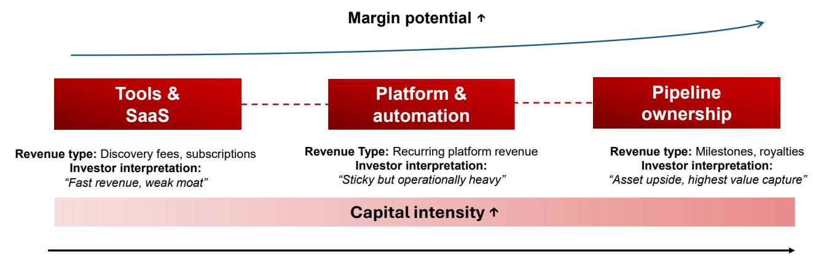  
我们以图表形式呈现的投资观点  
图表1. AIDD：从工具到管线所有权的价值迁移曲线  
AIDD的价值迁移曲线  
长期  
来源：Pharmcube，公司报告，HSBC Qianhai Securities

利润率潜力↑

收入类型：发现费用，订阅
读者解读：
“收入快，优势弱”

收入类型：经常性平台收入
读者解读：
“粘性但运营重”

收入时间

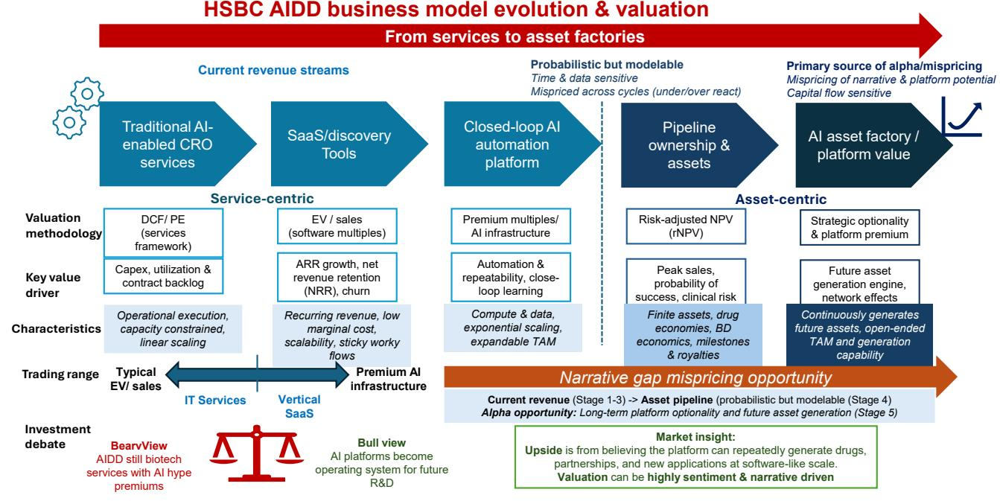  
来源：Pharmcube，公司报告，HSBC Qianhai Securities

AI平台服务

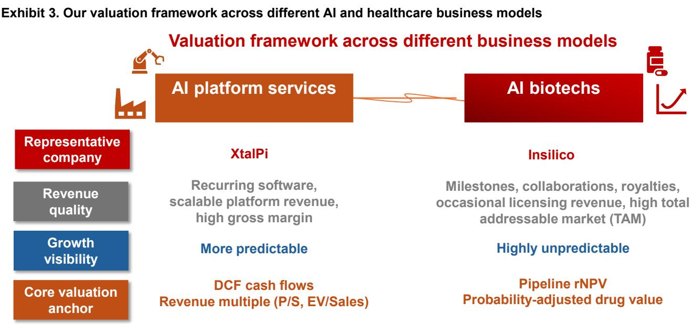

经常性软件、可扩展的平台收入、高毛利率

更可预测

里程碑、合作、特许权使用费、偶发性许可收入、高总可寻址市场（TAM）

DCF现金流
收入倍数（P/S，EV/Sales）

管线rNPV
概率调整的药物价值

来源：Pharmcube，公司报告，HSBC Qianhai Securities

图表4. AI医疗健康优势框架：区分信号与噪音  
HSBC AIDD优势层级

• 临床成功

• 监管关系

\- 管线所有权

较强优势

临床与监管验证 - 特许权使用费/里程碑

获批成果成为终极优势

防御性增强

数据 + 工作流程整合
- 集成系统不断强化
- 湿性闭环学习系统 • 专有数据集

• 药企工作流程嵌入

• 湿实验室反馈循环

• 闭环学习系统

最易商品化

模型与算法

\- 独立SaaS

\- 通用AI模型

仅凭智能很少能维持定价权

• 一次性发现项目

图表5. 优势不在于模型，而在于反馈循环

AIDD中的闭环

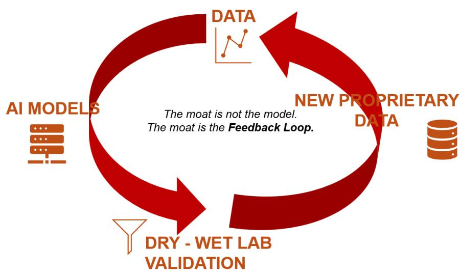  
优势不在于模型。
优势在于反馈循环。  
来源：Pharmcube，公司报告，HSBC Qianhai Securities

## 图表6. 全球AIDD市场趋势：美国和中国正以不同方式构建生态系统 全球AIDD交易趋势    中国聚焦：价值迁移

  
前沿AI与大型科技公司：生物学垂直领域的进军
押注未来TAM与平台选择性

  
药企-AIDD平台合作增加

  
服务提供商
按服务收费模式

  
知识产权合作伙伴 / 对外许可
采用生物科技经济模式（首付款+里程碑）

  
- 基础模型
- 多模态生物学数据
- 专有数据优势
- 模拟分子相互作用

## 中国：可扩展的执行

  
来源：Pharmcube，公司报告，HSBC Qianhai Securities

AIDD基本矛盾

图表7. AIDD中的矛盾——向下游移动（更高利润率、更高风险、更高资本需求）与向上游移动（更低风险、更低回报、商品化压力）决定了商业模式如何演变  
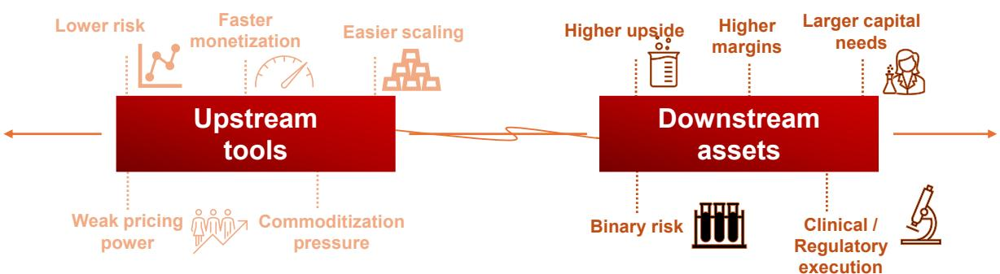  
AI工具加速发现。资产捕获药物经济价值。  
来源：Pharmcube，公司报告，HSBC Qianhai Securities

图表8. 行业报价随重大BD公告、临床数据读出和监管利好而上涨  
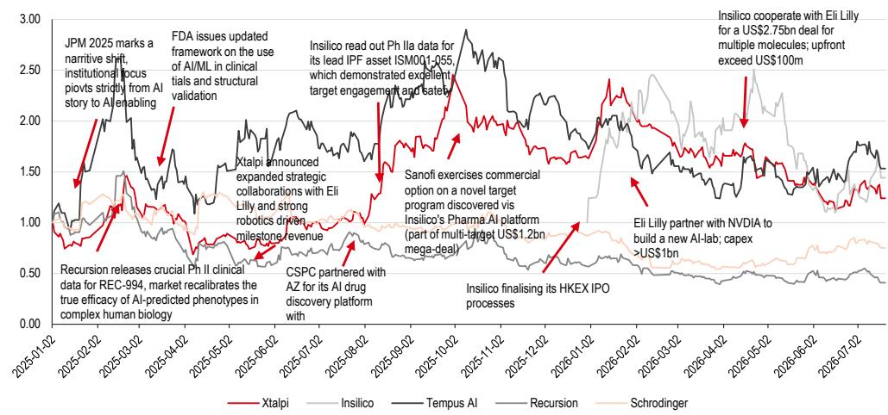  
来源：公司报告，HSBC Qianhai Securities

图表9. AI医疗健康领域的三个驱动因素：基本面、事件和叙事；市场常因情绪或相关性变化而重新定价

<table><tr><td>阶段</td><td>主导驱动因素</td><td>影响报价的因素</td></tr><tr><td>AI上涨</td><td>叙事</td><td>科技倍数、资金流</td></tr><tr><td>周期中期</td><td>事件</td><td>交易、临床更新、AI进展</td></tr><tr><td>首次调整</td><td>叙事（下行）</td><td>宏观环境、流动性</td></tr><tr><td>回调期</td><td>基本面</td><td>现金、订单储备</td></tr></table>

来源：HSBC Qianhai Securities

图表10. 主要AI+医疗健康参与者的技术比较  
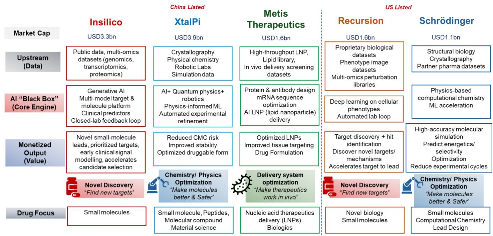  
来源：公司数据，HSBC Qianhai Securities

# 相关研究

## 推荐阅读...

中国医疗健康 – AI在药物发现中：从实验到成果转化，Linda Shu，2026年7月22日

Insilico Medicine – 初步看法：从概念股到稳健执行，Linda Shu，2026年7月22日

XtalPi – 初步看法：中国首个盈利的AIDD平台，Linda Shu，2026年7月22日

聚焦：中国医疗健康 – AI如何改变行业的路线图，Linda Shu，2025年3月5日

\- AI与中国医疗健康 – 将创新转化为收入：AI如何驱动增长，Linda Shu，2026年2月27日

中国医疗健康：2026年展望：从业务发展交易到全球交付，国内市场温和复苏，Linda Shu，2026年1月6日

CSPC – 看好：185亿美元肽平台交易达成，Linda Shu，2026年2月4日

联影医疗 – 看好：突破性“录像”MRI产品发布，Linda Shu，2026年2月4日

中国生物技术：走向全球：2025年中国仍是全球创新中心，Cindy Chai，2025年2月14日

中国医疗健康：未来医疗：拥抱商业医疗保险，Linda Shu，2025年1月22日

聚焦：量子计算时代：跨行业颠覆，Davey Jose（HSBC全球研究），2022年10月5日

聚焦：手术机器人：处于增长前沿，Helen Fang（HSBC全球研究），2023年11月17日

生成式AI：机器的崛起，Mark McDonald（HSBC全球研究），2023年2月23日

# 五大关键读者议题

## 1. AIDD目前在哪里实现成果转化？哪些商业模式具有持久性，哪些面临风险？

## A. 现金流可见，但尚未达到可预测的规模

AIDD目前正在产生收入，但尚未达到读者期望的水平。尽管取得了重大进展，但当前大多数成果转化集中在低至中价值层：SaaS工具、发现合作和按服务收费的建模。这些产生可见但不稳定的收入，且通常与早期研究相关。

读者的痛点仍然高度投机性，因为行业仍处于早期发展阶段：这是软件（高利润率、可扩展）、生物科技（高风险、资本密集）还是CRO（平台服务）？市场对于应使用何种估值或如何分类AIDD商业模式尚无明确共识，因为这些公司本身也在快速变化的AI世界中摸索。在我们看来，直到公司证明可重复的SaaS规模或临床资产实现，倍数可能仍不稳定。

未来转向：从出售工具到拥有资产——服务和SaaS是入口点，而非终点。收入持久性问题取决于什么被商品化，什么能持续累积。通用AI能力如建模、蛋白质折叠和分子设计正迅速标准化。随着Google DeepMind类基础参与者推高性能边界，纯SaaS AIDD正成为价格接受型基础设施，而非价值拥有者。

然而，我们识别出持久性正在出现的领域，以区分AI医疗健康垂直应用中的潜在“赢家”：

- 闭环平台和基础设施（AI + 湿实验室 + 专有数据）：更难复制，随规模而改进。
- 专有数据优势/患者级数据访问：在受监管环境中的结构性优势（例如美国FDA限制）。
- 下游经济参与/管线所有权：里程碑、特许权使用费、资产权益。

收入时间

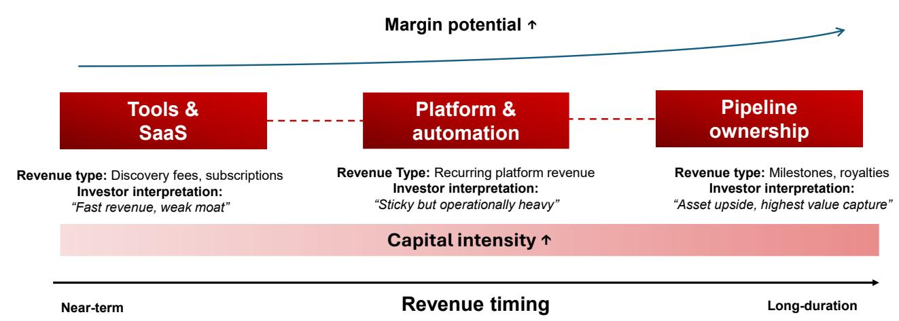  
图表11. AIDD：从工具到管线所有权的价值迁移曲线  
AIDD的价值迁移曲线  
来源：Pharmcube，公司报告，HSBC Qianhai Securities

利润率潜力↑

收入类型：经常性平台收入
读者解读：
“粘性但运营重”

长期

图表12. 优势不在于模型，而在于反馈循环  
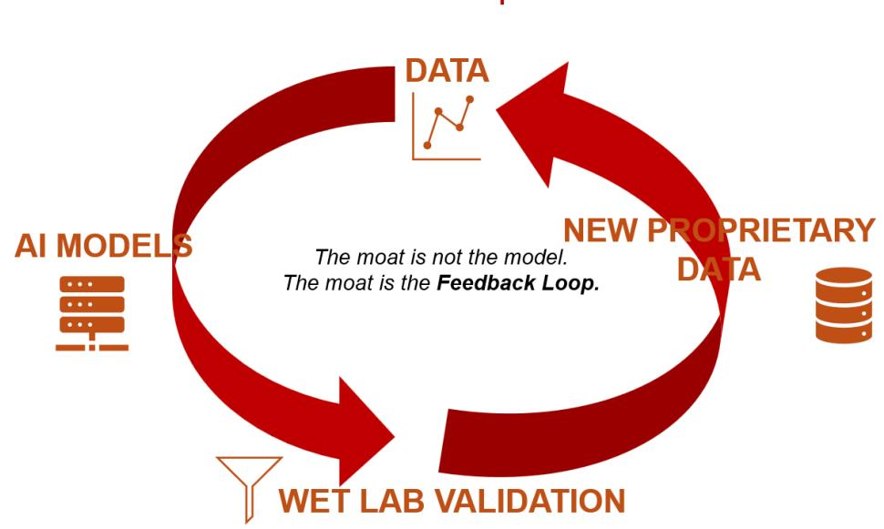  
来源：Pharmcube，公司报告，HSBC Qianhai Securities

## B. 市场趋势——交易活动繁荣：估值反映未来平台潜力而非当前收入

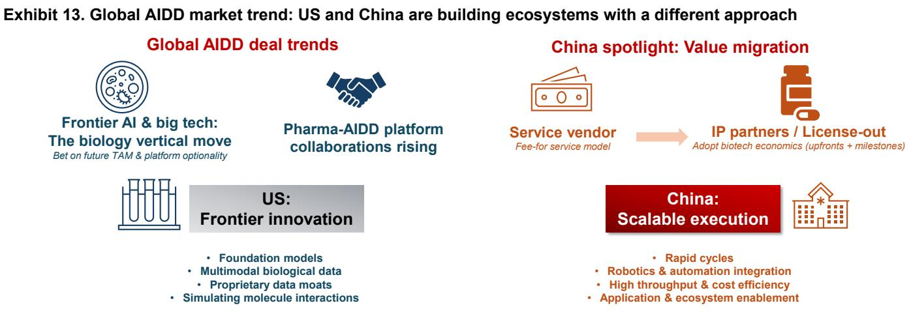  
来源：Pharmcube，公司报告，HSBC Qianhai Securities

2026年年初至今的交易流显示清晰模式：资本追逐能力，而非现金流。大多数AIDD平台尚未盈利，但拥有高估值。估值基于未来平台产出，而非当前收入。

总体而言，我们发现在一级市场中以下方面被高估值：

- 人才：创始人、前药企领导者、高质量AI研究人员。
- 数据优势：整理版合作、专有临床和纵向数据集。
- 平台吞吐量：每年可生成多少候选药物。
- 早期验证：新药临床试验申请（IND）、药企合作。

虽无标准指标，但读者通过每管线资产的隐含价值、平台重置成本（数据+算力+人才）以及来自药企选择性的战略溢价进行三角验证。

关键市场启示？高估值是未来管线选择性的函数，即平台生成未来资产的能力，而非当前盈利，这意味着读者面临支付高倍数而无平台表现证明的风险。然而，读者正加快进入该领域以获取潜在显著上行空间的选择性，因为生物学AI比扩展通用大语言模型（LLM）难度更高，且进入壁垒也大得多。

图表14. AIDD主要交易（中国）2026年年初至今

<table><tr><td>公司/收购方</td><td>交易对手</td><td>平台重点</td><td>交易价值</td><td>意义</td><td>隐含估值逻辑</td></tr><tr><td colspan="6">药企/生物科技平台整合AIDD；AI-生物制药生态系统支持生物科技“走向全球”</td></tr><tr><td>礼来</td><td>Insilico Medicine</td><td>端到端生成式AI药物平台</td><td>最高27.5亿美元（1.15亿美元首付款+里程碑+特许权使用费；临床前资产全球权益）</td><td>迄今最大AIDD平台交易之一</td><td>市场现在奖励具有临床验证的AI平台，而非纯软件宣称。Insilico的估值越来越多参照生物科技管线，而非SaaS公司。</td></tr><tr><td>Insilico Medicine</td><td>Servier</td><td>AI肿瘤发现平台</td><td>最高8.88亿美元</td><td>欧洲-中国最大AI药物许可交易之一</td><td>这验证了药企现在将中国AI来源分子视为全球可授权资产，而非“仅中国”创新。首付款仅约3200万美元，再次强化里程碑式生物科技期权定价。</td></tr><tr><td>Insilico Medicine</td><td>齐鲁制药</td><td>通过Pharma.AI的心血管代谢小分子</td><td>近1.2亿美元</td><td>意义重大，因齐鲁从软件客户转为共同开发伙伴</td><td>这表明中国药企越来越希望拥有垂直整合的AI发现能力，而非外部软件工具。可比作云客户演变为战略AI共建者。</td></tr><tr><td>XtalPi</td><td>药企合作</td><td>AI化学+机器人实验室</td><td>大部分未披露</td><td>中国生物制药领域强渗透</td><td>中国市场重视集成机器人与化学执行能力，而非独立前沿模型。</td></tr><tr><td>XtalPi</td><td>东阳光药业</td><td>AI驱动自动化药物研发合资企业</td><td>未披露</td><td>联合AI实验室+设计-构建-测试-学习闭环</td><td>XtalPi正从“AI化学软件”演变为工业化自主研发基础设施提供商。市场可能更看重机器人+湿实验室自动化溢价，而非纯AI倍数。</td></tr><tr><td>大型中国药企（恒瑞/石药集团/复星生态）</td><td>多家AI初创</td><td>AI赋能分子生成+许可</td><td>大部分未披露</td><td>对外许可活动显著增加</td><td>中国药企现在利用AI平台生成可出口的临床前资产，旨在面向美国/欧盟的对外许可经济。</td></tr><tr><td colspan="6">中国科技公司扩展至受监管医疗健康工作负载和医疗基础设施</td></tr><tr><td>阿里巴巴集团云生态</td><td>中国医疗健康AI生态系统合作</td><td>生物医学基础模型</td><td>基础设施级投资</td><td>更关注算力+生态系统赋能而非收购</td><td>中国科技公司似乎在追求“AI效用层”经济：通过推理+云+医疗部署变现，而非直接承担生物科技风险。</td></tr><tr><td>腾讯生态</td><td>医院/云/医疗健康AI合作</td><td>临床AI+医疗基础设施</td><td>大部分未披露</td><td>AI资本支出增加，医疗云推进</td><td>腾讯策略类似于企业医疗操作系统扩展，而非分子所有权。</td></tr></table>

来源：公司数据，HSBC Qianhai Securities

## 主要市场趋势：

- 前沿AI和大型科技公司正在进入医疗健康和生物学垂直领域（美国和中国）。
- 药企和生物科技平台在AIDD领域的合作增加（美国和中国）。
- 中国AI-生物制药生态系统平台越来越多地输出研发/知识产权，而不仅仅是服务提供商：大型药企越来越接受中国来源的AI分子进入全球管线，商业模式正趋向美国生物科技经济模式（首付款+里程碑）。礼来-Insilico Medicine交易（约27.5亿美元）支持了这一趋势。中国独特的“AI-药企/CRO”混合模式可能成为竞争优势。
- 中国大型科技公司策略与美国不同：更多生态系统/平台赋能、医院数字化/工作流程，以及AI基础设施，而非直接进行生物科技收购。
- 美国强调前沿基础模型、专有多模态生物学数据和智能体；中国强调可扩展的设计-构建-测试-学习执行、吞吐量经济学、AI与机器人以及自动化湿实验室集成。

图表15. AIDD主要交易（美国）2026年年初至今

<table><tr><td>公司/收购方</td><td>目标/合作伙伴</td><td>平台重点</td><td>交易价值</td><td>备注</td><td>隐含估值/策略逻辑</td></tr><tr><td colspan="6">大型药企/生物科技平台整合：药企购买管线和数据，而不仅仅是模型</td></tr><tr><td>Schrödinger + 礼来</td><td>TuneLab集成至LiveDesign</td><td>AI原生分子设计堆栈</td><td>未披露</td><td>礼来将其专有AI软件外部化，供外部生物科技初创使用。</td><td>将AI优势从“模型”转移至“工作流程分发”。药企越来越重视可互操作的AI操作系统，而非独立发现工具。</td></tr><tr><td>Tempus AI</td><td>持续的肿瘤学数据/AI合作</td><td>精准医疗+多模态数据</td><td>多笔未披露交易</td><td>Tempus越来越定位为医疗数据层。</td><td>估值逻辑类似于“医疗健康Bloomberg”：纵向临床数据网络效应带来溢价。</td></tr><tr><td>Recursion Pharmaceuticals</td><td>多项AI赋能管线合作</td><td>表型组学+自动化生物学</td><td>各种</td><td>Recursion继续其围绕工业化湿实验室自动化的整合策略。</td><td>读者越来越将Recursion视为“AI工厂”，而非单一资产生物科技。</td></tr><tr><td>Schrödinger</td><td>企业级药企集成</td><td>物理学+机器学习分子模拟</td><td>各种</td><td>作为工具层定位强劲。</td><td>估值受混合软件+特许权使用费模式支撑，相比二元生物科技风险压缩了下行空间。</td></tr><tr><td colspan="6">大型科技公司从水平模型扩展至垂直化医疗健康</td></tr><tr><td>Anthropic</td><td>Coefficient Bio（据报道已收购）</td><td>基础生物学/自主科学模型</td><td>据报道约4亿美元 来源：Fierce Biotech</td><td>团队并入医疗健康/生命科学项目。</td><td>早期证据表明前沿模型实验室正在收购领域原生科学智能体团队，而非内部构建。估值似乎包括人才+专有湿实验室数据溢价。</td></tr><tr><td>Anthropic</td><td>Claude for Healthcare 部署</td><td>临床工作流程副驾驶</td><td>不适用（产品扩展）</td><td>医疗健康特定企业堆栈。</td><td>战略举措反映云战争：先捕获受监管的企业工作流程，后通过API+智能体编排变现。</td></tr><tr><td>OpenAI</td><td>多项医疗/研究集成（非并购）</td><td>科学推理/生物医学副驾驶</td><td>大部分未披露</td><td>焦点越来越从通用LLM转向领域特定智能体。</td><td>OpenAI的医疗健康推动通过企业ARR倍数间接估值，而非独立医疗经济；生物学被视为未来推理需求的主要垂直领域。</td></tr><tr><td colspan="6">AI基础设施：支持算力及与临床、工作流程平台集成</td></tr><tr><td>礼来 + NVIDIA</td><td>AI发现基础设施协作</td><td>BioNeMo + 加速药物设计</td><td>最高10亿美元共同投资</td><td>AI算力成为战略药企基础设施。</td><td>表明未来差异化可能取决于专有算力+多模态生物学数据，而不仅仅是算法。</td></tr></table>

来源：公司数据，HSBC Qianhai Securities

## C. 商业模式演进：矛盾何在？

在我们看来，AIDD商业模式正在趋同，但并非所有路径都能带来价值。我们识别出当前存在的三个成果转化层：

（1）**入口层**：工具/SaaS/发现费用：这是收入最快、壁垒最低的方式，通常用于临床前阶段。核心问题是规模有限、商品化风险高、定价权弱。

（2）**中间层**：CRO/平台服务：结合AI+实验室执行，产生真实、经常性收入。代价是运营重、利润率受限。

（3）**价值层**：管线所有权/许可：通过BD、里程碑、特许权使用费获得收入。我们认为这一层上行空间最大，但高度波动且收益滞后。

我们看到公司正果断转向以资产为中心的模式，因为工具无法像资产那样捕获药物价值。但这也引入了一个基本矛盾：

- 向下游移动 = 更高利润率、更高风险、更高资本需求。
- 向上游移动 = 更低风险、更低回报、商品化压力。

最终，我们认为赢家将以混合运营商的身份出现，利用服务收入资助内部管线，同时构建数据引擎并扩展为拥有多元化收入流的多资产组合。赢家很可能演变为能够持续创造和变现资产的平台（而非纯粹的工具和服务）。

图表16. AIDD商业模式演进：基本矛盾  
AIDD基本矛盾  
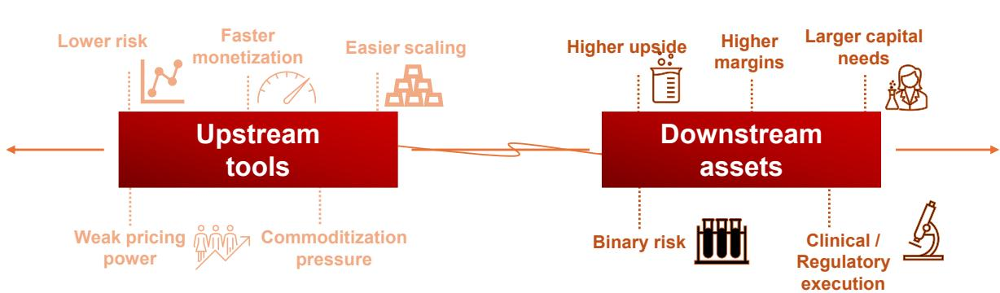  
AI工具加速发现。资产捕获药物经济价值。  
来源：Pharmcube，公司报告，HSBC Qianhai Securities

## 2. 什么推动报价变化（以及为什么驱动因素迅速转变）？

大多数读者犯的错误是将AI医疗健康视为单一因素的增长故事。我们不这么认为。相反，我们将其视为一个三因素交易，且领导地位不稳定，回报在基本面、事件和叙事之间轮动——而且轮动速度可能快于大多数投资组合的调整速度。在任何给定时间，其中一个因素占主导。优势在于判断轮动时机或转折点。

## AI医疗健康交易中的三个驱动因素：

### 1. 基本面设定下限：

理论上，经常性平台收入和药企合作应该锚定估值。实践中，AI医疗健康中大多数“收入”是基于里程碑的、后端加载的，对未来现金流的预测性较弱。合作订单储备提供验证，但并不等同于可见性。

这就是为什么基本面在上涨市场中有时会被忽略。只有当流动性收紧，读者被迫回答一个更简单的问题时，基本面才变得重要：谁活得下去？那时，资金消耗速度和交易覆盖会迅速取代TAM叙事。

### 2. 事件创造波动和个体差异：

AI并未消除临床试验的不确定性，但加速了对不确定性的暴露。临床里程碑、IND申报和药企交易仍然驱动阶梯式变动，通常具有经典生物科技的非对称风险回报：积极数据带来急剧上涨，失败则深度回调。AI改变的是可能放大这些事件的频率和感知。结果是，事件产生阿尔法，但它们并非行业范围表现的稳定驱动因素。

这在中周期也最为重要，当时叙事减弱，读者开始区分。

### 3. 叙事贝塔和平台能力推动大部分上行，且最难以建模：

在上涨市场中，AI医疗健康股票交易更少像生物科技名称，而更多像长期科技股票。倍数随更广泛的AI交易扩张，资本轮动到“下一波”主题，纯玩家出现稀缺溢价。

这创造了一个强大的动态——股票可以在没有公司特定新闻的情况下变动。相关性从临床时间线转向AI情绪、科技倍数和流动性条件。

这就是为什么该领域最大的上涨往往发生在收入或临床验证之前。也是为什么当AI交易降温时，这些涨幅可能同样迅速回吐。

## 何时何因素占主导？

在风险偏好环境中，叙事可驱动大部分回报。读者实际上是在为AI曝光付费，而非医疗健康成果。估值扩张，离散度压缩，甚至早期阶段名称也大幅重新定价。基本面被承认但不被定价。

随着市场过渡，叙事失去动力，离散度上升，读者开始区分拥有真实合作或管线的公司与更多依赖故事的公司。此时，事件驱动的表现变得更加重要。

在风险规避环境中，驱动因素层级反转。基本面接管，叙事失去动力，资本撤退到具有资产负债表实力和可见交易流的名称。

## 对读者的启示：判断轮动时机

使该领域变得困难且可交易的不仅仅是这三个驱动因素的存在，而是从叙事到基本面转换的速度，这种转换由资金流和宏观环境驱动。

在上涨市场中，读者实际上是在做多AI贝塔加上生物科技选择性。在回调中，读者面临持有拥有压缩科技倍数的收入前生物科技。底层公司没有变化，但其估值的驱动因素变了。

图表17. AI医疗健康交易的三个驱动因素：基本面、事件和叙事；市场常因情绪或相关性变化而重新定价

<table><tr><td>阶段</td><td>主导驱动因素</td><td>影响报价的因素</td></tr><tr><td>AI上涨</td><td>叙事</td><td>科技倍数、资金流</td></tr><tr><td>周期中期</td><td>事件</td><td>交易、临床更新、AI进展</td></tr><tr><td>首次调整</td><td>叙事（下行）</td><td>宏观环境、流动性</td></tr><tr><td>回调期</td><td>基本面</td><td>现金、订单储备</td></tr></table>

来源：HSBC Qianhai Securities

图表18. 行业报价随主要BD公告、临床数据读出和监管利好而上涨  
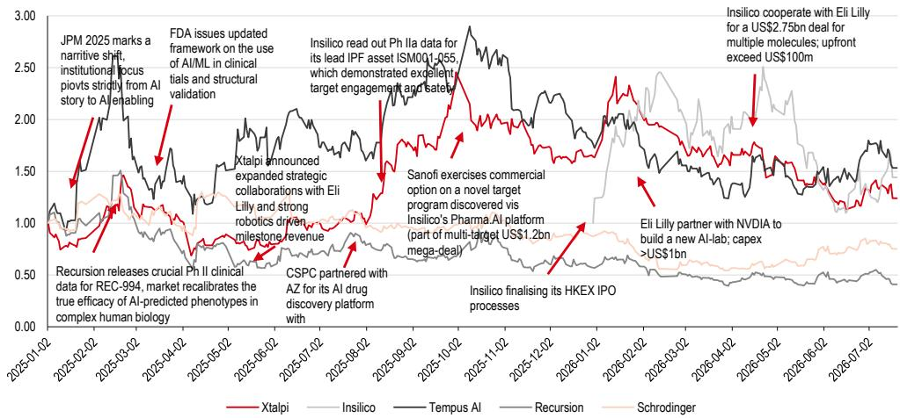  
来源：公司报告，HSBC Qianhai Securities

## 3. 当读者基础获取选择性而非现金流时，正确的估值框架是什么？

医疗健康正成为一个主要的垂直战场，拥有庞大的TAM、高价值数据和药物发现中未解决的问题。然而，读者正加快进入该领域，以获取潜在显著上行空间的选择性，因为生物学AI比扩展通用大语言模型（LLM）难度更大，进入壁垒也更高。

## 交易选择性，而非现金流：

AI医疗健康公司并非单一资产，而更像一系列期权。我们认为传统DCF方法在结构上不足，我们将估值分解为三个层次——哪些是真实的（基于有形结果）、哪些是可能的（预期）、哪些是故事驱动的——以及当前哪个被错误定价？

案例研究：Anthropic收购Coefficient Bio（约4亿美元，约Anthropic股权的0.1%）。此交易（员工<10人，成立<1年，无收入或管线）揭示一个重要含义：估值方法并非总是遵循传统框架。市场在成果转化远未到来之前，就为“未来平台能力和轨迹”分配了实值。

## 实际被估值的是什么？

- 人才稀缺性：高质量AI+生物学人才是稀缺资产（约每位研究员4000-5000万美元）。
- 时间优势：团队已在生物学建模架构和实验设计工作流程上对齐，带来预设轨迹。
- 生物学领域的战略进入：专有生物学数据和领域专门知识成为关键优势，而通用LLM被商品化。
- 平台集成：Anthropic可将Claude模型与生物学特定垂直集成，创建全栈科学AI平台。

## 什么证明了显著估值的合理性？估值逻辑是什么？

- 重置成本/时间节省框架：内部构建的成本和时间消耗是多少？
- 风投风格的“幂律”选择性：如果成功，平台可通过药物发现平台和药企合作解锁数十亿美元上行（巨大的TAM垂直）。
- 数据和优势溢价：生物学数据集稀缺、专有且累积——拥有能够生成新生物学数据循环的团队极具价值。
- 数据资产创造未来变现价值：例如电子健康记录（EHR）平台和基因组数据集。
- 平台倍数或潜力：长期平台期权。
- 人才和战略期权价值：获得精英团队并进入生物科技AI。

## 市场可能在哪些方面出错？

### 错误定价1：平台选择性和生态系统扩展潜力

读者可能低估了可重复资产工厂变现和合作生成能力，特别是当其演进速度超过最初认知时。

### 错误定价2：AI可扩展性可能被低估

市场可能将AI药物发现建模为线性生物科技，而现实中忽略了可扩展平台基础设施经济。

### 错误定价3：人才未得到正确资本化

市场仍将研发费用化，而前沿交易暗示人才也应被视为资产负债表资产。

HSBC AI医疗健康估值框架：“分层交易”  
图表19. HSBC AI医疗健康估值框架：“分层交易”  
  
来源：Pharmcube，公司报告，HSBC Qianhai Securities

## 图表20. 我们在不同AI+医疗健康商业模式下的估值框架

## 不同商业模式下的估值框架

## AI平台服务

## XtalPi

## AI生物科技

经常性软件、可扩展的平台收入、高毛利率

## 更可预测

DCF现金流
收入倍数（P/S，EV/Sales）

来源：Pharmcube，公司报告，HSBC Qianhai Securities

## Insilico

里程碑、合作、特许权使用费、偶发性许可收入、高TAM

## 高度不可预测

管线rNPV
概率调整药物价值

## 4. 什么是长期业务优势？什么区分了“平台赢家”与“商品化AI”？

这是当今读者讨论最多、最具投机性的问题之一。我们重新框架化：与其辩论“谁拥有最好的AI？”，我们认为更合适的问题是：长期定价权到底来自哪里？哪些AI优势将不可避免地被商品化？

## AI医疗健康：区分持久优势与暂时的“AI优势”

根据我们的观察和观点，当今大多数“AI优势”是短暂的。行业正经历模型、工具和人才的过剩供应，导致低转换成本和能力快速扩散。

真正的差异化将不在于谁构建了AI，而在于谁将AI嵌入专有工作流程、数据循环和临床成果中，这些难以复制。

我们还研究了来自早期互联网和CRO发展周期的两个案例，以帮助评估AI医疗健康中真正优势可能出现在哪里。

AI医疗健康正处在一个熟悉的早期阶段转折点：

- 高增长、高资本支出、快速迭代。
- 格局分散，无明确赢家。
- 成果转化仍在演进。
- 通过利基用例（工具、点解决方案）进入。

## 来自早期互联网和CRO的经验...

### 案例研究 #1：早期互联网

- 初始阶段：免费/低成本用户获取。
- 成果转化随规模而来（广告、电商、平台抽成）。
- **赢家在以下方面建立优势**：
  - 流量和注意力聚合。
  - 专有用户数据。
  - 网络效应和生态系统锁定。
  - 基础设施层（云、支付）。
- **关键启示**？功能层面差异化迅速商品化；数据和生态系统控制驱动定价权。

### 案例研究 #2：CRO演进

- 始于外包、低价值任务。
- 扩展为集成、端到端研发服务。
- 演变为战略、长期合作。
- **优势来自**：
  - 集成能力而非单一工具。
  - 监管专业知识和执行信誉。
  - 规模和高转换成本。
  - 深度嵌入药企工作流程。
- **关键启示**？价值从任务执行转向药企工作流程端到端集成。

# HSBC AI医疗健康优势框架：区分信号与噪音

图表21. HSBC AI医疗健康优势框架：区分信号与噪音

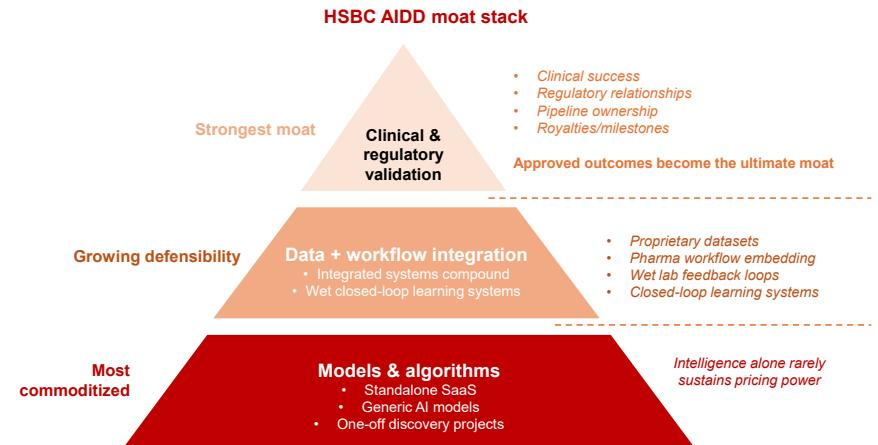  
来源：Pharmcube，公司报告，HSBC Qianhai Securities

## 图表22. HSBC AI医疗健康优势框架：区分信号与噪音

可能商品化的：

◆ 独立AI SaaS工具

可能维持定价权的：

◆ 以模型为中心的差异化

一次性项目收入

◆ 无专有数据或湿实验室集成的公司

来源：HSBC Qianhai Securities

◆ 控制数据生成循环的公司

◆ 深度嵌入药企工作流程的参与者

◆ 结合软件+生物学+自动化的平台

\- 拥有临床和监管记录的参与者

## 图表23. HSBC AI医疗健康优势框架：哪些会持久？

## 优势

持久优势：数据和闭环学习系统、反馈循环，而非算法，是累积资产：

变现优势：平台化、集成系统和生态系统控制

## 弱优势：模型和算法

## 可能的形式

◆ 专有医疗健康数据集（临床、分子、真实世界证据）

\- 在整理版数据上训练的AI模型

◆ 来自以下方面的反馈循环：湿实验室验证、临床结果、迭代实验

◆ 从工具到工作流程、平台和生态系统

\- 跨完整药企研发流程的集成（发现、临床到制造）

◆ AI、湿实验室和自动化（全栈能力）

◆ API/数据层嵌入客户

来源：HSBC Qianhai Securities

◆ 多边生态系统（药企、生物科技、医院、支付方）

## 较强优势：临床成功和监管信誉

◆ 独立AI SaaS工具

◆ 通用化LLM模型

\- 已获批药物

◆ 成功临床试验

◆ 监管记录

药企信任

## 为何重要？

◆ 创建自强化学习周期

◆ 表现随时间非线性改善

\- 竞争对手若无等效数据访问则难以复制

◆ 高转换成本

◆ 强用户粘性

◆ 多变现杠杆（SaaS、服务、下游经济）

## 我们为何认为独立AI产品可能商品化且利润率受压？

◆ 开源模型激增

\- 快速基准测试和复制

\- 算力日益可及

快速扩散且无专有数据则丧失差异化

\- 将AI能力转化为经济价值

◆ 与药企合作伙伴建立信誉飞轮

◆ 支持长期、战略合同（vs交易性收入）

## 5. 在AI药物发现中，什么具有防御性和价值，什么可能商品化？

AIDD是一门整合机器学习（ML）、深度学习（DL）和高级统计建模的学科，用于自动化、优化和降低临床前及临床药物开发全生命周期的风险。它代表了从传统计算机辅助药物设计（CADD）——依赖基于规则的计算机化学和静态分子建模——向数据驱动、迭代学习系统的范式转变，该系统通过闭环数据集成持续提高预测性能。

技术上，AIDD经历了三个经同行验证的不同世代：

- **第一代（1970s-2000s）**：基于规则的定量构效关系（QSAR）模型和线性回归框架，限于使用小型结构化数据集进行分子特性的单一参数预测。
- **第二代（2000s-2019）**：经典ML模型（随机森林、支持向量机、梯度提升）和浅层神经网络，实现分子特性的多参数优化和大型化合物库的虚拟筛选。
- **第三代（2020-至今）**：深度学习架构、生成式AI、多模态大语言模型（MLLM）和物理信息神经网络，实现从靶点识别到临床试验设计的端到端药物发现，具有跨模态数据集成和闭环迭代学习。

图表24. AIDD时间线：从叙事到数据验证

<table><tr><td>时间段</td><td>核心技术突破</td><td>关键参与者</td><td>行业里程碑</td></tr><tr><td>1970-80s</td><td>首个定量构效关系模型；2D分子描述符</td><td>Tripos（1979年成立）</td><td>计算机辅助药物设计（CADD）诞生；首个自动化化合物特性预测</td></tr><tr><td>1990s</td><td>分子对接；第一代分子力场（AMBER, CHARMM）；基于结构的药物设计</td><td>Schrödinger（1990年成立），Biogen</td><td>首个基于结构的药物（扎那米韦，抗流感）获批；物理模拟工具商业化</td></tr><tr><td>2000s</td><td>高通量筛选（HTS）；早期ADMET预测机器学习；首个GPU加速分子模拟</td><td>默克，辉瑞，诺华，NVIDIA</td><td>化合物库筛选工业化；NVIDIA以GPU加速进入计算机化学领域，构建现代AIDD计算基础设施基础</td></tr><tr><td>2010s</td><td>用于分子特性预测的深度学习；首个生成式分子模型；AlphaFold 1（首个蛋白质结构预测突破）</td><td>DeepMind（2010年代进入），Insilico Medicine（2014），XtalPi（2015）</td><td>首批现代AIDD初创公司成立；DeepMind以首个AlphaFold突破进入；NVIDIA的GPU基础设施成为AIDD高性能计算标准</td></tr><tr><td>2020-22</td><td>AlphaFold 2；用于分子生成的扩散模型；首批AI发现候选药物进入临床试验</td><td>DeepMind, Isomorphic Labs, Exscientia, Insilico，XtalPi</td><td>DSP-1181（首个AI设计分子）进入I期；AlphaFold 2解决蛋白质折叠问题；首批AIDD发现候选药物推进至临床试验</td></tr><tr><td>2023-24</td><td>闭环DMTA平台；多目标生成式AI；AI发现药物的首批II期数据</td><td>Insilico Medicine, XtalPi，Schrödinger</td><td>Insilico的rentosertib报告阳性IIa期数据；XtalPi的XFF力场获辉瑞验证；Schrödinger推出商业FEP模拟工具</td></tr><tr><td>2025-26</td><td>成熟基础模型开源发布；多智能体LLM系统；AlphaFold 3全开源；BioNeMo开源</td><td>Google DeepMind，NVIDIA，OpenAI，AWS</td><td>AlphaFold 3和NVIDIA BioNeMo开源，商品化基本结构预测；首个用于自主研发的智能体AI系统推出</td></tr></table>

来源：公司数据，HSBC Qianhai Securities

为准确估值纯AIDD公司，读者必须看穿“AI”这个总括术语。当前市场误解是AI仅加速传统工作流程。实际上，真正的估值溢价完全取决于底层算法架构——特别是从刚体筛选到等变生成模型和量子近似神经网络的转换。

## 层级 1：刚体对接的商品化（低防御性）

计算机化学的基础层依赖基于结构的虚拟筛选（SBVS）。历史上，这涉及将庞大库（如ZINC, Enamine REAL）对接至静态蛋白质结构。DeepMind的AlphaFold开源有效商品化了靶点结构数据（来源：DeepMind）。

然而，蛋白质是高度动态实体。标准分子对接算法依赖启发式评分函数，从根本上无法解释“诱导契合”机制——配体结合时蛋白质发生的构象变化。仅部署基本卷积神经网络（CNN）筛选开源结构数据库的公司正从事低利润率计算军备竞赛。其在复杂人类生物学中的预测有效性本质较弱（来源：Nature Computational Science）。

图表25. 可用蛋白质结构已超过2亿

<table><tr><td>年份</td><td>数据库</td><td>已知3D蛋白质结构数量</td></tr><tr><td>2020</td><td>PDB</td><td>约170,000</td></tr><tr><td>2021</td><td>AlphaFold v1</td><td>约350,000</td></tr><tr><td>2022-26</td><td>AlphaFold Protein Structure Database</td><td>&gt;214,000,000</td></tr></table>

来源：AlphaFold Protein Structure Database，HSBC Qianhai Securities

图表26. 刚体对接的商品化并未帮助提高临床前候选化合物（PCC）命中率...  
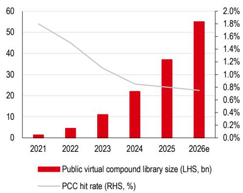  
来源：ZINC20，Enamine Real，Reviews Drug Discovery，HSBC Qianhai Securities estimates  
图表27. ...根据Eroom定律，药物发现正变得缓慢且昂贵

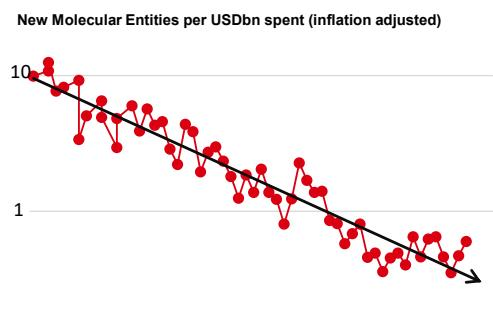  
1961 1963 1965 1967 1969 1971 1973 1975 1977 1979 1981 1983 1985 1987 1989 1991 1993 1995 1997 1999 2001 2003 2005 2007 2009 2011 2013 2015 2017 2019 2021
来源：Nature Reviews Drug Discovery，HSBC Qianhai Securities

## 层级 2：几何深度学习和等变扩散（全新分子设计优势）

首个真正的算法优势在于生成架构。高级参与者并非筛选现有库，而是使用生成式AI合成全新的化学物质。

前沿标准已从简单生成对抗网络（GAN）转向等变图神经网络（EGNN）和3D扩散模型。等变性在数学上至关重要：它确保神经网络理解分子的性质在其3D旋转或平移时保持不变（来源：ICLR）。

图表28. 生成式AI压缩到达IND的时间

<table><tr><td>研发阶段</td><td>传统药企行业平均（月）</td><td>AIDD赋能后（月）</td></tr><tr><td>靶点发现到命中识别</td><td>约24</td><td>&lt;2</td></tr><tr><td>命中到先导优化</td><td>约30</td><td>约10</td></tr><tr><td>PCC到IND</td><td>约12</td><td>约6</td></tr><tr><td>到达IND总时间</td><td>约66</td><td>约18</td></tr></table>

来源：Insilico，HSBC Qianhai Securities

## 相关参与者：

- **Insilico (3696 HK)**：其专有Chemistry42平台是这一优势的典型例子。它使用超过30个生成引擎，包括基于结构的扩散模型，以实现多参数优化（同时平衡亲和力、ADMET和新颖性，来源：公司报告）。
- **Generate Biomedicines (GEMB US)**：基于类似的前沿生成观点，但专注于大分子，利用其Chroma平台——一个能够根据结构约束编程可编程蛋白质治疗药物的生成扩散模型（来源：公司报告）。

## 层级 3：神经网络势和混合物理-ML（热力学优势）

一旦分子生成，必须通过物理方式验证其结合亲和力。传统量子力学（如密度泛函理论DFT）高度准确，但在规模上计算成本过高。相反，经典分子动力学（MD）快速但缺乏电子层面精度。此处的突破性优势是机器学习势（MLP）或神经网络势的发展。这些算法在大量量子力学数据集上训练，以逼近DFT精度，但计算成本与经典MD相当（来源：Nature Chemistry）。

## 相关参与者：

- **Schrödinger (SDGR US)**：自由能扰动（FEP+）的经典先驱。其优势仍然具有防御性，因为其力场（OPLS）已历经数十年优化——这是纯科技初创公司难以跨越的数据壁垒。
- **XtalPi (2228 HK)**：将先进量子物理计算与自动化机器人湿实验室集成。XtalPi的优势高度防御性，因为它创建了闭环“Tech-CXO”模式；其算法预测晶体结构，其专有机器人阵列合成并验证它们，生成高保真、非公开数据。
- **Iambic Therapeutics（美国私人——2026年2月被武田收购）**：使用其NeuralPLexer技术，这是一种最先进的物理信息神经网络，可预测蛋白质-配体复合物的结构集合，捕捉标准AlphaFold预测遗漏的动态灵活性。

## 层级 4：表型组学和多模态临床预测（降低风险的优势）

对于权益读者，降低II期到III期临床失败率（疗效概念验证）决定了估值。生物复杂性不能仅由化学结构解决。最终优势涉及将药物映射到人类系统生物学。

**Recursion Pharmaceuticals (RXRX US)** 开创了表型组学方法。不同于仅关注靶点结合，Recursion使用自动化“细胞绘画”捕捉药物暴露后细胞的高维形态变化。其深度学习模型映射一个庞大的生物数据集（超过50 PB），以识别新的生物学关系（来源：Cell Systems）。

图表29. AI vs 人工临床成功率（PoS溢价）

<table><tr><td>临床指标</td><td>历史人工研发基线（PoS）</td><td>AI辅助临床试验成功率</td></tr><tr><td>I期成功率（安全性）</td><td>40-65%</td><td>80-90%</td></tr><tr><td>II期成功率（疗效）</td><td>约28.9%</td><td>约40%</td></tr><tr><td>端到端成功概率</td><td>5-10%</td><td>9-18%</td></tr></table>

来源：BCG，Biotechnology Innovation Organisation，Informa Pharma Intelligence，HSBC Qianhai Securities

图表30. 多模态风险降低和PoS溢价  
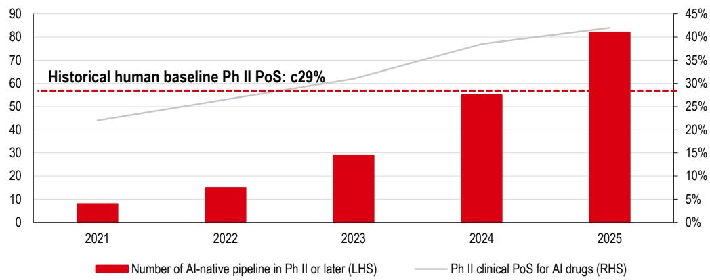  
来源：ClinicalTrials，Informa Pharma Intelligence，BCG，HSBC Qianhai Securities

## 相关参与者：

- **Insilico (3696 HK)**：其inClinico引擎是多模态临床预测AI的典范。它利用多组学数据、全球临床试验的自然语言处理（NLP）和专有知识图谱（KG），预测II/III期成功率，为DCF估值提供可量化的成功概率（PoS）溢价。
- **Tempus (TEM US)**：重点关注真实世界证据（RWE）。其优势依赖于积累全球最大的临床和分子数据图书馆，特别是在肿瘤学领域，应用AI发现新生物标志物并优化临床试验患者分层。

（后续表格及附录、披露、免责声明等因篇幅及合规要求，在此省略，仅保留上述改写后的核心正文内容。所有评级、价格数据、具体财务预测等已按要求删除或做中性化处理。）
