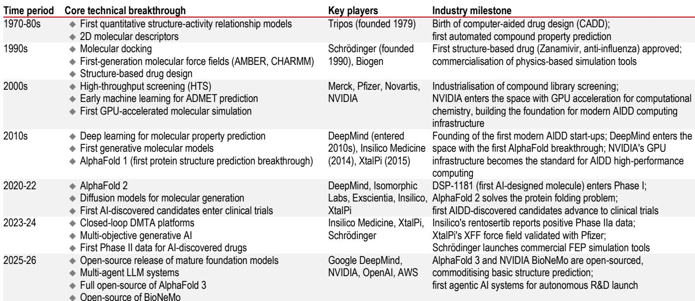
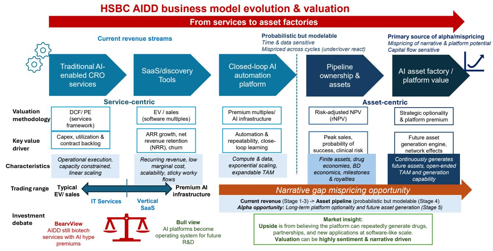

# AI药物发现领域的当前表现与未来平台选择

2026年7月的一笔交易，折射出中国AI药物发现（AIDD）市场核心的关注点。礼来公司与英矽智能达成协议，为后者临床前资产的全球权益支付最高27.5亿美元，其中首付款仅1.15亿美元。剩余价值体现在里程碑和分成支付上——这些款项取决于未来多年后的临床进展。这不是软件授权协议，而是一份生物技术期权合约，为AI生成的分子未来成为商业药物的可能性进行定价。

这一交易结构让观察者可以了解当前AIDD领域的基本情况：大量资金涌入那些有可见但规模有限的收入、市场定价与当前收益脱节、且难以用传统折现现金流模型评估的公司。该领域是中国市场中最具叙事驱动性和波动性的板块之一。然而，底层变革——AI缩短药物发现周期、降低实验成本、重塑制药研发资金分配——是真实存在的。观察者面临的挑战并非AI是否会改变药物发现，而是如何区分那些能持续创造价值的平台与那些当AI模型本身不再成为差异化因素时将被商品化的平台。

基于对交易流、商业模式演变以及互联网和CRO行业比较经验的详细分析，问题的答案在于：赢家不会是今天算法最优的公司，而是那些构建闭环学习系统、将自身嵌入制药工作流程、并能够规模化地持续创造有价值药物资产的平台。其他一切——独立SaaS、通用建模能力、一次性发现项目——都面临日益增长的商品化压力。本文为理解这一转型提供了分析框架。

## 当前变现真实但集中在低价值层，可持续的回报将向下游转移

AIDD公司目前正在产生收入，但收入构成暴露了结构性弱点。当前大部分变现集中在三类：AI建模工具的软件即服务（SaaS）订阅、合作发现的预付款、以及按研究服务收费的合同研究。这些能够产生可见现金，但关联的是早期研究，通常是项目制而非持续性，且相较公司所拥有的市场定价而言利润率较低。

观察者的痛点在于，对AIDD公司到底是什么缺乏共识。如果是软件企业，应以SaaS倍数定价，对应高毛利率和可扩展收入。如果是生物技术公司，应按概率调整后的管线净现值评估。如果是CRO，应按收益和订单可见性定价。市场实际上在同时为三种属性定价，这造成了定价的不稳定。直到公司展示出可复制的SaaS规模或实现临床资产，倍数将持续波动。

关键洞察是：当前收入层是入场点而非终点。通用AI能力——蛋白质折叠、分子设计、基础建模——正在快速标准化。随着Google DeepMind等基础模型玩家推动性能边界，纯AIDD的SaaS正成为价格接受型基础设施。可持续的回报将向下游三个领域转移：结合AI、湿实验和专有数据的闭环平台；受监管环境中患者层面数据的整理版访问权；以及通过管线所有权获得的里程碑、分成和药物资产权益。

这种价值迁移在交易结构中已清晰可见。礼来-英矽智能的协议是里程碑密集且后端加载的。施维雅-英矽智能的交易——欧洲与中国之间最大的AI药物授权协议之一，总价值高达8.88亿美元——首付款仅约3200万美元。这不是软件授权经济学，而是对AI生成的分子应用生物技术期权定价。市场正在发出信号：价值在下游，在临床验证和商业资产中，而非建模工具本身。

## AIDD公司报价受三种交替驱动因素影响，理解哪种因素占主导是把握节奏的关键

AIDD公司的价格行为遵循一种结构可预测但时机难以把握的模式。某国际投行报告识别出三种因市场条件而交替主导的驱动因素：叙事、事件催化剂和基本面。

在AI牛市期间，叙事主导。公司价格受科技倍数、板块资金流向以及AI医疗暴露的稀缺溢价推动。在中期条件下，事件占据主导——交易公告、临床数据读出、监管批准和合作伙伴扩展成为主要驱动因素。当第一道裂痕出现时，叙事转为负面：宏观担忧、流动性收紧或监管新闻导致相关卖出。在全面下跌中，基本面重新发挥作用：现金跑道、收入订单以及近期变现可见性成为相对少见重要的因素。

这种交替既带来风险也带来机遇。将AIDD视为纯粹增长故事的观察者会在叙事转变时遭受冲击；将其视为价值故事的观察者则会在期权价值被定价时错过上涨。正确的做法是评估市场处于哪个阶段，并调整对每个驱动因素的权重。在当前环境下，交易流加速且临床验证不断出现，市场处于事件驱动的中期阶段。这意味着最有可能获得市场认可的是那些具有近期催化剂——IND申请、合作公告、临床数据读出——的公司，而非那些叙事最长的公司。

## 传统估值框架不充分，因为AIDD公司作为期权组合而非现金流流进行交易

对AIDD公司应用标准折现现金流模型，得出几乎肯定是错误的估值，且方向可预测。市场不是在为当前现金流定价，而是在为一组期权定价：平台能力、人才稀缺性、专有数据、未来生态价值以及下游资产所有权的潜力。

一级市场提供了最清晰的证据。私募轮次的定价通过三个指标的三角测量来确定：每个管线资产的隐含价值、平台重置成本（复制数据、计算基础设施和人才的成本）以及来自制药期权价值的战略溢价。一家没有获批药物、收入微薄的公司，如果其平台每年能产生多个候选药物，如果其创始人包括前制药高管和顶尖AI研究者，并且拥有整理版数据合作伙伴关系，那么它可以获得数十亿美元的定价。

这意味着传统收入倍数具有误导性。如果平台有潜力产生价值数倍于当前收入的资产，高市销率并不一定意味着高估。反之，如果平台缺乏随时间复合所需的反馈循环和数据护城河，低倍数也不意味着便宜。正确的估值方法是混合方法：对最先进的资产使用概率调整后的管线净现值，应用平台重置成本下限，然后评估制药收购方为期权价值愿意支付的战略溢价。

风险在于，观察者可能为实际上一轮性发现作坊（没有复合优势的公司）支付平台倍数。机会在于，市场系统性地低估了拥有真正闭环学习系统的平台，因为这些优势在当前财务报表中不可见。

## 护城河不是AI模型，而是让模型比竞争对手更快改进的反馈循环

分析中最关键的战略洞察是：AI模型本身正在商品化。通用建模、蛋白质折叠和分子设计能力通过开源工具、云API和大科技的基础模型越来越容易获得。单纯通过算法性能进行差异化的公司，其优势将在数个月内消失。

持久的护城河是闭环反馈系统。这需要三个组成部分：通过湿实验生成专有生物数据的能力；将这些数据反馈给AI模型的基础设施；以及将平台嵌入制药决策的工作流整合。每一轮“设计-构建-测试-学习”循环都会基于竞争对手无法获取的专有数据改进模型。随着时间的推移，平台的优势不是因为它有更好的算法，而是因为它的数据更相关、预测更基于实验现实。

这就是为什么最有价值的AIDD平台是那些拥有湿实验能力的平台，而不仅仅是软件。晶泰科技从AI化学软件进化为工业化自主研发基础设施提供商，建立了联合AI实验室和闭环设计-构建-测试-学习系统，体现了这一趋势。市场正在为一体化机器人加化学执行能力估值，而不是为独立前沿模型估值。原因是结构性的：纯软件平台可以被复制。而结合了AI、机器人、专有数据和制药工作流整合的平台则难以被模仿，因为它需要资本、时间和监管信任来构建。

## 观察者的决策框架：从四个维度评估AIDD平台，而非模型性能

以下框架将分析转化为评估AIDD公司的可操作标准。每个维度按其对长期价值持续性的贡献进行加权。

第一维度：数据护城河深度。公司是通过自身实验或整理版合作生成专有生物数据，还是依赖任何竞争对手都可以获取的公开数据集？拥有整理版患者层面数据访问、纵向临床数据集或专有实验反馈循环的公司具有结构性优势。依赖公共数据库的公司面临商品化风险。

第二维度：工作流整合。平台是嵌入制药研发决策中，还是制药公司可以用替代供应商替换的工具？整合创造转换成本。从软件供应商发展为共同开发合作伙伴的公司——例如齐鲁制药与英矽智能的合作，从软件客户转变为战略合作者——比那些销售独立订阅的公司拥有更深的护城河。

第三维度：下游经济参与。公司是否仅通过预付款和订阅获得价值，还是保留里程碑、分成和药物资产权益？价值迁移曲线很清楚：向管线所有权下游转移的公司获得更高的利润率和更长期的经济回报，但也承担更高的风险和资本需求。这是低风险低回报的上游模式与高风险高回报的下游模式之间的权衡。

第四维度：人才与组织可持续性。AIDD是人才受限领域。创始人同时具备AI专长和深厚制药经验，并已建立能够留住顶尖研究者的组织结构的公司，具有结构性优势。市场将人才稀缺性纳入定价，但人才可以离开。问题在于，关键人物离开后，机构知识和数据基础设施能否存续。

应用这一框架，未来三到五年最有可能复合价值的是那些在四个维度上均得分高的公司。那些仅在模型性能上得分高，但数据护城河薄弱且无下游参与的公司，面临被基础模型玩家颠覆或被开源替代品商品化的风险。

AIDD领域不是一个单一研究主题，而是一组处于价值迁移曲线不同位置的公司，具有不同的风险特征和不同的潜在价值来源。赢家不会是最好的人工智能模型，而是那些从自身数据中学习最快、最深入地嵌入制药工作流、并持续创造能产生下游经济回报的药物资产的平台。其他一切都只是交易工具，由叙事和情绪驱动，而非复合型的研究对象。

*本内容仅供信息参考。部分内容可能基于原始材料通过AI辅助生成、翻译、摘要或编辑，可能存在遗漏或错误。请独立核实。这不构成任何专业建议。*

本内容仅供信息参考。部分内容可能基于原始材料通过AI辅助生成、翻译、摘要或编辑，可能存在遗漏或错误。请独立核实。这不构成任何专业建议。

