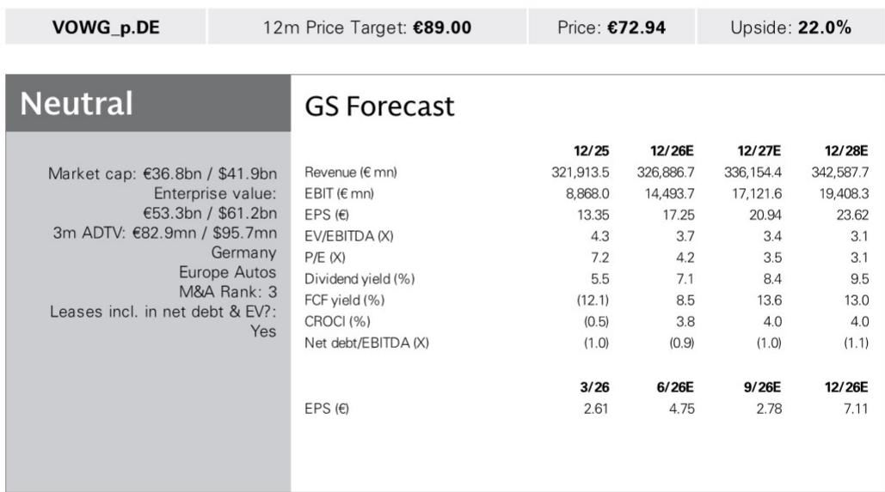
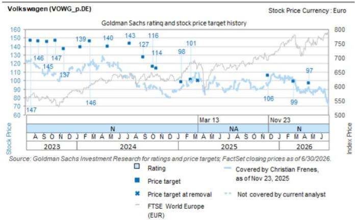

# 大众汽车业务与季度数据观察

大众汽车7月24日公布的二季度业绩呈现明显分化：集团运营利润34.7亿欧元，低于公司汇编的市场预估（38.5亿欧元）和相关机构预估（40.4亿欧元），但营收超出预估1.3%。与此同时，集团将2026年全年营收增速指引从此前的0%-3%下调至-3%-0%，同时维持4.0%-5.5%的运营利润率目标不变。相关观察指出，运营端不确定性主要来自Progressive品牌组和一次性特殊成本，而现金流表现则大幅超出预期。

## 1. Progressive品牌组影响运营利润，核心品牌表现稳健

二季度运营利润低于预期的主要来源是Brand Group Progressive，其运营利润较市场预估低29%。相关分析指出，这一缺口主要受残值重估效应影响。与此同时，Luxury品牌组运营利润超出预估12%，核心品牌组（Brand Group Core）运营利润较市场预估高出8.5%。中国合资企业的按比例权益收入为1.01亿欧元，高于相关机构预估的3500万欧元。运营层面还受到一笔与终止Bosch合作相关的低三位数百万欧元一次性成本影响。

> **观察评论：** 大众内部品牌表现的分化值得留意。Progressive品牌组（包含奥迪、宾利等）的残值重估问题可能反映高端电动车二手价格不确定性，而核心品牌（大众、斯柯达、西雅特）的稳健表现则说明传统燃油车业务仍有支撑。这种分化在后续季度是否持续，是判断集团整体盈利走向的一个角度。

## 2. 现金流大幅超出预期，资本支出和营运资本是主要驱动

二季度汽车业务净现金流达到11.72亿欧元，较市场预期的5.83亿欧元高出101%，也远高于相关机构预期的-5.92亿欧元。相关分析认为，超预期的现金流主要来自三个因素：营运资本现金消耗减少15亿欧元、资本支出和研发支出减少9亿欧元、并购支出减少1亿欧元。此外，Rivian研究相关的9亿欧元现金流出被中国重汽股权出售获得的3亿欧元部分抵消。二季度汽车研发现金支出为46.8亿欧元，低于相关机构预期的49.6亿欧元，其中资本化开发成本20.8亿欧元，对利润表产生9900万欧元的正面影响。

## 3. 营收指引下调但利润率目标不变，现金流指引维持

尽管二季度现金流表现强劲，大众汽车并未上调全年指引。公司维持2026年运营利润率4.0%-5.5%的目标，汽车净现金流和净流动性指引也未改变。相关观察认为，基于下调后的营收增速预期（-3%-0%），2026年市场共识每股盈利（EPS）将面临低个位数百分比的机械性下调。研报同时指出，上述指引未纳入集团目标2030（Group Target Picture 2030）的潜在影响，也未考虑已宣布的Everllence股权出售。

## 4. 观察框架：成本执行、中国业务和资本回报是后续焦点

相关分析列出了二季度交流会议需要关注的几个方面：成本削减措施的进展和执行情况、Everllence出售进程及2026年潜在的资本回报机会、中国合资企业业务前景和竞争格局、欧洲竞争格局。这些议题构成了评估大众汽车未来12个月表现的观察角度。其中，成本执行进度直接关系到利润率目标能否实现，而中国业务的表现则对集团整体盈利弹性有一定影响。

For informational purposes only. Portions may be generated, translated, summarized, or edited with AI assistance based on source materials and may contain omissions or errors. Please verify independently. This is not professional advice.

For informational purposes only. Portions may be generated, translated, summarized, or edited with AI assistance based on source materials and may contain omissions or errors. Please verify independently. This is not professional advice.

