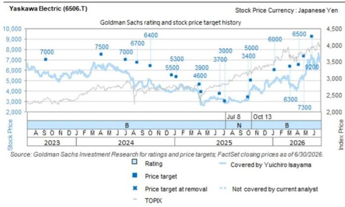

## Yaskawa Electric (6506.T): 电话会议要点：确认ERP相关影响的当前状态及后续路径；维持积极看法

在7月23日上午的会议中，我们举办了一场面向国内外读者的电话会议，与会方包括安川电机的企业传播部读者与股东关系课课长Ayano Motonaga。自ERP相关影响被发现以来，市场对公司执行进展及问题解决速度的关注度一直很高。在此背景下，我们对本次会议的整体印象是积极的，公司坦诚地说明了当前状况。我们维持对该公司的积极看法（在关注名单上）。以下是公司评论及我们认为值得关注的观察点。

Yuichiro Isayama
+81(3)4587-9806 |
yuichiro.isayama@gs.com
GS Japan Co., Ltd.

Takeru Adachi  
+81(3)4587-4067 |  
takeru.adachi@gs.com  
GS Japan Co., Ltd.

Takato Enoki  
+81(3)4587-1739 |  
takato.enoki@gs.com  
GS Japan Co., Ltd.

Chie Hu
+81(3)4587-6330 | chie.hu@gs.com
GS Japan Co., Ltd.

## 当前产能利用及正常化展望：从5月低谷恢复，为下半年复苏做准备增产

安川电机在5月的黄金周假期期间更新了其ERP系统。公司事先进行了模拟和测试，并为过渡做了充分准备，过渡过程本身进展顺利。然而，在执行过程中随后出现了问题。ERP转型大幅改变了工作流程和数据录入方式。现场运营未能足够快地适应，导致在产前和产后环节出现较大扰动。影响因业务部门而异。公司重申，在交付周期较长或供应链更复杂的业务中，恢复正常化的时间更长。

核心业务按单班制计算的月度产能利用率如下：

■ AC伺服：3月91%，4月85%，5月51%，6月64%，截至7月中旬的初步数据约为70%。

■ 变频器：3月82%，4月74%，5月71%，6月83%，7月接近100%。

■ 机器人：3月68%，4月65%，5月34%，6月51%，7月约为70%。

所有业务均从5月的低谷中恢复，安川电机预计这一趋势将持续。关于正常化的时间点，即单班制下100%的产能利用率，安川电机表示正在处理剩余问题，并在8月恢复AC伺服运营方面稳步推进。运营更为复杂的机器人业务，可能需要到9月左右才能恢复正常。机器人业务内部情况存在差异。传统的工业机器人，主要在自动化程度较高的5号工厂生产，恢复顺利。据公司称，仅5号工厂的利用率已恢复到接近100%。相比之下，用于半导体应用的晶圆搬运机器人，涉及许多难以自动化、劳动密集型制造工序，利用率仍维持在约60%。正如推动订单出货比远高于1倍的第一季度订单所示，公司收到的询价已超过其单班制产能所能支撑的水平。因此，它需要迅速恢复正常运营，并转向超过单班制的生产班次。变频器业务已转为1.5班制。安川电机计划从下半年起将AC伺服产能提升至当前水平的1.3-1.4倍。对于机器人，公司计划将产能瓶颈所在的半导体用晶圆搬运机器人的产量提升至当前水平的1.3-1.4倍，与AC伺服类似。

由AC伺服和变频器组成的运动控制业务，从接单到出货的交付周期已从三个月略微延长至四个月。由于并非极端延长，公司认为，ERP实施以及客户预防性提前下单的影响可能仍然有限。机器人交付周期保持不变，为三至六个月。

## 评估盈利影响：重点在于第二季度起的正常化（约等于季度营业利润1600亿日元）

公司解释，其内部第一季度营业利润目标约为1200亿日元，并曾预期在剩余三个季度实现全年营业利润6000亿日元。这意味着其目标是从第二季度起实现每季度1600亿日元的营业利润。尽管实际第一季度营业利润为85亿日元，远低于目标，并且需要采取包括追赶生产在内的各种措施，但公司表示，其追求每季度1600亿日元营业利润的立场没有实质性改变。尽管第二季度正常化仍在进行中，公司表示仍力求实现接近原定目标的营业利润。其假设汇率仍为145日元/美元，这表明公司寻求仅通过基本面的改善来恢复盈利。

安川电机还说明，第一季度与ERP相关的影响，包括因未确认收入和库存而损失的销售机会，具有时间差的性质。换言之，公司认为这些销售可以从第二季度起被追回。公司未提供递延金额的量化细分。但它给出了积极的信号，即第一季度未确认的相当一部分销售可能从第二季度开始集中入账，并有助于盈利恢复。

这也与公司的解释一致，即尽管交付周期延长，但并未看到订单取消。安川电机指出，定制化对于AC伺服和机器人非常重要，这使得客户很难取消订单或轻易更换供应商。AC伺服通常是定制产品，因为它们被集成到客户的制造设备中，很难快速切换到其他供应商的产品。对于机器人，从询价阶段就开始设计产线配置、使用方法和个性化规格，这本身就降低了取消订单和转向竞争对手的可能性。变频器相对更通用，更易被替代。然而，安川电机表示，由于该业务生产正常化最快，因此风险并未显现。在此背景下，公司对其应能追回当季损失的利润表示有信心。

## 订单趋势：未见机会损失；第二季度起势头可能保持强劲

对于AI相关终端市场，包括半导体和数据中心，三个核心业务的需求均在加强。公司评论称，需求和订单的增长中，超过一半可能与AI相关。

今天再次披露的一个具体例子是按终端市场划分的伺服电机订单趋势。第一季度用于半导体生产设备的AC伺服订单量环比增长16%，同比增长超过三倍。目前用于PCB组装芯片贴片机的需求尤为强劲。广义电子元件相关设备的AC伺服订单环比增长18%，同比增长58%。在变频器业务中，暖通空调订单环比增长22%，同比增长28%。虽然这些数据看起来较伺服电机更为温和，但该类别包括一般空调应用。公司表示，大部分增量需求可能与AI和数据中心有关。

在本财年伊始，安川电机曾预计订单将集中在第一季。然而，公司现在注意到，订单上升趋势在第一季度后可能不会失去动力。它重申，最重要的管理议题是其能否可靠地将这些订单转化为销售收入。

## 我们的观点：我们积极看待公司的主动应对

以AI为中心的有利经营环境此前已显而易见，安川电机也清楚市场对其盈利的期望非常高。因此，对于由公司特定因素导致的盈利大幅低于预期，公司似乎抱有强烈的紧迫感。自第一季度业绩公布以来，安川电机明显加强了与读者的沟通，我们预计短期内这种情况将持续。尽管这是一个意料之外的负面变化，但公司表示可以追回损失的利润，这是积极的。我们认为，该公司的市场估值有充分恢复的空间，我们维持积极看法（在关注名单上）。安川电机展现了比以前更主动地说明当前情况的意愿，我们预计将看到这一做法的效果。

## 目标估值风险与方法论 - Yaskawa Electric (6506.T)

我们12个月的目标估值为9,000日元，基于截至2028年2月的预估企业价值/EBITDA，并应用板块平均倍数10倍以及90%的板块相对溢价。

主要下行风险包括：(1) 半导体和AI资本支出相关业务的节奏变化，(2) 成本优化措施的效果不及预期，以及 (3) 下一期中期计划及长期愿景中的资本政策与增长战略未能达到市场预期。

<table><tr><td>6506.T</td><td>12个月目标估值: ¥9,000</td><td colspan="2">报价: ¥5,312</td><td colspan="2">潜在空间: 69.4%</td></tr><tr><td colspan="6"></td></tr><tr><td></td><td colspan="5">GS预测</td></tr><tr><td></td><td></td><td>2/26</td><td>2/27E</td><td>2/28E</td><td>2/29E</td></tr><tr><td>市值: ¥1.4万亿 / $84亿</td><td>营收 (¥十亿)</td><td>542.1</td><td>590.0</td><td>643.0</td><td>665.0</td></tr><tr><td>企业价值: ¥1.5万亿 / $89亿</td><td>营业利润 (¥十亿)</td><td>47.3</td><td>64.0</td><td>90.0</td><td>100.0</td></tr><tr><td>3个月日均交易量: ¥392亿 / $2.44亿</td><td>营业利润 CoE (¥十亿)</td><td>48.0</td><td>60.0</td><td>-</td><td>-</td></tr><tr><td>日本 日本工业</td><td>每股收益 (¥)</td><td>135.9</td><td>194.7</td><td>274.1</td><td>308.3</td></tr><tr><td rowspan="5">并购排名: 3 租赁是否计入净债务及企业价值？: 否</td><td>市盈率 (X)</td><td>27.9</td><td>27.3</td><td>19.4</td><td>17.2</td></tr><tr><td>市净率 (X)</td><td>2.0</td><td>2.7</td><td>2.6</td><td>2.5</td></tr><tr><td>股息率 (%)</td><td>1.8</td><td>1.4</td><td>2.1</td><td>2.3</td></tr><tr><td>净债务/EBITDA (不含租赁,X)</td><td>0.9</td><td>0.7</td><td>0.5</td><td>0.5</td></tr><tr><td>CROCI (%)</td><td>8.0</td><td>12.6</td><td>14.9</td><td>15.6</td></tr><tr><td></td><td></td><td>5/26</td><td>8/26E</td><td>11/26E</td><td>2/27E</td></tr><tr><td></td><td>每股收益 (¥)</td><td>21.0</td><td>46.3</td><td>50.1</td><td>77.3</td></tr></table>

来源：公司数据，GS预测，FactSet。报价截至2026年7月23日收盘。

## 附录披露

## Reg AC

我们，Yuichiro Isayama, Takeru Adachi, Takato Enoki 及 Chie Hu，特此证明本报告中表达的所有观点准确反映了我们关于标的公司或公司的个人观点。我们也证明，我们的薪酬中没有任何部分直接或间接与报告中表达的具体建议或观点相关。

除非另有说明，本报告封面所列个人为GS全球研究部的分析师。

撰稿作者：Yuichiro Isayama GS Japan Co., Ltd., Takeru Adachi GS Japan Co., Ltd., Takato Enoki GS Japan Co., Ltd., Chie Hu GS Japan Co., Ltd.

除非另有说明，本报告撰稿作者披露中列出的个人为GS全球研究部的分析师。

## GS因子概况

GS因子概况通过将关键属性与市场（即我们的评级股票池）及其板块同行进行比较，提供股票的研究背景。所描述的四个关键属性是：增长、财务回报、倍数（例如估值）和综合（增长、财务回报和倍数的综合）。增长、财务回报和倍数是通过使用每只股票的特定指标的标准化排名来计算的。指标的标准化排名然后被平均并转换为相关属性的百分位数。每个指标的具体计算可能因财政年度、行业和地区而异，但标准方法如下：

增长基于股票的远期销售增长、EBITDA增长和每股收益增长（对于金融股，仅基于每股收益和销售增长），百分位数越高表示增长型公司。财务回报基于股票的远期ROE、ROCE和CROCI（对于金融股，仅基于ROE），百分位数越高表示财务回报更高的公司。倍数基于股票的远期市盈率、市净率、价格/股息（P/D）、EV/EBITDA、EV/FCF和EV/债务调整后现金流（DACF）（对于金融股，仅基于市盈率、市净率和P/D），百分位数越高表示以更高倍数交易的股票。综合百分位数计算为增长百分位数、财务回报百分位数和（100% - 倍数百分位数）的平均值。

财务回报和倍数使用GS分析师在至少三个季度后的财年末的预测。增长使用至少七个季度后的财年输入，与至少三个季度后的财年进行比较（所有指标均基于每股）。

有关我们如何计算GS因子概况的更详细描述，请联系您的GS代表。

## 并购排名

在我们的全球覆盖范围内，我们使用并购框架审视股票，同时考虑定性因素和定量因素（可能因行业和地区而异），以纳入某些公司可能被收购的潜力。然后我们分配一个从1到3的并购排名，作为对我们评级覆盖的公司进行评分的方式，1代表公司成为收购目标的高概率（30%-50%），2代表中等概率（15%-30%），3代表低概率（0%-15%）。对于排名为1或2的公司，根据我们标准部门指引，我们将并购因素纳入目标估值。并购排名3被认为不重要，因此不计入我们的目标估值，并且可能在研究中讨论或不讨论。

## Quantum

Quantum是GS的专有数据库，提供对详细财务报表历史、预测和比率的访问。它可用于深入分析单一公司，或在不同行业和市场的公司之间进行比较。

## 披露

对安川电机的评级是相对于其所在覆盖范围内的其他公司：AeroEdge, CKD, 大福, 大金工业, 发那科, 谐波驱动系统, 星崎, IHI, 日本制钢所, 川崎重工, 基恩士, 牧田, 米思米集团, 三菱重工, 大隈, 欧姆龙, SKY Perfect JSAT Corp, SMC, THK, 安川电机

## 公司特定监管披露

以下披露涉及GS集团（及其附属公司，“GS”）与GS全球研究部所覆盖公司之间的关系。

截至本报告前一个月底，GS受益拥有1%或以上的普通股（根据美国证券法不需要汇总的关联公司和业务部门管理的头寸除外）：安川电机 (¥5,312)

在过去12个月内，GS与安川电机 (¥5,312) 存在非证券服务客户关系。

## 评级分布/投行业务关系

GS研究部全球股权覆盖范围

<table><tr><td rowspan="2"></td><td colspan="3">评级分布</td><td colspan="3">投行业务关系</td></tr><tr><td>积极</td><td>中性</td><td>谨慎</td><td>积极</td><td>中性</td><td>谨慎</td></tr><tr><td>全球</td><td>50%</td><td>34%</td><td>16%</td><td>65%</td><td>59%</td><td>43%</td></tr></table>

截至2026年7月1日，GS全球研究部对3,104只股权证券有评级。GS将股票分配到各个地区的名单中，标记为积极和谨慎；未这样分配的股票被视为中性。出于FINRA规则要求的上述披露目的，此类分配等同于积极、持有和卖出。请参见下面的“评级、覆盖范围和相关定义”。投行业务关系图反映了每个评级类别中GS在过去十二个月内提供投行服务的标的公司的百分比。

目标估值和评级历史图表  
  
所示目标估值应结合GS此前所有已发布的报告（可能包括或不包括目标估值）以及公司、其行业和金融市场的发展情况来考虑。

## 目标估值历史表格 安川电机 (6506.T)

报告日期 目标估值 (¥) 收盘价 (¥)

<table><tr><td>13-Jul-26</td><td>9,000</td><td>5,972</td></tr><tr><td>28-May-26</td><td>9,200</td><td>7,136</td></tr><tr><td>29-Apr-26</td><td>7,300</td><td>5,381</td></tr><tr><td>10-Apr-26</td><td>6,500</td><td>4,894</td></tr><tr><td>09-Mar-26</td><td>6,300</td><td>4,325</td></tr><tr><td>09-Jan-26</td><td>6,000</td><td>5,026</td></tr><tr><td>13-Oct-25</td><td>5,000</td><td>4,085</td></tr><tr><td>03-Oct-25</td><td>3,400</td><td>3,178</td></tr><tr><td>08-Jul-25</td><td>3,000</td><td>2,833</td></tr><tr><td>20-Jun-25</td><td>3,700</td><td>3,190</td></tr><tr><td>11-Apr-25</td><td>3,900</td><td>2,881</td></tr><tr><td>06-Apr-25</td><td>4,600</td><td>3,344</td></tr><tr><td>10-Jan-25</td><td>5,300</td><td>4,271</td></tr><tr><td>24-Dec-24</td><td>5,500</td><td>3,950</td></tr><tr><td>04-Oct-24</td><td>6,400</td><td>5,023</td></tr><tr><td>16-Aug-24</td><td>6,700</td><td>4,796</td></tr><tr><td>05-Jul-24</td><td>7,000</td><td>5,972</td></tr><tr><td>05-Apr-24</td><td>7,500</td><td>6,174</td></tr><tr><td>13-Sep-23</td><td>7,000</td><td>5,725</td></tr></table>

表格中显示的目标估值未针对公司行动进行调整。

## 监管披露

## 美国法律法规要求的披露

见上文公司特定监管披露，以了解本报告中提及的公司所需的任何以下披露：待定交易中的主承销商或联合主承销商；1%或以上的所有权；特定服务的报酬；客户关系类型；先前期间管理/联合管理的公开发行；董事职位；对于股权证券，做市和/或专家角色。GS可能作为本金交易或可能在债务证券（或相关衍生品）中交易本报告中讨论的发行人。以下为额外要求的披露：所有权和重大利益冲突：GS政策禁止其分析师、向分析师报告的专业人员及其家庭成员持有分析师覆盖范围内的任何公司的证券。分析师薪酬：分析师的薪酬部分基于GS的盈利能力，其中包括投行收入。分析师担任高级职员或董事：GS政策通常禁止其分析师、向分析师报告的人员或其家庭成员在分析师覆盖范围内的任何公司担任高级职员、董事或顾问。非美国分析师：非美国分析师可能不是GS & Co. LLC的关联人员，因此可能不受FINRA规则2241或FINRA规则2242中关于与标的公司沟通、公开露面以及交易分析师所覆盖证券的限制。

## 美国以外司法管辖区法律和法规要求的额外披露

以下披露是各司法管辖区要求的，但根据美国法律法规已在上文作出披露的除外。澳大利亚：GS Australia Pty Ltd及其关联公司不是澳大利亚的授权存款机构（定义见1959年银行法（联邦）），不在澳大利亚提供银行服务或开展银行业务。除非GS另有同意，本研究及其任何访问权限仅供“批发客户”（定义见澳大利亚公司法）。在撰写研究报告时，GS Australia全球研究部的成员可能会参加作为其研究对象的公司及其他实体举办的公司参访和其他会议。在某些情况下，如果GS Australia认为在参访或会议的具体情况下合适且合理，此类参访或会议的费用可能部分或全部由相关发行人承担。如果本文件内容包含任何金融产品建议，则仅为一般性建议，由GS在未考虑客户目标、财务状况或需求的情况下编制。客户在根据任何此类建议行事前，应考虑该建议是否适合其自身的目标、财务状况和需求。可获取GS Australia和New Zealand的利益披露声明副本以及GS澳大利亚卖方研究独立性政策声明副本，网址为：https://www.goldmansachs.com/disclosures/australia-new-zealand/index.html。巴西：关于CVM第20号决议的披露信息可在https://www.gs.com/worldwide/brazil/area/gir/index.html获取。在适用的情况下，本研究报告内容的主要负责巴西注册分析师，如CVM第20号决议第20条所定义，除非在文本末尾另有说明，否则为本报告开头的第一作者。加拿大：此信息仅供您参考，绝不构成GS & Co. LLC为在加拿大购买加拿大证券而进行的广告、要约或招揽。根据适用的加拿大证券法，GS & Co. LLC未在任何加拿大司法管辖区注册为交易商，通常不允许在加拿大交易证券，并且可能被禁止在加拿大的某些司法管辖区销售某些证券和产品。如果您希望在加拿大交易任何加拿大证券或其他产品，请联系GS Canada Inc.（GS Group Inc.的附属公司）或其他注册的加拿大交易商。香港：可根据要求从GS (Asia) L.L.C.获取本研究中提及的所覆盖公司证券的进一步信息。印度：可从GS (India) Securities Private Limited获取本研究中提及的标的公司或公司的进一步信息，研究员 - SEBI注册号INH000001493，地址：10th Floor, Ascent-Worli, Sudam Kalu Ahire Marg, Worli, Mumbai-400 025, India，公司识别号U74140MH2006FTC160634，电话+91 22 6616 9000，传真+91 22 6616 9001。GS可能受益拥有本研究报告中所提及的标的公司或公司证券（定义见印度证券合约（监管）法1956年第2(h)条）的1%或以上。SEBI的注册和NISM的认证在任何情况下均不保证中介机构的表现或向读者提供任何回报保证。GS (India) Securities Private Limited的合规官和读者投诉联系详情、年度合规审计报告副本以及其他相关信息和披露可通过此链接获取：https://www.goldmansachs.com/worldwide/india/research-analyst。日本：见下文。韩国：除非GS另有同意，本研究及其任何访问权限仅供“专业读者”（定义见金融服务和资本市场法）。可从GS (Asia) L.L.C., Seoul Branch获取本研究中提及的标的公司或公司的进一步信息。新西兰：GS New Zealand Limited及其附属公司不是新西兰的“注册银行”或“存款接受者”（定义见1989年新西兰储备银行法）。除非GS另有同意，本研究及其任何访问权限仅供“批发客户”（定义见2008年金融顾问法）。可获取GS Australia和New Zealand的利益披露声明副本，网址为：https://www.goldmansachs.com/disclosures/australia-new-zealand/index.html。俄罗斯：在俄罗斯联邦分发的研究报告并非俄罗斯立法所定义的广告，而是不以产品推广为主要目的的信息和分析，并不提供俄罗斯评估活动立法意义上的评估。研究报告不构成俄罗斯法律法规所定义的个性化研究交流，不针对特定客户，并且是在未分析客户财务状况、风险偏好或风险状况的情况下编制的。GS不对客户或任何其他人基于本研究做出的任何投资决策承担责任。新加坡：GS (Singapore) Pte.（公司编号：198602165W），受新加坡金融管理局监管，对本研究承担法律责任。有关本研究产生或与之相关的任何事宜，均应联系该公司。台湾：此材料仅供参考，未经许可不得转载。读者应仔细考虑自身的投资风险。投资结果由读者个人负责。英国：根据金融行为监管局规则中定义的术语，属于英国零售客户的个人应结合GS此前关于本研究中提及的所覆盖公司的报告来阅读本研究，并应参考GS International已发送给他们的风险警告。这些风险警告以及本报告中使用的某些金融术语的词汇表，可应要求从GS International获取。

欧盟和英国：关于欧盟委员会授权条例（EU）（2016/958）第6(2)条（包括该授权条例在英国脱离欧盟和欧洲经济区后转化为英国国内法律和法规的情况）补充欧洲议会和理事会条例（EU）第596/2014号的披露信息，涉及客观呈现研究交流或推荐或暗示投资策略的其他信息以及披露特定利益或利益冲突迹象的技术安排，可获取于https://www.gs.com/disclosures/europeanpolicy.html，其中陈述了与管理研究方面的利益冲突相关的欧洲政策。

日本：GS Japan Co., Ltd. 是在关东财务局注册的金融工具交易商，注册号金商第69号，是日本证券业协会、日本金融期货协会、第二类金融工具交易商协会和日本投资管理协会的会员。股票买卖需支付与客户预先确定的佣金外加消费税。见公司特定披露，以了解日本证券交易所、日本证券业协会或日本证券金融公司要求的任何适用披露。

## 评级、覆盖范围和相关定义

积极 (B), 中性 (N), 谨慎 (S) 分析师推荐将股票作为积极或谨慎纳入各个地区的名单。股票被指定为积极或谨慎，是由其相对于其覆盖范围的总回报潜力决定的。任何未被指定为积极或谨慎且具有有效评级的股票（即非评级暂停、未评级、早期生物科技、覆盖暂停或未覆盖的股票），均被视为中性。每个地区管理地区确信名单，这些名单选自该地区各自名单上被评级的股票，代表侧重于总回报潜力大小和/或在其各自覆盖区域内实现回报的可能性的推荐。股票加入或移出此类确信名单由各自地区的审查委员会或其他指定委员会管理，并不代表分析师对该等股票评级的变化。

总回报潜力代表当前报价与目标估值之间的上行或下行差异，包括所有已支付或预期股息，在目标估值相关的时间范围内预期。所有被覆盖的股票都需要有目标估值。总回报潜力、目标估值和相关时间范围在各份添加或重申名单成员资格的报告中有说明。

覆盖范围：每个覆盖范围内的股票列表可按首席分析师、股票和覆盖范围在 https://www.gs.com/research/hedge.html 获取。

未评级 (NR)。当GS在涉及该公司的合并或战略交易中担任顾问角色时，当存在法律、监管或政策限制导致GS参与交易时，以及在特定其他情况下，根据GS政策，评级、目标估值和盈利预测（如适用）将被移除。早期生物科技 (ES)。根据GS政策，当该公司既没有通过二期临床试验的药物、治疗或医疗器械，也没有分销通过二期临床试验后的药物、治疗或医疗器械的许可时，不分配评级和目标估值。评级暂停 (RS)。GS已暂停对该股票的评级和目标估值，因为没有足够的基本面依据来确定评级或目标估值。先前的评级和目标估值（如有）不再对该股票有效，不应被依赖。覆盖暂停 (CS)。GS已暂停对该公司的覆盖。未覆盖 (NC)。GS不覆盖该公司。

## 全球产品；分发实体

GS全球研究部在全球范围内为GS客户制作和分发研究产品。全球各地GS办公室的分析师对行业和公司以及宏观经济、货币、大宗商品和投资组合策略进行研究。本研究由以下机构分发：澳大利亚的GS Australia Pty Ltd (ABN 21 006 797 897)；巴西的GS do Brasil Corretora de Títulos e Valores Mobiliários S.A.；公共沟通渠道GS巴西：0800 727 5764 和/或 contatogoldmanbrasil@gs.com。工作日（节假日除外）9:00 至 18:00 可联系。巴西公共沟通渠道：0800 727 5764 和/或 contatogoldmanbrasil@gs.com。工作时间：周一至周五（节假日除外），9:00 至 18:00；加拿大的GS & Co. LLC；香港的GS (Asia) L.L.C.；印度的GS (India) Securities Private Ltd.；日本的GS Japan Co., Ltd.；韩国的GS (Asia) L.L.C., Seoul Branch；新西兰的GS New Zealand Limited；俄罗斯的OOO GS；新加坡的GS (Singapore) Pte.（公司编号：198602165W）；以及美利坚合众国的GS & Co. LLC。GS International已批准本研究报告，以便其在英国分发。

GS International (“GSI”)，由审慎监管局 (“PRA”) 授权，受金融行为监管局 (“FCA”) 和PRA监管，已批准本研究报告，以便其在英国分发。

欧洲经济区：GS Bank Europe SE (“GSBE”) 是一家在德国成立的信贷机构，在单一监管机制内，直接受欧洲央行审慎监管，在其他方面受德国联邦金融监管局 (BaFin) 和德意志联邦银行监管，并在欧洲经济区内分发研究。

## 一般披露

本研究仅针对我们的客户。除与GS相关的披露外，本研究基于我们认为可靠但目前公开的信息，但我们不代表其准确或完整，也不应依赖于此。本文所含信息、意见、估计和预测均截至给定日期，如有更改，恕不另行通知。我们寻求适时更新我们的研究，但各种法规可能阻止我们这样做。除某些按定期基础发布的行业报告外，大多数报告根据分析师的判断以不规则的间隔发布。

GS开展全球全方位的综合投资银行、投资管理和经纪业务。我们与全球研究部覆盖的很大一部分公司有投行和其他业务关系。GS & Co. LLC，美国经纪交易商，是SIPC的成员 (https://www.sipc.org)。

我们的销售人员、交易员和其他专业人员可能会向我们的客户和主要交易部门提供口头或书面的市场评论或交易策略，这些评论或策略反映了与本研究中表达的观点相反的意见。我们的资产管理领域、主要交易部门和投资业务可能做出与本研究中包含的建议或观点不一致的决策。

本报告中命名的分析人员可能不时与我们的客户（包括GS销售人员和交易员）讨论，或在本报告中讨论，提及可能对本报告中讨论的股权证券市场价格产生短期影响的催化剂或事件的交易策略，这种影响可能在方向上与分析人员对此类股票的已公布目标估值预期相反。任何此类交易策略都不同于且不影响分析人员对此类股票的基本面评级，该评级反映了股票相对于其覆盖范围的总回报潜力，如本文所述。

我们及我们的关联机构、高级职员、董事和员工将不时持有本研究中提及的任何证券或衍生品的多头或空头头寸，作为本金交易，并买入或卖出这些证券或衍生品，除非法规或GS政策禁止。

GS安排的会议上第三方演讲者（包括来自GS其他部门的个人）的观点不一定反映全球研究部的观点，也不是GS的官方观点。

本文引用的任何第三方，包括任何销售人员、交易员和其他专业人员或其家庭成员，可能持有所述产品的头寸，且这些头寸与本报告中命名的分析师表达的观点不一致。

本研究不构成在任何司法管辖区出售或招揽购买任何证券的要约，也不构成个人推荐或考虑特定客户的投资目标、财务状况或需求。客户应考虑本研究中的任何建议或推荐是否适合其特定情况，并酌情寻求专业建议，包括税务建议。本研究中提及的投资的价格和价值以及从中获得的收入可能会波动。过去的表现并不预示未来的结果，未来回报不保证，且可能发生原始资本的损失。汇率波动可能对某些投资的价值或价格或从中获得的收入产生不利影响。

某些交易，包括涉及期货、期权和其他衍生品的交易，会产生重大风险，并不适合所有读者。读者应查阅当前期权的风险披露文件，可从GS销售代表或https://www.theocc.com/about/publications/character-risks.jsp 和 https://www.goldmansachs.com/disclosures/cftc_fcm_disclosures 获取。在涉及多次买卖期权的策略（如价差策略）中，交易成本可能很大。将应要求提供支持性文件。

全球研究部提供的不同服务水平：GS全球研究部向您提供的服务水平类型和级别，可能与向GS内部和其他外部客户提供的服务有所不同，具体取决于各种因素，包括您个人对沟通频率和方式的偏好、您的风险状况、研究视角（例如，全市场、特定行业、长期、短期）、您与GS整体客户关系的规模和范围，以及法律和监管限制。例如，某些客户可能要求在特定证券研究报告发布时收到通知，某些客户可能要求将我们内部客户网站上提供的分析师基本分析的特定数据通过数据馈送或其他方式以电子方式传输给他们。分析师基本研究观点的任何变更（例如，对股权证券的评级、目标估值或盈利预测的重大变化），都不会在所有有权接收此类报告的客户通过内部客户网站的电子发布或以其他必要方式广泛传播研究报告之前告知任何客户。

所有研究报告同时通过内部客户网站的电子发布向所有客户提供。并非所有研究内容都会重新分发给我们客户或提供给第三方聚合商，GS也不对第三方聚合商重新分发我们的研究承担责任。如需获取与一个或多个证券、市场或资产类别相关的研究、模型或其他数据（包括相关服务），请联系您的GS代表或访问https://research.gs.com。

披露信息也可在https://www.gs.com/research/hedge.html 或从合规部获取，地址：200 West Street, New York, NY 10282。

## © 2026 GS.

您仅可出于自身目的存储、展示、分析、修改、重新格式化及打印通过本服务获得的信息。未经GS明确书面同意，您不得转售或逆向工程此信息以计算或开发任何指数用于披露和/或营销，或创建任何其他衍生作品或商业产品、数据或产品。未经GS明确书面同意，您不得以任何形式向任何第三方发布、传输或以其他方式复制此信息的全部或部分。上述限制（包括但不限于）禁止使用、提取、下载或检索此信息的全部或部分，用于训练或微调机器学习或人工智能系统，或作为任何此类系统的提示或输入。
