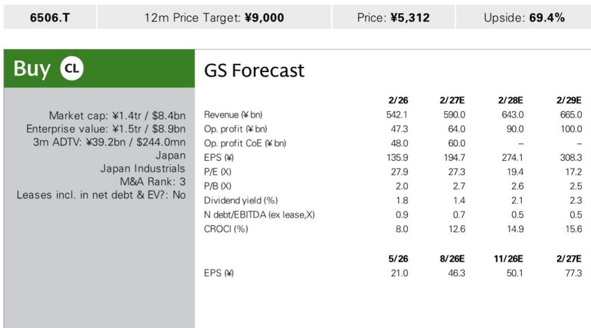

# 某研究机构：研究主题与行业变化观察

某研究机构在7月23日与安川电机用户沟通部门进行线上交流后发布报告。核心判断是：公司因5月ERP系统切换导致的生产中断正在有序恢复，同时AI相关需求正在推动订单增长，管理层对一季度业绩的影响可在后续弥补。这份报告的价值在于提供了ERP事件后安川电机各业务恢复节奏的具体数据，以及AI需求对工业自动化设备订单的拉动程度。

## 1. 各业务利用率从5月低点回升，恢复时间表已明确

安川电机在5月黄金周期间切换ERP系统，切换本身顺利，但后续执行环节出现较大调整。工作流程和数据录入方式的改变导致现场操作需要适应，主要影响生产前后环节。不同业务受影响程度差异明显：交期更长或供应链更复杂的业务恢复更慢。

具体利用率数据（单班制）显示各业务恢复节奏不一。AC伺服从5月的51%回升至7月中旬约70%；逆变器恢复最快，从5月的71%升至7月接近100%；机器人从5月的34%回升至7月约70%。公司预计AC伺服8月恢复正常，机器人因操作更复杂，预计要到9月左右。机器人内部出现分化：自动化程度较高的5号工厂利用率已接近100%，而半导体晶圆搬运机器人因涉及大量难以自动化的劳动密集型工序，利用率仍在60%左右。

> **KC观察：** 利用率数据是判断ERP事件影响程度和恢复节奏较直接的指标。逆变器业务恢复最快，而机器人业务内部的分化值得关注——自动化程度高的产线恢复快，劳动密集型环节恢复慢，这提示读者需要区分不同产品线的恢复路径。

## 2. 公司维持季度营业利润160亿日元目标，认为损失可追回

安川电机内部一季度营业利润目标为约120亿日元，实际仅实现85亿日元。但公司表示，从二季度起季度营业利润160亿日元的目标没有实质性改变。公司认为ERP相关影响本质上是时间差问题——一季度未确认的收入和库存可以在二季度及以后集中确认。

支撑这一判断的关键证据是：尽管交期有所延长（MC业务从3个月延长至4个月），但公司未观察到订单取消。AC伺服和机器人因定制化程度高，客户难以轻易更换供应商；逆变器虽通用性更强，但该业务恢复最快，不确定性未实际显现。公司对一季度的影响表示能在后续阶段弥补。

## 3. AI相关需求成为订单增长主要驱动力

安川电机指出，AI相关终端市场（包括半导体和数据中心）的需求正在三个核心业务中同时走强。公司估计，超过一半的需求和订单增长可能与AI相关。

具体数据：一季度AC伺服订单中，半导体生产设备用产品环比增长16%，同比增长超过3倍；电子元件相关设备用产品环比增长18%，同比增长58%。逆变器业务中，暖通空调用产品环比增长22%，同比增长28%。公司表示，这些增量需求大部分可能与AI和数据中心相关。值得注意的是，公司原本预期订单会集中在上半年，但现在认为上升趋势可能持续到下半年。

## 4. 产能扩张计划已启动，供应瓶颈集中在半导体用机器人

安川电机计划从下半年起将AC伺服产能提升至当前水平的1.3-1.4倍。对于机器人业务，供应瓶颈集中在半导体晶圆搬运机器人，公司计划将其产能提升至同等幅度。逆变器业务已从单班制转为1.5班制。公司强调，当前最重要的问题是能否可靠地将订单转化为销售。

该研究机构认为，安川电机在ERP事件后明显加强了与用户的沟通，管理层对后续阶段的积极表态是正面信号。报告更新机构观点，认为市场表现有望逐步回归。

For informational purposes only. Portions may be generated,translated,summarized,or edited with AI assistance based on source materials and may contain omissions or errors. Please verify independently. This is not investment,legal,tax,accounting,or other professional advice.

