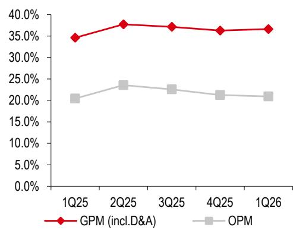
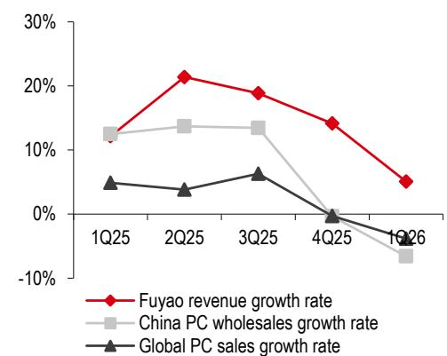

# 福耀玻璃（3606 HK / 600660 CH）

观察：市场已反映部分行业因素；后续关注基本面恢复

- 前期调整后，市场已部分反映行业相关因素
- 基本面预计在下半年改善，估值具备一定吸引力

公司A/H报价近期有所调整，主要反映了国内汽车行业的一些情况。随着下半年进入传统旺季，市场情绪和需求有望逐步好转。

公司基本面有望逐步改善。尽管面临行业背景，公司通过国内ASP扩张（受益于汽车智能化升级带来更高玻璃含量及更丰富的产品组合）以及海外市场份额提升（海外竞争对手收缩）展现出一定的韧性。同时，上半年受原油价格影响的一些成本因素（纯碱、运输、能源）预计在下半年逐步趋稳。此外，福州和安徽新工厂利用率提升以及美国二期增值玻璃工厂的产能爬坡，有望对毛利率形成季度环比改善。尽管中期业绩可能仍面临汇率相关影响，但基本面主要的不确定性已经过去。

调整盈利预期：考虑到国内汽车销售情况，下调收入和盈利预期，但部分被公司的ASP扩张和海外市场份额增长所抵消。具体数据略。

维持中性研究观点。公司估值基于现金流模型，调整了相关假设。新目标价（略）。最终，我们维持对A/H股的观察评级。

（以下为图片占位，具体内容略）

## 市场数据

## 财务摘要（略）

## 关键图表

Exhibit 1. 近年毛利率及营业利润率表现  
  
来源：公司数据

Exhibit 2. 福耀营收增长与全球乘用车销量波动关系  
  
来源：Rho Motion, 公司数据

## 盈利预测调整

## 下调盈利预期

我们下调2026-2027年盈利预期，主要因国内汽车销售因素，部分被ASP扩张和海外份额增长抵消。

（具体调整表格略）

## 估值与风险

## 维持中性观点，调整目标价

我们继续使用现金流模型进行估值，并调整了相关假设。新目标价（略）。

（详细假设表格略）

## 潜在催化剂与风险

## 潜在催化剂

- 国内汽车需求进入下半年旺季
- 原材料成本趋于稳定
- 海外扩张持续推进
- 高附加值产品订单增加

## 风险因素

- 汽车需求恢复不及预期
- 原材料及能源成本变动
- 海外运营相关不确定性
