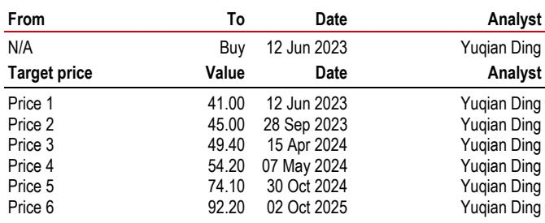
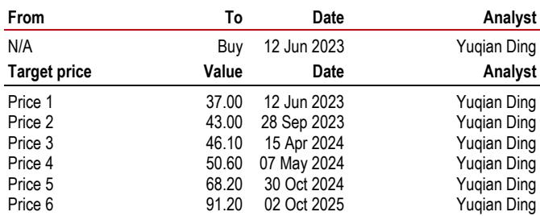
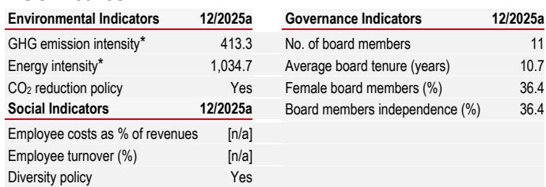

# HSBC：汽车行业数据与主题变化观察

福耀玻璃A/H股年初至今报价分别变动-15%和-17%，同期沪深300变动-2%，恒生国企指数变动-7%。HSBC最新研究认为，这一调整已基本反映当前市场环境的系统性影响——今年前六个月国内乘用车批发量同比下降6%，Wind汽车指数同期下降26%。随着国内汽车市场进入季节性较强的下半年，报告预计汽车需求和行业关注度均将出现改善。

基本面层面的关键变化在于，福耀玻璃在当前市场环境下仍展现出盈利稳定性特征。国内ASP持续扩张，得益于车辆智能化升级带来的更高玻璃含量和更丰富的产品组合；海外竞争对手变化，福耀进一步获取市场份额。成本方面，纯碱、运费和能源价格上半年存在不确定性，预计下半年将逐步趋于稳定。福州和安徽新工厂的产能利用率将提升，美国二期增值玻璃工厂也将爬坡，这些因素有望支撑毛利率的环比正向变化。尽管第二季度盈利仍可能面临外汇相关变量，但报告认为主要的不确定性因素已基本明确。

> **KC评论：** 福耀的盈利稳定性并非来自行业总量，而是来自“单车价值提升+海外份额替代”两条独立逻辑。读者可以关注ASP扩张速度和海外工厂爬坡节奏，而非国内汽车销量本身。

## 1. 盈利预测调整主要反映国内汽车销量变化

HSBC将2026年和2027年盈利预测分别调整-16%和-13%，核心原因是国内汽车销售变化导致收入预测调整-12%和-14%。但这一调整被ASP扩张和海外市场份额增长部分抵消。报告同时调整毛利率预测增加0.3和0.9个百分点，理由是执行持续提升以及纯碱价格趋于稳定。运营费用率因新工厂爬坡影响调整增加0.6和0.2个百分点。

值得注意的是，HSBC2026年预测低于彭博共识，主要考虑了今年的外汇损失影响；但2027-2028年盈利预测平均高于彭博共识3%，原因是报告对福耀的利润率可持续性和海外扩张潜力的看法较为积极。

## 2. 估值框架调整：折现率上调至7.9%，公司情况更新

HSBC继续使用现金流折现模型对福耀进行估值，将折现率从7.0%调整至7.9%，主要基于系统性影响系数从0.8调整至0.9。其他假设包括：基础利率4.25%、市场溢价4.75%、永续增长率2.5%均保持不变。A/H股估值折扣维持90%，HKD-RMB汇率假设从1.10调整至1.17。

基于上述调整，报告认为当前估值处于一定区间，A/H股对应2027年预期市盈率分别为12倍和11倍，而2027年盈利增速预期为22%。

## 3. 观察框架：区分两类业绩驱动因素

对于福耀这类公司，一个可复用的分析框架是将其业绩驱动因素分为两类：一类是行业周期驱动的变量，如国内汽车销量、纯碱价格、运费；另一类是公司自身结构性变量，如ASP提升、海外份额增长、新工厂效率。前者决定业绩的波动方向，后者决定业绩的长期中枢。

当前阶段，行业周期变量处于中性区间——国内汽车销量下半年有望季节性改善，成本变量趋于稳定。而结构性变量持续向好——ASP因智能化升级而扩张，海外竞争对手变化带来份额增长。当两类变量同时表现积极时，业绩超预期的可能性往往较高。

## 4. 仍需关注的变量

报告列出的主要关注变量包括：国内汽车需求变化；海外扩张节奏；纯碱、运费等成本波动；汇率变化对业绩的影响。这些因素中，汇率影响在2026年第二季度仍可能体现，但报告认为这些变量的不确定性已较前期有所降低。

For informational purposes only. Portions may be generated,translated,summarized,or edited with AI assistance based on source materials and may contain omissions or errors. Please verify independently. This is not an offer or solicitation. This is not investment,legal,tax,accounting,or other professional advice.

For informational purposes only. Portions may be generated,translated,summarized,or edited with AI assistance based on source materials and may contain omissions or errors. Please verify independently. This is not an offer or solicitation. This is not investment,legal,tax,accounting,or other professional advice.

#学习笔记 #研究笔记 #学习研究 #研报解读
